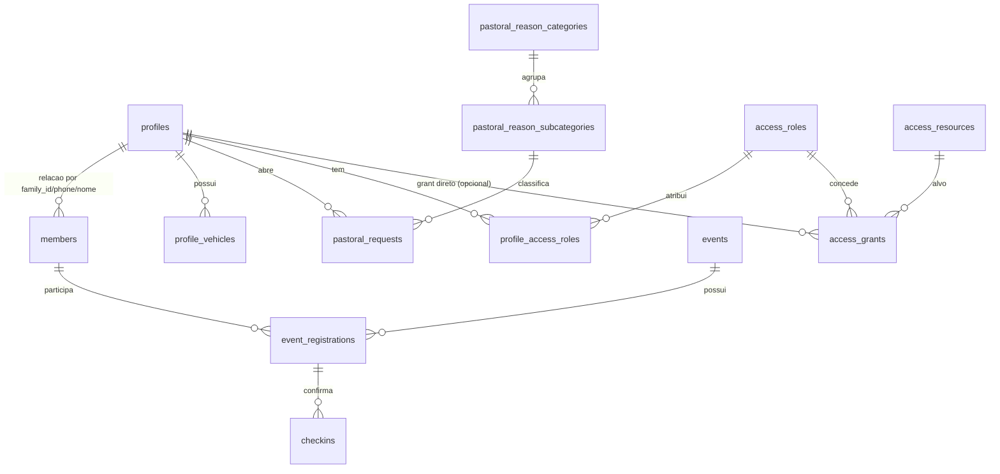

# Blueprint de Arquitetura e Especificação Técnica

**Pacote:** [`PACOTE_4_ANEXO_TECNICO.md`](PACOTE_4_ANEXO_TECNICO.md) · **Índice:** [`INDICE_DOCUMENTACAO.md`](INDICE_DOCUMENTACAO.md)

**Atualizado em:** 10/06/2026

## 1) Visão Geral

### Objetivo do sistema
Centralizar a operação digital da igreja em uma única plataforma com foco em:

- jornada do membro (login, cadastro, LGPD, dados cadastrais),
- gestão de eventos e check-in (incluindo totem),
- gestão de família/membros,
- acompanhamento pastoral,
- escalas e apoio operacional,
- visão geográfica (mapa por CEP) para organização territorial,
- controle de acesso granular por perfil, papel e recurso.

### Stack (alvo e estado atual)

| Camada | Stack alvo (solicitado) | Estado atual no código |
|---|---|---|
| Frontend Web/PWA | Next.js | Expo Router com export estático web (PWA-ready) |
| Mobile | React Native | React Native (Expo) |
| Backend/Data/Auth | Supabase (Postgres, RPC, RLS, Storage) | Supabase em produção |
| Geolocalização | Google Geocoding API ou similar | Fallback ativo: ViaCEP + OpenStreetMap; Google opcional |

Observação arquitetural: a base atual já suporta o contexto PWA e pode evoluir para shell Next.js sem ruptura de domínio (serviços, ACL, modelo de dados e RLS permanecem no Supabase).

---

## 2) Módulos Estratégicos (todos)

### 2.1 Acesso e Sessão
- Login por telefone + PIN (`profiles.access_pin`) e sessão local.
- Persistência de sessão com `user_phone` e `user_profile_id`.
- Resolução robusta de perfil por variantes de telefone.
- Encerramento de sessão centralizado.

### 2.2 LGPD e Onboarding
- Fluxo de aceite LGPD.
- Verificação de completude cadastral para direcionamento de fluxo.
- Proteções para dados sensíveis (máscara/ocultação no cliente).

### 2.3 Dados Cadastrais
- Edição controlada de perfil.
- Lookup de endereço por CEP.
- Alteração de PIN via RPC específica.

### 2.4 Gestão de Família / Membros
- CRUD de membros por família.
- Busca de perfil por nome ou telefone ao adicionar membro.
- Transferência entre famílias com confirmação (`accept_managed_member_into_family`).
- Reconhecimento familiar por `members.accepted` (toggle na lista).
- Herança de endereço completo do gestor para o perfil do membro aceito/transferido (`inheritFamilyAddressToAcceptedMember`).
- Sincronização entre `members` e `profiles` (family_id, dados base).

### 2.5 Dashboard e Cards Operacionais
- Agenda da família/eventos ativos.
- QR Check-in e fluxo totem.
- Salas Kids/Teens — no dashboard, somente inscrições da família do usuário; na manutenção, visão global.
- Dízimos/Ofertas — card sempre presente no carrossel (ACL).
- Lista de membros e aniversariantes.
- Escalas.
- Dados cadastrais.
- Coração Aberto (pastoral).
- Estacionamento/veículos.

### 2.6 Eventos e Manutenção
- CRUD de eventos (campos estratégicos: local, capacidade, salas, ofertas, totem, publicação).
- Políticas RLS para manutenção.
- Semântica de publicação e visibilidade.

### 2.7 Check-in e Totem
- Registro/remoção atômica em evento por RPC.
- Confirmação de check-in totem e consulta por QR/família.
- Compatibilidade com modo totem e parâmetros de aplicação.

### 2.8 Pastoral
- Categorias/subcategorias de motivos.
- Registro e histórico de pedidos pastorais.
- Evolução prevista para triagem por equipe pastoral.

### 2.9 Escalas (Vigilância e Operação)
- Tipos de escala com `vagas_por_servico` (1–50) e `modo_ciclo` (`individual` | `equipe`).
- Servos, ordem sequencial e `escalas_log` (múltiplos servos no mesmo domingo até o limite).
- Ciclo em bloco transacional (`aplicar_ciclo_escala`, `get_scale_cycle_context`).
- Registro manual com validação de vagas e domingo obrigatório.
- ACL por tipo de escala (papel `lider`, script `access-control-lider-escala.sql`).

### 2.10 Veículos
- Base de veículos por perfil/família.
- Integração com jornada operacional de estacionamento.

### 2.11 Geolocalização (CEP -> mapa)
- Carregamento em lote de perfis com CEP.
- Geocodificação com cache.
- Marker clustering.
- Painel de detalhes por pin.
- Uso tático para células e visitas pastorais.

### 2.12 ACL e Governança
- Catálogo de recursos (`screen`, `table`, `column`).
- Papéis e grants.
- Funções `profile_has_access` / `profile_has_access_by_phone`.
- Base pronta para enforcement no cliente e no banco.

---

## 3) Modelo de Dados (Supabase)

## 3.1 Entidades principais

- `profiles`: identidade primária do membro/usuário do app.
- `members`: membros de família e reconhecimento (`accepted`).
- `events`: eventos e configuração operacional.
- `event_registrations`: inscrições/check-in por evento/membro/família.
- `checkins`: confirmações de check-in (totem/manual).
- `profile_vehicles`: veículos vinculados a perfis/famílias.
- `pastoral_requests`: demandas pastorais.
- `pastoral_reason_categories` / `pastoral_reason_subcategories`: taxonomia pastoral.
- `tipos_escala`, `voluntarios_escala`, `escalas_log`: domínio de escalas.
- `app_parameters`: parâmetros globais de comportamento.

## 3.2 Entidades de autorização (ACL)

- `access_resources`
- `access_roles`
- `profile_access_roles`
- `access_grants`

## 3.3 Relações lógicas (alto nível)



## 3.4 Chaves de integração recomendadas

- `profiles.id` como sujeito principal de autorização.
- `family_id` como chave de escopo familiar.
- Telefone normalizado como fallback de reconciliação.
- `event_id + family_id/member_id` como eixo operacional de check-in.

---

## 4) Blueprint de Segurança e LGPD

## 4.1 Classificação de dados sensíveis

| Dado | Sensibilidade | Tratamento recomendado |
|---|---|---|
| CPF, PIN, dados pastorais, saúde/alergia | Alta | acesso restrito por coluna + RPC dedicada + log de auditoria |
| Endereço/CEP, telefone, selfie_url | Média/Alta | minimização por papel + mascaramento em telas não administrativas |
| Dados de escala e presença | Média | acesso por escopo de função/servo |

## 4.2 Princípios LGPD aplicados

- Finalidade: cada dado é usado por módulo claro (cadastro, pastoral, check-in, etc.).
- Necessidade: exibir somente o necessário para o papel do usuário.
- Transparência: consentimento LGPD e fluxo de pendência.
- Segurança: RLS + RPC `security definer` com validação explícita.
- Prestação de contas: trilhas de auditoria em alterações sensíveis (recomendado ampliar).

## 4.3 RLS no Supabase (modelo-alvo)

### Regras-base
- **Negar por padrão** nas tabelas sensíveis.
- Permitir por política apenas quando `profile_has_access(...)` retornar `true`.
- Separar políticas de leitura e escrita (`view` x `update`).

### Estratégia por tipo de recurso
- `screen:*`: bloqueio de rotas sensíveis no cliente + validação no servidor quando necessário.
- `table:*`: controle de SELECT/INSERT/UPDATE/DELETE por papel.
- `column:*`: validação de campos editáveis nas RPCs.

### Exemplo de modelo de política (conceitual)
- Líder/Admin: leitura completa de `profiles`, `members`, `events`, `pastoral_requests`.
- Servo: leitura apenas de suas escalas e dados mínimos de operação.
- Membro comum: dados próprios + informações públicas de eventos.

## 4.4 Matriz de permissões (referência)

| Papel | Eventos | Membros | Dados pessoais completos | Pastoral | Escalas |
|---|---|---|---|---|---|
| Pastor / Administrador | CRUD | CRUD | Sim | Triagem + histórico | Visão geral + gestão |
| Servo | Leitura operacional | Leitura limitada | Não (mínimo necessário) | Não | Somente próprias escalas |
| Membro comum | Leitura pública e próprios fluxos | Família própria (restrito) | Próprios dados | Abre/consulta próprios pedidos | Somente o que lhe diz respeito |

---

## 5) Estratégia de Deploy PWA

## 5.1 Objetivo
Disponibilizar instalação via navegador (Add to Home Screen), sem lojas.

## 5.2 Pipeline recomendado
1. Build estático web (`expo export --platform web`) gerando `dist`.
2. Publicação em host com HTTPS obrigatório.
3. Cache de assets estáticos com invalidação por hash.
4. Monitoramento de erros de runtime e métricas básicas.

## 5.3 Requisitos de produção
- HTTPS e domínio próprio.
- `manifest`/ícones/favicons consistentes.
- `theme-color` alinhado à identidade visual.
- Política de atualização clara (cache busting).

## 5.4 Resultado esperado ao usuário
- Acesso por URL.
- Prompt de instalação na tela inicial.
- Comportamento de app (fullscreen/chrome mínimo) conforme navegador.

---

## 6) Mapa de CEPs como alavanca estratégica

## 6.1 Casos de uso pastorais e de células
- Clusterização territorial de membros por bairro/região.
- Definição de células por proximidade geográfica.
- Priorização de visitas por zona e criticidade pastoral.
- Roteirização de visitas para reduzir deslocamento.

## 6.2 Indicadores recomendados
- Densidade de membros por bairro.
- Tempo médio de deslocamento para líderes/servos.
- Cobertura pastoral por região.
- Regiões sem célula ativa.

## 6.3 Governança de privacidade no mapa
- Exibir coordenadas agregadas para perfis sem permissão.
- Exibir endereço completo apenas para papéis autorizados.
- Logar acessos a painéis geográficos sensíveis.

---

## 7) Estrutura de diretórios escalável (proposta)

> Objetivo: evoluir para contexto web/PWA robusto sem romper módulos existentes.

```text
src/
  app/                       # Rotas (Expo Router / futura transição web)
  modules/
    auth/
      components/
      hooks/
      services/
      policies/
    profile/
    family/
    events/
    checkin/
    totem/
    pastoral/
    scales/
    vehicles/
    map/
    access-control/
  shared/
    ui/
    hooks/
    lib/
    types/
    constants/
  infra/
    supabase/
      client.ts
      repositories/
      rpc/
      rls/
    observability/
docs/
  architecture/
  security/
  runbooks/
scripts/
  migrations/
  seeds/
```

## 7.1 Convenções recomendadas
- Separar regra de negócio por módulo (`modules/*/services`).
- Centralizar acesso ao banco em repositórios por domínio.
- Isolar contratos de permissão por módulo.
- Evitar lógica de autorização “espalhada” no componente de UI.

---

## 8) Roadmap técnico sugerido

1. **ACL completo por card/tela** (cliente + banco).
2. **RLS por tabela sensível** com deny-by-default.
3. **Enforcement por coluna em RPCs** (`profiles`, `pastoral_requests`).
4. **Auditoria de alterações sensíveis** (quem alterou, quando, antes/depois).
5. **Mapa com camadas por papel** (admin vs servo).
6. **Observabilidade de produção PWA** (erros, latência RPC, taxa de falha de geocode).
7. **Endurecimento de sessão** (expiração/refresh e telemetria de segurança).

---

## 9) Critérios de aceite da arquitetura

- Build PWA exportável de forma consistente.
- Módulos com fronteiras claras e sem dependências circulares.
- Permissões auditáveis por recurso, papel e usuário.
- Dados sensíveis protegidos por RLS e RPC.
- Estratégia geográfica operacional sem violar LGPD.

