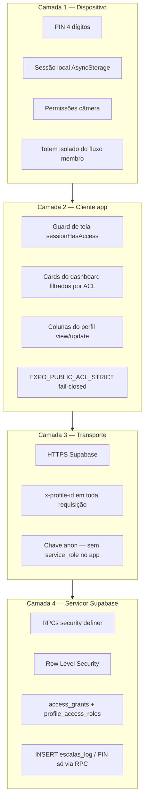
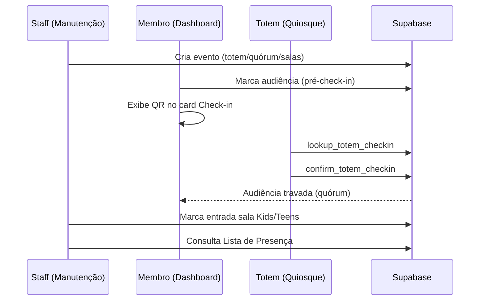

# Blueprint completo — app-igreja (Igreja Batista Norte)

Documento de referência da solução implementada: telas, controles, fluxos de negócio, mensagens ao usuário e camadas de segurança.

**Índice da documentação:** [`INDICE_DOCUMENTACAO.md`](INDICE_DOCUMENTACAO.md) · Pacote técnico: [`PACOTE_3_GOVERNANCA_TI.md`](PACOTE_3_GOVERNANCA_TI.md) · Anexo: [`PACOTE_4_ANEXO_TECNICO.md`](PACOTE_4_ANEXO_TECNICO.md)

**Atualizado em:** 09/06/2026

---

## 1. Visão geral da solução

| Aspecto | Descrição |
|---------|-----------|
| **Produto** | PWA / app Expo (React Native + Web) para membros e equipe da igreja |
| **Backend** | **Supabase** (PostgreSQL + PostgREST + RPCs + Storage) |
| **Projeto Supabase** | `bldbrsuiwctoaxzcrjoc` — URL `https://bldbrsuiwctoaxzcrjoc.supabase.co` |
| **Identidade** | Login por **celular + PIN de 4 dígitos** (`profiles.access_pin`); sessão local com `user_phone` e `user_profile_id` |
| **Autorização** | ACL via RPC `profile_has_access` + RLS com header `x-profile-id` |
| **Deploy web** | `npm run build:web` → pasta `dist/` (PWA estático em HTTPS) |
| **Modo totem** | Aparelho dedicado: celular configurado em `app_parameters.cel_totem`, senha fixa `9999`, rota `/totem-checkin` |

### Mapa de telas (rotas)

```
/                      → Login
/register              → Cadastro inicial
/(tabs)/dashboard      → Painel principal (carrossel de módulos)
/manage-profile        → Dados cadastrais
/manage-members        → Gerenciar família
/pastoral              → Coração Aberto (novo pedido)
/pastoral-history      → Meus pedidos pastorais
/financial             → Financeiro (leitura)
/mapa-geolocalizacao   → Mapa de geolocalização (PWA/web)
/lgpd                  → Termos LGPD
/maintenance-dashboard → Manutenção (equipe)
/totem-checkin         → Totem de check-in (quiosque)
```

### Documentação relacionada

| Documento | Conteúdo |
|-----------|----------|
| [`CONTROLE_ACESSO.md`](CONTROLE_ACESSO.md) | Modelo ACL, inventário de recursos, status de implementação |
| [`MANUAL_CONTROLE_ACESSO.md`](MANUAL_CONTROLE_ACESSO.md) | Manual operacional do ACL |
| [`scripts/`](scripts/) | Scripts SQL versionados para deploy no Supabase |

---

## 2. Segurança da informação — camadas e confiança

**Especificação completa:** [`CAMADAS_SEGURANCA.md`](CAMADAS_SEGURANCA.md)

### 2.1 Camadas de proteção (defesa em profundidade)



### 2.2 Banco de dados e guarda de informações

| Item | Detalhe |
|------|---------|
| **SGBD** | PostgreSQL 15+ (gerenciado pelo Supabase) |
| **Schema** | `public` |
| **Tabelas principais** | `profiles`, `members`, `events`, `event_registrations`, `checkins`, `financials`, `pastoral_requests`, `escalas_log`, `tipos_escala`, `access_resources`, `access_roles`, `access_grants`, `profile_access_roles`, `app_parameters`, `cep_geolocations`, etc. |
| **Dados sensíveis** | `access_pin` (crítico), `cpf`, `lgpd_*`, `medical_food_alerts` — ocultos na UI padrão; escrita via RPC com `can_update` |
| **Autenticação Supabase Auth** | Opcional (`profiles.auth_user_id`); maioria dos usuários **não** usa `auth.users` |
| **Validação de login** | RPC `verificar_login` — PIN nunca comparado em texto claro no cliente |
| **Sessão no app** | `user_profile_id` + `user_phone` em AsyncStorage; reparada via `repairUserSessionReference()` se inconsistente |
| **RLS** | Políticas consultam `profile_has_access` + header `x-profile-id` injetado por `lib/supabaseSessionFetch.ts` |
| **Modo estrito ACL** | `EXPO_PUBLIC_ACL_STRICT=true` em produção: nega acesso se RPC ACL ausente (banner no dashboard) |
| **Totem** | Sem ACL de tela; confiança no aparelho físico + parâmetro `cel_totem` + PIN `9999`; confirmação só via RPC com pré-check-in |
| **Geolocalização** | CEP → coordenadas no servidor (`cep_geolocations`); cache local versionado (`geoCepCache.v8`) |
| **LGPD** | Aceite registrado em `profiles.lgpd_accepted`; termos carregados de `app_parameters`; scroll obrigatório antes do aceite |
| **Confiança operacional** | Dados em nuvem Supabase (SOC 2); app não embute `service_role`; scripts SQL versionados em `scripts/`; PWA servido em HTTPS |

### 2.3 Papéis de acesso (ACL)

Papéis canônicos (ordem de exibição em `lib/accessRoleDisplayOrder.ts`):

`visitantes` → `congregado` → `member` → `family_acceptor` → `lider` → `events_admin` → `pastoral` → `super_admin`

Recursos protegidos:

- **Telas** — `screen:/dashboard`, `screen:/manage-profile`, etc.
- **Cards** — `screen:dashboard.card.*`
- **Tabelas** — `table:profiles`, `table:members`, etc.
- **Colunas** — `column:profiles.cpf`, `column:profiles.access_pin`, etc.

### 2.4 Matriz de guards por tela

| Tela | Mecanismo | Resource key |
|------|-----------|--------------|
| Login `/` | Público | — |
| Cadastro `/register` | Público (com `?phone=`) | — |
| Dashboard | Cards filtrados por ACL | `screen:/dashboard` + `dashboard.card.*` |
| Dados cadastrais | `sessionHasAccess` manual | `/manage-profile` |
| Gerenciar família | `useScreenAccessGuard` | `/manage-members` |
| Coração Aberto | `useScreenAccessGuard` | `/pastoral` |
| Meus pedidos | `useScreenAccessGuard` | `/pastoral-history` |
| Financeiro | `useScreenAccessGuard` | `/financial` |
| Mapa (web) | `useScreenAccessGuard` | `/mapa-geolocalizacao` |
| LGPD | `useScreenAccessGuard` (skip com `?phone=`) | `/lgpd` |
| Manutenção | `useScreenAccessGuard` | `/maintenance-dashboard` |
| Totem | **Sem ACL** — aparelho dedicado | — |

---

## 3. Telas — descrição completa

---

### 3.1 Tela de Login (`/` — `app/index.tsx`)

**Esta tela serve para:** autenticar membros (celular + PIN) ou abrir o modo totem em aparelho dedicado; restaurar sessão existente; links para redes sociais.

#### Modo membro (padrão)

| Elemento | Função |
|----------|--------|
| **Logo IBNORTE** | Identidade visual |
| **Título "Boas-Vindas"** | Cabeçalho |
| **Subtítulo** | Orienta: celular → WhatsApp → PIN temporário → alterar em Dados Cadastrais |
| **Campo Celular** | Máscara `(00) 00000-0000`; ao completar 11 dígitos foca o PIN |
| **Botão X (celular)** | Limpa o número digitado |
| **Campo Senha de acesso** | 4 dígitos, ocultos; auto-submit ao completar |
| **Ícone WhatsApp** | Gera e envia PIN temporário (fluxo primeira entrada) |
| **Texto de hint (PIN)** | Varia conforme `psw_user`/`psw_mngr` em `app_parameters` |
| **Botão "Entrar"** | Valida e autentica |
| **Instagram / YouTube** | Abre links externos da igreja |

#### Modo totem (quando celular = `cel_totem`)

| Elemento | Função |
|----------|--------|
| **Título "Totem — Check-in"** | Identifica modo quiosque |
| **Campo Senha do totem** | Apenas PIN; sem campo celular |
| **Botão "Abrir tela do totem"** | Senha `9999` → `/totem-checkin` |
| **Hint** | Informa que não usa cadastro/LGPD/PIN de membro |

#### Restauração de sessão

- Ao abrir: se há `user_phone` salvo e é o totem → redireciona direto para `/totem-checkin`.
- Parâmetro `?signedOut=1` após logout impede restauração automática.

#### Mensagens interativas (Alert)

| Título | Quando |
|--------|--------|
| **Atenção** — celular inválido | WhatsApp ou entrar sem celular completo |
| **WhatsApp indisponível** | `psw_mngr`/`psw_user` mal configurado |
| **Erro ao gerar código** | Falha em `prepareAccessPinDraft` |
| **Gestor não configurado** | `psw_user=nao` sem `psw_mngr` |
| **Não foi possível gerar o código** | Perfil/RPC ausente no Supabase |
| **Código gerado** | PIN preparado; mensagem copiada para área de transferência |
| **Código necessário** | Primeira entrada sem passar pelo WhatsApp |
| **Senha incorreta** | Totem: PIN diferente de 9999 |
| **Totem não configurado** | `cel_totem` ausente |
| **Validação indisponível** | RPC `verificar_login` não instalada |
| **Erro** — Número ou senha inválidos | Credenciais incorretas |
| **Erro de Acesso** | Falha de rede ou perfil não continuável |
| **Erro** — link social | Falha ao abrir Instagram/YouTube |

#### Quem inicia / termina

- **Inicia:** usuário digita celular e PIN (ou solicita PIN via WhatsApp).
- **Termina:** app grava sessão (`persistUserSession`) e redireciona para dashboard, cadastro, LGPD ou totem conforme estado do perfil.

---

### 3.2 Tela de Cadastro (`/register` — `app/register.tsx`)

**Esta tela serve para:** primeiro cadastro de perfil após receber PIN; coleta nome, nascimento, selfie, aceite LGPD; cria `profiles` + `family_id`.

| Elemento | Função |
|----------|--------|
| **Nome completo** | Capitalização automática por palavra |
| **Data nascimento** | Máscara DD/MM/AAAA |
| **Telefone** | Somente leitura (vem da rota `?phone=`) |
| **Caixa LGPD rolável** | Termos carregados do banco; exige scroll até o fim |
| **Checkbox "Li e aceito"** | Marca `lgpd_accepted=true` |
| **Checkbox "Li e não concordo"** | Marca recusa (com alerta de privacidade) |
| **Botão selfie / câmera** | Abre captura (nativo) ou seletor de arquivo (web) |
| **Estágio CAMERA** | Preview frontal, botão "Capturar Selfie" |
| **Estágio CONFIRM** | Revisão da foto + confirmar cadastro |
| **Botão final** | Grava perfil, upload selfie no Storage, reserva `family_id` |

**Rejeição totem:** `useRejectTotemPhoneFromMemberRoutes` redireciona celular totem para login.

#### Mensagens

| Mensagem | Quando |
|----------|--------|
| Preencha Nome e Nascimento | LGPD sem formulário válido |
| Role os termos até o final | Aceite sem scroll completo |
| Privacidade (declínio LGPD) | `buildLgpdDeclineMessage` |
| Permissão necessária (câmera) | Selfie sem permissão |
| Erro na câmera | Falha de hardware |
| Sucesso — cadastro concluído | Redireciona para completar dados |
| Erro | Falha insert/update |

#### Fluxo

- **Inicia:** gestor/sistema gera PIN → membro entra com PIN → rota de onboarding leva ao cadastro.
- **Termina:** perfil criado → sessão gravada → próxima tela (`manage-profile` ou LGPD).

---

### 3.3 Painel Principal / Dashboard (`/(tabs)/dashboard`)

**Esta tela serve para:** hub central do membro — carrossel de módulos conforme evento selecionado e permissões ACL.

#### Cabeçalho global

| Elemento | Função |
|----------|--------|
| **"Boas-Vindas, {nome}"** | Saudação; fundo vermelho se LGPD pendente |
| **Título do card ativo** | Nome do módulo atual |
| **Banner ACL** | `ACL_UNAVAILABLE_MESSAGE` se RPC ACL ausente em modo estrito |

#### Rodapé (`CarouselFooterNav`)

| Elemento | Função |
|----------|--------|
| **‹ / ›** | Navega cards (segurar = avança a cada 500 ms) |
| **Indicador 1 / N** | Posição atual no carrossel |
| **Menu** (centro) | Abre tela de atalhos `/(tabs)` com ícones coloridos |
| **Engrenagem** | Manutenção — só com `view` em `/maintenance-dashboard`; duplo toque evita clique acidental |

---

#### Card 1 — Agenda da Família (`event_alt`)

**Serve para:** escolher evento e registrar **audiência** (pré-check-in) dos membros da família.

| Elemento | Função |
|----------|--------|
| **Evento selecionado** | Nome, data/hora, local, badges Kids/Teens |
| **Vagas** | Inscritos / capacidade |
| **Trocar Evento** | Chips horizontais (`FamilyEventSelector`) |
| **Lista de audiência** | Checkboxes por membro (`FamilyRegistrationList`) |
| **Checkbox em massa** | Marca/desmarca todos (exceto quórum bloqueado) |

**Hints inline (sem Alert):**

- Selecione um evento…
- Quórum: só membro da sessão ativa
- Quórum + totem confirmado: audiência travada
- Quórum pendente: marque audiência para liberar QR
- Check-in automático / QR só no dia do evento
- Erro de gate pré-check-in (`preCheckinGateError`)

**Quem inicia / termina o pré-check-in:**

- **Inicia:** membro marca checkbox na audiência.
- **Termina (totem/quórum):** membro apresenta QR no totem → RPC confirma → checkbox trava.
- **Staff:** não participa desta etapa; apenas configura evento na manutenção.

---

#### Card 2 — Check-in QR (`qr`)

**Serve para:** exibir etiqueta (código família) e QR para leitura no totem ou entrada manual.

| Elemento | Função |
|----------|--------|
| **Toque no card** | Abre `CheckinModal` (seleção manual — **ainda sem gravação no banco**) |
| **Etiqueta** | `family_id` / `codigo_membro` |
| **QR Code** | Codifica identificador da família |
| **Badges Kids/Teens** | Se evento tem salas |

**Visibilidade:** dia do evento + pré-check-in feito + ACL + tipo de fluxo (totem/quórum/manual).

**Quem termina check-in no totem:**

- **Membro** mostra QR na tela do **totem** (outro aparelho, `/totem-checkin`).
- **Totem** escaneia → `lookup_totem_checkin` → `confirm_totem_checkin`.
- **Sistema** atualiza `checkins.status` para `confirmado`.

---

#### Card 3 — SALA(S) (`kids_teens`)

**Serve para:** monitorar entrada nas salas Kids/Teens (somente leitura para o membro).

| Elemento | Função |
|----------|--------|
| **Chips IBN KIDS / IBN TEENS** | Contagem check-in/total |
| **Lista de inscritos** | ✓ se `room_entry_checked` — **apenas membros da família do usuário** |

**Escopo:** no dashboard, filtro por `familyId` da sessão. Na manutenção, a equipe vê todos os inscritos.

**Quem termina check-in na sala:**

- **Staff** marca entrada em **Manutenção → Sala(s) - Check In**.
- Membro apenas **visualiza** status aqui.

---

#### Card 4 — Dízimos e Ofertas (`offerings`)

**Visibilidade:** sempre presente no carrossel (com ACL); independente de `parm_ofertas` do evento.

| Elemento | Função |
|----------|--------|
| **Dados do recebedor** | Informações institucionais |
| **Chave PIX** | Exibição + **Copiar chave PIX** |
| **Atualizar chave PIX** | Recarrega de `app_parameters` |

**Mensagens:** Chave PIX indisponível; Erro ao copiar; sucesso inline 3 s.

---

#### Card 5 — Coração Aberto (`pastoral`)

| Elemento | Função |
|----------|--------|
| **Toque** | Navega para `/pastoral` |

---

#### Card 6 — Lista de Membros (`members_list`)

| Elemento | Função |
|----------|--------|
| **Mapa** | `/mapa-geolocalizacao` |
| **Busca** | Filtra por nome |
| **Tabela** | Nome, família, WhatsApp |
| **Ícone users** | Modal "Membros da família" |
| **Ícone Zap** | Abre WhatsApp do membro |

---

#### Card 7 — Aniversariantes (`birthdays`)

| Elemento | Função |
|----------|--------|
| **Seletor de mês** | Picker |
| **Lista** | Data + nome + WhatsApp |

---

#### Card 8 — Financeiro (`financial`)

| Elemento | Função |
|----------|--------|
| **Toque** | `/financial` (somente leitura) |

---

#### Card 9 — Escalas (`vigilance_scales` + `scale_roster`)

| Elemento | Função |
|----------|--------|
| **Lista de tipos** | Radio → abre escala do tipo |
| **Roster** | Datas + servos + WhatsApp |
| **Estacionamento** | Se tipo = parking → painel de placa |
| **Voltar** | Retorna à lista de tipos |

---

#### Card 10 — Dados Cadastrais (`grouped_manage`)

| Elemento | Função |
|----------|--------|
| **Dados Cadastrais** | `/manage-profile` |
| **Gerenciar Família** | `/manage-members` |

---

#### Modais do dashboard

**CheckinModal:** lista membros, Confirmar Presença / Cancelar — *implementação de persistência pendente*.

**Modal família:** lista membros, WhatsApp, Fechar.

---

### 3.4 Dados Cadastrais (`/manage-profile`)

**Serve para:** autogestão completa do perfil — dados pessoais, contato, endereço (CEP), selfie, veículos, vínculo familiar, PIN, LGPD.

| Seção / controle | Função |
|------------------|--------|
| **Selfie** | Captura/substituição com confirmação |
| **Dados Pessoais** | Nome, nascimento, CPF (se permitido) — edição inline |
| **Contato** | E-mail, telefone (com `changePhoneEverywhere`) |
| **Endereço** | CEP com sync automático de logradouro |
| **Senha de acesso** | PIN atual / novo / confirmar (4 dígitos) |
| **Veículos** | CRUD placa, marca, modelo, cor |
| **Vincular família** | Busca por código + solicitação |
| **LGPD** | Atalho se pendente |
| **Voltar** | Dashboard card grouped_manage |

**ACL:** guard manual por tela; **colunas** filtradas por `canViewProfileColumn` / `canUpdateProfileColumn`; campos bloqueados até ACL carregar.

**Mensagens principais:** Acesso negado; Complete seu cadastro (onboarding); Campo protegido; Senha atualizada; erros de CEP/câmera/veículo/família.

---

### 3.5 Gerenciar Família (`/manage-members`)

**Serve para:** CRUD de membros da família (`members`), reconhecimento familiar (aceite), transferência entre famílias e herança de endereço completo.

| Controle | Função |
|----------|--------|
| **Formulário recolhível** | Adicionar/editar membro |
| **Busca por nome ou telefone** | Vincula perfil existente; permite transferir de outra família |
| **Parentesco** | Chips (Cônjuge, Filho(a), etc.) |
| **Checkbox aceite** | Reconhecimento na família; dispara herança de endereço |
| **Editar / Salvar / Excluir** | Por membro |
| **Banner family_id** | Somente leitura |

**Fluxos especiais:**

- **Transferência:** se membro está em outra `family_id`, diálogo de confirmação → `accept_managed_member_into_family` → cópia de endereço (`inheritFamilyAddressToAcceptedMember`).
- **Herança de endereço:** CEP, rua, número, complemento, bairro, cidade, estado do gestor → perfil do membro (aceitar, transferir ou adicionar). Falha na cópia não desfaz o vínculo familiar.

**Regra:** representante legal não pode ser excluído.

**Mensagens:** Acesso negado; duplicata de telefone/membro; confirmação de transferência/exclusão; aviso se endereço não pôde ser copiado; RLS/accepted column errors.

**SQL:** `scripts/sync-managed-member-profile-family-rpc.sql`, `scripts/profiles-sync-address-from-cep-rpc.sql` (`update_profile_field`).

---

### 3.6 Coração Aberto (`/pastoral`)

**Serve para:** enviar pedido de cuidado pastoral / intercessão.

| Controle | Função |
|----------|--------|
| **Motivo / Situação** | Chips segmentados (`SegmentChipRow`); categorias de `pastoral_reason_categories` |
| **Beneficiário** | Eu / família / terceiro (+ campos condicionais) |
| **Destino** | Sigilo pastoral / Intercessão |
| **Seu pedido** | Texto livre |
| **Histórico (ícone)** | `/pastoral-history` |
| **Enviar pedido** | RPC `submitPastoralRequest` |

---

### 3.7 Meus Pedidos (`/pastoral-history`)

**Serve para:** listar pedidos do perfil logado com status; pull-to-refresh.

| Controle | Função |
|----------|--------|
| **Tentar novamente** | Em erro de carga |
| **Fazer um pedido / Novo pedido** | Volta ao formulário |

---

### 3.8 Financeiro (`/financial`)

**Serve para:** relatórios financeiros **somente leitura** — REALIZADO mensal, comparativo, 12 meses, planejado × realizado.

| Controle | Função |
|----------|--------|
| **Seletor de mês** | Meses com REALIZADO e/ou PLANEJADO; badge **(só planejado)** |
| **Hint só planejado** | Explica resultado REALIZADO vazio |
| **Resultado do mês** | Boletim com saldo acumulado até o mês + YTD |
| **Comparativo mensal** | Mês atual vs anterior |
| **Últimos 12 meses** | Matriz |
| **Planejado × Realizado** | Bloqueado se sem orçamento planejado |
| **Atualizar** | Em erro de carga |
| **Aviso amarelo** | `commentsWarning` se comentários não carregaram |

**Edição financeira:** apenas em **Manutenção → Informações Financeiras** (staff).

---

### 3.9 Mapa de Geolocalização (`/mapa-geolocalizacao` — web)

**Serve para:** mapa Leaflet com pins por CEP dos perfis; filtros visitante/membro.

| Controle | Função |
|----------|--------|
| **Filtros** | Todos / Com papel / Visitantes |
| **Atualizar mapa** | Sincroniza snapshot + geocodificação |
| **Pin clicável** | Painel detalhe + WhatsApp |
| **Voltar** | Lista de membros no dashboard |

**Nativo (app mobile):** placeholder informando que mapa é só na PWA.

---

### 3.10 Termos LGPD (`/lgpd`)

**Serve para:** exibir termos e registrar aceite/recusa em `profiles.lgpd_accepted`.

| Controle | Função |
|----------|--------|
| **Scroll obrigatório** | Gate antes dos checkboxes |
| **Li e aceito / não concordo** | Escolha |
| **Confirmar / Concluir** | Grava preferência |

ACL ignorado quando `?phone=` (fluxo cadastro).

---

### 3.11 Totem Check-in (`/totem-checkin`)

**Serve para:** quiosque — escanear QR da família e confirmar presença no evento do dia.

| Controle | Função |
|----------|--------|
| **Seleção automática de evento** | Hoje + `totem_ativo` ou `requer_quorum` + publicado |
| **Ativar câmera** | Gate de permissão |
| **Scanner QR** | `CameraView` modo QR |
| **Banner de status** | Sucesso / erro / aviso |
| **Encerrar sessão** | Logout totem |

**Sem ACL de tela** — modelo de aparelho dedicado.

**Fluxo completo do check-in (totem/quórum):**

```
1. STAFF cria evento (Manutenção) com totem e/ou quórum
2. MEMBRO marca audiência no Dashboard (pré-check-in)
3. MEMBRO abre card QR no dia do evento
4. TOTEM escaneia QR → lookup → confirm
5. SISTEMA grava confirmado; trava audiência se quórum
6. STAFF consulta Lista de Presença (Manutenção) — somente leitura
```

**Mensagens (Toast + banners):**

- Pré-check-in não encontrado
- Confirmação realizada com sucesso
- Já confirmado (`TOTEM_CHECKIN_ALREADY_CONFIRMED_MESSAGE`)
- Câmera bloqueada / permissão necessária
- Evento indisponível (vários motivos + hints SQL)
- Aponte para o QR Code da família…

---

### 3.12 Manutenção (`/maintenance-dashboard`)

**Serve para:** operação interna — eventos, salas, quórum, escalas, pastoral, financeiro, ACL, cadastro de usuários.

#### Menu de módulos (atalhos)

| Módulo | Componente | Quem acessa |
|--------|------------|-------------|
| **Programação de Eventos** | Lista + editor | Staff com acesso manutenção |
| **Cronograma de Eventos** | Gantt | Idem |
| **Sala(s) - Check In** | `MaintenanceSalaMonitorCard` | Staff — **marca entrada Kids/Teens** |
| **Lista de Presença** | `MaintenanceQuorumPresenceCard` | Staff — leitura pós-totem |
| **Tipos de Escala** | `MaintenanceScaleTypesCard` — vagas/domingo e modo ciclo | ACL escala |
| **Servos em Disponibilidade** | `MaintenanceScaleVolunteersCard` | ACL escala |
| **Programação de Escalas** | `MaintenanceScalesCard` | Ciclo em bloco via `aplicar_ciclo_escala` |
| **Cuidado Pastoral** | `MaintenancePastoralCareCard` | Papel pastoral |
| **Informações Financeiras** | `MaintenanceFinancialsCard` | Import CSV, esvaziar mês REALIZADO |
| **Controle de Acesso** | `MaintenanceAccessControlCard` | `super_admin` |
| **Cadastro de Usuário** | `MaintenanceProfileCadastroCard` | `super_admin` |

#### Editor de eventos (campos)

| Campo | Função |
|-------|--------|
| Nome, data/hora, local | Identificação |
| Capacidade | Vagas obrigatórias |
| Chips Kids / Teens / Ofertas | Recursos do evento |
| **Ativação de Totem** | Habilita fluxo totem |
| **Requer Quorum** | Fluxo quórum + lista de presença |
| **Publicação** | Publicado / Rascunho |
| **Tabela quórum** | Registro em tempo real (poll 15 s) |
| **Salvar / Apagar / Cancelar** | CRUD |

**Toasts:** evento criado/atualizado/apagado; erros de formulário/RLS.

---

## 4. Fluxos de negócio — quem inicia e quem termina

| Processo | Inicia | Termina | Onde |
|----------|--------|---------|------|
| **Login membro** | Usuário | App grava sessão | `/` |
| **Primeiro PIN** | Usuário (WhatsApp) | RPC grava PIN temporário | `/` |
| **Cadastro inicial** | Sistema redireciona | Perfil + family_id criados | `/register` |
| **Completar perfil** | Onboarding | Membro salva campos | `/manage-profile` |
| **Audiência / pré-check-in** | Membro (checkbox) | Membro ou totem (quórum trava) | Dashboard Agenda |
| **Check-in totem** | Membro mostra QR | Totem confirma via RPC | `/totem-checkin` |
| **Check-in sala Kids/Teens** | Membro inscreve na audiência | **Staff** marca checkbox | Manutenção Salas |
| **Quórum lista presença** | Totem confirma | Staff imprime/consulta | Manutenção Lista Presença |
| **Pedido pastoral** | Membro envia | Equipe pastoral (fora do app) | `/pastoral` |
| **Financeiro leitura** | Membro consulta | — | `/financial` |
| **Financeiro carga** | Staff importa CSV | RPC manutenção | Manutenção Financeiro |
| **Escala ciclo** | Staff preview + confirma | RPC `aplicar_ciclo_escala` | Manutenção Escalas |
| **ACL papéis** | Super admin | Grants no Supabase | Manutenção ACL |
| **Mapa geolocalização** | Membro/staff abre mapa | Sync CEP → pins | PWA mapa |
| **Logout** | Usuário (Sair) | Sessão limpa | Dashboard / totem |

### Diagrama — check-in completo (totem + salas)



---

## 5. Catálogo consolidado de mensagens interativas

### Alerts (bloqueantes)

Login, cadastro, ACL negado, validações de formulário, confirmações destrutivas (excluir membro/evento), erros de RPC ausente, PIX, WhatsApp, câmera, PIN, totem, pastoral, perfil, família, veículos.

### Toasts (totem + manutenção)

Confirmação check-in, já confirmado, sucesso/erro de salvamento em manutenção.

### Banners / hints inline (não bloqueantes)

Gate pré-check-in, quórum, LGPD pendente (header vermelho), ACL indisponível, meses só planejado, comentários financeiros, schema SQL pendente na manutenção, cache do mapa, estados vazios de listas.

### Confirmações (dupla ação)

Apagar evento (Sim, apagar / Não), excluir membro, substituir selfie.

---

## 6. Scripts SQL e dependências de deploy

Ordem recomendada no Supabase:

1. `scripts/access-control-role-display-order.sql`
2. `scripts/access-control-schema.sql` + seeds ACL
3. `scripts/escalas-multi-vagas.sql`
4. `scripts/escalas-integrity-constraints.sql`
5. `scripts/escalas-apply-cycle-batch.sql` (inclui `aplicar_ciclo_escala` + `get_scale_cycle_context`)
6. `scripts/escalas-tipos-maintenance-rpc.sql`
7. `scripts/escalas-volunteers-rpc.sql`
8. `scripts/escalas-maintenance-rpc.sql`
9. `scripts/checkins-totem-flow.sql` + `scripts/events-quorum-registry.sql`
10. `scripts/profiles-sync-address-from-cep-rpc.sql`
11. `scripts/access-control-map-screen.sql`
12. `scripts/financials-maintenance-rpc.sql`
13. `scripts/verificar-login.sql`, scripts PIN/LGPD conforme ambiente

**Produção:**

- `EXPO_PUBLIC_ACL_STRICT=true`
- Deploy PWA: `npm run build:web` → publicar `dist/` em HTTPS

---

## 7. Resumo de confiança e proteção

A solução combina:

- **Autenticação por PIN** validado no servidor (`verificar_login`)
- **Autorização granular** (tela / card / coluna / tabela) via `profile_has_access`
- **RLS no PostgreSQL** com identidade transportada por header `x-profile-id`
- **RPCs `security definer`** para operações sensíveis (PIN, check-in, escala em lote, exclusão financeira escopada)
- **Isolamento do totem** (aparelho dedicado, sem ACL de tela)
- **LGPD** com registro auditável (`lgpd_accepted`)
- **Separação leitura (membro) vs escrita (manutenção)** em finanças e eventos

Dados residem no Supabase (PostgreSQL gerenciado). O app cliente **nunca** recebe chave `service_role`.

---

## 8. Inventário de cards do dashboard (ACL)

| `resource_key` | Card | Rota / destino |
|----------------|------|----------------|
| `screen:dashboard.card.event_alt` | Agenda da Família | Inline no dashboard |
| `screen:dashboard.card.qr` | Check In / QR Totem / Quórum | Inline + modal |
| `screen:dashboard.card.kids_teens` | SALA(S) | Inline (leitura) |
| `screen:dashboard.card.offerings` | Dízimos e Ofertas | Inline |
| `screen:dashboard.card.pastoral` | Coração Aberto | `/pastoral` |
| `screen:dashboard.card.members_list` | Lista de Membros | Inline + `/mapa-geolocalizacao` |
| `screen:dashboard.card.birthdays` | Aniversariantes | Inline |
| `screen:dashboard.card.financial` | Financeiro | `/financial` |
| `screen:dashboard.card.vigilance_scales` | Escalas | Inline (roster) |
| `screen:dashboard.card.parking_vehicle_v2` | Estacionamento | Inline |
| `screen:dashboard.card.grouped_manage` | Dados + Família | `/manage-profile`, `/manage-members` |

---

*Documento gerado a partir do código-fonte e da documentação do projeto app-igreja.*
