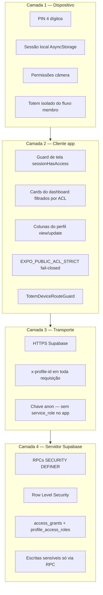

# Especificação das Camadas de Segurança — App IBN

Documento de referência do modelo de **defesa em profundidade** do **app-igreja** (Igreja Batista Norte).

**Atualizado em:** 10/06/2026

**Documentação relacionada:** [`BLUEPRINT.md`](BLUEPRINT.md) · [`CONTROLE_ACESSO.md`](CONTROLE_ACESSO.md) · [`MANUAL_CONTROLE_ACESSO.md`](MANUAL_CONTROLE_ACESSO.md) · [`PACOTE_3_GOVERNANCA_TI.md`](PACOTE_3_GOVERNANCA_TI.md)

---

## 1. Visão geral

O app adota **4 camadas de segurança** encadeadas. Cada camada complementa a anterior; a falha de um controle não deve, por si só, expor dados ou operações críticas.



### 1.1 Princípios

| Princípio | Implementação |
|-----------|---------------|
| **Menor privilégio** | Papéis (`access_roles`) com grants mínimos por recurso |
| **Fail-closed** | Modo estrito ACL nega acesso se RPC de permissão estiver ausente |
| **Não confiar só no cliente** | RLS + RPC validam `profile_has_access` no servidor |
| **Dados sensíveis fora da UI padrão** | `access_pin`, `cpf`, alertas médicos — coluna ACL + RPC de escrita |
| **Sessão reparável** | `repairUserSessionReference()` corrige `user_profile_id` inconsistente |

### 1.2 Granularidade do ACL (dentro da Camada 2 e 4)

Além das 4 camadas, o controle de acesso opera em **4 níveis de recurso**:

| Nível | Exemplo de chave | Onde é aplicado |
|-------|------------------|-----------------|
| **Tela** | `screen:/financial` | `useScreenAccessGuard`, `sessionHasAccess` |
| **Card** | `screen:dashboard.card.financial` | Filtro do carrossel em `dashboard.tsx` |
| **Tabela** | `table:profiles` | Políticas RLS |
| **Coluna** | `column:profiles.access_pin` | Dados cadastrais + RPC `update_profile_field` |

---

## 2. Camada 1 — Dispositivo

Protege o ponto de entrada físico e a sessão local antes de qualquer chamada ao servidor.

### 2.1 Autenticação local

| Controle | Especificação |
|----------|---------------|
| **PIN de 4 dígitos** | Validado no servidor via RPC `verificar_login`; nunca comparado em texto claro no cliente |
| **Primeira entrada** | PIN temporário via WhatsApp (parâmetros `psw_user` / `psw_mngr`) |
| **Sessão persistida** | `user_phone` + `user_profile_id` em `AsyncStorage` |
| **Logout** | `signOutAndReturnToLogin()` limpa telefone e profile_id |
| **Parâmetro `?signedOut=1`** | Impede restauração automática após saída explícita |

### 2.2 Modo totem (exceção controlada)

| Controle | Especificação |
|----------|---------------|
| **Isolamento** | Celular = `cel_totem` em `app_parameters`; fluxo sem cadastro/LGPD de membro |
| **Senha fixa** | PIN `9999` → rota `/totem-checkin` |
| **Sem ACL de tela** | Confiança no aparelho físico dedicado + RPC de confirmação com pré-check-in |
| **TotemDeviceRouteGuard** | Impede rotas de membro no aparelho totem |

### 2.3 Permissões do SO

- **Câmera** — selfie, QR Code, leitura no totem
- **Clipboard** — copiar chave PIX (card Dízimos e Ofertas)

---

## 3. Camada 2 — Cliente (app React Native / PWA)

Validações e filtros executados no app antes e durante a navegação.

### 3.1 Guards de tela

| Mecanismo | Arquivo | Comportamento |
|-----------|---------|---------------|
| `useScreenAccessGuard` | `hooks/useScreenAccessGuard.ts` | Bloqueia telas sem `view` na ACL; alerta e redireciona |
| `sessionHasAccess` | `lib/accessControl.ts` | Consulta RPC `profile_has_access` |
| Guard manual | `maintenance-dashboard.tsx` | Verifica acesso à manutenção no foco da tela |
| Guard manual | `manage-profile.tsx` | Dados cadastrais |

### 3.2 Matriz de telas protegidas

| Tela | Rota | Resource key | Guard |
|------|------|--------------|-------|
| Login | `/` | — | Público (sem marca d'água) |
| Cadastro | `/register` | — | Público com `?phone=` |
| Índice | `/(tabs)` / `/(tabs)/index` | — | Autenticado; atalhos respeitam ACL dos cards |
| Dashboard | `/(tabs)/dashboard` | `/dashboard` + `dashboard.card.*` | Cards filtrados |
| Dados cadastrais | `/manage-profile` | `/manage-profile` | `sessionHasAccess` |
| Gerenciar família | `/manage-members` | `/manage-members` | `useScreenAccessGuard` |
| Coração Aberto | `/pastoral` | `/pastoral` | `useScreenAccessGuard` |
| Meus pedidos | `/pastoral-history` | `/pastoral-history` | `useScreenAccessGuard` |
| Financeiro | `/financial` | `/financial` | `useScreenAccessGuard` |
| Relatório de despesas | `/expense-report` | `/expense-report` | Autenticado + tesouraria na manutenção |
| Mapa (web) | `/mapa-geolocalizacao` | `/mapa-geolocalizacao` | `useScreenAccessGuard` |
| LGPD | `/lgpd` | `/lgpd` | `useScreenAccessGuard` (skip com `?phone=`) |
| Manutenção | `/maintenance-dashboard` | `/maintenance-dashboard` | `useScreenAccessGuard` + verificação no foco |
| Totem | `/totem-checkin` | — | **Sem ACL** — aparelho dedicado |

### 3.3 Cards do dashboard

- Lista candidata em `dashboardCardCandidates` (`dashboard.tsx`)
- Filtro final via `isDashboardCardContentAllowed` e `loadDashboardCardViewAccess`
- Card **Dízimos e Ofertas** (`offerings`) permanece visível mesmo sem grant explícito (`DASHBOARD_ALWAYS_VISIBLE_CARD_CONTENTS`)
- Card **QR** depende de regras de negócio (dia do evento, totem, quórum, pré-check-in) além da ACL

### 3.4 Colunas do perfil

- Campos listados em `PROFILE_MANAGE_COLUMN_FIELDS` (`lib/accessControl.ts`)
- UI só exibe campos com `view`; edição exige `update`
- PIN e CPF nunca expostos sem grant de coluna

### 3.5 Modo estrito ACL

| Variável | Valor | Efeito |
|----------|-------|--------|
| `EXPO_PUBLIC_ACL_STRICT` | `true` (produção) | Se RPC ACL ausente → nega acesso |
| Banner no dashboard | `aclRpcStatus === 'missing'` | Alerta amarelo `ACL_UNAVAILABLE_MESSAGE` |

### 3.6 Marca d'água (não é controle de segurança)

- Overlay visual global via `AppShell` + `WatermarkSurface`
- **Excluída** na tela de login (`/` e `/index` raiz)
- Não substitui ACL; apenas identidade visual

---

## 4. Camada 3 — Transporte

Protege dados em trânsito entre app e Supabase.

| Controle | Especificação |
|----------|---------------|
| **HTTPS** | Todas as requisições ao projeto Supabase |
| **Header `x-profile-id`** | Injetado em toda requisição por `lib/supabaseSessionFetch.ts` |
| **Chave `anon`** | Única chave embutida no app; **`service_role` proibido** no cliente |
| **Sem PIN em query string** | Autenticação via corpo de RPC, não em URL |

### 4.1 Sessão no header

```text
Requisição HTTP → supabaseSessionFetch → adiciona x-profile-id: <uuid>
                                         → RLS usa profile_has_access(header, recurso, ação)
```

Se `user_profile_id` estiver ausente, `repairUserSessionReference()` tenta reconstruir a partir do telefone antes de operações sensíveis.

---

## 5. Camada 4 — Servidor (Supabase / PostgreSQL)

Última linha de defesa: banco, RPCs e políticas.

### 5.1 Modelo de dados ACL

| Tabela | Função |
|--------|--------|
| `access_resources` | Inventário de telas, cards, tabelas, colunas |
| `access_roles` | Papéis (`member`, `super_admin`, `lider`, …) |
| `access_grants` | Permissões `view` / `update` por papel e recurso |
| `profile_access_roles` | Vínculo perfil ↔ papel |

### 5.2 Funções centrais

| Função | Papel |
|--------|-------|
| `profile_has_access(profile_id, tipo, chave, ação)` | Decisão canônica de autorização |
| `profile_has_access_by_phone` | Variante por telefone (login/cadastro) |
| `session_has_resource_access` | Atalho com header `x-profile-id` |
| `verificar_login` | Valida celular + PIN sem expor hash no cliente |
| `update_profile_field` / `update_profile_access_pin` | Escrita com `can_update` na coluna |

### 5.3 Row Level Security (RLS)

- Habilitado nas tabelas sensíveis (`scripts/access-control-table-rls.sql`)
- Políticas consultam `profile_has_access` com o perfil do header
- Scripts adicionais por domínio: pastoral, escalas, mapa, RD, financeiro

### 5.4 RPCs `SECURITY DEFINER`

Operações que **não** podem ser feitas por INSERT/UPDATE direto:

| Domínio | Exemplos | Script |
|---------|----------|--------|
| Perfil | `update_profile_field`, PIN | `access-control-profile-write-rpc.sql` |
| Escalas | `aplicar_ciclo_escala` | `escalas-apply-cycle-batch.sql` |
| Check-in | `lookup_totem_checkin`, `confirm_totem_checkin` | `checkins-totem-flow.sql` |
| Financeiro | carga/exclusão em lote | `financials-maintenance-rpc.sql` |
| RD (despesas) | criar, conciliar, listar período | `expense-reports-rpc.sql` |
| ACL admin | grants e papéis | `access-control-admin-rpc.sql` |

Tesouraria de RD valida `session_can_manage_expense_reports_treasury()` nas RPCs de listagem e conciliação.

### 5.5 Dados sensíveis no banco

| Dado | Proteção |
|------|----------|
| `profiles.access_pin` | Hash no banco; escrita só via RPC; coluna ACL |
| `profiles.cpf` | Coluna ACL; mascaramento na UI |
| `profiles.lgpd_*` | Aceite registrado; tela LGPD com scroll obrigatório |
| `medical_food_alerts` | Coluna ACL restrita |
| `escalas_log` | Sem INSERT direto pelo app |

---

## 6. Papéis canônicos

Ordem de exibição (`lib/accessRoleDisplayOrder.ts`):

```text
visitantes → congregado → member → family_acceptor → lider → events_admin → pastoral → super_admin
```

| Papel | Uso típico |
|-------|------------|
| `member` | Membro padrão — dashboard, cadastro, família |
| `family_acceptor` | Gestor familiar |
| `lider` | Escalas por tipo (`access-control-lider-escala.sql`) |
| `events_admin` | Manutenção de eventos |
| `pastoral` | Triagem pastoral |
| `super_admin` | ACL, cadastro de usuários, manutenção completa |
| `visitantes` / `congregado` | Perfis restritos / visitantes no mapa |

---

## 7. Fluxos críticos (trilha de auditoria)

### 7.1 Login membro

```text
Celular + PIN → RPC verificar_login → grava user_phone + user_profile_id
             → redireciona (dashboard / cadastro / LGPD)
```

### 7.2 Acesso a tela protegida

```text
Navegação → useScreenAccessGuard / sessionHasAccess
         → RPC profile_has_access
         → permitido: renderiza | negado: alerta + volta
```

### 7.3 Escrita em perfil

```text
Campo editável na UI → grant column:profiles.<campo> update
                    → RPC update_profile_field valida grant no servidor
                    → RLS confirma política da tabela
```

### 7.4 Relatório de despesas (RD)

```text
Membro cria RD → expense_reports (pending)
Tesoureiro concilia → RPC conciliar_relatorio_despesas(financial_id)
Listagem mensal manutenção → mês do lançamento financeiro (conciliados)
                          ou mês de emissão (pendentes)
```

---

## 8. Exceções e limitações conhecidas

| Item | Situação | Mitigação |
|------|----------|-----------|
| **Totem** | Sem ACL de tela | Aparelho físico dedicado + PIN + RPC com pré-check-in |
| **RLS auxiliar** | Algumas tabelas (`checkins`, `escalas_log`) sem RLS completo | Enforcement via RPC `SECURITY DEFINER` |
| **PWA / web** | Mesma chave `anon` no bundle | RLS obrigatório; sem `service_role` |
| **ACL ausente em dev** | RPC não aplicada | Banner; modo estrito bloqueia em produção |

---

## 9. Checklist de deploy (segurança)

Execute no Supabase após atualizar o app:

| Ordem | Script | Camada impactada |
|-------|--------|------------------|
| 1 | `access-control-schema.sql` | 4 — modelo ACL |
| 2 | `access-control-profile-write-rpc.sql` | 4 — escrita perfil |
| 3 | `access-control-table-rls.sql` | 4 — RLS |
| 4 | `access-control-admin-rpc.sql` | 4 — UI admin ACL |
| 5 | `access-control-lider-escala.sql` | 4 — escalas por líder |
| 6 | `access-control-map-screen.sql` | 2/4 — tela mapa |
| 7 | `expense-reports-schema.sql` + `expense-reports-rpc.sql` | 4 — RD |
| 8 | `financials-maintenance-rpc.sql` | 4 — financeiro manutenção |

**Produção:** definir `EXPO_PUBLIC_ACL_STRICT=true`.

**Teste rápido:**

```sql
select set_config('request.headers', '{"x-profile-id":"<uuid>"}', true);
select public.profile_has_access('<uuid>', 'screen', '/maintenance-dashboard', 'view');
```

---

## 10. Resumo executivo

| # | Camada | Pergunta que responde |
|---|--------|------------------------|
| 1 | Dispositivo | Quem está segurando o aparelho e qual sessão local está ativa? |
| 2 | Cliente | Esta tela, card ou campo pode ser exibido/editado para este perfil? |
| 3 | Transporte | A requisição identifica o perfil e trafega de forma segura? |
| 4 | Servidor | O banco autoriza e executa a operação conforme o papel do usuário? |

O modelo não depende de uma única barreira: um bypass no cliente ainda encontra RLS e RPCs no servidor; um aparelho totem dedicado opera fora do ACL de tela, mas permanece preso a RPCs de check-in e pré-check-in obrigatório.

---

*App IBN · Igreja Batista Norte · Especificação de segurança v2026-06-10*
