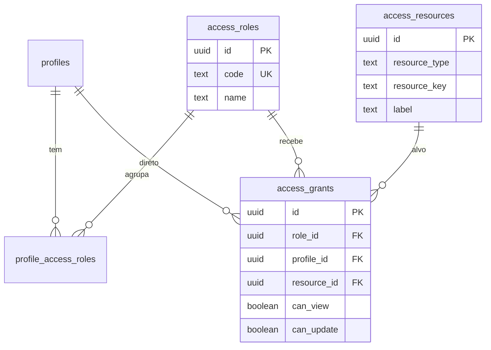

# Controle de acesso — modelo e inventário

Este documento rastreia **como o app-igreja identifica usuários hoje**, quais **telas**, **tabelas** e **campos** existem no ecossistema, e como a tabela de relacionamento proposta se encaixa.

Script SQL: [`scripts/access-control-schema.sql`](scripts/access-control-schema.sql)

**Manual operacional (dia a dia):** [`MANUAL_CONTROLE_ACESSO.md`](MANUAL_CONTROLE_ACESSO.md)

**Pacote:** [`PACOTE_3_GOVERNANCA_TI.md`](PACOTE_3_GOVERNANCA_TI.md) · **Índice:** [`INDICE_DOCUMENTACAO.md`](INDICE_DOCUMENTACAO.md) · **Camadas de segurança:** [`CAMADAS_SEGURANCA.md`](CAMADAS_SEGURANCA.md)

---

## Status da implementação (atualizado em 09/06/2026)

Documento de encerramento da sessão: o que já está pronto, o que falta e qual é o **próximo passo** recomendado.

### Concluído no Supabase (Passos 1–7)

| Item | Status |
|------|--------|
| Tabelas `access_resources`, `access_roles`, `access_grants`, `profile_access_roles` | Criadas |
| Correção de índices únicos (`role_id` / `profile_id` parciais) | Aplicada (evita erro 23505 com `profile_id` null) |
| Funções `profile_has_access` e `profile_has_access_by_phone` | Criadas |
| Seed de recursos, papéis e grants (`member`, `super_admin`, `events_admin`) | Executado |
| Perfil administrador (`04b919ba-38b4-4fe5-a371-2e98e9acbc0d`) com `super_admin` + `member` | Configurado |
| Todos os perfis em `profiles` com papel `member` | Configurado |
| Teste SQL: `profile_has_access` → manutenção `true` para super_admin | OK |

### Concluído no app (Passo 9)

| Item | Arquivo(s) |
|------|----------------|
| Sessão: `user_phone` + `user_profile_id` após login/cadastro | `lib/userSession.ts`, `app/index.tsx`, `app/register.tsx` |
| Cliente ACL: RPC `profile_has_access` / `sessionHasAccess` | `lib/accessControl.ts` |
| Engrenagem do dashboard só para quem tem `view` em `/maintenance-dashboard` | `app/(tabs)/dashboard.tsx` |
| Bloqueio da tela `maintenance-dashboard` sem permissão | `app/maintenance-dashboard.tsx` |
| Logout limpa sessão (telefone + profile_id) | `app/(tabs)/dashboard.tsx` |
| **Passo 9b:** carrossel só com cards permitidos (`dashboard.card.*`) | `lib/accessControl.ts`, `app/(tabs)/dashboard.tsx` |
| **Passo 9c:** colunas visíveis/editáveis em Dados cadastrais | `lib/accessControl.ts`, `app/manage-profile.tsx` |
| **Passo 9d:** `update_profile_field` e `update_profile_access_pin` validam `can_update` | `scripts/access-control-profile-write-rpc.sql` |
| **Passo 9e:** UI admin de papéis e grants (somente `super_admin`) | `components/MaintenanceAccessControlCard.tsx`, `scripts/access-control-admin-rpc.sql` |
| **Passo 9f:** RLS nas tabelas com `profile_has_access` + header `x-profile-id` | `scripts/access-control-table-rls.sql`, `lib/supabaseSessionFetch.ts` |

### Entregas recentes (jun/2026)

| Item | Detalhe |
|------|---------|
| **Relatórios de Despesas (RD)** | Tela `/expense-report`; tesouraria na manutenção (`expense-reports-*.sql`); listagem mensal por data do lançamento (conciliados) ou emissão (pendentes) |
| **Financeiro manutenção** | Carga/esvaziar lote com versão REALIZADO/PLANEJADO; seções colapsáveis; accordion (uma seção aberta) |
| **Índice do aplicativo** | `/(tabs)/index` — atalhos com etiquetas para todos os cards |
| **Manutenção — card menu** | Primeiro card do carrossel com etiquetas dos módulos |
| **Marca d'água** | Global via `AppShell`, exceto login; alinhada ao frame do card |
| **Performance navegação** | Refetch silencioso no foco; menos re-renders ao trocar cards |

### Ainda não feito (próximas sessões)
- Papel `events_admin` atribuído a pessoas da equipe de eventos (só seed SQL hoje).
- RLS em tabelas auxiliares (`checkins`, `escalas_*`, …).
- Views com mascaramento de colunas sensíveis em `profiles`.

### Outras entregas da mesma época (fora do ACL)

- Senha de acesso em Dados cadastrais (PIN, seção recolhível, olho, validação).
- Gerenciar Família: seção “Adicionar membro” recolhível; busca por nome; **transferência** entre famílias com confirmação; **herança de endereço completo** ao aceitar, transferir ou adicionar membro (`lib/inheritFamilyAddress.ts`, RPC `accept_managed_member_into_family`).
- Dashboard: carrossel com `‹` / `›`, indicador `1 / N`, badge do card ativo; card **Dízimos e Ofertas** sempre visível; card **SALA(S)** filtrado por família do usuário.
- UX compartilhada: `lib/uiTokens.ts`, ícones coloridos no Menu e na Manutenção, chips segmentados no Coração Aberto.

---

## Próximo passo recomendado (quando retomar)

Roadmap ACL (fases 9a–9f) **concluído**. Guards de rota nas telas principais via `hooks/useScreenAccessGuard.ts`.

Próximas melhorias opcionais:

1. Enforcement ACL em RPCs de manutenção (escalas, financeiro em lote, etc.).
2. RLS em tabelas auxiliares (`checkins`, `escalas_log`, `tipos_escala`, …).
3. Views com mascaramento de colunas sensíveis (`access_pin`, `cpf`) em `profiles`.

**Supabase (obrigatório após 9f):** execute `scripts/access-control-table-rls.sql` no SQL Editor.

**Teste rápido (9f):**

```sql
-- Simula header do app (substitua pelo seu profile_id)
select set_config('request.headers', '{"x-profile-id":"<uuid>"}', true);
select public.session_has_resource_access('table', 'profiles', 'view');
-- esperado: true para member com grant
```

**Lembrete ao testar no celular:** após mudar papéis no Supabase, use **Sair** e entre de novo para gravar `user_profile_id` na sessão.

---

## 1. Situação no banco vs. no app (referência)

| Aspecto | Hoje |
|--------|------|
| **Identidade no app** | `profiles.id` (login por PIN em `profiles.access_pin` + telefone em `AsyncStorage`) |
| **Supabase Auth** | Opcional (`profiles.auth_user_id`); muitos usuários **não** têm linha em `auth.users` |
| **Autorização** | RLS com `profile_has_access` nas tabelas principais (9f) + RPCs `security definer` para fluxos sem sessão |
| **Manutenção** | Engrenagem e rota protegidas via `profile_has_access` (Passo 9 parcial) |
| **Cards do dashboard** | Filtrados por `profile_has_access` (Passo 9b) |
| **Demais telas** | Guards de rota em manutenção, perfil, família, pastoral, financeiro e LGPD |
| **Campos sensíveis** | Ocultos no cliente; RPCs `update_profile_field` / PIN validam `can_update` por coluna (9d) |

O banco **já responde** permissões via `profile_has_access`; o app consulta para **manutenção** e **cards do dashboard**.

---

## 2. Sujeito da permissão

Use sempre **`profiles.id`** como “usuário” do ACL.

- Não use só `auth.users.id` — pedidos pastorais e RPCs já documentam o desvio (`pastoral-requests-fields.sql`).
- O app pode resolver `profile_id` a partir do telefone da sessão (`find_profile_id_by_phone` / SELECT em `profiles`).

---

## 3. Inventário de telas (`resource_type = 'screen'`)

| `resource_key` | Rota / origem | Observação |
|----------------|---------------|------------|
| `screen:/` | `app/index.tsx` | Login |
| `screen:/register` | `app/register.tsx` | Cadastro |
| `screen:/dashboard` | `app/(tabs)/dashboard.tsx` | Painel principal |
| `screen:/maintenance-dashboard` | `app/maintenance-dashboard.tsx` | Manutenção (eventos, monitor salas) |
| `screen:/manage-profile` | `app/manage-profile.tsx` | Dados cadastrais |
| `screen:/manage-members` | `app/manage-members.tsx` | Gerenciar família |
| `screen:/pastoral` | `app/pastoral.tsx` | Coração Aberto (formulário) |
| `screen:/pastoral-history` | `app/pastoral-history.tsx` | Meus pedidos |
| `screen:/lgpd` | `app/lgpd.tsx` | Termos LGPD |

### Cards do dashboard (`screen:dashboard.card.*`)

| `resource_key` | Card | `content` |
|----------------|------|-----------|
| `screen:dashboard.card.event_alt` | Agenda da Família | `event_alt` |
| `screen:dashboard.card.qr` | Check In | `qr` |
| `screen:dashboard.card.kids_teens` | SALA(S) | `kids_teens` |
| `screen:dashboard.card.offerings` | Dízimos e Ofertas | `offerings` |
| `screen:dashboard.card.pastoral` | Coração Aberto | `pastoral` |
| `screen:dashboard.card.members_list` | Lista de membros | `members_list` |
| `screen:dashboard.card.birthdays` | Aniversariantes | `birthdays` |
| `screen:dashboard.card.vigilance_scales` | Escalas | `vigilance_scales` |
| `screen:dashboard.card.parking_vehicle_v2` | Estacionamento | `parking_vehicle_v2` |
| `screen:dashboard.card.grouped_manage` | Menu (perfil + família) | `grouped_manage` |

Visibilidade condicional de cards (parâmetros/evento) continua no app; o ACL define se o usuário **pode** ver o card quando ele estaria disponível.

---

## 4. Inventário de tabelas (`resource_type = 'table'`)

Tabelas usadas pelo app (Supabase `public`):

| `resource_key` | Uso principal |
|----------------|---------------|
| `table:profiles` | Login, perfil, LGPD, endereço, PIN |
| `table:members` | Família, check-in, listas |
| `table:events` | Agenda, manutenção, salas |
| `table:event_registrations` | Check-in / salas Kids-Teens |
| `table:profile_vehicles` | Veículos no perfil e estacionamento |
| `table:pastoral_requests` | Pedidos pastorais |
| `table:pastoral_reason_categories` | Motivos (leitura) |
| `table:pastoral_reason_subcategories` | Submotivos (leitura) |
| `table:app_parameters` | Parâmetros globais (PIX, QR, prefixo família) |
| `table:families` | Dados de família (`useFamilyData`) |
| `table:vigilancia_*` | Escalas (import/histórico — conferir nomes no Supabase) |

Atualizar a lista após `information_schema.tables` no projeto se houver tabelas só no banco.

---

## 5. Inventário de campos (`resource_type = 'column'`)

Formato: `column:<tabela>.<coluna>`.

### `profiles` (cadastro + sensíveis)

Colunas conhecidas no app (`manage-profile.tsx`, `register.tsx`):

| Coluna | Sensível | Notas |
|--------|----------|--------|
| `full_name`, `phone`, `birth_date`, `email` | médio | Contato / identificação |
| `cpf` | alto | Oculto na UI padrão |
| `access_pin` | crítico | Só RPC `update_profile_access_pin`; exige `can_update` (9d) |
| `address_*`, `cep` | médio | Endereço |
| `lgpd_*`, `medical_food_alerts` | alto | Privacidade / saúde |
| `family_id`, `codigo_membro`, `role` | médio | Escopo familiar / papel |
| `selfie_url` | médio | Imagem |
| `auth_user_id`, `id`, `created_at`, `updated_at` | sistema | Bloqueados em `update_profile_field` |

### `members`

| Coluna | Notas |
|--------|--------|
| `full_name`, `phone`, `birth_date`, `relationship`, `family_id` | Gerenciar família |
| `accepted` | Reconhecimento na família |

### `events`

Campos editáveis em `maintenance-dashboard` / `maintenanceEventForm`: `name`, `event_date`, `event_local`, `max_capacity`, `kids_room`, `teens_room`, `parm_ofertas`, `is_locked`, `is_visible`, etc.

### `pastoral_requests`

`request_for`, `beneficiary_*`, `destination_label`, `profile_id`, `message`, status, etc. (`pastoral-requests-fields.sql`).

**Regra sugerida:** `can_view` na tabela não implica todas as colunas — conceda colunas sensíveis (`cpf`, `access_pin`) só a papéis administrativos.

---

## 6. Modelo proposto (3 tabelas + função)



### `access_resources` (catálogo)

Define **o que** pode ser protegido: tela, tabela ou coluna.

### `access_roles` (papéis)

Ex.: `member`, `family_acceptor`, `pastoral`, `events_admin`, `super_admin`.

### `access_grants` (relacionamento pedido)

Uma linha = permissão de um **papel** *ou* de um **perfil** sobre um recurso:

- `can_view` — visualizar (tela, listagem, SELECT de campo)
- `can_update` — alterar (formulário, UPDATE, RPC de escrita)

Exatamente um de `role_id` ou `profile_id` deve estar preenchido.

### `profile_access_roles`

N:N entre `profiles` e `access_roles`.

### Função `profile_has_access(profile_id, resource_type, resource_key, action)`

- `action`: `'view'` ou `'update'`
- Suporta curinga `*` no final da chave (ex.: `table:profiles` não inclui colunas; `column:profiles.*` todas as colunas)
- **Modo legado:** se não existir nenhum grant no sistema, retorna `true` (app continua funcionando até você configurar papéis)

---

## 7. Papéis sugeridos (seed)

| `code` | Quem | View típico | Update típico |
|--------|------|-------------|---------------|
| `visitantes` | Sem perfil na sessão ou perfil sem papéis | Login, cadastro, LGPD, check-in QR, eventos públicos | Cadastro e inscrição em eventos |
| `congregado` | Participante cadastrado | Dashboard básico, perfil, pastoral; sem família/financeiro | Perfil e pedido pastoral |
| `member` | Membro comum | Próprio perfil (campos básicos), cards dashboard, pastoral próprio | Perfil próprio (campos permitidos), pedido pastoral |
| `family_acceptor` | Quem aceita familiares | `manage-members`, membros da família | `members` da própria `family_id` |
| `lider` | Líder de tipo(s) de escala | Painéis de servos/programação + card Escalas | Tipos vinculados em `profile_scale_leadership` |
| `events_admin` | Equipe de eventos | `maintenance-dashboard`, `events` | CRUD `events` |
| `pastoral` | Equipe pastoral | Pedidos (futuro painel) | Triagem `pastoral_requests` |
| `super_admin` | TI / pastor responsável | `*` | `*` |

Ordem no painel admin: mesma sequência da tabela acima.

Ajuste conforme a política da igreja.

---

## 8. Roadmap do app (ordem sugerida)

| Fase | Descrição | Status |
|------|-----------|--------|
| 9a | Manutenção (engrenagem + tela) | Feito |
| 9b | Cards do dashboard (`dashboard.card.*`) | Feito |
| 9c | Campos do perfil (`column:profiles.*`) | Feito |
| 9d | RPCs de escrita | Feito |
| 9e | UI admin de grants | Feito |
| 9f | RLS nas tabelas | Feito |

---

## 9. Checklist operacional

### Supabase

- [x] Executar `scripts/access-control-schema.sql` (e correção de índices se necessário)
- [x] `super_admin` no perfil administrador
- [x] `member` em todos os perfis
- [x] Testar `profile_has_access` no SQL Editor
- [ ] Atribuir `events_admin` a quem cuida de eventos (quando definir a equipe)
- [ ] Revisar grants do papel `member` conforme política da igreja

### App

- [x] `lib/userSession.ts` + `lib/accessControl.ts`
- [x] Login/cadastro persistem `user_profile_id`
- [x] Dashboard: engrenagem condicional
- [x] `maintenance-dashboard`: guard de acesso
- [x] Dashboard: filtrar cards por ACL (Passo 9b)
- [ ] Supabase: `access-control-member-dashboard-grants.sql` se seed antigo omitiu cards do `member`
- [x] `manage-profile`: colunas visíveis/editáveis por permissão (Passo 9c)
- [ ] Supabase: `access-control-member-profile-columns.sql` se seed antigo omitiu `cpf` / `medical_food_alerts` no `member`
- [x] RPCs: validar `can_update` antes de gravar (Passo 9d)
- [ ] Supabase: `access-control-profile-write-rpc.sql` após deploy do app 9d
- [x] Manutenção: card Controle de Acesso para `super_admin` (Passo 9e)
- [ ] Supabase: `access-control-admin-rpc.sql` após deploy do app 9e
- [x] App: header `x-profile-id` em todas as requisições Supabase (Passo 9f)
- [x] RLS: policies ACL em tabelas principais (Passo 9f)
- [ ] Supabase: `access-control-table-rls.sql` após deploy do app 9f

### Arquivos de referência no código

| Arquivo | Uso |
|---------|-----|
| `lib/accessControl.ts` | Constantes `ACCESS_SCREEN`, `ACCESS_DASHBOARD_CARD`, helpers RPC |
| `lib/userSession.ts` | `user_profile_id` no AsyncStorage |
| `lib/supabaseSessionFetch.ts` | Header `x-profile-id` para RLS (9f) |
| `hooks/useScreenAccessGuard.ts` | Guard de rota por `screen:*` |
| `scripts/access-control-table-rls.sql` | Policies RLS por tabela |
| `DASHBOARD_CARDS.md` | Lista de cards e `content` |
| `MANUTENCAO_ECOSISTEMA.md` | Rotina do módulo de manutenção |
| `MANUAL_CONTROLE_ACESSO.md` | Manual operacional (papéis, grants, testes, troubleshooting) |
