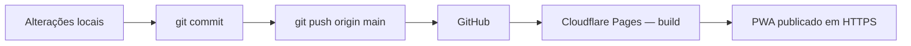

# Deploy do PWA no Cloudflare Pages

Guia rápido para publicar o **app-igreja** via `git push` no GitHub. O Cloudflare Pages faz o build automaticamente a cada push na branch `main`.

**Repositório:** https://github.com/maufreitas63/app-igreja

---

## Visão geral



| Etapa | Quem executa | Tempo típico |
|-------|----------------|--------------|
| Push → fila no Cloudflare | Automático | ~30 s |
| `npm install` + `npm run build:web` | Cloudflare | **3–10 min** |
| Propagação do deploy | Cloudflare | ~30 s |
| Navegador buscar HTML novo | Usuário (revalidação) | Imediato após deploy* |

\* O `public/_headers` manda o HTML a **revalidar sempre**; os JS/CSS com hash continuam em cache. Sem hard refresh, alguns navegadores/PWA instalados ainda podem demorar um pouco — veja seção abaixo.

---

## Configuração do projeto no Cloudflare (uma vez)

No painel [Cloudflare Dashboard](https://dash.cloudflare.com/) → **Workers & Pages** → **Create application** → **Pages** → **Connect to Git**:

| Campo | Valor |
|-------|--------|
| Repositório | `maufreitas63/app-igreja` |
| Branch de produção | `main` |
| Framework preset | **None** (ou Expo, se disponível — o comando abaixo é o que importa) |
| Build command | `npm run build:web` |
| Build output directory | `dist` |
| Root directory | *(vazio — raiz do repositório)* |

### Variáveis de ambiente (Build)

Em **Settings → Environment variables** do projeto Pages, configure:

| Variável | Valor | Obrigatória |
|----------|--------|-------------|
| `NODE_VERSION` | `20` | Sim |
| `NODE_OPTIONS` | `--max-old-space-size=6144` | Recomendado |
| `PUPPETEER_SKIP_DOWNLOAD` | `true` | Recomendado |

Variáveis opcionais do app (só se precisar no build/runtime):

| Variável | Uso |
|----------|-----|
| `EXPO_PUBLIC_GOOGLE_MAPS_GEOCODING_API_KEY` | Geocodificação Google (senão usa ViaCEP + OSM) |
| `EXPO_PUBLIC_ACL_STRICT` | `true` para negar acesso quando RPC de ACL estiver ausente |

### Assistente IA (runtime — Cloudflare Pages Function `/api/ai-chat`)

Em **Settings → Environment variables** (ambiente **Production**), configure também:

| Variável | Uso | Obrigatória |
|----------|-----|-------------|
| `GEMINI_API_KEY` | Chave da API Google Gemini (nunca no PWA) | Sim |
| `SUPABASE_SERVICE_ROLE_KEY` | Valida sessão e grava `ai_audit_logs` no servidor | Sim |
| `SUPABASE_URL` | Opcional; padrão `https://bldbrsuiwctoaxzcrjoc.supabase.co` | Não |

> O chat em produção chama **`/api/ai-chat`** na mesma origem do PWA (pasta `functions/` no repositório). Não é necessário deploy separado no Supabase Edge Functions, salvo desenvolvimento local.

> O Supabase usa valores padrão em `lib/supabaseConfig.ts`. Para outro projeto/ambiente, defina `EXPO_PUBLIC_SUPABASE_URL` e `EXPO_PUBLIC_SUPABASE_ANON_KEY` no Cloudflare.

---

## Fluxo diário: git push

### 1. Conferir o que será enviado

```powershell
cd c:\Users\maufr\.cursor\MProj\ecossistema\app-igreja
git status
git diff
```

### 2. Commitar (se ainda não commitou)

```powershell
git add .
git commit -m "descreva aqui a alteração"
```

### 3. Enviar para o GitHub

```powershell
git push origin main
```

Pronto. O Cloudflare detecta o push e inicia um novo deploy em alguns segundos.

> **Produção vs Preview:** só pushes na branch **`main`** geram deploy de **Production** (URL principal / domínio customizado). Pushes em outras branches (`melhorias-cursor`, PRs, etc.) geram deploys **Preview** — visíveis no painel, mas **não** substituem o site em produção até merge em `main` ou **Promote to production** manual.

### 4. Acompanhar o build

1. Cloudflare Dashboard → seu projeto Pages → aba **Deployments**
2. Aguarde status **Success** (build costuma levar 2–8 minutos)
3. Abra a URL do projeto (ex.: `https://app-igreja.pages.dev` ou domínio customizado)

### 5. Validar no navegador

Após o deploy aparecer **Success** (não basta o `git push` — aguarde o build):

1. Abra `https://{seu-dominio}/build-info.json` e confira:
   - `"environment": "production"` e `"branch": "main"` — deploy de produção ativo
   - Se aparecer `"environment": "preview"`, você está em URL de preview (ou build de branch secundária), **não** em produção
   - `"commit"` deve corresponder ao push em `main` no GitHub
2. Abra a URL em aba anônima **ou** use **Ctrl+Shift+R** (hard refresh)
3. Confira no DevTools → **Network** → documento HTML: cabeçalho `cache-control: public, max-age=0, must-revalidate`
4. Teste login, dashboard e a tela que você alterou
5. Se o app está **instalado como PWA**: feche todas as janelas, reabra; em último caso, limpe dados do site no navegador

### Formulário público de cadastro familiar (fora do app)

O `npm run build:web` gera **dois** artefatos na pasta `dist/`:

| Caminho | Conteúdo |
|---------|----------|
| `/` | PWA da igreja (login, dashboard, etc.) |
| `/cadastro-familia/` | Formulário standalone — **sem** AppShell, tabs nem login |

**Link para enviar aos usuários:**

```
https://{seu-dominio}/cadastro-familia/
```

Exemplo: `https://app-igreja.pages.dev/cadastro-familia/`

Após o envio, a submissão entra na fila **Recepção Familiar** na manutenção (execute `scripts/recepcao-cadastro-familiar.sql` no Supabase se a fila não carregar).

Desenvolvimento local do formulário (sem Expo):

```powershell
npm run dev:family-form
```

> **Por que parece “demorar”?** O código só entra em produção depois do build no Cloudflare (vários minutos). O push no Git é só o gatilho — não é publicação instantânea.

---

## Testar o build localmente (antes do push)

Evita falhas no Cloudflare:

```powershell
cd c:\Users\maufr\.cursor\MProj\ecossistema\app-igreja
npm install
npm run build:web
```

Se terminar sem erro, a pasta `dist/` foi gerada. Opcional: servir localmente:

```powershell
npx serve dist
```

Requisito de Node: **≥ 20.19.4** (ver `package.json` e `.nvmrc`).

---

## Solução de problemas

| Sintoma | O que verificar |
|---------|------------------|
| `Output directory "npm run build:web" not found` / build sem `npm install` | No painel **Settings → Builds**: **Build command** = `npm run build:web` e **Build output directory** = `dist` (não inverta os dois campos). Depois **Retry deployment**. |
| `npm error command sh -c node scripts/cloudflare-pages-build.mjs` | Corrigido: removido postinstall. Build command deve ser `npm run build:web`. |
| Build falha com erro de memória | `NODE_OPTIONS=--max-old-space-size=6144` no Cloudflare (o script também aplica no CI) |
| `git` não encontrado no build | Não afeta o deploy atual; build usa `npm run build:web` |
| Node 18 / erro Metro | `NODE_VERSION=20` nas variáveis do Cloudflare |
| PWA antigo após deploy | Aguardar deploy **Success**; hard refresh (Ctrl+Shift+R); PWA: fechar e reabrir. Headers em `public/_headers` evitam cache longo do HTML |
| Alteração no ar mas tela antiga | Build ainda em andamento na aba **Deployments**, ou cache local — aba anônima para testar |
| Deploy aparece como **Preview** no Cloudflare | Push foi em branch ≠ `main` — faça merge em `main` + `git push origin main`, ou no painel: **Deployments** → ⋯ no deploy → **Promote to production** |
| `/build-info.json` mostra `"preview"` | Abra a URL de produção (domínio principal), não o link `*.pages.dev` do commit/branch |
| Ícones aparecem como `?` ou quadrado | Fontes em `assets/fonts/` + `public/_headers`; confira no DevTools → Network se os `.ttf` retornam 200 (não 404) |
| Push rejeitado | `git pull origin main` antes de novo push |
| Deploy não dispara | Branch do push deve ser `main` (branch de produção no Pages) |

Logs completos do build: Cloudflare → **Deployments** → clique no deploy → **View build log**.

---

## Checklist rápido

- [ ] Alterações testadas localmente (`npm run web` ou `npm run build:web`)
- [ ] Commit criado com mensagem clara
- [ ] `git push origin main` concluído (**não** apenas branch de feature)
- [ ] Deploy **Success** no Cloudflare com badge **Production** (não Preview)
- [ ] `/build-info.json` com `"environment": "production"`, `"branch": "main"` e commit do push atual
- [ ] PWA validado no navegador com hard refresh

---

## Produção vs Preview (Cloudflare Pages)

| Tipo | Quando ocorre | URL típica | Vai para o público? |
|------|----------------|------------|---------------------|
| **Production** | Push em `main` (branch de produção) | Domínio principal (`app-igreja.pages.dev` ou customizado) | **Sim** |
| **Preview** | Push em outra branch, PR ou deploy manual de branch | `https://{hash}.{projeto}.pages.dev` ou link do deploy | **Não** (só quem tem o link) |

### Publicar alterações em produção imediatamente

1. Garanta que o código está em **`main`**: `git checkout main` → `git merge melhorias-cursor` (se necessário)
2. `git push origin main`
3. No Cloudflare → **Deployments** → aguarde o deploy com etiqueta **Production** (verde)
4. Confira `https://{seu-dominio}/build-info.json` → `"environment": "production"`

### Se o deploy certo está só em Preview

No painel Cloudflare → **Deployments** → localize o deploy desejado → menu **⋯** → **Promote to production**.

Ou faça merge na `main` e push — o próximo build de `main` substitui produção automaticamente.

### Configuração recomendada (uma vez)

**Settings → Builds & deployments:**

- **Production branch:** `main`
- Preview deployments: opcional para branches de feature; produção **sempre** segue `main`

---

## Referências no repositório

| Arquivo | Conteúdo |
|---------|----------|
| `package.json` | `build:web` → `write-build-info.mjs` + `expo export -p web` + `build:family-form` |
| `scripts/write-build-info.mjs` | Gera `public/build-info.json` (commit + data do build) |
| `npm run build:access-roles-pdf` | Mapa ACL → `pdfs/PAPEIS_CONTROLE_ACESSO.pdf` |
| `standalone/cadastro-familia/` | Formulário público independente do PWA |
| `app.json` | Web: `bundler: metro`, `output: static` |
| `public/_headers` | Cache: HTML revalida sempre; `/_expo/static` e `/assets` com cache longo |
| `.nvmrc` | Node 20 |
| `.env.example` | Variáveis opcionais do Expo |
| `ARQUITETURA_BLUEPRINT_PWA.md` | Arquitetura do PWA |

---

*App IBN · Deploy Cloudflare Pages · atualizado em 12/06/2026*

```powershell
git push origin main
```
