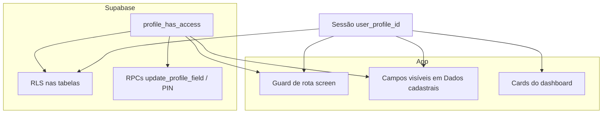

# Manual operacional — Controle de acesso (app-igreja)

Este manual descreve **como operar** o controle de acesso no dia a dia: instalação, atribuição de papéis, ajuste de permissões, testes e resolução de problemas.

Documentação técnica de referência: [`CONTROLE_ACESSO.md`](CONTROLE_ACESSO.md) · [`CAMADAS_SEGURANCA.md`](CAMADAS_SEGURANCA.md)

**Pacote:** [`PACOTE_3_GOVERNANCA_TI.md`](PACOTE_3_GOVERNANCA_TI.md) · **Índice:** [`INDICE_DOCUMENTACAO.md`](INDICE_DOCUMENTACAO.md)

**Atualizado em:** 09/06/2026

---

## 1. Para quem é este manual

| Público | Uso |
|---------|-----|
| **Super administrador** | Configura papéis e permissões pela UI ou SQL |
| **Equipe de TI / secretaria** | Atribui `events_admin`, `pastoral`, etc. a pessoas certas |
| **Desenvolvedor** | Instala scripts, valida RLS e RPCs após deploy |

---

## 2. Conceitos essenciais

### 2.1 Identidade

- O “usuário” do ACL é sempre **`profiles.id`** (UUID).
- Login no app: telefone + PIN de 4 dígitos (`profiles.access_pin`).
- Após o login, o app grava `user_profile_id` na sessão e envia o header **`x-profile-id`** ao Supabase.

### 2.2 Papéis (`access_roles`)

Um perfil pode ter **vários papéis** ao mesmo tempo (ex.: `member` + `events_admin`).

| Código | Nome | Uso típico |
|--------|------|------------|
| `visitantes` | Visitantes | Acesso público mínimo; **fallback** sem perfil na sessão ou perfil sem papéis |
| `congregado` | Congregado | Participante com acesso básico (sem gerenciar família) |
| `member` | Membro | Acesso padrão do aplicativo |
| `family_acceptor` | Responsável familiar | Gerencia família (complementar ao `member`) |
| `lider` | Líder | Gerencia servos e programação dos tipos de escala atribuídos ao perfil |
| `events_admin` | Administrador de eventos | Manutenção de eventos e salas |
| `pastoral` | Equipe pastoral | Triagem de pedidos pastorais |
| `super_admin` | Super administrador | Configura o ACL; acesso amplo |

**Ordem no painel (aba Papéis e lista de papéis do perfil):** Visitantes → Congregado → Membro → Responsável familiar → Líder → Administrador de eventos → Equipe pastoral → Super administrador.

### 2.4 Líder de escala (`lider`)

O papel **`lider`** permite gerenciar **tipos específicos** de escala (ex.: Vigilância, Recepção):

1. **Papéis** → ajuste grants do `lider` (painéis `maintenance.card.scale_volunteers` e `maintenance.card.scales`).
2. **Perfis** → atribua o papel **`lider`** ao perfil.
3. **Perfis** → na seção **Liderança por tipo de escala**, ligue os tipos que essa pessoa comanda.

Recursos por tipo: `screen:scale_type.<codigo>` (criados automaticamente a partir de `tipos_escala.codigo`).

Quem tem `maintenance.card.scale_types` (ou `super_admin`) cria/edita tipos; o líder só opera nos tipos vinculados.

**Script:** `scripts/access-control-lider-escala.sql`

**Regra:** todo perfil ativo deve manter pelo menos o papel **`member`**, salvo exceções administrativas explícitas.

**Fallback Visitantes:** quem **não tem `user_profile_id` na sessão** (antes do login) ou tem perfil **sem nenhum papel** em `profile_access_roles` recebe automaticamente os grants do papel **`visitantes`** — não é necessário atribuir esse papel manualmente na maioria dos casos.

### 2.3 Recursos (`access_resources`)

O que pode ser protegido:

| Tipo | Exemplo de chave | O que controla |
|------|------------------|----------------|
| `screen` | `/manage-profile` | Abrir uma tela ou card do dashboard |
| `table` | `profiles` | Leitura/gravação em uma tabela |
| `column` | `profiles.cpf` | Ver/editar um campo em Dados cadastrais |

Curingas (uso restrito):

- `screen:*` — todas as telas
- `table:*` — todas as tabelas
- `column:profiles.*` — todas as colunas de `profiles`

### 2.4 Permissões (`access_grants`)

Cada grant liga um **papel** (ou um perfil específico) a um **recurso**:

| Flag | Significado |
|------|-------------|
| `can_view` | Pode ver (tela, listagem, campo) |
| `can_update` | Pode alterar (formulário, UPDATE, RPC de escrita) |

**Importante:** `can_view` em `table:profiles` **não** libera automaticamente `profiles.cpf` ou `profiles.access_pin`. Colunas sensíveis exigem grants de coluna explícitos.

### 2.5 Onde a permissão é aplicada



---

## 3. Instalação e pré-requisitos (uma vez)

Execute no **SQL Editor do Supabase**, nesta ordem:

| Ordem | Script | O que faz |
|-------|--------|-----------|
| 1 | `scripts/access-control-schema.sql` | Tabelas, funções, seed inicial |
| 2 | `scripts/access-control-profile-write-rpc.sql` | ACL nas RPCs de perfil (9d) |
| 3 | `scripts/access-control-admin-rpc.sql` | UI admin de papéis/grants (9e) |
| 4 | `scripts/access-control-table-rls.sql` | RLS nas tabelas principais (9f) |

Scripts **incrementais** (se o seed for antigo ou algo sumir no app):

| Script | Quando usar |
|--------|-------------|
| `access-control-member-dashboard-grants.sql` | Cards do dashboard não aparecem para `member` |
| `access-control-member-profile-columns.sql` | CPF ou alertas alimentares não aparecem em Dados cadastrais |
| `access-control-lider-escala.sql` | Papel Líder, vínculo perfil↔tipo de escala e enforcement nas RPCs de escala |
| `access-control-role-display-order.sql` | Corrigir ordem dos papéis no painel (Visitantes → … → Super administrador) |
| `access-control-congregado-visitantes-roles.sql` | **Congregado e Visitantes não aparecem na UI** — cria ambos os papéis e grants |
| `access-control-congregado-role.sql` | Só Congregado (legado; prefira o script combinado acima) |
| `access-control-visitantes-role.sql` | Só Visitantes + funções de fallback (sem perfil/papéis) |

### 3.1 Primeiro super administrador

Todo ambiente precisa de **pelo menos um** perfil com papel `super_admin`:

```sql
-- Confirme quem já é super_admin
select p.full_name, p.phone, ar.code
  from public.profile_access_roles par
  join public.access_roles ar on ar.id = par.role_id
  join public.profiles p on p.id = par.profile_id
 where ar.code = 'super_admin';

-- Atribuir (troque o telefone)
insert into public.profile_access_roles (profile_id, role_id)
select p.id, ar.id
  from public.profiles p
 cross join public.access_roles ar
 where regexp_replace(coalesce(p.phone, ''), '\D', '', 'g')
     = regexp_replace('(11) 99999-9999', '\D', '', 'g')
   and ar.code = 'super_admin'
on conflict (profile_id, role_id) do nothing;
```

### 3.2 Garantir `member` em todos os perfis

```sql
insert into public.profile_access_roles (profile_id, role_id)
select p.id, ar.id
  from public.profiles p
 cross join public.access_roles ar
 where ar.code = 'member'
   and not exists (
     select 1
       from public.profile_access_roles par
      where par.profile_id = p.id
        and par.role_id = ar.id
   );
```

---

## 4. Operação pelo aplicativo (recomendado)

### 4.1 Quem pode abrir a manutenção de ACL

1. Perfil com papel **`super_admin`**.
2. Acesso à tela **Manutenção** (`/maintenance-dashboard`) — normalmente só `super_admin` ou quem tiver grant explícito nessa tela.
3. No carrossel de manutenção, o card **Controle de Acesso** só aparece para `super_admin`.

### 4.2 Aba **Perfis** — atribuir papéis a uma pessoa

**Objetivo:** definir *quem* é membro, quem cuida de eventos, quem é admin, etc.

**Passo a passo:**

1. Abra **Manutenção → Controle de Acesso → aba Perfis**.
2. Em **Buscar perfil**, digite nome, telefone ou código do membro (mínimo 2 caracteres).
3. Toque em **Buscar** e selecione o perfil na lista.
4. Na lista de papéis, use o **switch** para ligar ou desligar cada papel.
5. Confirme o toast de sucesso.

**Efeito:** alteração imediata em `profile_access_roles`.

**Regras de segurança:**

- O sistema **impede remover o último** `super_admin` do banco.
- Após mudar papéis de **si mesmo** ou de quem está testando, peça **Sair → entrar de novo** no app.

### 4.3 Aba **Papéis** — ajustar o que cada papel pode fazer

**Objetivo:** definir *o que* `member`, `events_admin`, etc. podem ver e editar.

**Passo a passo:**

1. Aba **Papéis**.
2. Selecione o papel (ex.: `member`, `events_admin`).
3. Filtre por **Telas**, **Tabelas** ou **Colunas**.
4. Para cada recurso, use:
   - **Ver** — `can_view`
   - **Editar** — `can_update` (só fica ativo se **Ver** estiver ligado)
5. Colunas sensíveis (`profiles.cpf`, `profiles.access_pin`) aparecem **destacadas em amarelo**.

**Desligar Ver e Editar** remove o grant daquele recurso para o papel.

**Exemplos de política:**

| Objetivo | Onde ajustar |
|----------|--------------|
| Membro não vê PIN | Papel `member` → Colunas → `profiles.access_pin` → Ver/Editar desligados |
| Só tesouraria vê financeiro | Tirar `dashboard.card.financial` e `/financial` do `member`; criar papel `finance_admin` (futuro) ou grant direto ao perfil |
| Equipe de eventos mantém agenda | Atribuir papel `events_admin` à pessoa (aba Perfis); revisar grants do papel em Telas/Tabelas |

### 4.4 O que o membro comum experiencia (sem ser admin)

| Área | Comportamento |
|------|---------------|
| Dashboard | Só cards com `can_view` no papel |
| Dados cadastrais | Só campos com grant de coluna; sem PIN se não houver grant |
| Telas (pastoral, família, financeiro) | Guard bloqueia com alerta se não houver `screen:*` view |
| Gravação de perfil | RPC + RLS validam de novo no servidor |

---

## 5. Operação via SQL (Table Editor ou SQL Editor)

Use quando a UI não estiver disponível, para diagnóstico ou carga em massa.

### 5.1 Consultar papéis de um perfil

```sql
select p.full_name, p.phone, ar.code, ar.name, par.granted_at
  from public.profiles p
  join public.profile_access_roles par on par.profile_id = p.id
  join public.access_roles ar on ar.id = par.role_id
 where regexp_replace(coalesce(p.phone, ''), '\D', '', 'g')
     = regexp_replace('(11) 99999-9999', '\D', '', 'g')
 order by ar.code;
```

### 5.2 Testar permissão (simula o app)

```sql
select public.profile_has_access(
  '<uuid-do-perfil>'::uuid,
  'screen',           -- ou 'table' ou 'column'
  '/financial',       -- ou 'profiles' ou 'profiles.cpf'
  'view'              -- ou 'update'
);
```

Simular header da sessão (RLS):

```sql
select set_config(
  'request.headers',
  '{"x-profile-id":"<uuid-do-perfil>"}',
  true
);
select public.session_has_resource_access('table', 'profiles', 'view');
```

### 5.3 Atribuir / remover papel

```sql
-- Atribuir events_admin
insert into public.profile_access_roles (profile_id, role_id)
select p.id, ar.id
  from public.profiles p
 cross join public.access_roles ar
 where p.id = '<uuid>'::uuid
   and ar.code = 'events_admin'
on conflict (profile_id, role_id) do nothing;

-- Remover events_admin
delete from public.profile_access_roles par
 using public.access_roles ar
 where par.role_id = ar.id
   and par.profile_id = '<uuid>'::uuid
   and ar.code = 'events_admin';
```

### 5.4 Ajustar grant de um papel

```sql
-- Ex.: member pode VER mas não EDITAR financeiro (tela)
insert into public.access_grants (role_id, resource_id, can_view, can_update)
select r.id, res.id, true, false
  from public.access_roles r
  join public.access_resources res
    on res.resource_type = 'screen'
   and res.resource_key = '/financial'
 where r.code = 'member'
on conflict (role_id, resource_id) where (role_id is not null) do update
  set can_view = excluded.can_view,
      can_update = excluded.can_update,
      updated_at = now();

-- Remover grant (desliga view e update)
delete from public.access_grants g
 using public.access_roles r, public.access_resources res
 where g.role_id = r.id
   and g.resource_id = res.id
   and r.code = 'member'
   and res.resource_type = 'screen'
   and res.resource_key = '/financial';
```

### 5.5 Grant excepcional a **um perfil** (sem mudar o papel)

Quando **uma pessoa** precisa de algo que o papel dela não tem:

```sql
insert into public.access_grants (profile_id, resource_id, can_view, can_update)
select '<uuid-perfil>'::uuid, res.id, true, false
  from public.access_resources res
 where res.resource_type = 'screen'
   and res.resource_key = '/maintenance-dashboard'
on conflict (profile_id, resource_id) where (profile_id is not null) do update
  set can_view = excluded.can_view,
      can_update = excluded.can_update,
      updated_at = now();
```

Use com moderação: grants por perfil são mais difíceis de auditar que grants por papel.

---

## 6. Cenários operacionais (receitas)

### 6.1 Atribuir papel Congregado (em vez de Membro)

Use para quem participa do app mas **não** é membro pleno nem responsável familiar.

1. Controle de Acesso → **Perfis** → buscar pessoa.
2. Ligar **`congregado`**; desligar **`member`** se não for membro pleno.
3. Ajustar grants em **Papéis → Congregado** (Telas / Colunas) conforme a política da igreja.
4. Pedir **Sair → entrar** no app.

**Diferença padrão vs `member`:** sem `/manage-members`, sem card lista de membros, sem financeiro, sem CPF/alertas alimentares no seed inicial.

### 6.2 Novo membro cadastrado no app

| Etapa | O que acontece | Ação do operador |
|-------|----------------|------------------|
| Cadastro | Cria linha em `profiles` | Nenhuma, se o seed aplicar `member` a todos automaticamente |
| Primeiro login | PIN + sessão | Nenhuma |
| Permissões | Herda grants do papel `member` | Revisar se a política da igreja está correta no papel `member` |

Se o membro não tiver papel `member`:

```sql
insert into public.profile_access_roles (profile_id, role_id)
select p.id, ar.id
  from public.profiles p
 cross join public.access_roles ar
 where p.id = '<uuid>'::uuid
   and ar.code = 'member'
on conflict do nothing;
```

### 6.3 Nomear responsável pela equipe de eventos

1. **App:** Controle de Acesso → Perfis → buscar pessoa → ligar **`events_admin`**.
2. **Verificar** grants do papel `events_admin` (aba Papéis → Telas: `/maintenance-dashboard`; Tabelas: `events`, `event_registrations`).
3. Pedir à pessoa: **Sair → entrar**.
4. Confirmar: engrenagem de manutenção visível; consegue abrir Programação de Eventos.

### 6.4 Restringir CPF e PIN apenas a administradores

1. Aba **Papéis** → `member` → **Colunas**.
2. Desligar **Ver** e **Editar** em:
   - `profiles.cpf`
   - `profiles.access_pin`
3. Manter ligado em `super_admin` (via curinga `*` ou grants explícitos).
4. Testar com perfil `member`: Dados cadastrais sem CPF/PIN; alteração de PIN falha no servidor.

### 6.5 Membro perdeu acesso a um card do dashboard

**Diagnóstico:**

```sql
select public.profile_has_access(
  '<uuid>'::uuid,
  'screen',
  'dashboard.card.financial',
  'view'
);
```

**Correção rápida:** executar `access-control-member-dashboard-grants.sql` ou religar o grant na aba Papéis → `member` → Telas.

### 6.6 Promover novo super administrador

1. Controle de Acesso → Perfis → buscar pessoa → ligar **`super_admin`**.
2. **Não** remover o `super_admin` antigo até o novo confirmar acesso.
3. Novo admin: Sair → entrar → abrir Manutenção → Controle de Acesso.

### 6.7 Desligar acesso de um voluntário

1. Remover papéis específicos (`events_admin`, `pastoral`, …) na aba Perfis.
2. Manter `member` se a pessoa continuar usando o app como membro.
3. Para bloqueio total: remover todos os papéis **exceto** se for o último `super_admin` (bloqueado pelo sistema).

---

## 7. Rotina de manutenção recomendada

### 7.1 Semanal (5 min)

- [ ] Confirmar que existe pelo menos um `super_admin` ativo.
- [ ] Revisar se há perfis sem papel `member` (consulta SQL abaixo).

```sql
select p.id, p.full_name, p.phone
  from public.profiles p
 where not exists (
   select 1
     from public.profile_access_roles par
     join public.access_roles ar on ar.id = par.role_id
    where par.profile_id = p.id
      and ar.code = 'member'
 )
   and coalesce(p.full_name, '') <> '';
```

### 7.2 Ao mudar equipe (eventos, pastoral, tesouraria)

- [ ] Atribuir/remover papéis na aba Perfis.
- [ ] Avisar: **Sair e entrar** no app.
- [ ] Testar uma tela e um card do dashboard com o perfil afetado.

### 7.3 Após deploy de nova versão do app

- [ ] Confirmar scripts SQL do ACL aplicados (seção 3).
- [ ] Login como `member` e como `super_admin`.
- [ ] Um teste de gravação em Dados cadastrais e um de manutenção (se aplicável).

### 7.4 Ao alterar política de privacidade

- [ ] Revisar colunas `profiles.cpf`, `profiles.medical_food_alerts`, `profiles.access_pin` no papel `member`.
- [ ] Documentar internamente quem pode ver dados sensíveis.

---

## 8. Testes de validação

### 8.1 Checklist rápido no celular

| # | Perfil | Ação | Resultado esperado |
|---|--------|------|-------------------|
| 1 | `member` | Abrir dashboard | Cards conforme grants do `member` |
| 2 | `member` | Dados cadastrais | Campos básicos editáveis; sem seção PIN |
| 3 | `member` | Abrir Manutenção | Negado (sem engrenagem / sem acesso) |
| 4 | `super_admin` | Controle de Acesso | Card visível; busca e switches funcionam |
| 5 | `events_admin` | Manutenção → Eventos | Consegue criar/editar evento |
| 6 | Qualquer | Após mudança de papel | Sair → entrar → comportamento atualizado |

### 8.2 Testes SQL úteis

```sql
-- ACL está ativo?
select public.acl_enforcement_enabled();

-- Últimos grants do member (amostra)
select ar.code, res.resource_type, res.resource_key, g.can_view, g.can_update
  from public.access_grants g
  join public.access_roles ar on ar.id = g.role_id
  join public.access_resources res on res.id = g.resource_id
 where ar.code = 'member'
 order by res.resource_type, res.resource_key
 limit 30;

-- PIN bloqueado para member (RPC deve falhar)
select public.update_profile_access_pin('(11) 99999-9999', '1234', '5678');
-- esperado: exception de permissão
```

---

## 9. Solução de problemas

| Sintoma | Causa provável | Correção |
|---------|----------------|----------|
| Card sumiu do dashboard | Grant `dashboard.card.*` ausente no `member` | `access-control-member-dashboard-grants.sql` ou aba Papéis |
| “Acesso negado” ao abrir tela | Sem `screen:...` view | Aba Papéis ou grant SQL |
| Campo não aparece em Dados cadastrais | Sem `column:profiles.<campo>` view | `access-control-member-profile-columns.sql` ou aba Papéis → Colunas |
| Edição falha com mensagem de permissão | Sem `can_update` na coluna ou RPC | Aba Papéis; conferir script 9d aplicado |
| Mudança de papel não surte efeito | Sessão antiga | **Sair → entrar** |
| Controle de Acesso não aparece | Perfil não é `super_admin` | Atribuir papel (seção 3.1) |
| Erro ao abrir Controle de Acesso | RPC admin não instalada | Executar `access-control-admin-rpc.sql` |
| SELECT/UPDATE falha com RLS | `access-control-table-rls.sql` não aplicado ou sem header | Script 9f; app atualizado com `supabaseSessionFetch` |
| Tudo liberado indevidamente | Nenhum grant em `access_grants` (modo legado) | Executar seed em `access-control-schema.sql` |

### 9.1 Modo legado

Se a tabela `access_grants` estiver **vazia**, `profile_has_access` retorna **`true`** para tudo (compatibilidade). Assim que existir **qualquer** grant, o ACL passa a valer de forma restritiva.

---

## 10. Boas práticas e limitações

### 10.1 Boas práticas

1. Prefira mudanças por **papel**, não por perfil individual (mais fácil de manter).
2. Conceda `super_admin` só a pessoas de confiança (2–3 no máximo).
3. Colunas **críticas** (`access_pin`, `cpf`) só para papéis administrativos.
4. Sempre peça **Sair → entrar** após alterar papéis.
5. Teste com um perfil “voluntário” antes de aplicar em massa.

### 10.2 O que o ACL ainda não cobre totalmente

| Área | Situação |
|------|----------|
| RPCs de escalas | Com ACL por tipo quando `access-control-lider-escala.sql` está instalado; financeiro em lote ainda parcial |
| Tabelas `checkins`, `escalas_*` | RLS legada em parte das tabelas; operações sensíveis preferem RPC `security definer` |
| Mascaramento de CPF/PIN no SELECT | Coluna ainda pode existir no JSON se grant de tabela for amplo |
| Editar perfil de **outra** pessoa pela UI | Não há tela admin de cadastro; só SQL ou futura feature |
| Login / cadastro | Fluxos sem `x-profile-id` tratados como pré-sessão |

---

## 11. Referência rápida de arquivos

| Arquivo | Função |
|---------|--------|
| `MANUAL_CONTROLE_ACESSO.md` | Este manual |
| `CONTROLE_ACESSO.md` | Modelo técnico e inventário |
| `scripts/access-control-schema.sql` | Base do ACL |
| `scripts/access-control-admin-rpc.sql` | API da UI admin |
| `scripts/access-control-profile-write-rpc.sql` | RPCs de perfil com ACL |
| `scripts/access-control-table-rls.sql` | RLS por tabela |
| `scripts/access-control-member-dashboard-grants.sql` | Correção cards `member` |
| `scripts/access-control-member-profile-columns.sql` | Correção colunas `member` |
| `components/MaintenanceAccessControlCard.tsx` | UI no app |
| `hooks/useScreenAccessGuard.ts` | Bloqueio de rotas |
| `lib/accessControl.ts` | Cliente `profile_has_access` |
| `lib/supabaseSessionFetch.ts` | Header `x-profile-id` |

---

## 12. Contatos e escalação

| Situação | Responsável |
|----------|-------------|
| Atribuição de papéis do dia a dia | Super administrador da igreja |
| Política de quem vê CPF/dados de saúde | Liderança + secretaria |
| Script SQL, deploy, bug no app | Equipe de desenvolvimento / TI |
| Perda do último `super_admin` | Recuperação via SQL Editor (service role) com insert manual em `profile_access_roles` |

---

*Última atualização: maio/2026 — alinhado às fases 9a–9f e guards de rota.*
