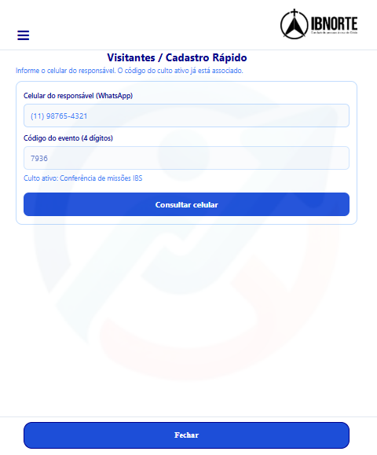
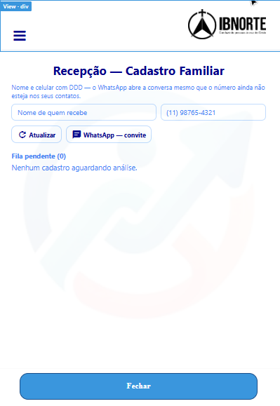
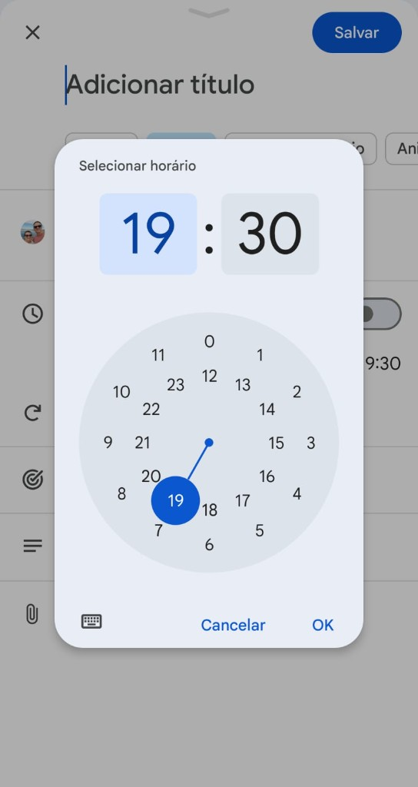
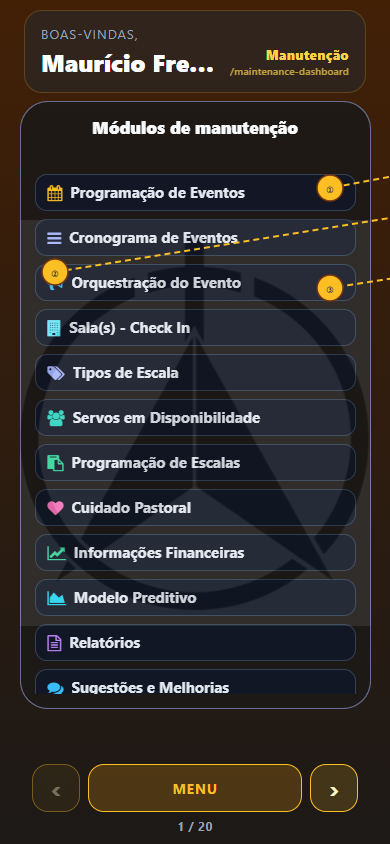
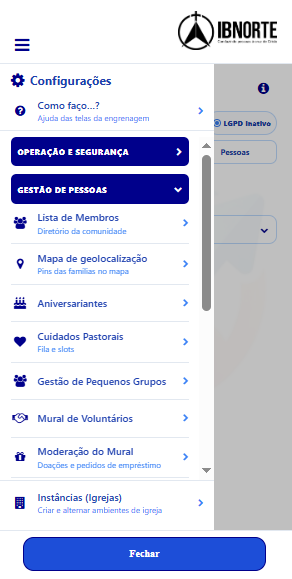
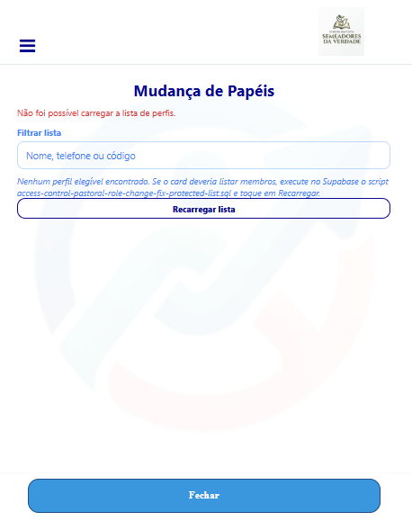
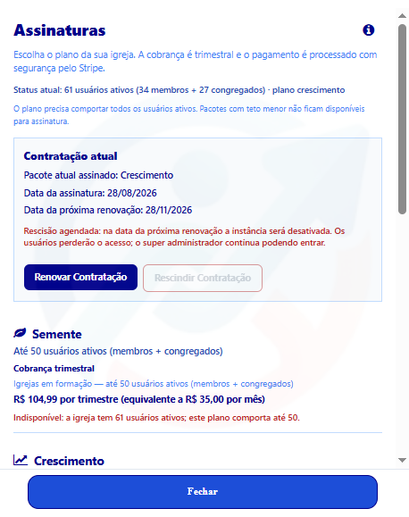
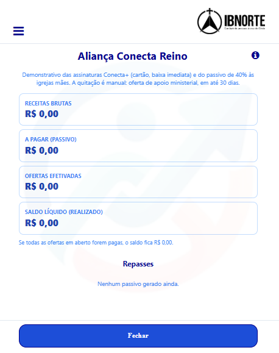

# Manual do Conecta+ — Engrenagem e Gestão da Igreja

Manual operacional detalhado de todos os itens publicados na **engrenagem**.

**Público:** secretaria, recepção, pastoral, líderes, tesouraria, gestores de acesso e super administradores.
**Organização:** **Operação e Segurança**, **Gestão de Pessoas**, **Culto e Eventos**, **Finanças e Inteligência** e **Governança e TI**.
**Atualizado em:** 05/10/2026.

> A engrenagem é filtrada por papel e grant. A ausência de um item pode ser uma regra de acesso, não um defeito.

---

## 1. Acesso, navegação e segurança

### Objetivo

Entrar na gestão correta, reconhecer a igreja ativa e operar sem expor dados.

### Caminho

**Login → Início → engrenagem → grupo → módulo**

### Passo a passo

1. Entre com celular e PIN próprios.
2. Confira nome e identidade visual da igreja.
3. Toque na **engrenagem**.
4. Leia os grupos disponíveis.
5. Abra o grupo da tarefa.
6. Toque no módulo.
7. Aguarde o carregamento antes de editar.
8. Confira novamente igreja, registro e pessoa.
9. Execute a operação.
10. Leia a confirmação.
11. Use **Fechar/Voltar** para retornar.
12. Encerre a sessão em aparelho compartilhado.

### Resultado esperado

A gestão abre apenas os módulos autorizados da igreja ativa.

### Dicas

- Não ensine a engrenagem como carrossel de cards.
- Mudança de papel ou grant geralmente exige sair e entrar.
- Nunca compartilhe PIN.
- Em ação destrutiva, confira nome, data e igreja duas vezes.
- O Gestor de Controle de Acesso não vê nem edita Super Administrador, seus logs ou credenciais.

### Se der erro

| Situação | O que fazer |
|---|---|
| Engrenagem não aparece | Confira papel e grant com o responsável. |
| Módulo sumiu após alteração | Encerre a sessão e entre novamente. |
| Dados de outra igreja | Pare, volte e selecione a instância correta. |
| Tela vazia | Confira ACL, filtros e existência de registros. |
| Salvamento falhou | Não repita várias vezes; leia a mensagem e valide a conexão. |

---

# Grupo 1 — Operação e Segurança

## 2. Configuração de salas

### Objetivo

Definir nomes das salas, finalidade e pessoas associadas ao Espaço Infantil.

### Caminho

**Engrenagem → Operação e Segurança → Configuração de salas**

### Passo a passo

1. Abra o módulo.
2. Consulte as salas existentes.
3. Toque em criar ou editar.
4. Informe o nome afetivo da sala.
5. Defina faixa etária ou finalidade.
6. Associe membros/equipe quando disponível.
7. Revise duplicidades.
8. Salve.
9. Abra um evento compatível e valide a sala.

### Resultado esperado

A sala fica disponível para configuração de evento e check-in infantil.

### Dicas

- Use nomes curtos e reconhecíveis pela recepção.
- Não reutilize a mesma sala para faixas incompatíveis sem revisar o evento.

### Se der erro

| Situação | Ação |
|---|---|
| Sala não aparece no evento | Confira se foi salva e se está ativa. |
| Criança vai para faixa errada | Revise faixa, nascimento e configuração do evento. |

---

## 3. Totem de check-in

### Objetivo

Operar um leitor fixo de QR no hall para registrar presença.

### Caminho

**Engrenagem → Operação e Segurança → Totem de check-in**

### Passo a passo

1. Abra o módulo no aparelho destinado ao totem.
2. Entre com o celular e PIN configurados.
3. Confira a igreja ativa.
4. Autorize a câmera.
5. Selecione ou confirme o evento elegível.
6. Posicione o aparelho de forma estável.
7. Peça ao membro o QR da Carteirinha ou Agenda.
8. Enquadre todo o código.
9. Aguarde a confirmação.
10. Leia a mensagem antes de chamar a próxima família.
11. Encerre a sessão ao final.

### Resultado esperado

O participante com pré-check-in válido tem a presença registrada.

### Dicas

- Teste câmera e internet antes da abertura das portas.
- Aumente a iluminação sem gerar reflexo.
- O mesmo celular pode existir em mais de uma igreja; confirme a instância.

### Se der erro

| Mensagem | Ação |
|---|---|
| Pré-check-in não encontrado | Oriente a marcar audiência no evento correto. |
| Câmera bloqueada | Permita câmera em HTTPS e feche outro aplicativo que a utiliza. |
| QR não reconhecido | Limpe a lente, aumente o brilho e tente novamente. |

---

## 4. Autorização de imagem e voz

### Objetivo

Solicitar, registrar e consultar o termo específico de uso de imagem e voz.

### Caminho

**Engrenagem → Operação e Segurança → Autorização de imagem e voz**

### Passo a passo

1. Abra o módulo.
2. Pesquise a pessoa ou família.
3. Confira o perfil selecionado.
4. Leia o termo aplicável.
5. Inicie a solicitação.
6. Confirme o e-mail do destinatário.
7. Envie.
8. Oriente a pessoa a consultar a caixa de entrada.
9. Aguarde a confirmação.
10. Consulte o estado atualizado.

### Resultado esperado

O consentimento ou a recusa fica vinculado ao termo de mídia.

### Dicas

- Este termo não substitui o aceite geral de LGPD.
- Não registre aceite verbal como confirmação digital sem regra formal.

### Se der erro

Se o e-mail não chegar, confira endereço, spam e configuração do remetente antes de reenviar.

---

# Grupo 2 — Gestão de Pessoas

## 5. Visitantes / Cadastro Rápido

### Objetivo

Cadastrar rapidamente visitante e crianças para o check-in do Espaço Infantil.

### Caminho

**Engrenagem → Gestão de Pessoas → Visitantes / Cadastro Rápido**

### Passo a passo

1. Abra o módulo.
2. Pergunte se a família já frequentou.
3. Pesquise antes de criar.
4. Se encontrar, selecione o registro correto.
5. Se não encontrar, informe nome do responsável.
6. Informe celular com DDD.
7. Preencha os demais campos obrigatórios.
8. Adicione cada criança.
9. Confira nome e data de nascimento.
10. Confirme a sala elegível.
11. Toque em **Cadastrar e gerar QR** ou **Gerar QR / Check-in**.
12. Revise o QR.
13. Use o WhatsApp para enviar link do crachá e imagem, quando necessário.
14. Oriente o responsável sobre entrada e retirada.

### Resultado esperado

O visitante fica identificado e recebe o QR necessário ao fluxo infantil.

### Dicas

- Pesquisar antes evita perfil e família duplicados.
- Confirme o telefone lendo os últimos dígitos para o responsável.
- Não use este fluxo para substituir o cadastro familiar completo.

### Se der erro

| Situação | Ação |
|---|---|
| Família já existe | Reutilize o registro; não duplique. |
| Sala não aparece | Confira idade, evento e configuração da sala. |
| WhatsApp não abre | Copie o link e envie pelo contato validado. |

---

## 6. Recepção Familiar

### Objetivo

Convidar uma família, vincular novos membros e processar formulários públicos antes da gravação definitiva.

### Caminho

**Engrenagem → Gestão de Pessoas → Recepção Familiar**

### Enviar convite — passo a passo

1. Abra **Recepção Familiar**.
2. Confirme a igreja ativa.
3. Localize **Recepção — Cadastro Familiar**.
4. Informe nome do contato.
5. Informe celular com DDD.
6. Pergunte se existe representante cadastrado.
7. Se existir, toque em **Novos Membros**.
8. Abra a busca **Enxergar**.
9. Digite conforme o critério da tela.
10. Selecione a pessoa correta.
11. Confira o código familiar exibido.
12. Volte ao convite.
13. Toque em **WhatsApp — convite**.
14. Confira destinatário e texto.
15. Envie o link.

### Processar fila — passo a passo

1. Abra **Fila pendente**.
2. Expanda a primeira submissão.
3. Confira o informante.
4. Confira todos os integrantes.
5. Valide telefones com DDD.
6. Revise datas de nascimento.
7. Trate a data provisória `01/01/1900`.
8. Confira CEP, número e complemento.
9. Pesquise possíveis duplicidades.
10. Analise conflitos de código familiar.
11. Corrija ou separe registros com problema.
12. Marque somente os registros válidos.
13. Toque em **Gravar selecionados**.
14. Leia o resumo.
15. Confirme.
16. Para inválidos, marque-os separadamente.
17. Toque em **Rejeitar selecionados**.
18. Confirme a rejeição.

### Resultado esperado

Registros válidos viram perfis/membros corretos; conflitos permanecem para análise ou são rejeitados.

### Dicas

- A fila pública não é perfil definitivo até ser gravada.
- Não grave lote com conflito apenas para “limpar” a fila.
- O sticker da Home prioriza esta fila.
- Use **Novos Membros** para levar o código familiar correto no convite.

### Se der erro

| Situação | Ação |
|---|---|
| Duplicidade provável | Pare e compare nome, telefone, nascimento e família. |
| Código familiar conflitante | Não crie outro; valide com representante e secretaria. |
| Data `01/01/1900` | Corrija antes de gravar. |
| CEP ausente | Complete ou devolva para correção conforme o procedimento local. |

---

## 7. Régua de Acolhimento

### Objetivo

Acompanhar **visitantes** depois da recepção com ações D+1, D+4 e D+8.

### Caminho

**Engrenagem → Gestão de Pessoas → Régua de Acolhimento**

### Passo a passo

1. Abra o módulo.
2. Filtre visitantes pendentes.
3. Selecione uma pessoa.
4. Confirme que o papel atual é **visitante**.
5. Leia a etapa sugerida.
6. No D+1, faça o contato de acolhimento por WhatsApp.
7. Registre o resultado real.
8. No D+4, apresente célula ou próximo passo adequado.
9. Registre a ação.
10. No D+8, faça o convite para o culto.
11. Registre resposta e observação necessária.
12. Avance somente após a ação.
13. Ao mudar para congregado ou membro, conclua a régua.

### Resultado esperado

O visitante possui histórico claro de acolhimento sem ser mantido indevidamente na fila.

### Dicas

- Régua é para **visitante**, não membro ou congregado.
- Registro deve ser objetivo e respeitoso.
- Não marque contato como feito se não ocorreu.

### Se der erro

Se membro aparecer na régua, confira o papel e conclua/corrija o processo em vez de continuar o acompanhamento de visitante.

---

## 8. Lista de Membros

### Objetivo

Consultar o diretório da comunidade conforme a autorização.

### Caminho

**Engrenagem → Gestão de Pessoas → Lista de Membros**

### Passo a passo

1. Abra a lista.
2. Use a busca por nome.
3. Selecione a pessoa correta.
4. Confira família e contatos permitidos.
5. Abra WhatsApp somente para finalidade autorizada.
6. Consulte mapa apenas quando necessário.
7. Feche os detalhes ao terminar.

### Resultado esperado

O diretório exibe apenas pessoas e campos permitidos.

### Dicas

- Não exporte nem compartilhe a lista informalmente.
- Confirme homônimos pelo vínculo familiar.

### Se der erro

Se alguém não aparecer, confira filtros, igreja ativa, papel da pessoa e ACL do operador.

---

## 9. Cadastro de Usuário

### Objetivo

Revisar e corrigir o cadastro de um perfil existente.

### Caminho

**Engrenagem → Gestão de Pessoas → Cadastro de Usuário**

### Passo a passo

1. Abra o módulo.
2. Pesquise pelo nome.
3. Selecione o perfil correto.
4. Confira celular e igreja.
5. Revise dados pessoais.
6. Corrija CEP.
7. Corrija número e complemento.
8. Atualize apenas campos autorizados.
9. Salve.
10. Leia a confirmação.
11. Para exclusão completa, confira vínculos e autorização.
12. Execute ação destrutiva somente após dupla conferência.

### Resultado esperado

O perfil fica atualizado sem criar duplicidade ou romper vínculos válidos.

### Dicas

- Antes de excluir, verifique família, eventos, pastoral e histórico.
- Prefira correção a recriação.

### Se der erro

Em conflito de telefone, não substitua às cegas; compare os dois perfis e peça decisão responsável.

---

## 10. Lista de Famílias

### Objetivo

Consultar composição, representante e pendências por código familiar.

### Caminho

**Engrenagem → Gestão de Pessoas → Lista de Famílias**

### Passo a passo

1. Abra o módulo.
2. Pesquise por código, representante ou integrante.
3. Selecione a família correta.
4. Expanda os detalhes.
5. Confira representante principal.
6. Confira integrantes e parentescos.
7. Compare telefones e datas quando houver suspeita de duplicidade.
8. Identifique pendências.
9. Use contato apenas para finalidade pastoral/administrativa.
10. Feche a família antes de abrir outra.

### Resultado esperado

A equipe reconhece a composição familiar e os vínculos usados pela Agenda e pelo QR.

### Dicas

- O código familiar é uma chave de vínculo; não o troque sem análise.
- Criança sem telefone pode ser integrante válida.

### Se der erro

| Situação | Ação |
|---|---|
| Integrante em duas famílias | Pare e valide com responsáveis antes de corrigir. |
| Representante incorreto | Use o procedimento autorizado; não remova o principal diretamente. |
| Busca não encontra | Tente código, nome completo ou outro integrante. |

---

## 11. Mapa de geolocalização

### Objetivo

Visualizar pins de famílias para planejamento autorizado.

### Caminho

**Engrenagem → Gestão de Pessoas → Mapa de geolocalização**

### Passo a passo

1. Abra o mapa.
2. Aguarde a carga dos pins.
3. Ajuste zoom e área.
4. Use os filtros permitidos.
5. Toque em um pin.
6. Consulte somente os detalhes necessários.
7. Feche o detalhe.

### Resultado esperado

Endereços elegíveis são representados conforme ACL.

### Dicas

- Detalhes de pin podem exigir grant adicional.
- Use dados geográficos apenas para a finalidade informada.

### Se der erro

Pin ausente normalmente indica endereço incompleto, geocodificação pendente, filtro ou falta de acesso.

---

## 12. Aniversariantes

### Objetivo

Consultar aniversários pessoais e de casamento por período.

### Caminho

**Engrenagem → Gestão de Pessoas → Aniversariantes**

### Passo a passo

1. Abra o módulo.
2. Escolha mês ou período.
3. Aplique filtros.
4. Confira os nomes.
5. Diferencie aniversário pessoal e casamento.
6. Use contato autorizado quando necessário.
7. Revise a mensagem antes de enviar.

### Resultado esperado

A lista do período é exibida conforme dados e permissões.

### Dicas

- O bolo da Home mostra apenas o dia.
- Data ausente ou incorreta deve ser corrigida no cadastro.

### Se der erro

Confira período, data de nascimento/casamento e consentimentos aplicáveis.

---

## 13. Cuidados Pastorais

### Objetivo

Receber, atribuir e acompanhar pedidos com sigilo.

### Caminho

**Engrenagem → Gestão de Pessoas → Cuidados Pastorais**

### Acompanhar — passo a passo

1. Abra o módulo.
2. Filtre por estado ou solicitante.
3. Selecione a pessoa.
4. Se houver mais de um pedido, use o chip de data/hora.
5. Confira motivo e situação.
6. Leia quem é o beneficiário.
7. Confira destino e nível de sigilo.
8. Leia a descrição.
9. Defina responsável, quando aplicável.
10. Registre o primeiro contato.
11. Avance para **Acolher**.
12. Registre apoio realizado.
13. Avance para **Apoiar**.
14. Registre continuidade.
15. Avance para **Acompanhar**.
16. Encerre apenas quando o ciclo terminar.

### Excluir após solicitação do membro

1. Selecione o pedido correto pela data/hora.
2. Localize **Solicitação de cancelamento**.
3. Leia a justificativa do membro.
4. Confirme que a solicitação pertence ao pedido aberto.
5. Como **super_admin**, localize **Excluir** ao lado de **Acompanhar**.
6. Toque em **Excluir**.
7. Leia o diálogo que repete motivo e justificativa.
8. Confirme apenas se estiver correto.
9. Aguarde a remoção.

### Resultado esperado

O pedido evolui com rastreabilidade; cancelamento válido é excluído apenas pelo Super Administrador.

### Dicas

- Não copie conteúdo sigiloso para grupos.
- Use WhatsApp somente quando o destino do pedido permitir.
- **Excluir** não é ação pastoral comum.

### Se der erro

| Situação | Explicação |
|---|---|
| Excluir não aparece | Exige super_admin e solicitação válida do membro. |
| Pedido errado abriu | Selecione outro chip de data/hora. |
| Cancelamento sem justificativa | Não prossiga até confirmar a solicitação correta. |

---

## 14. Atribuições

### Objetivo

Marcar responsabilidades operacionais ou pastorais autorizadas para uma pessoa.

### Caminho

**Engrenagem → Gestão de Pessoas / fluxo autorizado → Atribuições**

### Passo a passo

1. Abra **Atribuições**.
2. Toque no campo de pessoa.
3. Use a busca **Enxergar**.
4. Digite respeitando o critério existente.
5. Selecione o perfil correto no modal superior.
6. Confira nome, telefone e igreja.
7. Leia as atribuições atuais.
8. Marque a nova atribuição.
9. Desmarque somente o que deve ser removido.
10. Revise o conjunto completo.
11. Salve.
12. Leia a confirmação.
13. Oriente a pessoa a sair e entrar, se necessário.

### Resultado esperado

As atribuições ficam associadas ao perfil correto sem alterar papéis indevidos.

### Dicas

- Enxergar muda a apresentação, não o critério da busca.
- Não conceda atribuição “por teste” em produção.
- Registre o motivo conforme a política local.

### Se der erro

Se a pessoa não aparecer, confira igreja ativa, mínimo de caracteres e visibilidade do seu papel.

---

## 15. Gestão de Pequenos Grupos

### Objetivo

Manter células, lideranças, locais e vínculos.

### Caminho

**Engrenagem → Gestão de Pessoas → Gestão de Pequenos Grupos**

### Passo a passo

1. Abra o módulo.
2. Pesquise o grupo.
3. Crie ou edite.
4. Informe nome, dia e horário.
5. Informe local permitido.
6. Defina liderança.
7. Revise integrantes.
8. Salve.
9. Valide em **Menu → Minha Célula** com perfil apropriado.

### Resultado esperado

O pequeno grupo fica disponível aos membros vinculados.

### Dicas

- Valide endereço antes de publicar.
- Não exponha endereço residencial a perfis indevidos.

### Se der erro

Confira liderança ativa, vínculo da pessoa e grants da tela do membro.

---

## 16. Mural de Voluntários

### Objetivo

Publicar oportunidades e organizar disponibilidade de serviço.

### Caminho

**Engrenagem → Gestão de Pessoas → Mural de Voluntários**

### Passo a passo

1. Abra o módulo.
2. Consulte oportunidades existentes.
3. Crie uma oportunidade.
4. Informe título e descrição.
5. Defina requisitos e período.
6. Informe contato responsável.
7. Revise.
8. Publique.
9. Confira no Mural de Oportunidades.

### Resultado esperado

A oportunidade publicada aparece aos perfis autorizados.

### Dicas

- Retire oportunidades encerradas.
- Seja explícito sobre horário e habilidade necessária.

### Se der erro

Se não aparecer ao membro, confira publicação, período e ACL.

---

## 17. Moderação do Mural

### Objetivo

Revisar doações e pedidos antes da publicação.

### Caminho

**Engrenagem → Gestão de Pessoas → Moderação do Mural**

### Passo a passo

1. Abra a fila.
2. Escolha um item pendente.
3. Leia descrição e categoria.
4. Confira contato e condições.
5. Verifique conteúdo inadequado ou dados excessivos.
6. Aprove, solicite correção ou rejeite.
7. Registre o motivo quando necessário.
8. Confirme.

### Resultado esperado

Somente itens adequados aparecem no Mural de Generosidade.

### Dicas

- Não aprove anúncio com informação bancária aberta.
- Diferencie doação, empréstimo e pedido.

### Se der erro

Se o item aprovado não aparecer, confira estado, prazo e filtro da tela pública.

---

## 18. Administrativo

### Objetivo

Consultar e manter atos constitutivos e registros institucionais autorizados.

### Caminho

**Engrenagem → Gestão de Pessoas → Administrativo**

### Passo a passo

1. Abra o módulo.
2. Escolha a categoria.
3. Localize o registro.
4. Abra para consulta.
5. Crie ou edite somente com autorização.
6. Anexe a versão correta.
7. Revise data e título.
8. Salve.

### Resultado esperado

O acervo administrativo fica organizado por igreja.

### Dicas

- Preserve versão e data do documento.
- Não substitua ato oficial sem validação.

### Se der erro

Confira formato, tamanho do arquivo, permissão e instância.

---

## 19. Livros doados

### Objetivo

Cadastrar e consultar o acervo doado.

### Caminho

**Engrenagem → Gestão de Pessoas → Livros doados**

### Passo a passo

1. Abra o módulo.
2. Pesquise pelo título ou ISBN.
3. Se encontrado, confira antes de duplicar.
4. Para novo livro, use a busca ISBN.
5. Revise os dados retornados.
6. Complete manualmente o que faltar.
7. Informe quantidade e estado quando disponível.
8. Salve.

### Resultado esperado

O livro entra no acervo com identificação consistente.

### Dicas

- ISBN reduz erros de título e autoria.
- Cadastre manualmente somente após a busca.

### Se der erro

Se o ISBN não retornar, confira os dígitos e use o cadastro manual.

---

# Grupo 3 — Culto e Eventos

## 20. Programação de Eventos

### Objetivo

Criar, revisar e publicar cultos e eventos.

### Caminho

**Engrenagem → Culto e Eventos → Programação de Eventos**

### Passo a passo

1. Abra o módulo.
2. Toque em criar evento ou abra um existente.
3. Informe nome.
4. Defina data e hora.
5. Informe local.
6. Defina capacidade.
7. Configure público.
8. Ative Kids/Teens quando aplicável.
9. Associe salas.
10. Configure totem.
11. Configure quórum ou proximidade quando necessário.
12. Revise todos os campos.
13. Salve como rascunho.
14. Faça uma segunda revisão.
15. Publique.
16. Confira em **Início → Próximos Eventos**.

### Resultado esperado

O evento publicado aparece no Início; o rascunho permanece oculto.

### Dicas

- Use rascunho até concluir a revisão.
- Ao replicar para +7 dias, revise data, equipe e salas.
- Não publique capacidade ou local incorretos.

### Se der erro

| Situação | Ação |
|---|---|
| Evento não aparece | Confira se está publicado e dentro do período. |
| Sala não disponível | Volte à Configuração de salas. |
| Data replicada errada | Edite antes de publicar. |

---

## 21. Cronograma de Eventos

### Objetivo

Visualizar eventos no tempo e abrir rapidamente uma edição.

### Caminho

**Engrenagem → Culto e Eventos → Cronograma de Eventos**

### Passo a passo

1. Abra o cronograma.
2. Escolha período.
3. Aplique filtros.
4. Percorra as datas.
5. Identifique sobreposições.
6. Toque no evento.
7. Abra a edição.
8. Corrija e salve, se necessário.

### Resultado esperado

O calendário operacional mostra eventos e conflitos visuais.

### Dicas

- Use o cronograma para revisão, não para presumir publicação.
- Confirme estado do evento na edição.

### Se der erro

Verifique período, filtros e igreja ativa.

---

## 22. Manutenção de Avisos

### Objetivo

Publicar comunicados exibidos no Início.

### Caminho

**Engrenagem → Culto e Eventos → Manutenção de Avisos**

### Passo a passo

1. Abra o módulo.
2. Consulte avisos ativos.
3. Crie ou edite.
4. Informe título.
5. Escreva texto claro.
6. Defina início e fim.
7. Defina público quando disponível.
8. Revise links e datas.
9. Salve.
10. Confira no Início.

### Resultado esperado

O aviso aparece no período e para o público configurado.

### Dicas

- Evite manter aviso vencido.
- Não publique dados pessoais.

### Se der erro

Confira período, estado ativo, público e cache da página.

---

## 23. Sala(s) — Check In

### Objetivo

Registrar entrada e retirada de crianças por QR ou código.

### Caminho

**Engrenagem → Culto e Eventos → Sala(s) — Check In**

### Entrada — passo a passo

1. Abra o módulo.
2. Confirme a igreja.
3. Selecione o evento.
4. Selecione a sala.
5. Confira a equipe responsável.
6. No rodapé, toque em **Ler QR Code**.
7. Autorize a câmera.
8. Peça o QR ao responsável.
9. Enquadre o código.
10. Confira família e crianças elegíveis.
11. Selecione a criança correta.
12. Confirme a entrada.
13. Verifique o estado **Na sala**.

### Retirada — passo a passo

1. Peça novamente o QR ao responsável.
2. Leia o código.
3. Confira nome e sala.
4. Confirme a pessoa autorizada conforme procedimento local.
5. Registre a saída.
6. Verifique o estado **Liberado**.
7. Entregue a criança somente após a confirmação.

### Código digitado

1. Toque em **Digitar Código**.
2. Informe o código familiar.
3. Confira a família retornada.
4. Continue a entrada ou retirada.

### Resultado esperado

Entrada e saída ficam registradas na sala e aparecem para o responsável.

### Dicas

- Nunca pule a conferência do nome.
- Mantenha evento e sala visíveis à equipe.
- Teste o leitor antes do culto.

### Se der erro

| Situação | Ação |
|---|---|
| QR ilegível | Use brilho maior ou **Digitar Código**. |
| Criança não aparece | Confira audiência, idade, sala e família. |
| Sala errada | Não confirme; volte e selecione a correta. |
| Estado não muda | Não entregue até obter confirmação ou aplicar protocolo manual autorizado. |

---

## 24. Tipos de Escala

### Objetivo

Definir modelos de escala, vagas e ciclo.

### Caminho

**Engrenagem → Culto e Eventos → Tipos de Escala**

### Passo a passo

1. Abra o módulo.
2. Consulte tipos existentes.
3. Crie ou edite.
4. Informe código e nome.
5. Defina número de vagas.
6. Escolha ciclo individual ou equipe.
7. Revise.
8. Salve.

### Resultado esperado

O tipo fica disponível para voluntários e programação.

### Dicas

- Planeje nomes estáveis.
- Alterar tipo em uso pode afetar programações futuras.

### Se der erro

Verifique código duplicado e campos obrigatórios.

---

## 25. Servos em Disponibilidade

### Objetivo

Associar voluntários aos tipos de escala e organizar sua ordem.

### Caminho

**Engrenagem → Culto e Eventos → Servos em Disponibilidade**

### Passo a passo

1. Abra o módulo.
2. Escolha o tipo de escala.
3. Pesquise o voluntário.
4. Confirme o perfil.
5. Associe à disponibilidade.
6. Ajuste ordem quando permitido.
7. Revise a lista.
8. Salve.

### Resultado esperado

Os voluntários ficam disponíveis para a Programação de Escalas.

### Dicas

- Confirme disponibilidade real antes de associar.
- Não confunda papel de acesso com função na escala.

### Se der erro

Se a pessoa não aparecer, confira cadastro, igreja, filtros e permissão.

---

## 26. Programação de Escalas

### Objetivo

Gerar e manter escalas individuais ou em bloco.

### Caminho

**Engrenagem → Culto e Eventos → Programação de Escalas**

### Passo a passo

1. Abra o módulo.
2. Escolha período ou evento.
3. Escolha o tipo.
4. Confira vagas.
5. Selecione voluntários.
6. Use geração em bloco quando adequada.
7. Revise conflitos e repetições.
8. Ajuste manualmente.
9. Salve.
10. Confira em **Menu → Escalas** com perfil de teste autorizado.

### Resultado esperado

A escala publicada fica visível aos voluntários.

### Dicas

- Configure Tipos e Servos antes.
- Revise feriados e indisponibilidades.

### Se der erro

Confira período, tipo, disponibilidade e conflito de vaga.

---

## 27. Presença

### Objetivo

Registrar e consultar presença formal em eventos com quórum.

### Caminho

**Engrenagem → Culto e Eventos → Presença**

### Passo a passo

1. Abra o módulo.
2. Escolha o evento formal.
3. Confira data e quórum.
4. Consulte participantes elegíveis.
5. Registre ou valide presença.
6. Revise ausências e duplicidades.
7. Salve.
8. Consulte o resumo.

### Resultado esperado

O evento mantém lista formal e contagem de quórum.

### Dicas

- Não altere presença sem evidência.
- Eventos formais podem bloquear desmarcação pelo membro.

### Se der erro

Confirme evento, horário, regra de quórum e pré-check-in.

---

# Grupo 4 — Finanças e Inteligência

## 28. Informações Financeiras

### Objetivo

Importar extratos, manter versões, anexar evidências e conciliar RDs.

### Caminho

**Engrenagem → Finanças e Inteligência → Informações Financeiras**

### Passo a passo

1. Abra o módulo.
2. Escolha mês e versão.
3. Selecione importação por CSV ou colagem.
4. Carregue os dados.
5. Leia a prévia.
6. Corrija erros de coluna, data ou valor.
7. Escolha substituir versão ou acrescentar.
8. Revise o efeito da escolha.
9. Importe.
10. Confira totais.
11. Adicione comentários.
12. Anexe comprovantes permitidos.
13. Localize o RD correspondente.
14. Vincule ao lançamento.
15. Revise a conciliação.
16. Remova vínculo somente quando incorreto.

### Resultado esperado

O período financeiro fica importado e conciliado na versão escolhida.

### Dicas

- Guarde o arquivo original.
- Não substitua versão sem conferir o impacto.
- Use valores e datas no formato esperado.

### Se der erro

| Situação | Ação |
|---|---|
| Colunas inválidas | Ajuste o CSV conforme o modelo. |
| Total diverge | Interrompa e compare prévia com arquivo. |
| RD não aparece | Confira igreja, período e estado do relatório. |

---

## 29. Gestão de Campanhas

### Objetivo

Configurar campanhas mostradas no fluxo de contribuição.

### Caminho

**Engrenagem → Finanças e Inteligência → Gestão de Campanhas**

### Passo a passo

1. Abra o módulo.
2. Consulte campanhas.
3. Crie ou edite.
4. Informe nome e finalidade.
5. Defina período.
6. Configure dados de recebimento autorizados.
7. Revise.
8. Publique.
9. Confira em **Eu quero… → Contribuir**.

### Resultado esperado

A campanha vigente aparece ao público configurado.

### Dicas

- Valide recebedor antes de publicar.
- Encerre campanhas concluídas.

### Se der erro

Confira vigência, estado de publicação e dados financeiros.

---

## 30. Prímicias

### Objetivo

Registrar itens em espécie vinculados a uma campanha.

### Caminho

**Engrenagem → Finanças e Inteligência → Prímicias**

### Passo a passo

1. Abra o módulo.
2. Escolha a campanha.
3. Registre o item.
4. Informe quantidade e unidade.
5. Identifique origem quando permitido.
6. Revise.
7. Salve.
8. Atualize destino ou baixa conforme o fluxo.

### Resultado esperado

O item em espécie fica rastreado na campanha correta.

### Dicas

- Não registre valor monetário como item físico.
- Padronize unidades.

### Se der erro

Confirme campanha ativa, campos obrigatórios e unidade.

---

## 31. Modelo Preditivo

### Objetivo

Consultar indicadores de apoio à liderança sem automatizar decisões humanas.

### Caminho

**Engrenagem → Finanças e Inteligência → Modelo Preditivo**

### Passo a passo

1. Abra o módulo.
2. Escolha período.
3. Leia a definição de cada indicador.
4. Compare tendências.
5. Verifique qualidade e atualização dos dados.
6. Registre a análise fora de dados pessoais desnecessários.
7. Leve decisões sensíveis à liderança.

### Resultado esperado

Indicadores autorizados apoiam análise, sem substituir discernimento e validação.

### Dicas

- Correlação não prova causa.
- Não use previsão para rotular pessoas.

### Se der erro

Se não houver dados suficientes, não conclua tendência; ajuste período ou aguarde base adequada.

---

# Grupo 5 — Governança e TI

## 32. Temas da Trilha

### Objetivo

Manter textos, vídeos e reflexões dos módulos de discipulado.

### Caminho

**Engrenagem → Governança e TI → Temas da Trilha**

### Passo a passo

1. Abra o módulo.
2. Escolha módulo e lição.
3. Edite título e texto.
4. Revise links de vídeo.
5. Configure reflexão.
6. Confira ordem.
7. Salve.
8. Valide na Trilha com perfil autorizado.

### Resultado esperado

O conteúdo atualizado aparece na etapa correta.

### Dicas

- Preserve numeração e pré-requisitos.
- Revise ortografia antes de publicar.

### Se der erro

Confira campos obrigatórios, link e ordem da lição.

---

## 33. Trilha — Reconhecimentos

### Objetivo

Identificar pessoas com etapa concluída e prontas para reconhecimento.

### Caminho

**Engrenagem → Governança e TI → Trilha — Reconhecimentos**

### Passo a passo

1. Abra o módulo.
2. Filtre etapa ou período.
3. Consulte alunos com 100%.
4. Abra o perfil.
5. Confirme requisitos.
6. Registre certificado ou reconhecimento.
7. Salve.

### Resultado esperado

O reconhecimento fica associado à conclusão válida.

### Dicas

- Percentual sozinho não substitui conferência dos critérios.

### Se der erro

Confira igreja, etapa, sincronização do progresso e filtros.

---

## 34. Resetar Trilha

### Objetivo

Reiniciar o progresso de uma pessoa na igreja ativa.

### Caminho

**Engrenagem → Governança e TI → Resetar Trilha**

### Passo a passo

1. Abra o módulo como Super Administrador.
2. Pesquise a pessoa.
3. Confirme perfil e igreja.
4. Leia o progresso atual.
5. Registre o motivo.
6. Toque em resetar.
7. Leia o aviso destrutivo.
8. Confirme.
9. Verifique o novo estado.

### Resultado esperado

O progresso daquela pessoa é reiniciado somente na igreja selecionada.

### Dicas

- Use apenas com autorização e motivo claro.
- A ação pode ser irreversível.

### Se der erro

Não repita; confirme se o primeiro reset foi processado e se a pessoa/igreja estão corretas.

---

## 35. Como faço…?

### Objetivo

Consultar ajuda operacional das telas da engrenagem.

### Caminho

**Engrenagem → Governança e TI → Como faço…?**

### Passo a passo

1. Abra o catálogo de manutenção.
2. Pesquise pelo módulo.
3. Abra o artigo.
4. Siga a sequência.
5. Volte para outro assunto.

### Resultado esperado

A ajuda contextual de gestão é exibida.

### Dicas

- Use termos iguais aos rótulos da engrenagem.

### Se der erro

Tente palavra mais curta ou consulte a Base de conhecimento.

---

## 36. Base de conhecimento

### Objetivo

Criar e editar artigos da ajuda interna.

### Caminho

**Engrenagem → Governança e TI → Base de conhecimento**

### Passo a passo

1. Abra o módulo.
2. Pesquise antes de criar.
3. Abra artigo existente ou crie novo.
4. Informe título claro.
5. Escolha catálogo/categoria.
6. Escreva passos objetivos.
7. Revise links.
8. Salve.
9. Confira em **Como faço…?**.

### Resultado esperado

O artigo fica disponível no catálogo definido.

### Dicas

- Atualize artigos quando a navegação mudar.
- Evite duplicar respostas.

### Se der erro

Confira categoria, estado de publicação e permissão.

---

## 37. Relatórios

### Objetivo

Executar relatórios autorizados com filtros da igreja ativa.

### Caminho

**Engrenagem → Governança e TI → Relatórios**

### Passo a passo

1. Abra o catálogo.
2. Escolha o relatório.
3. Leia a descrição.
4. Informe filtros.
5. Execute.
6. Aguarde o resultado.
7. Revise período e igreja.
8. Exporte somente quando autorizado.

### Resultado esperado

O relatório retorna dados isolados da igreja e permitidos ao perfil.

### Dicas

- Use intervalo menor quando a consulta for pesada.
- Proteja qualquer arquivo exportado.

### Se der erro

Revise filtros obrigatórios, período e grant do relatório.

---

## 38. Controle de Acesso

### Objetivo

Gerir disponibilidade do app, condição comercial, LGPD, papéis e grants.

### Caminho

**Engrenagem → Governança e TI → Controle de Acesso**

### Cabeçalho — App Ativo/Inativo

1. Abra o módulo.
2. Confira a igreja ativa.
3. Localize o switch **App Ativo/App Inativo**.
4. Leia o estado atual.
5. Antes de inativar, escreva ou revise a mensagem de indisponibilidade.
6. Altere o switch.
7. Confirme.
8. Valide o efeito com cuidado.

**Resultado esperado:** a disponibilidade geral muda para toda a instância.

**Dica:** não use este switch para resolver problema de apenas um usuário.

### Cabeçalho — Gestão Liberada/Bloqueada

1. Localize **Gestão Liberada/Gestão Bloqueada**.
2. Leia o estado comercial atual.
3. Confirme a autorização para alterar.
4. Ative **Gestão Liberada** para desligar o paywall da instância.
5. Ou bloqueie conforme a condição comercial aplicável.
6. Confirme.
7. Reabra a sessão de teste.

**Resultado esperado:** com Gestão Liberada, a igreja opera sem exigir assinatura Stripe ativa.

**Dica:** Gestão Liberada não concede papéis nem grants.

### Cabeçalho — LGPD Ativo/Inativo

1. Localize o switch LGPD.
2. Leia o estado.
3. Confirme a política da igreja.
4. Ative para exigir o fluxo formal de consentimento.
5. Desative para usar o cadastro simplificado.
6. Confirme.
7. Teste com um cadastro apropriado.

**Resultado esperado:** o fluxo de entrada respeita o estado LGPD da instância.

### Texto LGPD por instância

1. Com LGPD ativo, localize **Texto de consentimento LGPD**.
2. Leia todo o texto atual.
3. Atualize entidade, finalidade e canais.
4. Revise com o responsável.
5. Toque em **Salvar texto LGPD**.
6. Valide no cadastro da mesma igreja.

### Alterar papéis e atribuições

1. Abra a aba de perfis.
2. Toque na busca.
3. Use **Enxergar**.
4. Digite conforme nome, telefone ou critério vigente.
5. Selecione a pessoa.
6. Confira identidade.
7. Expanda papéis e atribuições.
8. Faça apenas a alteração autorizada.
9. Salve.
10. Oriente saída e novo login.

### Configurar grants

1. Selecione o papel.
2. Escolha telas, tabelas ou colunas.
3. Pesquise o recurso.
4. Leia o estado atual.
5. Defina **Ver**.
6. Defina **Editar** somente se necessário.
7. Salve.
8. Teste com perfil daquele papel.

### Resultado esperado

Switches afetam a instância; papéis e grants afetam os perfis definidos.

### Dicas

- Não confunda bloqueio comercial com ACL.
- Conceda o menor acesso necessário.
- Teste com Modo Ghost.
- O Gestor de Controle de Acesso nunca vê super_admin, seus logs, PIN ou senha.

### Se der erro

| Situação | Ação |
|---|---|
| Usuário não ganhou acesso | Peça logout/login e confira papel + grant. |
| Gestão Liberada não abre módulo | Falta ACL; o switch só remove paywall. |
| Texto LGPD não mudou em outra igreja | O texto é por instância. |
| Gestor vê Super Admin | Trate como falha de segurança e interrompa a operação. |

---

## 39. Mudança Papéis

### Objetivo

Promover ou alterar Visitante, Congregado e Membro com conferência.

### Caminho

**Engrenagem → Governança e TI → Mudança Papéis**

### Passo a passo

1. Abra o módulo.
2. Escolha o filtro do papel atual.
3. Para novos registros, use **Visitante**.
4. Abra a busca **Enxergar**.
5. Digite o nome.
6. Selecione a pessoa correta.
7. Confira família e telefone.
8. Escolha o novo papel.
9. Leia o impacto.
10. Confirme.
11. Aguarde a mensagem.
12. Oriente a pessoa a sair e entrar.

### Entrada pelo sticker da Home

1. Toque no sticker amarelo.
2. Se houver fila familiar, processe-a primeiro.
3. Sem fila prioritária, o app abre Mudança Papéis filtrada em Visitante.
4. Selecione o novo registro e prossiga.

### Resultado esperado

O perfil passa ao novo papel e deixa a Régua quando não for mais visitante.

### Dicas

- Não promova sem concluir a recepção necessária.
- Confira homônimos.
- super_admin vê o sticker sempre; secretaria/pastoral apenas com pendência.

### Se der erro

Se a pessoa não aparece, confira papel atual, fila familiar, filtros e igreja ativa.

---

## 40. Transferência de Membro

### Objetivo

Mover o vínculo de membro entre igrejas conforme regras autorizadas.

### Caminho

**Engrenagem → Governança e TI → Transferência de Membro**

### Passo a passo

1. Abra o módulo.
2. Pesquise a pessoa.
3. Confirme igreja de origem.
4. Confira família e vínculos.
5. Selecione destino.
6. Leia os efeitos.
7. Obtenha as confirmações exigidas.
8. Execute a transferência.
9. Confira o resultado nas duas instâncias.

### Resultado esperado

O vínculo é transferido conforme as regras sem criar perfil duplicado.

### Dicas

- Não use transferência para corrigir seleção de igreja errada sem análise.
- Revise família e histórico antes.

### Se der erro

Pare em conflito de vínculo ou família e peça decisão administrativa.

---

## 41. Acesso Usuários

### Objetivo

Auditar logins, sessões e histórico de telas.

### Caminho

**Engrenagem → Governança e TI → Acesso Usuários**, somente **super_admin**.

### Passo a passo

1. Abra o módulo como Super Administrador.
2. Use **Enxergar** para localizar o perfil.
3. Confira nome e igreja.
4. Consulte último acesso.
5. Leia quantidade de logins.
6. Abra a sessão desejada.
7. Consulte histórico de telas.
8. Registre apenas a conclusão necessária.
9. Use **Limpar histórico** somente com motivo autorizado.
10. Confirme antes de apagar.

### Resultado esperado

O Super Administrador audita acessos permitidos.

### Dicas

- Este módulo é exclusivo de super_admin.
- O Gestor de Controle de Acesso não pode ver ações ou credenciais do Super Administrador.

### Se der erro

Se o módulo aparecer para papel indevido, interrompa o acesso e trate como incidente de segurança.

---

## 42. Modo Ghost

### Objetivo

Auditar o aplicativo usando a identidade efetiva de outra pessoa.

### Caminho

**Engrenagem → Governança e TI → Modo Ghost**

### Passo a passo

1. Abra o módulo.
2. Pesquise o perfil-alvo.
3. Confira nome, telefone e igreja.
4. Leia o aviso da simulação.
5. Inicie o Ghost.
6. O app vai ao Início uma vez, já como o alvo.
7. Abra menu, Eu quero…, Perfil ou um deep link.
8. Confira opções visíveis.
9. Entre nas rotas necessárias.
10. Permaneça na rota para verificar dados e comportamento.
11. Não use o poder do operador para furar ACL do alvo.
12. Registre o resultado da auditoria.
13. Toque em **Sair do Ghost**.
14. Confirme o retorno à identidade real.
15. Verifique o Início.

### Resultado esperado

A simulação usa perfil, telefone, família e permissões do alvo.

### Regras obrigatórias

- Iniciar e encerrar Ghost são os únicos retornos automáticos previstos ao Início.
- A rota escolhida não deve “quicar” para o Início.
- O bypass de Super Admin do operador fica desligado.
- Não cobrir a tela com “Sem acesso nesta simulação”.
- Paywall, assinatura e seleção da igreja pertencem ao operador/instância.

### Dicas

- Anote previamente o que será validado.
- Encerre sempre a simulação.
- Não altere dados reais sem necessidade do teste.

### Se der erro

| Situação | Ação |
|---|---|
| Perfil-alvo não aparece | Confira igreja e visibilidade do operador. |
| Rota volta ao Início | Registre rota e comportamento como falha de navegação Ghost. |
| Dados são do auditor | Interrompa; identidade efetiva não foi aplicada. |
| Paywall usa o alvo | Interrompa; cobrança deve permanecer na instância do operador. |

---

## 43. Assinaturas e Billing

### Objetivo

Consultar plano, cobrança e situação comercial da igreja.

### Caminho

**Engrenagem → Governança e TI → Assinaturas**

### Passo a passo

1. Abra **Assinaturas**.
2. Confira a igreja.
3. Leia o plano.
4. Consulte a situação da assinatura.
5. Confira datas e cobrança.
6. Abra o portal ou fluxo disponível quando autorizado.
7. Faça apenas a alteração comercial aprovada.
8. Retorne ao Conecta+.
9. Confira o estado atualizado.

### Gestão Liberada

1. Abra **Controle de Acesso**.
2. Localize **Gestão Liberada**.
3. Ative somente com autorização.
4. Confirme.
5. Valide que o paywall deixou de bloquear a instância.
6. Confirme que a ACL individual continua igual.

### Resultado esperado

A cobrança reflete o plano; Gestão Liberada remove a exigência comercial sem conceder acessos.

### Dicas

- Não altere assinatura durante Modo Ghost para testar o alvo.
- Paywall é da igreja/operador, não da identidade simulada.

### Se der erro

| Situação | Ação |
|---|---|
| Gestão Liberada mas módulo não abre | Confira ACL do usuário. |
| Portal não abre | Permita nova guia e confira autorização. |
| Estado não atualiza | Recarregue após retorno do provedor. |

---

## 44. Aliança Conecta Reino

### Objetivo

Gerir indicações, passivo de 40% e baixa manual de ofertas no programa.

### Caminho

**Engrenagem → Governança e TI → Aliança Conecta Reino**

### Passo a passo

1. Abra o módulo.
2. Confira a igreja e a parceria.
3. Consulte indicações.
4. Leia valores e estados.
5. Confira o passivo aplicável.
6. Registre baixa manual somente com evidência.
7. Revise.
8. Confirme.

### Resultado esperado

As movimentações da aliança ficam atualizadas e rastreáveis.

### Dicas

- Não dê baixa apenas por comunicação verbal.
- Preserve comprovantes.

### Se der erro

Confira vínculo da parceria, valor, estado e autorização.

---

## 45. Indicados

### Objetivo

Administrar o funil Kanban de indicados.

### Caminho

**Engrenagem → Governança e TI → Indicados**, exclusivo do Super Administrador.

### Passo a passo

1. Abra o módulo.
2. Leia as colunas do funil.
3. Localize o indicado.
4. Abra o cartão.
5. Registre atualização objetiva.
6. Mova para a etapa correta.
7. Confirme.
8. Revise o quadro.

### Resultado esperado

O funil representa a etapa real de cada indicação.

### Dicas

- Não avance cartão sem ação real.
- Mantenha dados comerciais restritos.

### Se der erro

Confira acesso de super_admin, filtros e igreja/parceria.

---

## 46. Instâncias (Igrejas)

### Objetivo

Criar e alternar ambientes de igreja.

### Caminho

**Engrenagem → Governança e TI → Instâncias (Igrejas)**

### Passo a passo

1. Abra o módulo.
2. Consulte as instâncias permitidas.
3. Para alternar, selecione a igreja.
4. Confirme.
5. Verifique nome e logomarca.
6. Para criar, use a ação autorizada.
7. Preencha identificação e configurações essenciais.
8. Revise.
9. Salve.
10. Valide isolamento de dados.

### Resultado esperado

A sessão opera na igreja escolhida ou uma nova instância é criada corretamente.

### Dicas

- Confira a instância antes de qualquer alteração.
- Nunca use dados de uma igreja para completar outra.

### Se der erro

Se dados misturarem instâncias, pare imediatamente e trate como incidente.

---

## 47. Chave Gemini

### Objetivo

Configurar a chave usada pela Abigail.

### Caminho

**Engrenagem → Governança e TI → Chave Gemini**, somente Super Administrador.

### Passo a passo

1. Abra o módulo.
2. Confirme a igreja.
3. Informe ou substitua a chave autorizada.
4. Evite exibi-la a terceiros.
5. Salve.
6. Faça um teste simples na Abigail.
7. Confira se a resposta pertence ao contexto correto.

### Resultado esperado

A Abigail consegue operar com a configuração da instância.

### Dicas

- Chave é segredo; não envie por chat ou documento.
- Rotacione se houver exposição.

### Se der erro

Confira validade, cota, restrições e se a chave foi salva na instância correta.

---

## 48. Rotinas operacionais

### Antes do culto

1. Confira evento publicado.
2. Confira data, local e capacidade.
3. Valide salas e faixas.
4. Teste Totem de check-in.
5. Teste Sala(s) — Check In.
6. Confira Tipos e Programação de Escalas.
7. Revise avisos.
8. Confirme equipe de recepção.

### Durante o culto

1. Recepcione famílias.
2. Cadastre visitantes sem duplicar.
3. Leia QR infantil.
4. Monitore estados **Na sala** e **Liberado**.
5. Registre presença quando aplicável.
6. Aplique protocolo manual autorizado em contingência.

### Diariamente

1. Consulte o sticker de novos registros.
2. Processe Recepção Familiar.
3. Use a Régua somente para visitantes.
4. Revise Cuidados Pastorais.
5. Trate solicitações de cancelamento.
6. Modere murais.

### Mensalmente

1. Revise papéis e grants.
2. Confira App, Gestão e LGPD.
3. Revise assinatura.
4. Importe e concilie financeiro.
5. Audite acessos quando necessário.
6. Atualize a Base de conhecimento.

---

## 49. Resumo rápido

| Necessidade | Caminho |
|---|---|
| Configurar sala infantil | **Operação e Segurança → Configuração de salas** |
| Operar leitor no hall | **Totem de check-in** |
| Cadastrar visitante infantil | **Visitantes / Cadastro Rápido** |
| Processar nova família | **Recepção Familiar** |
| Acompanhar visitante | **Régua de Acolhimento** |
| Consultar composição familiar | **Lista de Famílias** |
| Tratar pedido pastoral | **Cuidados Pastorais** |
| Excluir pedido cancelado | **Cuidados Pastorais → Excluir**, super_admin |
| Definir responsabilidade | **Atribuições** |
| Publicar evento | **Programação de Eventos** |
| Ler QR infantil | **Sala(s) — Check In** |
| Programar voluntários | **Programação de Escalas** |
| Importar financeiro | **Informações Financeiras** |
| Alterar switches da igreja | **Controle de Acesso** |
| Conceder grant | **Controle de Acesso → papel → recurso** |
| Admitir visitante | **Mudança Papéis**, filtro Visitante |
| Auditar como outra pessoa | **Modo Ghost** |
| Auditar logins | **Acesso Usuários**, super_admin |
| Consultar cobrança | **Assinaturas** |
| Remover paywall da instância | **Controle de Acesso → Gestão Liberada** |
| Configurar Abigail | **Chave Gemini**, super_admin |

---

## 50. Checklist de segurança

### Antes de salvar

- [ ] Estou na igreja correta.
- [ ] Selecionei a pessoa correta.
- [ ] Li o estado atual.
- [ ] Tenho autorização.
- [ ] Entendi o impacto.

### Antes de excluir

- [ ] Comparei nome, data e registro.
- [ ] Verifiquei vínculos.
- [ ] Li a justificativa.
- [ ] Confirmei que a ação é necessária.
- [ ] Sei se a ação é reversível.

### Ao terminar

- [ ] Li a confirmação.
- [ ] Testei o resultado proporcionalmente ao risco.
- [ ] Saí do Modo Ghost.
- [ ] Fechei dados sensíveis.
- [ ] Encerrei a sessão em aparelho compartilhado.

---

*Conecta+ · Manual detalhado da engrenagem · revisão de 05/10/2026*
