# Manual do Painel — Uso pelo Membro

**App IBN · Igreja Batista Norte**

Manual **autocontido** para quem usa o aplicativo pela primeira vez ou no dia a dia. Cobre **login, cadastro, painel e todos os cards do membro** — sem o painel de manutenção (engrenagem).

**Público:** membros, famílias e voluntários no celular ou PWA (navegador).  
**Formato:** passo a passo por card, com **resultado esperado** em cada ação.  
**Tempo estimado:** 45 a 60 minutos na primeira leitura completa.

**Pacote:** [`PACOTE_5_MANUAL_PAINEL.md`](PACOTE_5_MANUAL_PAINEL.md) · **Índice:** [`INDICE_DOCUMENTACAO.md`](INDICE_DOCUMENTACAO.md)

**Atualizado em:** 22/05/2026

---

## Como usar este manual

| Símbolo | Significado |
|---------|-------------|
| **Objetivo** | O que você vai conseguir fazer |
| **Caminho** | Onde tocar na tela |
| **Passo a passo** | Ações numeradas |
| **Resultado esperado** | O que você deve **ver** ou **confirmar** ao concluir |
| **Dica** | Atalho ou cuidado útil |
| **Ilustração** | Captura da tela com **marcadores numerados** (①②③…); tabela **Ref.** explica cada ponto *(dados fictícios)* |
| **Se der erro** | Mensagens comuns e o que fazer |

Itens em **negrito** são botões, títulos ou áreas da interface.

> **Cards que não aparecem**  
> A igreja define o que cada perfil pode ver. Se um card não estiver no seu painel, fale com a secretaria — não é defeito do aparelho.

---

# Parte 0 — Primeiro contato com o app

## 0.1 Entrar pela primeira vez (celular e código)

### Objetivo
Acessar o app com seu **celular** e **código de 4 dígitos** (senha temporária na primeira vez).

### Caminho
Tela **Boas-vindas** → **1. Seu celular** → **Continuar** → **Receber código no WhatsApp** → **2. Código de acesso** → entrar automaticamente ou **Acessar**.

### Ilustração — Boas-vindas *(dados fictícios)*

| Ref. | Elemento indicado na imagem |
|:----:|------------------------------|
| ① | Campo **Seu celular** — exemplo `(11) 98765-4321` |
| ② | Botão **Continuar** após DDD + número válidos |
| ③ | Campo **Código de acesso** (4 dígitos, oculto) |
| ④ | **Receber código no WhatsApp** na primeira vez |

### Passo a passo

1. Abra o app IBN (link da igreja no navegador ou atalho instalado).
2. Digite seu celular com DDD — o app formata: `(00) 00000-0000`.
3. Toque em **Continuar**.
4. Na **primeira vez**, toque em **Receber código no WhatsApp**.
   - Leia o texto abaixo do campo: o código pode ir para **você** ou para o **Ministério de Acolhimento**, conforme a política da igreja.
5. Abra o WhatsApp, copie ou memorize os **4 dígitos**.
6. Digite o código no campo **2. Código de acesso** (oculto, como PIN).
7. Ao completar o 4º dígito, o app pode entrar sozinho; ou toque em **Acessar**.

### Resultado esperado

- Login aceito → você vai para **Cadastro** (primeira vez), **Termos LGPD** (se pendente) ou **Painel / Agenda da Família**.
- Na tela de boas-vindas, o passo **2 Código** fica ativo após o celular válido.

### Dica
Depois do primeiro acesso, troque o código temporário por uma senha pessoal em **Gestão de Cadastros → Dados Cadastrais → Senha de acesso**.

### Se der erro

| Mensagem | O que fazer |
|----------|-------------|
| *Senha incorreta* / *Número ou senha inválidos* | Confira os 4 dígitos; gere novo código pelo WhatsApp |
| *Código necessário* | Toque em **Receber código no WhatsApp** antes de digitar |
| *Digite o celular completo…* | Informe 11 dígitos com DDD |

---

## 0.2 Concluir cadastro (nome, nascimento, LGPD, selfie)

### Objetivo
Finalizar seu cadastro inicial para usar o painel com segurança.

### Caminho
Tela **Cadastro** → preencher dados → ler **Termos LGPD** → **Li e aceito** → **Tirar Selfie Biométrica** → **Confirmar Registro**.

### Ilustração — Cadastro inicial *(dados fictícios)*

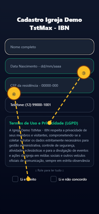

| Ref. | Elemento indicado na imagem |
|:----:|------------------------------|
| ① | **Nome completo** do membro |
| ② | **Data de nascimento** `dd/mm/aaaa` |
| ③ | Caixa rolável dos **Termos LGPD** |
| ④ | Marcação **Li e aceito** |
| ⑤ | **Tirar Selfie Biométrica** antes de confirmar |

### Passo a passo

1. Confira o **Telefone** (veio do login, não editável).
2. Preencha **Nome completo** e **Data Nascimento** (`dd/mm/aaaa`).
3. Informe o **CEP da residência** (8 dígitos).
4. Role a caixa **Termos de Uso e Privacidade (LGPD)** **até o final**.
   - Enquanto rola: `↓ Role para ler tudo ↓`
   - No fim: `✅ Termos lidos.`
5. Marque **Li e aceito** (ou **Li e não concordo**, conforme sua decisão).
6. Toque em **Tirar Selfie Biométrica** — permita a câmera se o celular pedir.
7. Revise a foto → **Confirmar Registro**.
8. Aguarde a mensagem de sucesso do cadastro.

### Resultado esperado

- Alerta *Cadastro inicial concluído* e redirecionamento para **Dados Cadastrais** (completar perfil) ou **Painel**.
- Selfie salva no seu perfil; termos LGPD registrados no sistema.

### Dica
Rosto centralizado, boa luz, sem óculos escuros — facilita identificação nos eventos.

### Se der erro

- *Role os termos…* → leia o LGPD até o fim antes de aceitar.
- Câmera bloqueada → liberar permissão nas configurações do celular/navegador.

### Texto integral — Termos de Uso e Privacidade (LGPD)

Texto exibido na caixa rolável da tela **Cadastro** (e na tela **Termos de Uso e Privacidade**). O nome da entidade vem do parâmetro `Nome_Entidade` no sistema; quando não configurado, usa-se **Igreja Batista Norte (IBN)**.

> A Igreja Batista Norte (IBN) respeita a privacidade de seus membros e visitantes, comprometendo-se a coletar e tratar os dados estritamente necessários para gestão administrativa, controle de segurança, atividades eclesiásticas e para a divulgação de eventos e ações da igreja em mídias sociais e outros veículos oficiais de comunicação, sempre em estrita observância à Lei Geral de Proteção de Dados (LGPD - Lei nº 13.709/2018).

---

## 0.3 Aceitar termos LGPD (se ainda pendente)

### Objetivo
Regularizar privacidade quando o cabeçalho do painel estiver **vermelho**.

### Caminho
**Dados Cadastrais** → botão **LGPD** — ou tela dedicada **Termos de Uso e Privacidade**.

### Ilustração — Termos LGPD *(dados fictícios)*

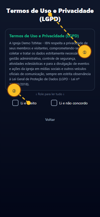

| Ref. | Elemento indicado na imagem |
|:----:|------------------------------|
| ① | Caixa rolável dos **Termos LGPD** até o fim |
| ② | Marcação **Li e aceito** ou **Li e não concordo** |
| ③ | Botão **Confirmar** / **Concluir** |

### Passo a passo

1. Abra **LGPD**.
2. Role todo o texto.
3. Marque **Li e aceito** ou **Li e não concordo**.
4. Toque em **Confirmar** ou **Concluir**.

### Resultado esperado

- Preferência salva; cabeçalho **Boas-Vindas** volta ao estilo normal (sem fundo vermelho de alerta).
- Toast ou alerta confirmando o registro.

---

## 0.4 Conhecer o Índice e o Painel (carrossel)

### Objetivo
Saber onde estão os módulos e como alternar entre cards.

### Caminho
**Índice do Aplicativo** (atalhos) ↔ **Painel** (carrossel) — rodapé **‹** · **Menu** · **›**.

### Ilustração — Índice e Painel *(dados fictícios)*

| Ref. | Elemento indicado na imagem |
|:----:|------------------------------|
| ① | Atalhos do **Índice** abrem o card correspondente |
| ② | Área do **card ativo** no carrossel do Painel |
| ③ | Contador **3 / 8** — posição no carrossel |
| ④ | Rodapé **‹ Menu ›** para navegar e voltar ao Índice |

### Passo a passo

1. No **Índice**, leia *Selecione a tela que deseja abrir*.
2. Toque em uma etiqueta (ex.: **Painel de Eventos**, **Dízimos e Ofertas**) — o app abre o **card correspondente** no Painel.
3. No **Painel**, o topo mostra **Boas-Vindas, {seu nome}** e o nome do card ativo.
4. Use **‹** e **›** no rodapé para mudar de card (ou deslize, se disponível).
5. O contador **1 / N** indica sua posição no carrossel.
6. Toque em **Menu** no centro do rodapé para voltar ao **Índice**.
7. Para sair: no Índice, **Encerrar sessão** (web) ou **Sair do aplicativo** (celular).

### Resultado esperado

- Cada atalho do Índice abre o card certo sem precisar passar card por card.
- **Menu** sempre retorna ao Índice; **Voltar** em telas internas retorna ao **card que você abriu** (ex.: Mapa → Lista de Membros).

### Dica
Alguns atalhos ficam **desabilitados** com explicação em cinza — ex.: QR só no dia do evento, Sala(s) sem evento ativo.

---

# Parte 1 — Card Agenda da Família

### Objetivo
Escolher o culto/evento, **ver vagas disponíveis** e **inscrever sua família** (audiência / pré-check-in).

### Caminho
Painel → card **Agenda da Família** (ou **Painel de Eventos** no Índice).

### Ilustração — Agenda da Família *(dados fictícios)*

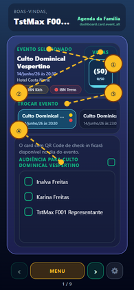

| Ref. | Elemento indicado na imagem |
|:----:|------------------------------|
| ① | Bloco **Evento selecionado** com selos Kids/Teens |
| ② | **Vagas** — número entre parênteses = restantes |
| ③ | **Trocar evento** — lista de cultos publicados |
| ④ | Checkbox de **Audiência** por familiar |

### Estrutura do card

| Área | O que mostra |
|------|----------------|
| **Evento Selecionado** | Nome, data, horário, local; selos **IBN Kids** / **IBN Teens** se houver |
| **Vagas** | Copo visual + número entre parênteses (restantes) + `inscritos/máximo` |
| **Trocar Evento** | Lista de eventos ativos (hoje e futuros) |
| **Audiência** | Membros da sua família com checkbox |

### Passo a passo — ver vagas e inscrever

1. Abra o card **Agenda da Família**.
2. Em **Trocar Evento**, toque no culto desejado.
3. No bloco **Evento Selecionado**, confira data, horário e local.
4. Olhe o **copo de vagas**:
   - Número entre parênteses = **vagas ainda disponíveis**.
   - Linha inferior = quantos já estão inscritos no total do evento.
   - Copo mais cheio = evento mais lotado.
5. Na seção **Audiência**, marque o checkbox de cada familiar que participará.
6. Para marcar todos de uma vez, use o checkbox no topo da lista de audiência.

### Resultado esperado

- Membro marcado → texto **Registrado para o evento** ao lado do nome.
- Copo e contador de vagas **atualizam** após cada marcação ou desmarcação.
- Com audiência marcada, o atalho/card de **QR Code** pode liberar (no dia do evento, conforme regras).
- Selos **IBN Kids** / **IBN Teens** indicam que há salas para crianças/adolescentes naquele evento.

### Passo a passo — remover inscrição

1. Toque de novo no checkbox do membro já registrado.

### Resultado esperado

- Checkbox desmarcado; texto *Registrado para o evento* some; vagas recalculadas.

### Se der erro ou aviso

| Situação | Significado |
|----------|-------------|
| *Nenhum evento no momento* | Não há culto publicado para hoje/futuro próximo |
| *Selecione um evento* | Escolha um item em **Trocar Evento** primeiro |
| *Família não vinculada* | Peça código de família na secretaria e complete em **Dados Cadastrais** |
| Evento de **quórum** | Só o membro da sessão ativa pode ser marcado; após check-in no totem, pode travar |

---

# Parte 2 — Card Check-in / QR Code

### Objetivo
Apresentar o **QR Code da família** na entrada ou no totem, no **dia do evento**.

### Caminho
Painel → card **QR Code — Check-in Totem** / **Check In — QR Code** (visível conforme evento e audiência).

### Ilustração — QR Check-in *(dados fictícios)*

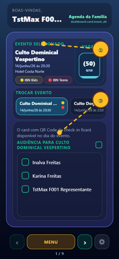

| Ref. | Elemento indicado na imagem |
|:----:|------------------------------|
| ① | Nome do **evento do dia** |
| ② | **Etiqueta** da família (ex.: `FAM-2048`) |
| ③ | **QR Code** para apresentar no totem |

### Pré-requisitos

1. Ter marcado a **audiência** no card Agenda (Parte 1).
2. Estar no **dia do evento** (para a maioria dos modos de check-in).

### Passo a passo

1. No dia do culto, abra o card de QR no Painel ou pelo atalho **QR Code** no Índice.
2. Confira o **nome do evento** (mesmo contexto da Agenda).
3. Localize a **Etiqueta** — código da sua família em destaque.
4. Apresente o **QR Code** (fundo branco) na câmera do **totem** da igreja.
5. Aumente o brilho da tela do celular.

### Resultado esperado

- No totem: *Confirmação realizada com sucesso*.
- No painel: card de QR pode ficar com destaque **azul piscina** após confirmação (até o fim do dia do evento).
- Se já confirmou antes: aviso de que o check-in **já foi realizado** (evita duplicidade).

### Se der erro

| Situação | O que fazer |
|----------|-------------|
| Card QR não aparece no Índice | Marque audiência; confirme que é o dia do evento |
| *Pré-check-in não encontrado* (totem) | Volte à Agenda e marque os participantes |
| Sem etiqueta de família | Complete vínculo familiar em **Gestão de Cadastros** |

---

# Parte 3 — Card SALA(S) — IBN Kids / IBN Teens

### Objetivo
**Acompanhar se seu filho foi aceito/entrou** na sala Kids ou Teens — somente membros **da sua família**.

### Caminho
Painel → **SALA(S)** (ou atalho **Sala(s)** no Índice, dentro de Painel de Eventos).

### Ilustração — SALA(S) Kids/Teens *(dados fictícios)*

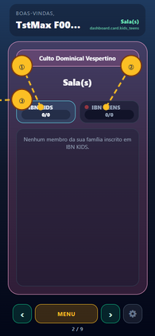

| Ref. | Elemento indicado na imagem |
|:----:|------------------------------|
| ① | Chip **IBN KIDS** com contador `confirmados/total` |
| ② | Chip **IBN TEENS** (alternar sala) |
| ③ | **✓** = entrada confirmada pela equipe da sala |

### Passo a passo

1. Selecione o evento na **Agenda da Família** primeiro (mesmo culto em evidência).
2. Abra o card **SALA(S)**.
3. Se o evento tiver as duas salas, alterne os chips **IBN KIDS** e **IBN TEENS**.
4. Leia a lista de nomes da sua família inscritos naquela sala.
5. Procure o símbolo **✓** ao lado do nome.

### Resultado esperado

- **✓** ao lado do nome = criança/adolescente **aceito/entrada registrada** pela equipe da sala (check-in feito na operação da igreja).
- Contador no chip: `confirmados/total` da sua família naquela sala.
- Sem inscritos: *Nenhum membro da sua família inscrito em IBN KIDS/TEENS.*

### Dica
Este card é **somente leitura** para o membro. A entrada física na sala é confirmada pela equipe — o ✓ aparece depois que eles registram.

### Se não aparecer seu filho

- Confirme audiência na Agenda e idade/parametrização Kids/Teens do evento.
- Fale com a equipe da sala se o culto já começou e o ✓ ainda não apareceu.

---

# Parte 4 — Card Dízimos e Ofertas

### Objetivo
Ver dados do recebedor e **copiar a chave PIX** para ofertar pelo app do banco.

### Caminho
Painel → **Dízimos e Ofertas**.

### Ilustração — Dízimos e Ofertas *(dados fictícios)*

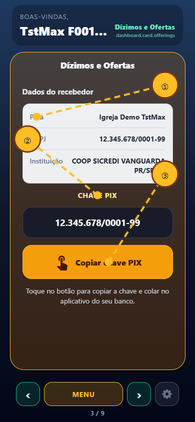

| Ref. | Elemento indicado na imagem |
|:----:|------------------------------|
| ① | Dados do **recebedor** (nome e CNPJ fictícios) |
| ② | **Chave PIX** exibida para cópia |
| ③ | Botão **Copiar chave PIX** |

### Passo a passo

1. Abra o card e aguarde carregar **Dados do recebedor** (Igreja Batista Norte, CNPJ, instituição).
2. Leia a **Chave PIX** exibida.
3. Toque em **Copiar chave PIX** (ícone de toque).

### Resultado esperado

- Toast **Chave PIX copiada** com orientação para colar no app do banco.
- Você cola no banco e conclui a transferência **fora** do app IBN (o app não debita automaticamente).

### Se der erro

- **Chave PIX indisponível** → toque em **Atualizar chave PIX** ou avise a secretaria.

---

# Parte 5 — Card Coração Aberto

### Objetivo
Enviar um **pedido pastoral** e **acompanhar o status** até saber que está sendo cuidado.

### Caminho
Painel → **Coração Aberto** → formulário; ícone de histórico → **Meus pedidos**.

### Ilustração — Coração Aberto *(dados fictícios)*

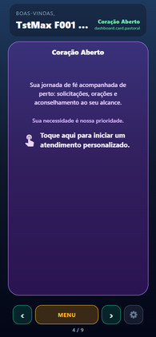

| Ref. | Elemento indicado na imagem |
|:----:|------------------------------|
| ① | Seleção de **Motivo** e **Situação** |
| ② | Opção **Para mim** / **Familiar** / encaminhamento |
| ③ | Campo de texto **Seu pedido** |
| ④ | Atalho **Meus pedidos** (histórico) |

### Passo a passo — novo pedido

1. Toque no card (*Toque aqui para iniciar um atendimento personalizado*).
2. Escolha **Motivo** e **Situação** (listas na tela).
3. Indique **Este pedido é para**: **Para mim** / **Familiar** / **Terceiros**.
4. Escolha **Encaminhar para**: **Sigilo pastoral** ou **Intercessão**.
5. Escreva seu pedido em **Seu pedido**.
6. Toque em **Enviar pedido**.

### Resultado esperado (envio)

- Mensagem *Pedido enviado! Estaremos orando por você.*
- Pedido aparece em **Meus pedidos** com status inicial **Novo** ou **Pendente**.

### Passo a passo — acompanhar pedido

1. No formulário, toque no ícone de **histórico** ou abra **Meus pedidos**.
2. Localize seu pedido na lista (data, motivo, situação).
3. Leia o **status** no cartão:

| Status que você pode ver | Significado para você |
|--------------------------|------------------------|
| **Novo** / **Pendente** | Pedido recebido, aguardando equipe |
| **Acolher** | Equipe pastoral iniciou o primeiro cuidado |
| **Apoiar** | Acompanhamento em andamento (segunda etapa) |
| **Acompanhar** | Acompanhamento contínuo (terceira etapa) |
| **Em andamento** / **Aberto** | Pedido ativo na equipe |
| **Encerrado** | Ciclo de cuidado concluído |

### Resultado esperado (acompanhamento)

- Quando a equipe avança o cuidado, o status muda para **Acolher**, depois **Apoiar**, depois **Acompanhar** — isso confirma que **seu pedido está sendo acompanhado**.
- Você não precisa atualizar a tela: ao reabrir **Meus pedidos**, vê o status atual.

### Excluir pedido (se permitido)

- Ícone de borracha no pedido → só quando ainda **Novo** e não iniciado pelo Cuidado Pastoral.
- Se já houver **Acolher/Apoiar/Acompanhar**, a exclusão é bloqueada com mensagem explicativa.

---

# Parte 6 — Card Lista de Membros

### Objetivo
Buscar membros ou visitantes da igreja, contatar por WhatsApp e abrir o **Mapa Geral**.

### Caminho
Painel → **Lista de Membros**.

### Ilustração — Lista de Membros *(dados fictícios)*

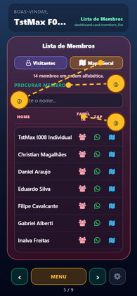

| Ref. | Elemento indicado na imagem |
|:----:|------------------------------|
| ① | Campo **Procurar membro** |
| ② | Botão **Mapa Geral** (PWA/web) |
| ③ | Linha da tabela com **WhatsApp** e **GPS** |

### Passo a passo

1. Use **Visitantes** para ver visitantes; **Membros** para voltar à lista de membros (botões na mesma linha).
2. Digite em **Procurar membro** / **Digite o nome...** para filtrar.
3. Na tabela (**Nome**, **Família**, **Zap**, **GPS**):
   - Toque no ícone de **família** para ver integrantes do mesmo núcleo.
   - Toque no **WhatsApp** para abrir conversa (se houver telefone).
4. Toque em **Mapa Geral** para ver geolocalização (PWA/web).

### Resultado esperado

- Resumo no topo: *N membro(s) em ordem alfabética* (ou *X de Y* ao buscar).
- Modal **Membros da família** com lista e botão **Fechar**.
- **Mapa Geral** abre tela de mapa; **Voltar** retorna a este card.

### Mapa Geral (PWA)

- Filtros: **Todos**, **Com papel**, **Visitantes**.
- Toque em um pin → painel com dados; copiar endereço para navegação.
- **Voltar** → card Lista de Membros.

---

# Parte 7 — Card Aniversariantes

### Objetivo
Ver quem faz aniversário no mês e parabenizar pelo WhatsApp.

### Caminho
Painel → **Aniversariantes**.

### Ilustração — Aniversariantes *(dados fictícios)*

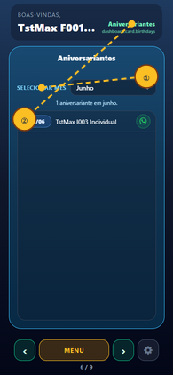

| Ref. | Elemento indicado na imagem |
|:----:|------------------------------|
| ① | Seletor **Mês** |
| ② | Lista **DD/MM** + nome |
| ③ | Ícone **WhatsApp** para parabenizar |

### Passo a passo

1. Toque em **Selecionar Mês** (padrão: mês atual).
2. Role a lista com data **DD/MM** e nome.
3. Toque no **WhatsApp** ao lado de quem deseja cumprimentar.

### Resultado esperado

- Texto *N aniversariante(s) em {mês}.*
- Lista vazia: *Nenhum aniversariante encontrado em {mês}.*

---

# Parte 8 — Card Financeiro

### Objetivo
Consultar **relatórios financeiros da igreja** (somente leitura) e solicitar reembolso de despesas, se disponível no seu perfil.

### Caminho
Painel → **Financeiro** → *Toque para abrir o módulo financeiro.*

### Ilustração — Financeiro *(dados fictícios)*

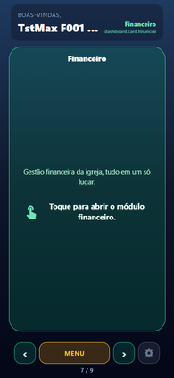

| Ref. | Elemento indicado na imagem |
|:----:|------------------------------|
| ① | Dropdown **Selecionar mês** |
| ② | Atalho **Relatório de Despesas (RD)** |
| ③ | Seções colapsáveis (**Saldo bancário**, etc.) |

### Passo a passo

1. Abra o módulo **Financeiro**.
2. Escolha o **mês** em **Selecionar mês**.
3. No topo, use o atalho destacado **Relatório de Despesas (RD)** ou role até **Relatórios**.
4. Expanda as seções (uma por vez):
   - **Resultado do mês**

### Ilustração — Financeiro — Resultado do mês *(dados fictícios)*

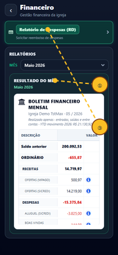

| Ref. | Elemento indicado na imagem |
|:----:|------------------------------|
| ① | Seção **Resultado do mês** expandida |
| ② | Tabela de **Receitas** do período |
| ③ | Tabela de **Despesas** do período |

   - **Comparativo mensal**

### Ilustração — Financeiro — Comparativo mensal *(dados fictícios)*

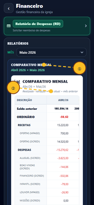

| Ref. | Elemento indicado na imagem |
|:----:|------------------------------|
| ① | Seção **Comparativo mensal** expandida |
| ② | Comparação entre dois meses consecutivos |

   - **Últimos 12 meses**

### Ilustração — Financeiro — Últimos 12 meses *(dados fictícios)*

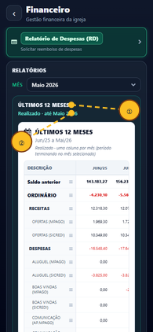

| Ref. | Elemento indicado na imagem |
|:----:|------------------------------|
| ① | Seção **Últimos 12 meses** expandida |
| ② | Série **Realizado** acumulada |

   - **Planejado × Realizado** (quando houver orçamento)

### Ilustração — Financeiro — Planejado × Realizado *(dados fictícios)*

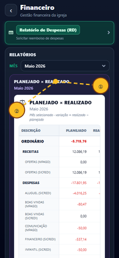

| Ref. | Elemento indicado na imagem |
|:----:|------------------------------|
| ① | Seção **Planejado × Realizado** expandida |
| ② | Colunas **Planejado** e **Realizado** |

   - **Saldo bancário** (saldo por conta e total)

### Ilustração — Financeiro — Saldo bancário *(dados fictícios)*

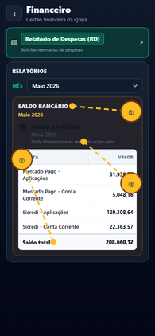

| Ref. | Elemento indicado na imagem |
|:----:|------------------------------|
| ① | Seção **Saldo bancário** expandida |
| ② | Linha **Saldo total** |
| ③ | Saldo por **conta** bancária |

### Resultado esperado

- Tabelas e totais do mês selecionado — **sem editar** valores (consulta).
- Mês sem orçamento: aviso *Sem orçamento planejado para este mês* na seção planejado × realizado.
- **Saldo bancário** mostra contas com movimento (Sicredi, Mercado Pago, etc.) e **Saldo total**.

---

# Parte 8b — Relatório de Despesas (RD)

### Objetivo
Solicitar **reembolso de despesas** da igreja com comprovantes e chave PIX.

### Caminho
Painel → **Financeiro** → atalho **Relatório de Despesas (RD)** — ou rota `/expense-report`.

### Ilustração — Relatório de Despesas (RD) *(dados fictícios)*

| Ref. | Elemento indicado na imagem |
|:----:|------------------------------|
| ① | **Chave PIX** do solicitante |
| ② | Botão **Novo RD** |
| ③ | Lista **Meus relatórios** |
| ④ | Status **Pendente** / **Conciliado** |

### Passo a passo

1. Toque **Novo RD**.

### Ilustração — Formulário de RD *(dados fictícios)*

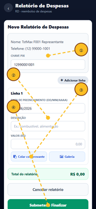

| Ref. | Elemento indicado na imagem |
|:----:|------------------------------|
| ① | Campo **Chave PIX** |
| ② | **Descrição** da despesa |
| ③ | Anexo de **comprovante** |
| ④ | **Submeter e Finalizar** |

2. Confira nome e telefone no cabeçalho; informe **Chave PIX**.
3. Em cada linha: data, descrição, valor (digite centavos da direita para esquerda — `1` → R$ 0,01) e comprovante (colar ou galeria).
4. **Submeter e Finalizar** — o relatório é gravado e o WhatsApp do tesoureiro abre automaticamente.
5. Na lista **Meus relatórios**, abra um RD para ver itens ou **Excluir RD** se ainda estiver **Pendente**.

### Resultado esperado

- Toast confirma submissão; tesoureiro recebe mensagem com número do RD e valor.
- Status **Pendente** até a tesouraria conciliar na manutenção; depois **Conciliado**.

### Se der erro

- Configure `Tesoureiro_contato` em `app_parameters` se o WhatsApp não abrir.
- RPC ausente — equipe executa `scripts/expense-reports-schema.sql` e `expense-reports-rpc.sql`.

---

# Parte 9 — Card Escalas

### Objetivo
Saber **quem está escalado** para servir na igreja (vigilância, acolhimento, intercessão, etc.) e contatar servos.

### Caminho
Painel → **Escalas** → **Selecionar Escala** → lista ou card de detalhe.

### Ilustração — Escalas *(dados fictícios)*

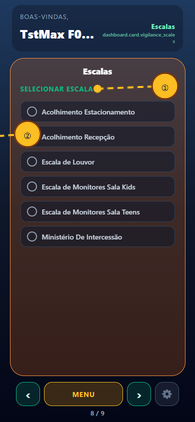

| Ref. | Elemento indicado na imagem |
|:----:|------------------------------|
| ① | **Selecionar Escala** (tipo de serviço) |
| ② | Tabela **Nome · Data · Zap** |
| ③ | **Identificar veículo** (escala estacionamento) |

### Passo a passo

1. Abra **Escalas**.
2. Em **Selecionar Escala**, toque no tipo desejado (ex.: estacionamento, intercessão).
3. O painel avança para o card de **servos daquela escala** (ou tabela Nome / Data / Zap).
4. Confira **nomes e datas** — são os servos programados para os próximos domingos/datas.
5. Toque no **WhatsApp** ao lado de um servo para contato.
6. Use **Voltar** para retornar à lista de tipos de escala.

### Resultado esperado

- Lista com servos e datas futuras da escala escolhida.
- Para escala de **estacionamento**: botão **Identificar veículo** leva ao card Estacionamento (Parte 11).
- Você consegue responder: *“Quem está de escala hoje nesta função?”* — procure a **data de hoje** na tabela.

### Dica
Se você mesmo é servo, sua escala também aparece aqui — útil para confirmar o dia de serviço.

---

# Parte 10 — Card Servos em escala *(quando visível)*

### Objetivo
Ver detalhe rápido da escala já selecionada no card Escalas.

### Caminho
Aparece automaticamente no carrossel após escolher uma escala com servos cadastrados.

### Ilustração — Servos em escala (detalhe) *(dados fictícios)*

| Ref. | Elemento indicado na imagem |
|:----:|------------------------------|
| ① | **Selecionar Escala** (tipo de serviço) |
| ② | Tabela **Nome · Data · Zap** |
| ③ | **Identificar veículo** (escala estacionamento) |

### Resultado esperado

- Mesmos nomes e contatos do detalhe aberto em Escalas, em card dedicado no carrossel.
- Some do carrossel se não houver escala selecionada ou servos.

---

# Parte 11 — Card Estacionamento *(quando visível)*

### Objetivo
Identificar o **proprietário de um veículo** pela placa (equipe de acolhimento no estacionamento).

### Caminho
Escalas → escala de estacionamento → **Identificar veículo** — ou card **Estacionamento** se ativo no seu perfil.

### Ilustração — Estacionamento *(dados fictícios)*

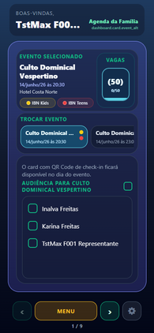

| Ref. | Elemento indicado na imagem |
|:----:|------------------------------|
| ① | Campo **Número da placa** |
| ② | Botão **Buscar** |
| ③ | Dados do **proprietário** e veículo |

### Passo a passo

1. Digite a **Número da placa** e busque.
2. Leia **Proprietário**, **Marca**, **Modelo**, **Cor**, **Telefone**.
3. Toque no **WhatsApp** para falar com o dono, ou **Nova busca**.

### Resultado esperado

- Dados do veículo e dono exibidos; placa não encontrada → *Nenhum veículo encontrado…*
- **Voltar** retorna à escala de estacionamento.

---

# Parte 12 — Gestão de Cadastros (seu círculo familiar)

### Objetivo
Manter **seus dados** e **cadastrar integrantes da sua família** no mesmo círculo (código de família).

### Caminho
Painel → **Gestão de Cadastros** → **Dados Cadastrais** ou **Gerenciar Família**.

### Ilustração — Gestão de Cadastros *(dados fictícios)*

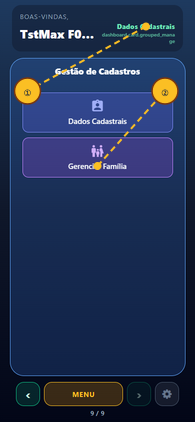

| Ref. | Elemento indicado na imagem |
|:----:|------------------------------|
| ① | Atalho **Dados Cadastrais** |
| ② | Atalho **Gerenciar Família** |
| ③ | Checkbox **✓** de aceite do integrante |
| ④ | **Adicionar integrante** ao código familiar |

## 12.1 Dados Cadastrais

### Passo a passo

1. Toque em **Dados Cadastrais**.

### Ilustração — Dados Cadastrais *(dados fictícios)*

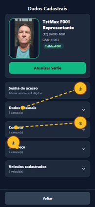

| Ref. | Elemento indicado na imagem |
|:----:|------------------------------|
| ① | Seção **Dados Pessoais** (expandida) |
| ② | Campo **Nome** e demais dados pessoais |
| ③ | Seção **Contato** |
| ④ | Seção **Endereço** |

2. Atualize **selfie**, **dados pessoais**, **contato**, **endereço** (seções recolhíveis).

### Ilustração — Selfie biométrica *(dados fictícios)*

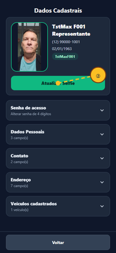

| Ref. | Elemento indicado na imagem |
|:----:|------------------------------|
| ① | Botão **Tirar Selfie** / **Atualizar Selfie** |
| ② | Área de pré-visualização da foto |
| ③ | Atalho **LGPD** (se pendente) |
| ④ | Resumo do membro (nome fictício TstMax) |

3. Em **Senha de acesso**, defina sua senha pessoal de 4 dígitos (após primeiro acesso).
4. Cadastre **veículos** se desejar (placa usada no estacionamento).
5. Use **Vincular a Família** se a secretaria forneceu um código para unir núcleos.
6. Toque em **Voltar** — retorna ao card Gestão de Cadastros.

### Resultado esperado

- Campos salvos com confirmação na tela.
- Código de família visível — necessário para QR, audiência e Salas.
- LGPD regularizado → cabeçalho sem alerta vermelho.

---

## 12.2 Gerenciar Família — incluir integrantes no seu círculo

### Objetivo
Adicionar cônjuge, filhos e outros parentes ao **mesmo código de família** para que participem de audiência, QR, Salas, etc.

### Caminho
**Gestão de Cadastros** → **Gerenciar Família**.

### Ilustração — Gerenciar Família *(dados fictícios)*

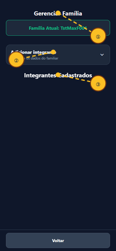

| Ref. | Elemento indicado na imagem |
|:----:|------------------------------|
| ① | Código **Família Atual** no topo |
| ② | Botão **Adicionar integrante** |
| ③ | Lista **Integrantes Cadastrados** |
| ④ | Campo **Grau de parentesco** |

### Passo a passo

1. Anote **Família Atual: {código}** no topo.
2. Toque em **Adicionar integrante** (ou use busca por nome/telefone se a pessoa já existe no sistema).
3. Preencha **Nome completo**, **Telefone**, **Nascimento**, **Grau de parentesco** (Cônjuge, Filho(a), etc.).
4. Toque em **ADICIONAR INTEGRANTE**.
5. Na lista **Integrantes Cadastrados**, marque o **checkbox de aceite** (✓) ao lado de quem você confirma como membro do seu núcleo.
6. Para editar, toque no ícone de lápis; para remover, use **EXCLUIR INTEGRANTE** (com confirmação).

### Resultado esperado

- Novo integrante aparece na lista **Integrantes Cadastrados**.
- Com checkbox ✓ (aceite), o membro:
  - Aparece na **Audiência** do card Agenda.
  - Pode constar no **QR Code** da família.
  - Aparece no card **SALA(S)** quando inscrito em Kids/Teens.
- Indicadores **KIDS/TEENS** (bolinhas) por idade na lista.
- Se a pessoa estava em outra família, o app pede **confirmação de transferência** — ao aceitar, ela entra no seu círculo.

### Dica
O representante legal da família não pode ser excluído — proteção do cadastro principal.

### Se der erro

- Duplicata (mesmo nome/telefone na família) → mensagem impedindo segundo cadastro igual.
- Sem código de família → solicite à secretaria antes de adicionar integrantes.

---

# Encerramento — Sair com segurança

### Objetivo
Encerrar a sessão no aparelho (essencial em celular compartilhado).

### Caminho
**Índice** → rodapé → **Encerrar sessão** (web) ou **Sair do aplicativo** (celular).

### Resultado esperado

- Volta à tela **Boas-vindas**; próximo uso exige celular e senha novamente.
- Dados de login removidos do aparelho.

---

## Resumo — o que você deve conseguir após este manual

| Necessidade | Onde ver no app |
|-------------|-----------------|
| Vagas do culto | Agenda → copo **Vagas** + número entre parênteses |
| Filho aceito na sala | SALA(S) → **✓** ao lado do nome |
| Pedido pastoral acompanhado | Coração Aberto → **Meus pedidos** → status **Acolher / Apoiar / Acompanhar** |
| Quem está de escala hoje | Escalas → tipo → data de hoje na lista |
| Incluir família no meu círculo | Gestão de Cadastros → **Gerenciar Família** → adicionar + checkbox ✓ |
| Ofertar via PIX | Dízimos e Ofertas → **Copiar chave PIX** |
| Check-in no culto | Agenda (audiência) + QR no dia do evento |

---

*App IBN · Igreja Batista Norte · Manual do Painel v2026-06-10*
