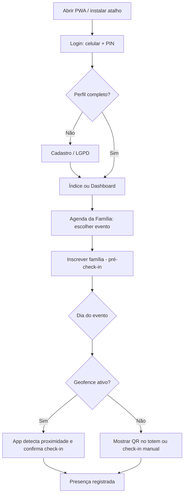
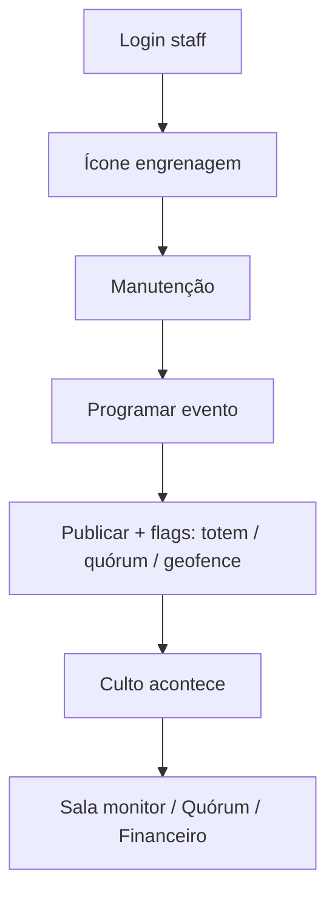
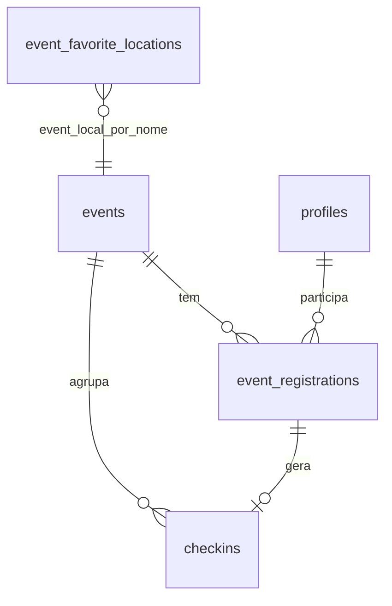

# Manual de Entrega — App Igreja (IBNorte)

**Documento:** Manual técnico e funcional de referência  
**Sistema:** Aplicativo digital da Igreja Batista Norte  
**Repositório:** `maufreitas63/app-igreja`  
**Versão do app:** 1.0.0  
**Data:** 2 de julho de 2026  
**Públicos:** Cliente final (valor e usabilidade) · Equipe de manutenção (arquitetura e lógica)

---

## Como ler este documento

| Seção | Público | Objetivo |
|-------|---------|----------|
| §1–§3 | **Cliente final** | Entender o que o sistema faz, os benefícios e o caminho natural de uso |
| §4 | **Equipe de manutenção** | Arquitetura, dados, fluxos críticos, desenvolvimento e deploy |
| §5 | **Ambos** | Status atual, riscos e evoluções recomendadas |

Documentação complementar no repositório: `FUNCIONALIDADES.md`, `BLUEPRINT.md`, `CONTROLE_ACESSO.md`, `DEPLOY_CLOUDFLARE.md`, `INDICE_DOCUMENTACAO.md`.

---

# Parte A — Cliente Final

## 1. Visão Geral do Produto

### 1.1 O que é

O **App Igreja** é uma plataforma digital (PWA instalável no celular e computador) que concentra a vida operacional da igreja em um único lugar: cadastro de membros, participação em cultos e eventos, check-in de presença, cuidado pastoral, informações financeiras, escalas de serviço e ferramentas administrativas para a equipe.

### 1.2 Qual problema resolve

Antes de um sistema integrado, igrejas costumam depender de planilhas, grupos de WhatsApp, listas em papel e processos manuais desconectados. Isso gera:

- Dificuldade em saber **quem está presente** em um culto ou evento
- Retrabalho ao cadastrar famílias e atualizar endereços
- Falta de visibilidade financeira para membros autorizados
- Pedidos pastorais sem rastreamento ou histórico
- Escalas de serviço difíceis de consultar e manter

O App Igreja resolve esses pontos ao oferecer:

| Dor operacional | Solução no app |
|-----------------|----------------|
| Presença em eventos | Pré-cadastro (audiência), check-in por QR/totem, check-in automático por proximidade (GPS) e quórum |
| Cadastro familiar | Perfil individual, gestão de família, formulário público e fila de recepção |
| Comunicação pastoral | Módulo Coração Aberto com categorias, sigilo e acompanhamento |
| Transparência financeira | Boletins mensais, comparativos e relatórios de despesas (RD) |
| Organização de serviço | Escalas consultáveis, estacionamento por placa, salas Kids/Teens |
| Segurança e governança | Controle de acesso por papel (ACL), LGPD configurável, sessão por PIN |

### 1.3 Quem usa

| Perfil | Acesso típico |
|--------|---------------|
| **Membro / visitante** | Login com celular + PIN → painel principal (dashboard) |
| **Família** | Gestão de integrantes, inscrição em eventos, check-in |
| **Equipe (staff)** | Painel de manutenção — eventos, salas, quórum, financeiro, pastoral, ACL |
| **Totem** | Dispositivo fixo na entrada — leitura de QR para check-in |
| **Público externo** | Formulário `/cadastro-familia/` para solicitar entrada na igreja |

### 1.4 Onde roda

- **Produção:** PWA publicado via Cloudflare Pages (HTTPS)
- **Banco de dados:** Supabase (PostgreSQL na nuvem)
- **Mobile:** Expo/React Native — PWA é o canal principal; builds nativos são suportados pelo stack

---

## 2. Guia de Recursos (Usuário Final)

Cada recurso abaixo descreve **o benefício** para quem usa, não apenas a funcionalidade técnica.

### 2.1 Acesso e segurança pessoal

| Recurso | Benefício |
|---------|-----------|
| **Login por celular + PIN** | Acesso rápido sem senha longa; o PIN é validado no servidor, não fica exposto no aparelho além da sessão local |
| **PIN temporário via WhatsApp** | Primeiro acesso simplificado — o membro recebe credencial sem depender de secretaria no momento |
| **Sessão persistente** | Ao reabrir o app, o membro continua logado até encerrar sessão |
| **Encerrar sessão** | Proteção em aparelhos compartilhados |
| **LGPD configurável** | Quando ativo, garante aceite formal dos termos e selfie; quando inativo, onboarding mais leve |

### 2.2 Cadastro e perfil

| Recurso | Benefício |
|---------|-----------|
| **Cadastro inicial guiado** | Novos usuários completam dados essenciais em poucos passos |
| **Dados cadastrais editáveis** | O membro mantém endereço, contato e documentos atualizados |
| **Endereço por CEP** | Digitar o CEP preenche rua, bairro e cidade — menos erro e mais agilidade |
| **Selfie no perfil** | Identificação visual em recepção e processos internos |
| **Veículos cadastrados** | Placa vinculada ao membro — útil no estacionamento e comunicação |
| **Alteração de PIN** | O membro troca a senha de acesso com validação do PIN atual |

### 2.3 Família

| Recurso | Benefício |
|---------|-----------|
| **Código de família** | Agrupa pessoas que frequentam juntos — inscrições e check-ins em lote |
| **Gerenciar integrantes** | O representante adiciona cônjuge, filhos e dependentes sem ir à secretaria |
| **Reconhecimento de membros** | Checkbox de aceite indica quem a família reconhece oficialmente |
| **Herança de endereço** | Novos membros recebem automaticamente o endereço do gestor familiar |
| **Transferência entre famílias** | Mudança de núcleo familiar com confirmação — evita duplicidade |
| **Indicadores Kids/Teens** | Identificação visual por idade nas salas infantis e de adolescentes |

### 2.4 Painel principal (Dashboard)

O dashboard é um **carrossel de cards** — deslize horizontalmente ou use as setas no rodapé. O botão **Menu** ocupa a faixa central; a engrenagem de manutenção, quando visível no Índice, fica **alinhada à direita** do rodapé.

| Card | Benefício para o membro |
|------|-------------------------|
| **Agenda da Família** | Vê eventos, vagas e inscreve a família antes do culto (pré-check-in) |
| **Check-in / QR Code** | Gera QR da família para leitura no totem; check-in manual quando necessário |
| **SALA(S)** | Acompanha entrada dos filhos nas salas Kids/Teens (somente da própria família) |
| **Dízimos e Ofertas** | Chave PIX e dados do recebedor sempre à mão; copiar com um toque |
| **Coração Aberto** | Atalho para pedido pastoral ou intercessão |
| **Lista de Membros** | Diretório com busca, WhatsApp e mapa geral (detalhe de pin restrito por ACL) |
| **Aniversariantes** | Celebra e contata aniversariantes do mês |
| **Financeiro** | Hub para relatórios autorizados e relatório de despesas (RD) |
| **Escalas** | Consulta quando e com quem serve em cada tipo de escala |
| **Estacionamento** | Identifica dono do veículo pela placa e abre WhatsApp |
| **Gestão de Cadastros** | Atalhos para perfil e família |

**Índice do aplicativo:** tela inicial com atalhos visuais para cada card — útil em telas grandes ou para quem prefere menu em vez de carrossel.

### 2.5 Eventos e check-in

| Recurso | Benefício |
|---------|-----------|
| **Pré-check-in (audiência)** | A família declara quem virá antes do evento — organiza salas, materiais e quórum |
| **QR Code da família** | Check-in rápido na entrada sem digitar nomes |
| **Check-in automático por proximidade** | Com GPS ativo e evento configurado, o app detecta chegada ao templo e confirma presença |
| **Check-in manual** | Alternativa quando totem ou GPS não estão disponíveis |
| **Quórum** | Um representante por sessão confirma presença oficial para atas e registros |
| **Totem na entrada** | Dispositivo dedicado escaneia QR — fila mais rápida em cultos cheios |
| **Salas Kids e Teens** | Inscrição via audiência; monitoramento de entrada nas salas |

### 2.6 Pastoral — Coração Aberto

| Recurso | Benefício |
|---------|-----------|
| **Formulário de pedido** | Canal formal para pedir oração, aconselhamento ou intercessão |
| **Categorias de motivo** | Ajuda a equipe pastoral a priorizar e encaminhar |
| **Sigilo ou intercessão** | O membro escolhe se o pedido é confidencial ou pode ser compartilhado com intercessores |
| **Histórico (Meus pedidos)** | Acompanha status sem precisar ligar para a secretaria |

### 2.7 Financeiro (membro)

| Recurso | Benefício |
|---------|-----------|
| **Boletim mensal** | Visão do resultado financeiro do mês com saldo acumulado |
| **Comparativo mensal** | Entende evolução mês a mês |
| **Matriz 12 meses** | Panorama anual em uma tela |
| **Planejado × Realizado** | Transparência sobre orçamento versus execução |
| **Saldo bancário** | Saldos por conta no mês selecionado |
| **Relatório de Despesas (RD)** | Membro que gastou com a igreja envia comprovantes e solicita reembolso de forma rastreável |

### 2.8 Escalas e estacionamento

| Recurso | Benefício |
|---------|-----------|
| **Lista de escalas** | Sabe quando serve e quem está na mesma escala |
| **WhatsApp do servo** | Contato direto para combinar substituições |
| **Estacionamento** | Encontra o responsável pelo veículo estacionado de forma irregular |

### 2.9 Mapa de geolocalização

| Recurso | Benefício |
|---------|-----------|
| **Mapa da comunidade** | Visualiza onde os membros moram (por CEP) — útil para visitas e regionalização |
| **Filtros** | Todos, com papel ministerial ou visitantes |
| **Detalhe do membro** | Nome, papel, endereço e WhatsApp ao tocar no pin |

### 2.10 Avisos e versículos

| Recurso | Benefício |
|---------|-----------|
| **Avisos de culto** | Comunicados publicados pela equipe em tempo real |
| **Versículo por tema** | Inspiração bíblica contextualizada no índice do app |

### 2.11 Cadastro público de família

| Recurso | Benefício |
|---------|-----------|
| **Formulário `/cadastro-familia/`** | Famílias novas se cadastram sem instalar o app; a equipe aprova na Recepção Familiar |

---

## 3. Mapa de Usabilidade

### 3.1 Caminho feliz — membro regular



**Passo a passo narrativo:**

1. **Primeiro acesso:** informar celular → receber PIN (WhatsApp) → criar perfil → aceitar LGPD (se ativo).
2. **Uso cotidiano:** login → índice ou dashboard.
3. **Antes do culto:** card Agenda → selecionar evento → marcar quem da família participará.
4. **No culto:** se geofence estiver ativo e o local tiver coordenadas, aproximar-se do templo; caso contrário, apresentar QR no totem.
5. **Após check-in:** salas Kids/Teens e quórum refletem a presença automaticamente quando configurados.

### 3.2 Caminho feliz — equipe de manutenção



### 3.3 Caminho feliz — totem

1. Aparelho dedicado faz login com PIN `9999` e celular configurado em `cel_totem`.
2. Redirecionamento automático para `/totem-checkin`.
3. Família apresenta QR do dashboard.
4. Totem confirma presença via RPC — status atualizado para toda a equipe.

### 3.4 Caminho feliz — cadastro público

1. Família acessa link `/cadastro-familia/`.
2. Preenche dados e envia.
3. Equipe abre **Recepção Familiar** na manutenção.
4. Aprova ou rejeita em lote — membros passam a existir no sistema.

### 3.5 Navegação entre telas principais

| Origem | Destino | Como |
|--------|---------|------|
| Dashboard | Perfil / Família / Pastoral / Financeiro | Card ou atalho → retorno ao card de origem |
| Dashboard | Manutenção | Ícone engrenagem (ACL) |
| Login | Totem | PIN 9999 + celular totem |
| Financeiro hub | RD / Relatórios | Botões no card Financeiro |

---

# Parte B — Equipe de Manutenção

## 4. Guia Técnico

### 4.1 Stack e arquitetura

```
┌─────────────────────────────────────────────────────────────┐
│  Cliente (PWA / iOS / Android)                              │
│  Expo 54 · React 19 · React Native 0.81 · TypeScript 5.9   │
│  Expo Router (file-based) · ~287 arquivos TS/TSX           │
└──────────────────────────┬──────────────────────────────────┘
                           │ HTTPS (REST + Realtime)
                           │ Headers: x-session-token | x-profile-id
┌──────────────────────────▼──────────────────────────────────┐
│  Supabase                                                    │
│  PostgreSQL · RLS · SECURITY DEFINER RPCs · Storage         │
│  ~170 scripts SQL em scripts/ (aplicação manual)            │
└─────────────────────────────────────────────────────────────┘
```

| Camada | Responsabilidade |
|--------|------------------|
| `app/` | Rotas e telas (22 arquivos de rota) |
| `components/` | UI — cards, modais, painéis de manutenção (~67 componentes) |
| `hooks/` | Estado e efeitos de domínio (~43 hooks) |
| `lib/` | Regras de negócio, APIs Supabase, utilitários (~147 módulos) |
| `scripts/` | Schema SQL, RPCs, seeds, build e importação |
| `standalone/cadastro-familia/` | Formulário público Vite |

**Padrão de integração Supabase:**

- Cliente único em `lib/supabase.ts` com `persistSession: false`
- Identidade via `lib/supabaseSessionFetch.ts` — injeta `x-session-token` (preferido) ou `x-profile-id`
- Escritas sensíveis via RPC `SECURITY DEFINER`; leituras via `from().select()` com RLS
- Detecção de RPC ausente → mensagem com hint do script SQL (`lib/supabaseRpc.ts`)

### 4.2 Arquitetura de dados

#### 4.2.1 Entidades centrais

| Tabela | Papel | Relacionamentos principais |
|--------|-------|---------------------------|
| `profiles` | Identidade de login (PIN, telefone, endereço, geo) | → `members`, `event_registrations`, `checkins`, ACL |
| `members` | Integrantes da família (podem não ter perfil) | `family_id` sincronizado com `profiles` |
| `events` | Cultos e eventos | → `event_registrations`, `checkins`, flags operacionais |
| `event_registrations` | Inscrição de perfil em evento | 1:1 com `checkins` (por `event_registration_id`) |
| `checkins` | Presença (`pre_checkin`, `confirmado`) + geo | FK → `events`, `event_registrations` |
| `event_favorite_locations` | Locais com coordenadas para geofence | Vinculado por nome em `events.event_local` |
| `access_*` | Papéis, recursos e grants (ACL) | Controla RLS e UI |
| `app_parameters` | Configuração runtime | Geofence, LGPD, totem, PIX tesoureiro, etc. |
| `pastoral_requests` | Pedidos Coração Aberto | Categorias, sigilo, status |
| `financials` | Lançamentos financeiros | Importação CSV, boletins |
| `expense_reports` / `expense_items` | Relatórios de despesas (RD) | Conciliação tesouraria |
| `tipos_escala`, `voluntarios_escala`, `escalas_log` | Sistema de escalas | Ciclos, vagas, líderes |
| `recepcao_cadastro_familiar*` | Fila cadastro público | Lotes e membros pendentes |
| `bible_themes`, `bible_verses_by_theme` | Versículos por tema | RPC `get_random_bible_verse` |
| `cep_geolocations`, `cep_address_cache` | Cache CEP → coordenadas | Mapa e endereços |

#### 4.2.2 Colunas operacionais em `events`

| Coluna | Efeito |
|--------|--------|
| `totem_ativo` | Habilita fluxo QR/totem |
| `requer_quorum` | Exige registro de quórum |
| `geofence_ativo` | Check-in automático por GPS |
| `somente_membros` | Restringe audiência |
| `kids_room` / `teens_room` | Salas infantis/adolescentes |
| `is_locked` / publicação | Bloqueio de edição e visibilidade |

#### 4.2.3 Diagrama simplificado (presença em eventos)



### 4.3 Módulos críticos (código)

#### Autenticação e sessão

| Módulo | Função |
|--------|--------|
| `lib/verificarLogin.ts` | RPC `verificar_login` |
| `lib/userSession.ts` | AsyncStorage: telefone, profile_id, session_token |
| `lib/profileOnboarding.ts` | Roteamento pós-login |
| `scripts/profile-sessions.sql` | Tokens assinados `profile_sessions` |
| `scripts/verificar-login.sql` | Hardening de login |

#### Check-in e geofence

| Módulo / script | Função |
|-----------------|--------|
| `hooks/useGeoCheckinMonitor.ts` | Watch GPS, fila offline, confirmação automática |
| `lib/geoCheckinApi.ts` | RPCs `confirm_geo_family_checkin_atomic`, `sync_family_event_registrations_atomic` |
| `lib/checkinGeofence.ts` | Haversine, raio, validação com precisão GPS |
| `lib/geoCheckinWindow.ts` | Janela temporal (horas antes + fim do dia SP) |
| `lib/eventGeofenceCoordinates.ts` | Resolve lat/lng via locais favoritos |
| `lib/geofenceEventIntegrity.ts` | Detecta alterações que invalidam check-ins |
| `lib/saveMaintenanceEvent.ts` | Salva evento; confia em trigger de purge |
| `scripts/checkins-totem-flow.sql` | Tabela `checkins`, totem RPCs |
| `scripts/geo-checkin-automatic.sql` | Geofence RPCs, haversine, RLS audiência |
| `scripts/geo-checkin-purge-on-event-update.sql` | Triggers de invalidação |

#### Controle de acesso

| Módulo / script | Função |
|-----------------|--------|
| `lib/accessControl.ts` | Cache e `sessionHasAccess` |
| `lib/aclPolicy.ts` | Políticas client-side |
| `components/ScreenAccessGate.tsx` | Guard de rota |
| `scripts/access-control-schema.sql` | Tabelas ACL |
| `scripts/access-control-table-rls.sql` | RLS em tabelas core |
| `scripts/access-control-security-hardening.sql` | Endurecimento |

#### Família e recepção

| Módulo / script | Função |
|-----------------|--------|
| `lib/familyRegistration.ts` | CRUD familiar |
| `lib/familyReceptionApi.ts` | Fila recepção |
| `scripts/register-member-atomic.sql` | Inscrição atômica em eventos |
| `scripts/recepcao-cadastro-familiar.sql` | Schema recepção |

#### Financeiro

| Módulo / script | Função |
|-----------------|--------|
| `lib/financialModule.ts` | Leitura membro |
| `lib/expenseReport.ts` | RD membro |
| `lib/maintenanceFinancialApi.ts` | Staff: import, CRUD |
| `scripts/financials-schema.sql` | Tabela `financials` |
| `scripts/expense-reports-schema.sql` | RD |

#### Pastoral

| Módulo / script | Função |
|-----------------|--------|
| `lib/pastoralRequest.ts` | Insert membro |
| `lib/maintenancePastoralApi.ts` | Painel staff |
| `scripts/pastoral-request-categories.sql` | Taxonomia |

#### Escalas

| Módulo / script | Função |
|-----------------|--------|
| `lib/maintenanceScalesApi.ts` | CRUD escalas |
| `lib/maintenanceScaleCycleApi.ts` | `aplicar_ciclo_escala` |
| `scripts/vigilancia-escalas.sql` | Schema escalas |

### 4.4 Fluxos críticos e dependências

#### Fluxo A — Login

```
Tela / → verificar_login → issue_profile_session (opcional)
→ headers na próxima requisição → RLS resolve current_session_profile_id
```

**Dependências SQL:** `profiles-access-pin.sql`, `verificar-login.sql`, `profile-sessions.sql`, ACL (opcional mas recomendado).

#### Fluxo B — Pré-check-in e check-in totem

```
sync/register_member_atomic → sync_checkin_for_registration (se totem/quorum)
→ checkins.status = pre_checkin
→ totem: lookup_totem_checkin → confirm_totem_checkin → confirmado
→ maybe_sync_quorum_registry_for_registration
```

**Dependências:** `events-totem-ativo.sql`, `checkins-totem-flow.sql`, `register-member-atomic.sql`, `events-quorum-registry.sql` (opcional).

#### Fluxo C — Check-in geofence

```
useGeoCheckinMonitor → 3 leituras GPS dentro do raio
→ confirm_geo_family_checkin_atomic
  → assert_session_can_manage_family
  → assert_event_geofence_checkin_enabled
  → assert_geofence_for_event (haversine + janela temporal)
  → update/insert checkins confirmado + geo_latitude/longitude
```

**Dependências:** `event-favorite-locations.sql`, `events-geofence-ativo.sql`, `geo-checkin-automatic.sql`, `geo-checkin-purge-on-event-update.sql`.

**Invalidação:** editar evento com `geofence_ativo` ou local favorito vinculado → trigger apaga check-ins → famílias devem validar novamente.

#### Fluxo D — ACL

```
Cliente: sessionHasAccess(resource) → filtra cards/rotas
Servidor: session_has_resource_access → RLS USING/WITH CHECK
Legado: acl_enforcement_enabled() = false → acesso aberto
```

#### Fluxo E — Deploy PWA

```
git push main → Cloudflare Pages → npm run build:web → dist/
```

SQL **não** faz parte do pipeline de deploy — scripts em `scripts/` são aplicados manualmente no Supabase.

### 4.5 Ordem recomendada de scripts SQL (bootstrap)

| Fase | Scripts principais |
|------|-------------------|
| 1 — Base | `profiles-access-pin.sql`, `register-member-atomic.sql` |
| 2 — ACL | `access-control-schema.sql` → `access-control-table-rls.sql` → `access-control-security-hardening.sql` |
| 3 — Sessão | `verificar-login.sql`, `profile-sessions.sql` |
| 4 — Eventos | `events-totem-ativo.sql`, `events-requer-quorum.sql`, `events-geofence-ativo.sql`, `checkins-totem-flow.sql` |
| 5 — Geofence | `event-favorite-locations.sql`, `geo-checkin-automatic.sql`, `geo-checkin-purge-on-event-update.sql` |
| 6 — Domínios | pastoral, financials, escalas, recepção, bible-verses (conforme necessidade) |

Consulte `scripts/APLICAR-PENDENCIAS-SUPABASE.md` para pendências conhecidas.

### 4.6 Rotas da aplicação

| Rota | Arquivo | ACL |
|------|---------|-----|
| `/` | `app/index.tsx` | Público |
| `/(tabs)/dashboard` | `app/(tabs)/dashboard.tsx` | Sim |
| `/(tabs)/index` | `app/(tabs)/index.tsx` | Autenticado |
| `/manage-profile` | `app/manage-profile.tsx` | Sim |
| `/manage-members` | `app/manage-members.tsx` | Sim |
| `/pastoral` | `app/pastoral.tsx` | Sim |
| `/pastoral-history` | `app/pastoral-history.tsx` | Sim |
| `/financial` | `app/financial.tsx` | Sim |
| `/expense-report` | `app/expense-report.tsx` | Sim |
| `/mapa-geolocalizacao` | `app/mapa-geolocalizacao.web.tsx` | Sim |
| `/maintenance-dashboard` | `app/maintenance-dashboard.tsx` | Staff |
| `/totem-checkin` | `app/totem-checkin.tsx` | Totem |
| `/cadastro-familia` | redirect → Vite standalone | Público |
| `/admin/orquestrador` | `app/admin/orquestrador.tsx` | Orquestrador |
| `/avisos` | `app/avisos.tsx` | Autenticado |
| `/lgpd` | `app/lgpd.tsx` | Sim |
| `/sessao-encerrada` | `app/sessao-encerrada.tsx` | Público |

### 4.7 Ambiente de desenvolvimento

**Requisitos:**

- Node.js ≥ 20.19.4
- npm
- Conta Supabase com projeto configurado
- Variáveis em `.env` (não versionado): URL e anon key do Supabase

**Comandos:**

```bash
npm install
npm run web              # http://localhost:8081
npm run build:web        # dist/ — igual produção
npm run lint
npm run build:family-form  # formulário público
```

**Estrutura de sessão local (dev):**

- `user_phone`, `user_profile_id`, `user_session_token` em AsyncStorage
- Sem Supabase Auth — identidade customizada via headers

**Testes automatizados disponíveis:**

- `npm run test:family-address`
- `npm run test:recepcao-ibn`
- `npm run test:carousel-nav`
- `npm run test:maintenance-carousel`

### 4.8 Deploy

| Etapa | Ação |
|-------|------|
| Build local (validação) | `npm run build:web` |
| Publicação | `git push origin main` |
| Hospedagem | Cloudflare Pages — output `dist/` |
| Variáveis Cloudflare | `NODE_VERSION=20`, `NODE_OPTIONS=--max-old-space-size=6144` |
| Pós-deploy | Hard refresh; conferir `CHECKLIST_VALIDACAO_POS_DEPLOY.md` |

**Importante:** alterações em `scripts/*.sql` exigem execução manual no SQL Editor do Supabase. O PWA e o banco evoluem em pipelines separados.

### 4.9 Papéis ACL (referência)

| Papel | Uso típico |
|-------|------------|
| `visitantes` | Acesso mínimo pós-cadastro |
| `congregado` | Membro em processo de integração |
| `member` | Membro pleno |
| `family_acceptor` | Aprova vínculos familiares |
| `lider` | Liderança de escala |
| `events_admin` | Eventos |
| `tesoureiro` | Financeiro e RD |
| `pastoral` | Coração Aberto e mudança de papéis |
| `super_admin` | ACL, exclusão de perfil, insights |

Recursos controlados: `screen`, `dashboard_card`, `table`, `column` — ações `view` / `update`.

### 4.10 RPCs de maior impacto

| RPC | Domínio |
|-----|---------|
| `verificar_login` | Auth |
| `register_member_atomic` / `unregister_member_atomic` | Eventos |
| `confirm_totem_checkin` / `lookup_totem_checkin` | Totem |
| `confirm_geo_family_checkin_atomic` | Geofence |
| `sync_family_event_registrations_atomic` | Audiência + geo |
| `profile_has_access` | ACL |
| `submit_family_registration_public` | Recepção |
| `insert_pastoral_request` | Pastoral |
| `importar_lancamentos_financeiros_csv` | Financeiro |
| `aplicar_ciclo_escala` | Escalas |
| `purge_event_checkins_for_geofence_event` | Manutenção (service_role / trigger) |

### 4.11 Triggers críticos

| Trigger | Tabela | Efeito |
|---------|--------|--------|
| `events_purge_geofence_checkins_on_update` | `events` | Invalida check-ins ao editar evento geofence |
| `event_favorite_locations_purge_geofence_checkins` | `event_favorite_locations` | Invalida ao alterar/deletar local |
| `trg_sync_profile_family_from_member` | `members` | Sincroniza `family_id` |
| `trg_profiles_sync_address_from_cep` | `profiles` | Preenche endereço por CEP |
| `trg_events_enforce_lock_if_past` | `events` | Bloqueia edição de eventos passados |

---

## 5. Status e Recomendações

### 5.1 Status atual (junho/2026)

| Área | Status | Observação |
|------|--------|------------|
| PWA produção | ✅ Estável | Deploy automático Cloudflare |
| Login + sessão | ✅ | Tokens `profile_sessions` recomendados |
| Dashboard membro | ✅ | 12 cards ACL-aware |
| Check-in totem | ✅ | Fluxo completo com cooldown |
| Check-in geofence | ✅ | Com purge seguro e paridade SQL/TS |
| Manutenção | ✅ | 16 painéis no carrossel |
| ACL | ✅ | Modo legado aberto se sem grants |
| Financeiro | ✅ | Import CSV + RD |
| Pastoral | ✅ | Categorias + manutenção |
| Escalas | ✅ | Ciclos em bloco |
| Mapa (web) | ✅ | Leaflet; nativo placeholder |
| Bible verses | ✅ | ~161 temas via scripts |
| Documentação | ✅ | Pacotes 1–7 + este manual |

### 5.2 Pontos de atenção

| Ponto | Risco | Mitigação |
|-------|-------|-----------|
| SQL manual no Supabase | App e banco dessincronizados | Checklist pós-deploy; `useMaintenanceRpcMissing` |
| `x-profile-id` legado | Spoofing se sem session token | Priorizar `profile-sessions.sql` |
| ACL desligado | Acesso aberto no banco | Ativar grants + `EXPO_PUBLIC_ACL_STRICT=true` |
| Geofence sem coordenadas | Check-in bloqueado (correto) | Cadastrar lat/lng em locais favoritos |
| Scripts pendentes | `APLICAR-PENDENCIAS-SUPABASE.md` | Aplicar `events-somente-membros.sql`, etc. |
| PWA cache | Usuário vê versão antiga | Hard refresh; `_headers` com revalidação HTML |

### 5.3 Melhorias futuras recomendadas

| Prioridade | Melhoria | Benefício |
|------------|----------|-----------|
| Alta | Runner de migrações SQL versionado | Rastreabilidade de schema |
| Alta | Testes E2E (Playwright) nos fluxos login + check-in | Regressão automatizada |
| Média | RPC `resolve_event_geofence_coordinates` no cliente | Menos fetch de todos os favoritos |
| Média | Mapa nativo com react-native-maps | Paridade mobile |
| Média | Notificações push para avisos de culto | Engajamento |
| Baixa | Unificar haversine em lib compartilhada (mapa + geo) | DRY |
| Baixa | Remover rotas template (`/modal`, `/explore`) | Limpeza |

### 5.4 Checklist de entrega

- [ ] Scripts SQL da fase atual aplicados no Supabase de produção
- [ ] Variáveis Cloudflare configuradas
- [ ] `EXPO_PUBLIC_ACL_STRICT` definido conforme política da igreja
- [ ] Locais favoritos com coordenadas para eventos geofence
- [ ] Parâmetros `app_parameters` revisados (LGPD, totem, geofence, tesoureiro)
- [ ] Papéis ACL atribuídos aos gestores
- [ ] Totem configurado (`cel_totem`, PIN 9999)
- [ ] Validação pós-deploy (`CHECKLIST_VALIDACAO_POS_DEPLOY.md`)
- [ ] Treinamento equipe (`MANUAL_TREINAMENTO.md`, pacotes PDF)

---

## Apêndice A — Inventário de hooks (`hooks/`)

| Hook | Domínio |
|------|---------|
| `useCheckin` | Totem |
| `useGeoCheckinMonitor` | Geofence automático |
| `useFamilyPreCheckin` | Audiência |
| `useDashboardSelectedEvent` | Contexto de evento |
| `useActiveEvents` | Eventos publicados |
| `useEventGeofenceCoordinates` | Coordenadas do local |
| `useEventFavoriteLocations` | Locais favoritos CRUD |
| `useQuorumRegistry` | Registro quórum |
| `useScreenAccessGuard` | ACL rota |
| `useTotemDeviceRouteGuard` | Bloqueio totem |
| `useMaintenanceEvents` | CRUD eventos staff |
| `useMaintenanceFinancials` | Financeiro staff |
| `useMaintenanceScales` | Escalas staff |
| `useMaintenancePastoralCare` | Pastoral staff |
| `useMaintenanceAccessControl` | ACL admin |
| `useMaintenanceFamilyReception` | Recepção |
| `useProfilesMapMarkers` | Mapa |
| `usePredictiveInsights` | Modelo preditivo |

## Apêndice B — Scripts SQL por domínio (resumo)

| Domínio | Qtd. aprox. | Exemplos |
|---------|-------------|----------|
| ACL | 33 | `access-control-*.sql` |
| Perfis / família | 35+ | `profiles-*`, `members-*`, `recepcao-*` |
| Eventos / check-in | 17 | `events-*`, `checkins-*`, `geo-checkin-*` |
| Pastoral | 7 | `pastoral-*` |
| Financeiro | 10 | `financials-*`, `expense-reports-*` |
| Escalas | 8 | `vigilancia-escalas.sql`, `escalas-*` |
| CEP / geo | 8+ | `cep-geolocation-*`, `profiles-geo-*` |
| Bible | 18 | `bible-verses-by-theme*` |
| Diagnóstico / seed | 25+ | `tstmax-*`, `diagnose-*` |

---

*Documento gerado como manual de entrega profissional do projeto app-igreja. Para regenerar o PDF: `npm run build:manual-entrega-pdf`.*
