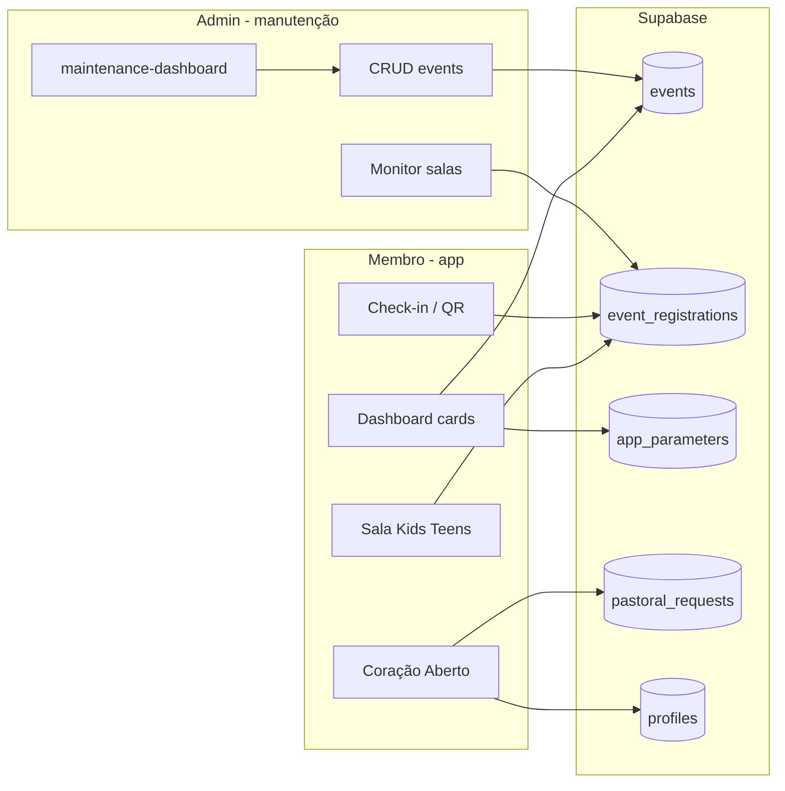

# Manutenção como ecossistema vivo

Proposta de atuação do **administrador** no módulo de manutenção (`maintenance-dashboard`), alinhada ao que o app-igreja já entrega: eventos, salas Kids/Teens, parâmetros globais, Coração Aberto (pedidos pastorais), escalas e cards do dashboard.

**Pacotes:** [`PACOTE_6_MANUAL_MANUTENCAO.md`](PACOTE_6_MANUAL_MANUTENCAO.md) (passo a passo) · [`PACOTE_2_OPERACAO.md`](PACOTE_2_OPERACAO.md) (ecossistema) · **Índice:** [`INDICE_DOCUMENTACAO.md`](INDICE_DOCUMENTACAO.md)

**Atualizado em:** 22/05/2026

---

## 1. Papel do administrador

O administrador não “mexe no banco” no dia a dia. Ele **alimenta o pulso da igreja no app** através de intervenções curtas e recorrentes, sempre pelo fluxo de manutenção (ícone de engrenagem no rodapé do dashboard).

| Papel | O que mantém vivo |
|--------|-------------------|
| **Curador de eventos** | Agenda visível, capacidade, salas, ofertas no evento |
| **Operador de salas** | Monitoramento Kids/Teens no dia do culto |
| **Configurador** | Parâmetros (`app_parameters`) que ligam/desligam cards |
| **Guardião pastoral** | (futuro painel web) triagem de `pastoral_requests` |

O membro usa o app com PIN; o admin usa as mesmas regras de negócio, com permissão de escrita em `events` e parâmetros.

---

## 2. Mapa do ecossistema (hoje)

---

## 3. Rotina recomendada de intervenção

### Diária (dia de culto / evento)

1. **Abrir manutenção** → conferir lista “Eventos cadastrados”.
2. **Evento do dia**
   - Data/hora e local corretos.
   - `kids_room` / `teens_room` conforme programação.
   - `max_capacity` atualizada (evita contagem errada no card SALA).
   - `parm_ofertas` se houver coleta no app.
   - Evento **não** bloqueado (`is_locked` = falso), salvo encerramento.
3. **Aba / card Monitor de salas** (no próprio maintenance)
   - Selecionar o evento ativo.
   - Acompanhar entradas Kids/Teens (refresco manual ao focar a tela — sem polling agressivo).
4. **Após o culto** (opcional)
   - Bloquear evento (`is_locked`) ou arquivar na política da igreja.

### Semanal

1. **Próximos eventos** — cadastrar cultos, conferências, retiros com 7–15 dias de antecedência.
2. **Parâmetros globais** (via SQL ou painel futuro em `app_parameters`):
   - `QRCode_Ativo` — exibe ou oculta card Check-in (eventos **sem** totem).
   - `check_In_Automatico` — com totem ativo no evento: card Check-in só aparece se valor = `nao` (check-in manual + QR + confirmação no totem).
   - `cel_totem` — celular **exclusivo** do tablet totem: senha **9999**, sem cadastro/LGPD/perfil; só `/totem-checkin` (não usar esse número em `profiles`; ver `scripts/app-parameter-cel-totem.sql`).
   - `chave_pix` — card Dízimos e Ofertas.
   - `psw_user` / `psw_mngr` — regras do PIN (já em `profiles-access-pin.sql`).
3. **Categorias pastorais** — se novos motivos forem aprovados em reunião pastoral, rodar `pastoral-request-categories.sql` (não é tela de manutenção ainda).

### Mensal

1. Revisar eventos antigos abertos (limpeza / `is_locked`).
2. Conferir se scripts RLS/RPC novos foram aplicados após deploy do app (checklist abaixo).
3. Amostragem de pedidos em `pastoral_requests` (hoje via Table Editor ou painel futuro).

---

## 4. Campos críticos em `events` (manutenção)

| Campo | Impacto no ecossistema |
|--------|-------------------------|
| `name`, `event_date`, `event_local` | Cards, seleção de evento, SALA |
| `max_capacity` | Vagas restantes no monitor |
| `kids_room`, `teens_room` | Abas Kids/Teens no card SALA e no maintenance |
| `parm_ofertas` | Contexto do evento (ofertas no culto); o card “Dízimos e Ofertas” no dashboard permanece **sempre visível** |
| `is_locked` | Evento some do check-in / lista ativa |
| `totem_ativo` | Inscrição na audiência gera `checkins.status = pre_checkin`; totem confirma via QR |
| `is_visible` / regras em `eventVisibility` | Quem vê o evento para inscrição |

**Boas práticas**

- Um evento “principal” por janela de tempo evita confusão no seletor do card SALA.
- Alterou capacidade ou salas → salvar e pedir à equipe que **reabra** o card SALA (pull-to-refresh implícito ao mudar de card).

---

## 5. Scripts SQL — checklist pós-deploy

Executar no Supabase quando atualizar o app:

| Script | Função |
|--------|--------|
| `events-totem-ativo.sql` | Coluna `events.totem_ativo` |
| `events-requer-quorum.sql` | Coluna `events.requer_quorum` |
| `checkins-totem-flow.sql` | Tabela `checkins`, RPCs totem (fonte única), patch `register_member_atomic` |
| `events-quorum-registry.sql` | Tabela `event_quorum_registry` + `sync_quorum_registry_for_registration` (após totem) |
| `escalas-multi-vagas.sql` | Colunas `vagas_por_servico` e `modo_ciclo`; remove limite 1 servo/domingo |
| `escalas-integrity-constraints.sql` | Limite por vagas + validação domingo (I3) |
| `escalas-apply-cycle-batch.sql` | `aplicar_ciclo_escala` + `get_scale_cycle_context` |
| `escalas-tipos-maintenance-rpc.sql` | CRUD tipos com vagas e modo do ciclo |
| `access-control-lider-escala.sql` | ACL por tipo de escala (papel `lider`) |
| `access-control-map-screen.sql` | Tela `/mapa-geolocalizacao` no ACL (I12) |
| `profiles-sync-address-from-cep-rpc.sql` | RPC canônica de CEP/endereço (I14) |
| `events-maintenance-rls.sql` | Admin grava/apaga eventos |
| `sync-managed-member-profile-family-rpc.sql` | RPC `accept_managed_member_into_family` (transferência/aceite familiar) |
| `pastoral-request-categories.sql` | Motivos/submotivos Coração Aberto |
| `pastoral-requests-fields.sql` | Insert pedidos + `profile_id` |
| `pastoral-requests-history.sql` | Histórico “Meus pedidos” |
| `profiles-access-pin.sql` | Login PIN |
| `financials-maintenance-rpc.sql` | Carga/exclusão em lote com versão REALIZADO/PLANEJADO |
| `expense-reports-schema.sql` | Tabelas `expense_reports` / `expense_items` |
| `expense-reports-rpc.sql` | Criar, conciliar, listar período, desconciliar RD |

Sem o histórico pastoral, o membro vê lista vazia mesmo com pedidos gravados.

**Ordem totem/quórum (C6):** `events-totem-ativo` → `events-requer-quorum` → `checkins-totem-flow` → `events-quorum-registry`. Reexecutar `checkins-totem-flow` não remove hooks de quórum.

**Ordem escalas (multi-vagas):** `escalas-multi-vagas` → `escalas-integrity-constraints` → `escalas-apply-cycle-batch` → `escalas-tipos-maintenance-rpc` → (se ACL) `access-control-lider-escala`.

---

## 6. Evolução desejada do módulo manutenção

Prioridade sugerida para tornar o ecossistema **autossuficiente** (menos SQL manual):

| Fase | Entrega admin | Benefício |
|------|----------------|-----------|
| **A** | Tela “Parâmetros do app” (`QRCode_Ativo`, `chave_pix`, textos) | Cards reagem sem SQL |
| **B** | Atalho “Duplicar evento” | Agenda semanal mais rápida |
| **C** | Painel pastoral (lista `pastoral_requests`, status, responsável) | Coração Aberto fecha o ciclo |
| **D** | Notificações (opcional) | Admin alertado em pedido sigiloso novo |
| **E** | Auditoria (`updated_at`, quem alterou) | Confiança e suporte |

---

## 7. Sinais de ecossistema “doente”

| Sintoma | Provável causa | Ação admin/técnica |
|---------|----------------|------------------|
| Card SALA vazio no **dashboard do membro** | Nenhum membro **da família dele** inscrito no evento, ou `family_id` não identificado | Marcar audiência da família; conferir cadastro. Na **manutenção**, o monitor mostra todos os inscritos |
| Card SALA sem crianças na **manutenção** | RPC `get_event_registrations_by_status` desatualizada | Rodar migrations / refetch |
| Check-in não aparece | `QRCode_Ativo` = nao (sem totem) ou totem ativo com `check_In_Automatico` ≠ nao | Ajustar parâmetros / totem do evento |
| Pedido pastoral “some” | RPC histórico não criada | `pastoral-requests-history.sql` |
| Evento não lista | `is_locked` ou data fora da janela de visibilidade | Revisar evento na manutenção |
| App lento no dashboard | Muitos polls/consultas (mitigado em 2025) | Manutenção sem polling duplicado; cards pesados só ao abrir |

---

## 8. Otimizações já aplicadas no app (performance)

- Polling de eventos: **8s** (antes 2s), pausa em segundo plano.
- Manutenção / monitor salas: **sem polling**; atualiza ao focar a tela (sem `refetch` no blur).
- Inscrições Kids/Teens: busca só com card **SALA** ativo; refetch **silencioso** se já há dados.
- Pré-check-in: refetch silencioso no foco (índice e dashboard) — evita piscar ao trocar tela.
- Perfil/ACL no foco: atualiza estado só quando os dados mudam de fato.
- Aniversariantes, lista de membros, escalas: carga **na primeira visita** ao card.
- `app_parameters`: cache em memória **5 min**.
- Datas de nascimento da família: leitura de `profiles` em **lote** (não N+1).
- Marca d'água renderizada **atrás** do conteúdo (menos flicker visual).

---

## 9. Métricas simples de sucesso

- Tempo para publicar um novo culto na manutenção: meta **&lt; 2 min**.
- Eventos ativos com data futura sempre **≥ 1**.
- Pedidos pastorais com `profile_id` preenchido: **100%** (pós `pastoral-requests-fields.sql`).
- Zero intervenção SQL semanal para parâmetros (após fase A).

---

## 10. Resumo executivo

O administrador mantém o ecossistema vivo **cadastrando e ajustando eventos**, **configurando parâmetros que ligam os cards**, **monitorando salas no dia D** e **conciliando relatórios de despesas (RD)**. O carrossel de manutenção abre em um **card menu** com etiquetas dos módulos (como o Índice do Aplicativo no dashboard do membro). O próximo salto de maturidade é trazer **parâmetros e pastoral** para dentro da manutenção, eliminando idas ao SQL Editor e fechando o ciclo “pedido → acompanhamento → resposta”.
