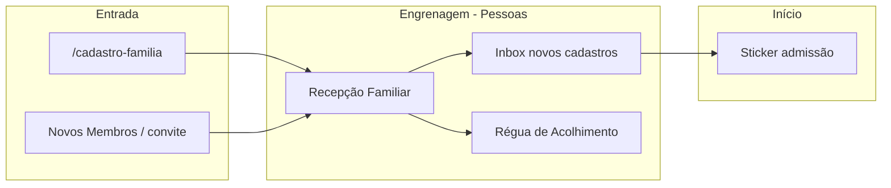
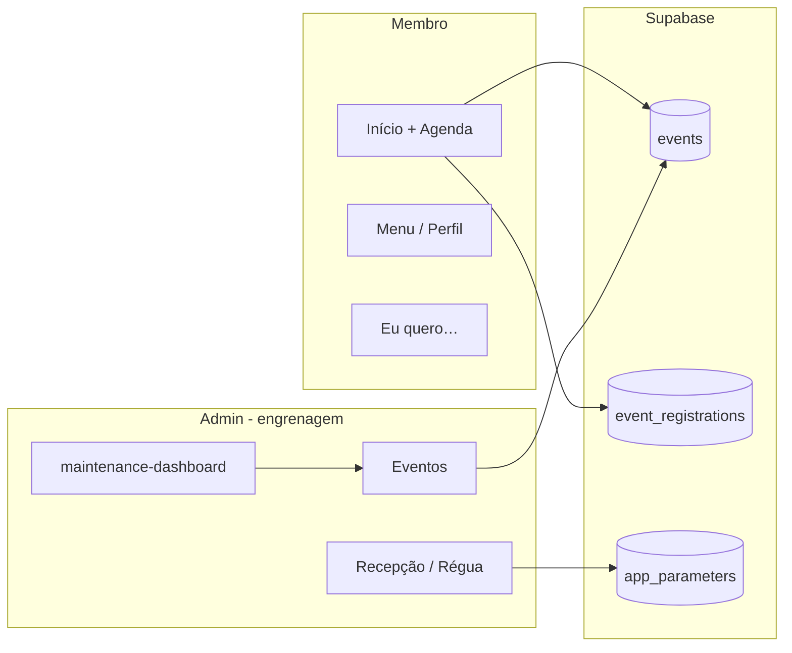

# Manutenção como ecossistema vivo

Proposta de atuação do **administrador** no módulo de manutenção, alinhada ao Conecta+ publicado em **05/10/2026**: **Início + menu + Eu quero… + engrenagem** (sem carrossel do Painel).

**Pacotes:** [`PACOTE_6_MANUAL_MANUTENCAO.md`](PACOTE_6_MANUAL_MANUTENCAO.md) · [`PACOTE_2_OPERACAO.md`](PACOTE_2_OPERACAO.md) · [`MANUAL_DASHBOARD_MANUTENCAO.md`](MANUAL_DASHBOARD_MANUTENCAO.md) · **Índice:** [`INDICE_DOCUMENTACAO.md`](INDICE_DOCUMENTACAO.md)

**Atualizado em:** 05/10/2026

---

## 1. Papel do administrador

O administrador **alimenta o pulso da igreja no app** pela **engrenagem** (ícone no Início, visível conforme ACL) — não pelo carrossel congelado `/(tabs)/dashboard`.

| Papel | O que mantém vivo |
|--------|-------------------|
| **Curador de eventos** | Programação visível no Início, capacidade, salas, geofence, totem |
| **Operador de recepção** | **Recepção Familiar**, **Novos Membros**, convites, fila `/cadastro-familia` |
| **Guardião do acolhimento** | **Régua de Acolhimento** (D+1/D+4/D+8) após visitante efetivo aceito |
| **Operador de salas** | Espaço Infantil — check-in entrada/saída no dia do culto |
| **Guardião pastoral** | **Cuidados Pastorais**; **Mudança de Papéis** |
| **Governança** | Controle de Acesso, **Gestão Liberada**, instâncias, billing |
| **Auditoria** | **Modo Ghost** (identidade efetiva); **Acessos de Usuários** *(super_admin)* |

Fonte de verdade dos grupos: `APP_DRAWER_SETTINGS_ITEMS` em `lib/appDrawerMenu.ts` — **Operação e Segurança**, **Gestão de Pessoas**, **Culto e Eventos**, **Finanças e Inteligência**, **Governança e TI**.

---

## 2. Multi-tenant

- Cada sessão carrega um **`tenant_id`** (igreja ativa). Eventos, recepção, régua, finanças, documentos e ACL são **isolados por instância**.
- Usuário em mais de uma igreja passa por **Selecionar igreja**; troca invalida caches dependentes do tenant.
- Formulário público **`/cadastro-familia`** exige tenant no link — evita cadastro na igreja errada.
- **Super Administrador** gerencia instâncias em **Instâncias (Igrejas)**; **Gestão Liberada** (por tenant) permite operar sem plano Stripe ativo quando a igreja está em implantação ou contrato especial.

---

## 3. Recepção e régua (fluxo resumido)

```mermaid
flowchart LR
  subgraph entrada [Entrada]
    CF["/cadastro-familia"]
    NM["Novos Membros / convite"]
  end
  subgraph engrenagem [Engrenagem - Pessoas]
    RF[Recepção Familiar]
    IN[Inbox novos cadastros]
    RG[Régua de Acolhimento]
  end
  subgraph inicio [Início]
    ST[Sticker admissão]
  end
  CF --> RF
  NM --> RF
  RF --> IN
  RF --> RG
  IN --> ST
```

1. Submissão pública ou convite entra na **fila** da Recepção Familiar.
2. Secretaria processa/rejeita; visitante efetivo aceito pode iniciar **Régua** (WhatsApp D+1, célula D+4, ligação D+8).
3. Pendências aparecem no **sticker** do Início (prioridade recepção → Mudança de Papéis).

Detalhe ponta a ponta: [`docs/PROCESSO_RECEPCAO_FAMILIAR.md`](docs/PROCESSO_RECEPCAO_FAMILIAR.md).

---

## 4. Rotina recomendada

### Diária (culto)

1. Engrenagem → **Programação de Eventos** — evento do dia (local, capacidade, salas, geofence/totem).
2. **Sala(s) - Check In** — acompanhar entrada/saída infantil.
3. Recepção: sticker / **Recepção Familiar** / tarefas da **Régua**.

### Semanal

- Cadastrar cultos e eventos com antecedência.
- Revisar **Manutenção de Avisos** (faixa do Início).
- Conferir parâmetros críticos (`chave_pix`, geofence, `cel_totem`, LGPD) em **Controle de Acesso**.

### Pós-deploy

- Executar scripts pendentes em `scripts/` (ver [`CHECKLIST_VALIDACAO_POS_DEPLOY.md`](CHECKLIST_VALIDACAO_POS_DEPLOY.md)).
- Smoke test: Início, sticker, tenant, Ghost sem bounce indevido, PIN por e-mail.

---

## 5. Mapa técnico (membro × admin)

```mermaid
flowchart LR
  subgraph membro [Membro]
    I[Início + Agenda]
    M[Menu / Perfil]
    EQ[Eu quero…]
  end
  subgraph admin [Admin - engrenagem]
    MD[maintenance-dashboard]
    EV[Eventos]
    RF2[Recepção / Régua]
  end
  subgraph supabase [Supabase]
    EVt[(events)]
    ER[(event_registrations)]
    AP[(app_parameters)]
  end
  I --> EVt
  MD --> EV
  EV --> EVt
  I --> ER
  RF2 --> AP
```

---

## 6. Sinais de ecossistema “doente”

| Sintoma | Provável causa | Ação |
|---------|----------------|------|
| Evento não aparece no Início | `is_locked`, data passada ou visibilidade | Revisar Programação de Eventos |
| Geofence não confirma | Sem audiência, sem coordenadas ou fora da janela | Agenda + locais favoritos + parâmetros |
| Visitante “some” após domingo | Régua não iniciada ou papel já promovido | Recepção + Régua + papéis |
| Dados de outra igreja | Tenant errado na sessão | Selecionar igreja / link público com tenant |
| Equipe presa em billing | Gestão Liberada desligada e sem Stripe | SA liga **Gestão Liberada** no Controle de Acesso |

---

## 7. Resumo executivo

O administrador mantém o ecossistema **publicando eventos e avisos**, **operando recepção e régua**, **configurando parâmetros por tenant** e **usando a engrenagem agrupada por ACL**. O membro vive o **Início**; a operação não depende mais do carrossel do Painel. Próximo passo de maturidade operacional: validar cada release com o checklist pós-deploy e a planilha por papel (`pdfs/CHECKLIST_VALIDACAO_POR_PAPEL.xlsx`).
