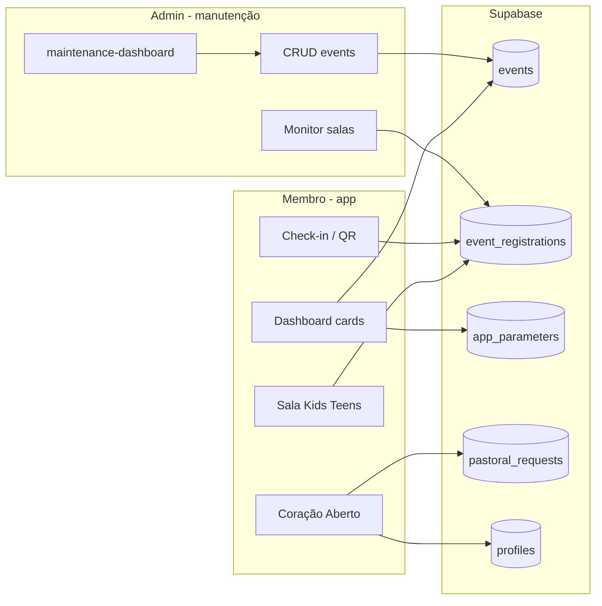

# Pacote 2 — Operação da Igreja

Documentação **autocontida** para secretaria, eventos, salas Kids/Teens e líderes de escala.

**Atualizado em:** 12/06/2026

Conteúdo integrado: Manutenção como ecossistema · Missão B4 (escalas) · Card Agenda · FAQ Totem/Manutenção

---

# Parte 1 — Manutenção como ecossistema vivo

---

# Manutenção como ecossistema vivo

Proposta de atuação do **administrador** no módulo de manutenção (`maintenance-dashboard`), alinhada ao que o app-igreja já entrega: eventos, salas Kids/Teens, parâmetros globais, Coração Aberto (pedidos pastorais), escalas e cards do dashboard.

**Pacotes:** [`PACOTE_6_MANUAL_MANUTENCAO.md`](PACOTE_6_MANUAL_MANUTENCAO.md) (passo a passo) · [`PACOTE_2_OPERACAO.md`](PACOTE_2_OPERACAO.md) (ecossistema) · **Índice:** [`INDICE_DOCUMENTACAO.md`](INDICE_DOCUMENTACAO.md)

**Atualizado em:** 12/06/2026

---

## 1. Papel do administrador

O administrador não “mexe no banco” no dia a dia. Ele **alimenta o pulso da igreja no app** através de intervenções curtas e recorrentes, sempre pelo fluxo de manutenção (ícone de engrenagem no rodapé do dashboard).

| Papel | O que mantém vivo |
|--------|-------------------|
| **Curador de eventos** | Agenda visível, capacidade, salas, ofertas no evento |
| **Operador de salas** | Monitoramento Kids/Teens no dia do culto |
| **Configurador** | Parâmetros (`app_parameters`) que ligam/desligam cards |
| **Guardião pastoral** | Card **Cuidado Pastoral** na manutenção; **Mudança de Papéis** para visitante/congregado/membro |
| **Operador de recepção** | Fila **Recepção Familiar** do formulário público `/cadastro-familia/` |

O membro usa o app com PIN; o admin usa as mesmas regras de negócio, com permissão de escrita em `events` e parâmetros.

---

## 2. Mapa do ecossistema (hoje)

---

## 3. Rotina recomendada de intervenção

### Diária (dia de culto / evento)

1. **Abrir manutenção** → conferir lista “Eventos cadastrados”.
2. **Evento do dia**
   - Data/hora e local corretos.
   - `kids_room` / `teens_room` conforme programação.
   - `max_capacity` atualizada (evita contagem errada no card SALA).
   - `parm_ofertas` se houver coleta no app.
   - Evento **não** bloqueado (`is_locked` = falso), salvo encerramento.
3. **Aba / card Monitor de salas** (no próprio maintenance)
   - Selecionar o evento ativo.
   - Acompanhar entradas Kids/Teens (refresco manual ao focar a tela — sem polling agressivo).
4. **Após o culto** (opcional)
   - Bloquear evento (`is_locked`) ou arquivar na política da igreja.

### Semanal

1. **Próximos eventos** — cadastrar cultos, conferências, retiros com 7–15 dias de antecedência.
2. **Parâmetros globais** (via SQL ou painel futuro em `app_parameters`):
   - `QRCode_Ativo` — exibe ou oculta card Check-in (eventos **sem** totem).
   - `check_In_Automatico` — com totem ativo no evento: card Check-in só aparece se valor = `nao` (check-in manual + QR + confirmação no totem).
   - `cel_totem` — celular **exclusivo** do tablet totem: senha **9999**, sem cadastro/LGPD/perfil; só `/totem-checkin` (não usar esse número em `profiles`; ver `scripts/app-parameter-cel-totem.sql`).
   - `chave_pix` — card Dízimos e Ofertas.
   - `psw_user` / `psw_mngr` — regras do PIN (já em `profiles-access-pin.sql`).
3. **Categorias pastorais** — se novos motivos forem aprovados em reunião pastoral, rodar `pastoral-request-categories.sql` (não é tela de manutenção ainda).

### Mensal

1. Revisar eventos antigos abertos (limpeza / `is_locked`).
2. Conferir se scripts RLS/RPC novos foram aplicados após deploy do app (checklist abaixo).
3. Amostragem de pedidos em `pastoral_requests` (hoje via Table Editor ou painel futuro).

---

## 4. Campos críticos em `events` (manutenção)

| Campo | Impacto no ecossistema |
|--------|-------------------------|
| `name`, `event_date`, `event_local` | Cards, seleção de evento, SALA |
| `max_capacity` | Vagas restantes no monitor |
| `kids_room`, `teens_room` | Abas Kids/Teens no card SALA e no maintenance |
| `parm_ofertas` | Contexto do evento (ofertas no culto); o card “Dízimos e Ofertas” no dashboard permanece **sempre visível** |
| `is_locked` | Evento some do check-in / lista ativa |
| `totem_ativo` | Inscrição na audiência gera `checkins.status = pre_checkin`; totem confirma via QR |
| `is_visible` / regras em `eventVisibility` | Quem vê o evento para inscrição |

**Boas práticas**

- Um evento “principal” por janela de tempo evita confusão no seletor do card SALA.
- Alterou capacidade ou salas → salvar e pedir à equipe que **reabra** o card SALA (pull-to-refresh implícito ao mudar de card).

---

## 5. Scripts SQL — checklist pós-deploy

Executar no Supabase quando atualizar o app:

| Script | Função |
|--------|--------|
| `events-totem-ativo.sql` | Coluna `events.totem_ativo` |
| `events-requer-quorum.sql` | Coluna `events.requer_quorum` |
| `checkins-totem-flow.sql` | Tabela `checkins`, RPCs totem (fonte única), patch `register_member_atomic` |
| `events-quorum-registry.sql` | Tabela `event_quorum_registry` + `sync_quorum_registry_for_registration` (após totem) |
| `escalas-multi-vagas.sql` | Colunas `vagas_por_servico` e `modo_ciclo`; remove limite 1 servo/domingo |
| `escalas-integrity-constraints.sql` | Limite por vagas + validação domingo (I3) |
| `escalas-apply-cycle-batch.sql` | `aplicar_ciclo_escala` + `get_scale_cycle_context` |
| `escalas-tipos-maintenance-rpc.sql` | CRUD tipos com vagas e modo do ciclo |
| `access-control-lider-escala.sql` | ACL por tipo de escala (papel `lider`) |
| `access-control-map-screen.sql` | Tela `/mapa-geolocalizacao` no ACL (I12) |
| `profiles-sync-address-from-cep-rpc.sql` | RPC canônica de CEP/endereço (I14) |
| `events-maintenance-rls.sql` | Admin grava/apaga eventos |
| `sync-managed-member-profile-family-rpc.sql` | RPC `accept_managed_member_into_family` (transferência/aceite familiar) |
| `pastoral-request-categories.sql` | Motivos/submotivos Coração Aberto |
| `pastoral-requests-fields.sql` | Insert pedidos + `profile_id` |
| `pastoral-requests-history.sql` | Histórico “Meus pedidos” |
| `profiles-access-pin.sql` | Login PIN |
| `financials-maintenance-rpc.sql` | Carga/exclusão em lote com versão REALIZADO/PLANEJADO |
| `expense-reports-schema.sql` | Tabelas `expense_reports` / `expense_items` |
| `expense-reports-rpc.sql` | Criar, conciliar, listar período, desconciliar RD |

Sem o histórico pastoral, o membro vê lista vazia mesmo com pedidos gravados.

**Ordem totem/quórum (C6):** `events-totem-ativo` → `events-requer-quorum` → `checkins-totem-flow` → `events-quorum-registry`. Reexecutar `checkins-totem-flow` não remove hooks de quórum.

**Ordem escalas (multi-vagas):** `escalas-multi-vagas` → `escalas-integrity-constraints` → `escalas-apply-cycle-batch` → `escalas-tipos-maintenance-rpc` → (se ACL) `access-control-lider-escala`.

---

## 6. Evolução desejada do módulo manutenção

Prioridade sugerida para tornar o ecossistema **autossuficiente** (menos SQL manual):

| Fase | Entrega admin | Benefício |
|------|----------------|-----------|
| **A** | Tela “Parâmetros do app” (`QRCode_Ativo`, `chave_pix`, textos) | Cards reagem sem SQL |
| **B** | Atalho “Duplicar evento” | Agenda semanal mais rápida |
| **C** | Painel pastoral (lista `pastoral_requests`, status, responsável) | Coração Aberto fecha o ciclo |
| **D** | Notificações (opcional) | Admin alertado em pedido sigiloso novo |
| **E** | Auditoria (`updated_at`, quem alterou) | Confiança e suporte |

---

## 7. Sinais de ecossistema “doente”

| Sintoma | Provável causa | Ação admin/técnica |
|---------|----------------|------------------|
| Card SALA vazio no **dashboard do membro** | Nenhum membro **da família dele** inscrito no evento, ou `family_id` não identificado | Marcar audiência da família; conferir cadastro. Na **manutenção**, o monitor mostra todos os inscritos |
| Card SALA sem crianças na **manutenção** | RPC `get_event_registrations_by_status` desatualizada | Rodar migrations / refetch |
| Check-in não aparece | `QRCode_Ativo` = nao (sem totem) ou totem ativo com `check_In_Automatico` ≠ nao | Ajustar parâmetros / totem do evento |
| Pedido pastoral “some” | RPC histórico não criada | `pastoral-requests-history.sql` |
| Evento não lista | `is_locked` ou data fora da janela de visibilidade | Revisar evento na manutenção |
| App lento no dashboard | Muitos polls/consultas (mitigado em 2025) | Manutenção sem polling duplicado; cards pesados só ao abrir |

---

## 8. Otimizações já aplicadas no app (performance)

- Polling de eventos: **8s** (antes 2s), pausa em segundo plano.
- Manutenção / monitor salas: **sem polling**; atualiza ao focar a tela (sem `refetch` no blur).
- Inscrições Kids/Teens: busca só com card **SALA** ativo; refetch **silencioso** se já há dados.
- Pré-check-in: refetch silencioso no foco (índice e dashboard) — evita piscar ao trocar tela.
- Perfil/ACL no foco: atualiza estado só quando os dados mudam de fato.
- Aniversariantes, lista de membros, escalas: carga **na primeira visita** ao card.
- `app_parameters`: cache em memória **5 min**.
- Datas de nascimento da família: leitura de `profiles` em **lote** (não N+1).
- Marca d'água renderizada **atrás** do conteúdo (menos flicker visual).

---

## 9. Métricas simples de sucesso

- Tempo para publicar um novo culto na manutenção: meta **&lt; 2 min**.
- Eventos ativos com data futura sempre **≥ 1**.
- Pedidos pastorais com `profile_id` preenchido: **100%** (pós `pastoral-requests-fields.sql`).
- Zero intervenção SQL semanal para parâmetros (após fase A).

---

## 10. Resumo executivo

O administrador mantém o ecossistema vivo **cadastrando e ajustando eventos**, **configurando parâmetros que ligam os cards**, **monitorando salas no dia D** e **conciliando relatórios de despesas (RD)**. O carrossel de manutenção abre em um **card menu** com etiquetas dos módulos (como o Índice do Aplicativo no dashboard do membro). O próximo salto de maturidade é trazer **parâmetros e pastoral** para dentro da manutenção, eliminando idas ao SQL Editor e fechando o ciclo “pedido → acompanhamento → resposta”.

---

# Parte 2 — Missão B4: Escalas em equipe (Manual de Treinamento)

---

3. Escreva seu pedido e toque em **Enviar pedido**.

---

### Missão B4 — Escalas em equipe: vagas por domingo e ciclo em bloco *(staff / líder de escala)*

> **Quem pode fazer:** perfil com acesso à **Manutenção** e permissão nos cards de escala (`Tipos de Escala`, `Servos em Disponibilidade`, `Programação de Escalas`). Se você não vê a engrenagem no Painel, pule esta missão.

#### Objetivo da Missão
Configurar um tipo de escala com **várias vagas no mesmo domingo** (ex.: vigilância com 4 servos) e gerar a programação automaticamente no modo **equipe**.

#### Caminho
**Painel** → ícone **engrenagem** (Manutenção) → **Tipos de Escala** → **Servos em Disponibilidade** → **Programação de Escalas** → conferir no card **Escalas** do Painel.

#### Ação prática — Parte A: Configurar o tipo de escala

1. No **Painel**, toque no ícone de **engrenagem** para abrir a **Manutenção**.
2. Abra o card **Tipos de Escala**.
3. Cadastre um tipo novo **ou** edite um existente (ex.: `vigilancia_estacionamento` / **Vigilância Estacionamento**).
4. Em **Vagas por domingo**, informe quantos servos podem atuar na mesma data — use **4** neste exercício (aceita de 1 a 50).
5. Em **Modo do ciclo em bloco**, selecione **Equipe** (em vez de Individual).
   - **Individual:** cada servo em domingo distinto no ciclo automático.
   - **Equipe:** o ciclo preenche até N servos no **mesmo** domingo antes de avançar para o próximo.
6. Toque em **Cadastrar** ou **Salvar alterações** e aguarde a confirmação na tela.

#### Ação prática — Parte B: Preparar os servos

1. Na Manutenção, abra **Servos em Disponibilidade**.
2. Selecione o **mesmo tipo de escala** que você acabou de configurar.
3. Confira se há servos **ativos** com **ordem sequencial** definida (1, 2, 3, 4…).
   - Sem ordem, o ciclo em bloco **não gera** a prévia — ajuste a ordem antes de continuar.
4. Se faltar servo, cadastre e defina a ordem na lista.

#### Ação prática — Parte C: Gerar o ciclo em equipe

1. Abra **Programação de Escalas** na Manutenção.
2. Selecione o tipo de escala configurado (chip/radio no topo do card).
3. Toque em **Escala em bloco**.
4. Leia a **prévia** (título *Prévia — escala em bloco*): com modo **equipe** e 4 vagas, você deve ver **até 4 servos na mesma data** antes de passar ao domingo seguinte.
5. Confira a mensagem de resumo (quantidade de escalas, domingos e ordem sequencial).
6. Toque em **Gravar bloco** e confirme no diálogo para aplicar via `aplicar_ciclo_escala`.
7. Aguarde o toast de sucesso com a quantidade de escalas gravadas.

#### Ação prática — Parte D: Validar no Painel

1. Volte ao **Painel** (sair da Manutenção se necessário).
2. Deslize até o card **Escalas**.
3. Selecione o tipo de escala que você programou.
4. Verifique se **o mesmo domingo** lista **vários nomes** (até o limite de vagas configurado).
5. Toque no ícone **WhatsApp** ao lado de um servo, se houver telefone — confirme que o contato abre corretamente.

#### O que acontece nos bastidores
O app consulta `get_scale_cycle_context` (ocupação por data, vagas e modo) e monta a prévia em `gerarCicloCompleto`. Ao confirmar, grava tudo de uma vez em `escalas_log` pela RPC `aplicar_ciclo_escala` — se uma entrada falhar, **nenhuma** é salva (transação).

#### Dica Pro
Use **modo equipe** para vigilância, recepção ou estacionamento (vários no mesmo culto). Use **modo individual** para intercessão ou funções em que cada servo serve em domingos alternados. O **registro manual** na Programação de Escalas também respeita o limite de vagas — o mesmo servo **não** pode repetir na mesma data.

> **Se a prévia falhar**  
> - *"sem ordem_sequencial"* — defina a ordem em **Servos em Disponibilidade**.  
> - *"Calendário saturado"* — há muitas datas futuras já ocupadas; revise escalas existentes ou reduza servos no ciclo.  

---

# Parte 3 — Manual do Card 1: Agenda da Família

---

# Manual de Instrucoes - Card 1 do Dashboard

**Pacotes:** [`PACOTE_5_MANUAL_PAINEL.md`](PACOTE_5_MANUAL_PAINEL.md) (membro) · [`PACOTE_2_OPERACAO.md`](PACOTE_2_OPERACAO.md) (operação) · **Índice:** [`INDICE_DOCUMENTACAO.md`](INDICE_DOCUMENTACAO.md)

**Atualizado em:** 22/05/2026

## Objetivo

O Card 1 do dashboard foi desenvolvido para concentrar, em uma unica area, a selecao do evento ativo, a visualizacao de vagas e o registro da audiencia da familia.

Este card permite:

- visualizar o evento atualmente em evidencia;
- verificar data, horario e local do evento;
- identificar se o evento possui `IBN Kids` e/ou `IBN Teens`;
- acompanhar a ocupacao de vagas pelo indicador em formato de copo;
- trocar rapidamente entre eventos ativos;
- registrar ou remover individualmente os membros da familia no evento selecionado;
- marcar ou desmarcar todos os membros de uma vez.

## Estrutura do Card

O card esta dividido em tres blocos principais:

### 1. Evento Selecionado

Nesta area aparecem:

- nome do evento em destaque;
- data e horario formatados;
- local do evento;
- identificadores `IBN Kids` e `IBN Teens`, quando aplicavel.

Se nenhum evento estiver selecionado, o card exibira a mensagem:

`Selecione um evento.`

### 2. Vagas

Ao lado do evento selecionado existe um indicador visual em formato de copo.

Ele mostra:

- o numero de vagas restantes entre parenteses;
- a relacao `inscritos/total de vagas`;
- o preenchimento visual proporcional da ocupacao.

Interpretacao:

- quanto mais cheio o copo, maior a ocupacao do evento;
- o valor entre parenteses representa as vagas restantes;
- a linha inferior mostra quantos participantes ja estao registrados.

### 3. Trocar Evento

Esta faixa exibe os eventos ativos disponiveis.

Cada item pode mostrar:

- nome do evento;
- data/hora;
- indicadores coloridos quando houver `kids_room` ou `teens_room`.

Ao tocar em um evento desta lista:

1. ele passa a ser o evento em evidencia;
2. o bloco superior e atualizado;
3. o contador de vagas e recalculado;
4. a audiencia da familia passa a atuar sobre esse evento.

### 4. Audiencia

A parte inferior do card mostra a audiencia da familia vinculada ao usuario logado.

Nesta area:

- cada linha representa um membro da familia;
- o nome do membro aparece sem parentesco;
- cada item possui um checkbox para registrar ou remover a participacao;
- quando o membro ja estiver inscrito, o item indica `Registrado para o evento`.

No cabecalho da audiencia existe um checkbox geral para:

- marcar todos os membros;
- desmarcar todos os membros.

## Como Usar

### Registrar participantes

1. Abra o dashboard.
2. No Card 1, confira qual evento esta em evidencia.
3. Se necessario, use a secao `Trocar Evento` para selecionar outro evento.
4. Na secao `Audiencia`, toque no checkbox ao lado do nome do membro desejado.
5. Aguarde a confirmacao visual do registro.

Resultado esperado:

- o membro fica marcado;
- o texto `Registrado para o evento` aparece;
- o contador de vagas e atualizado.

### Remover participantes

1. Localize o membro ja marcado na audiencia.
2. Toque novamente no checkbox.

Resultado esperado:

- o membro deixa de ficar marcado;
- o registro e removido do evento;
- o contador de vagas e ajustado automaticamente.

### Registrar ou remover todos

1. No topo da secao `Audiencia`, use o checkbox geral.
2. Se todos estiverem desmarcados, a acao registra todos.
3. Se todos estiverem marcados, a acao remove todos.

## Regras de Funcionamento

### Eventos exibidos

O card apresenta apenas:

- eventos do dia atual;
- eventos futuros;
- eventos desbloqueados/ativos.

Eventos antigos permanecem no banco para historico, mas nao aparecem no Card 1.

### Indicadores `IBN Kids` e `IBN Teens`

Quando o evento possuir suporte a criancas ou adolescentes:

- `IBN Kids` aparece com destaque amarelo;
- `IBN Teens` aparece com destaque vermelho.

Esses indicadores aparecem:

- no bloco do evento selecionado;
- na lista de troca de eventos;
- no card de `Check In`, vinculado ao mesmo evento em evidencia.

### Atualizacao das vagas

Sempre que um membro e registrado ou removido:

- o total de inscritos e recalculado;
- o numero de vagas restantes e atualizado;
- o copo muda visualmente conforme a ocupacao.

## Navegacao no Dashboard

O dashboard nao depende mais de arraste lateral.

Para navegar entre os cards, utilize os botoes inferiores:

- `<` para voltar;
- `Sair` para encerrar a sessao;
- `>` para avancar.

## Integracao com o Card de Check In

O evento selecionado no Card 1 tambem alimenta o card de `Check In`.

No card de `Check In` sao refletidos:

- o nome do evento em evidencia;
- os badges `IBN Kids` e `IBN Teens`, quando existirem.

Isso garante que o evento selecionado no Card 1 seja o mesmo contexto visual do QR Code.

## Mensagens Possiveis

Durante o uso, algumas mensagens podem aparecer:

- `Erro ao carregar evento.`
- `Nenhum evento no momento.`
- `Selecione um evento para registrar participantes.`
- `Família não vinculada.`
- `Carregando participantes já registrados...`

## Resumo Operacional

Fluxo recomendado de uso:

1. Escolher o evento em `Trocar Evento`;
2. Confirmar nome, horario, local e indicadores do evento;
3. Conferir vagas disponiveis no copo;
4. Marcar ou desmarcar participantes da audiencia;
5. Avancar ao card de `Check In` quando necessario.

---

# Parte 4 — FAQ: Totem e Manutenção (equipe)

---

A equipe pastoral **fora do app** (telefone, encontro pessoal, etc.). O app registra e encaminha o pedido.

---

## 15. Termos LGPD

**Por que preciso rolar até o fim dos termos?**  
Requisito de **consentimento informado** — o sistema só libera o aceite após leitura completa.

**Posso mudar de ideia depois?**  
O aceite fica em `lgpd_accepted` no perfil. Para revisar, acesse **LGPD** ou **Dados Cadastrais**.

**Recusei os termos. Posso usar o app?**  
Depende da política da igreja; o app registra sua preferência. Alguns recursos podem ficar limitados.

---

## 16. Menu, navegação e saída

**Qual a diferença entre Menu e Sair?**  
No **Painel**, **Menu** leva aos atalhos. O **Sair** / **Encerrar sessão** fica na tela de atalhos (rodapé).

**Sair fecha o app no Android?**  
Pode encerrar o aplicativo após limpar a sessão — comportamento esperado.

**Troquei de celular. O que faço?**  
**Saia** no aparelho antigo; no novo, login com celular + senha.

**Mudaram minhas permissões e um card sumiu.**  
Saia e **entre de novo** para recarregar permissões do servidor.

---

## 17. Totem de check-in

**O totem é para membros usarem no culto?**  
Não. É um **aparelho fixo da igreja** operado na entrada para **escanear** o QR das famílias.

**Senha do totem.**  
**9999** (configuração padrão do modo totem).

**Nenhum evento no totem.**  
Pode não ser o dia do evento, evento não publicado, sem flag totem/quórum, ou colunas SQL não aplicadas — mensagens na tela orientam.

