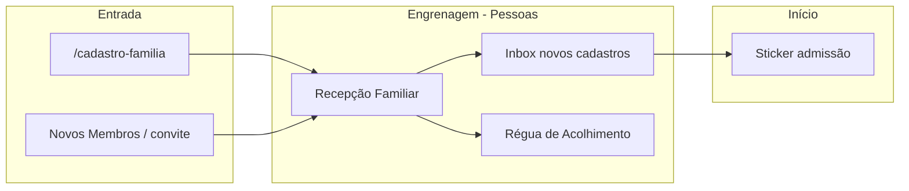
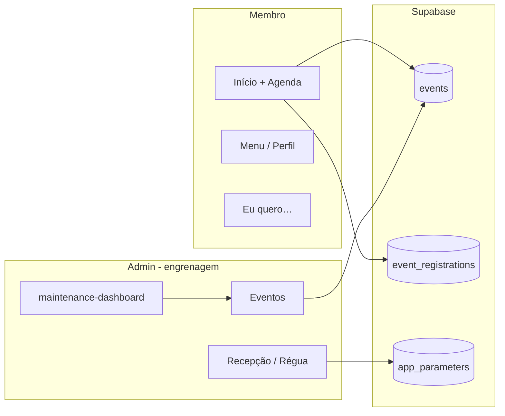

# Pacote 2 — Operação da Igreja

Documentação **autocontida** para secretaria, eventos, salas Kids/Teens e líderes de escala.

**Atualizado em:** 05/10/2026

Conteúdo integrado: Manutenção como ecossistema · Escalas · Agenda · FAQ operacional

---

# Parte 1 — Manutenção como ecossistema vivo

---

# Manutenção como ecossistema vivo

Proposta de atuação do **administrador** no módulo de manutenção, alinhada ao Conecta+ publicado em **05/10/2026**: **Início + menu + Eu quero… + engrenagem** (sem carrossel do Painel).

**Pacotes:** [`PACOTE_6_MANUAL_MANUTENCAO.md`](PACOTE_6_MANUAL_MANUTENCAO.md) · [`PACOTE_2_OPERACAO.md`](PACOTE_2_OPERACAO.md) · [`MANUAL_DASHBOARD_MANUTENCAO.md`](MANUAL_DASHBOARD_MANUTENCAO.md) · **Índice:** [`INDICE_DOCUMENTACAO.md`](INDICE_DOCUMENTACAO.md)

**Atualizado em:** 05/10/2026

---

## 1. Papel do administrador

O administrador **alimenta o pulso da igreja no app** pela **engrenagem** (ícone no Início, visível conforme ACL) — não pelo carrossel congelado `/(tabs)/dashboard`.

| Papel | O que mantém vivo |
|--------|-------------------|
| **Curador de eventos** | Programação visível no Início, capacidade, salas, geofence, totem |
| **Operador de recepção** | **Recepção Familiar**, **Novos Membros**, convites, fila `/cadastro-familia` |
| **Guardião do acolhimento** | **Régua de Acolhimento** (D+1/D+4/D+8) após visitante efetivo aceito |
| **Operador de salas** | Espaço Infantil — check-in entrada/saída no dia do culto |
| **Guardião pastoral** | **Cuidados Pastorais**; **Mudança de Papéis** |
| **Governança** | Controle de Acesso, **Gestão Liberada**, instâncias, billing |
| **Auditoria** | **Modo Ghost** (identidade efetiva); **Acessos de Usuários** *(super_admin)* |

Fonte de verdade dos grupos: `APP_DRAWER_SETTINGS_ITEMS` em `lib/appDrawerMenu.ts` — **Operação e Segurança**, **Gestão de Pessoas**, **Culto e Eventos**, **Finanças e Inteligência**, **Governança e TI**.

---

## 2. Multi-tenant

- Cada sessão carrega um **`tenant_id`** (igreja ativa). Eventos, recepção, régua, finanças, documentos e ACL são **isolados por instância**.
- Usuário em mais de uma igreja passa por **Selecionar igreja**; troca invalida caches dependentes do tenant.
- Formulário público **`/cadastro-familia`** exige tenant no link — evita cadastro na igreja errada.
- **Super Administrador** gerencia instâncias em **Instâncias (Igrejas)**; **Gestão Liberada** (por tenant) permite operar sem plano Stripe ativo quando a igreja está em implantação ou contrato especial.

---

## 3. Recepção e régua (fluxo resumido)

```mermaid
flowchart LR
  subgraph entrada [Entrada]
    CF["/cadastro-familia"]
    NM["Novos Membros / convite"]
  end
  subgraph engrenagem [Engrenagem - Pessoas]
    RF[Recepção Familiar]
    IN[Inbox novos cadastros]
    RG[Régua de Acolhimento]
  end
  subgraph inicio [Início]
    ST[Sticker admissão]
  end
  CF --> RF
  NM --> RF
  RF --> IN
  RF --> RG
  IN --> ST
```

1. Submissão pública ou convite entra na **fila** da Recepção Familiar.
2. Secretaria processa/rejeita; visitante efetivo aceito pode iniciar **Régua** (WhatsApp D+1, célula D+4, ligação D+8).
3. Pendências aparecem no **sticker** do Início (prioridade recepção → Mudança de Papéis).

Detalhe ponta a ponta: [`docs/PROCESSO_RECEPCAO_FAMILIAR.md`](docs/PROCESSO_RECEPCAO_FAMILIAR.md).

---

## 4. Rotina recomendada

### Diária (culto)

1. Engrenagem → **Programação de Eventos** — evento do dia (local, capacidade, salas, geofence/totem).
2. **Sala(s) - Check In** — acompanhar entrada/saída infantil.
3. Recepção: sticker / **Recepção Familiar** / tarefas da **Régua**.

### Semanal

- Cadastrar cultos e eventos com antecedência.
- Revisar **Manutenção de Avisos** (faixa do Início).
- Conferir parâmetros críticos (`chave_pix`, geofence, `cel_totem`, LGPD) em **Controle de Acesso**.

### Pós-deploy

- Executar scripts pendentes em `scripts/` (ver [`CHECKLIST_VALIDACAO_POS_DEPLOY.md`](CHECKLIST_VALIDACAO_POS_DEPLOY.md)).
- Smoke test: Início, sticker, tenant, Ghost sem bounce indevido, PIN por e-mail.

---

## 5. Mapa técnico (membro × admin)

```mermaid
flowchart LR
  subgraph membro [Membro]
    I[Início + Agenda]
    M[Menu / Perfil]
    EQ[Eu quero…]
  end
  subgraph admin [Admin - engrenagem]
    MD[maintenance-dashboard]
    EV[Eventos]
    RF2[Recepção / Régua]
  end
  subgraph supabase [Supabase]
    EVt[(events)]
    ER[(event_registrations)]
    AP[(app_parameters)]
  end
  I --> EVt
  MD --> EV
  EV --> EVt
  I --> ER
  RF2 --> AP
```

---

## 6. Sinais de ecossistema “doente”

| Sintoma | Provável causa | Ação |
|---------|----------------|------|
| Evento não aparece no Início | `is_locked`, data passada ou visibilidade | Revisar Programação de Eventos |
| Geofence não confirma | Sem audiência, sem coordenadas ou fora da janela | Agenda + locais favoritos + parâmetros |
| Visitante “some” após domingo | Régua não iniciada ou papel já promovido | Recepção + Régua + papéis |
| Dados de outra igreja | Tenant errado na sessão | Selecionar igreja / link público com tenant |
| Equipe presa em billing | Gestão Liberada desligada e sem Stripe | SA liga **Gestão Liberada** no Controle de Acesso |

---

## 7. Resumo executivo

O administrador mantém o ecossistema **publicando eventos e avisos**, **operando recepção e régua**, **configurando parâmetros por tenant** e **usando a engrenagem agrupada por ACL**. O membro vive o **Início**; a operação não depende mais do carrossel do Painel. Próximo passo de maturidade operacional: validar cada release com o checklist pós-deploy e a planilha por papel (`pdfs/CHECKLIST_VALIDACAO_POR_PAPEL.xlsx`).

---

# Parte 2 — Escalas (Manual de Treinamento)

---

# Manual de Treinamento — Conecta+

Treinamento prático em missões para membros, famílias, voluntários e equipes. Execute cada missão no ambiente da sua igreja.

**Atualizado em:** 05/10/2026
**Navegação publicada:** **Início + menu lateral + Eu quero… + Perfil + engrenagem**. Não use o antigo carrossel do Painel como roteiro.

---

## Antes de começar

- Confira nome/logo da igreja ativa.
- Tenha acesso ao e-mail cadastrado: primeiro PIN e recuperação são enviados por e-mail.
- Itens variam por papel e ACL; não ver uma opção pode ser comportamento correto.
- Em aparelho compartilhado, encerre a sessão ao terminar.

---

## Missão 1 — Entrar pela primeira vez

**Caminho:** Boas-vindas → celular → Continuar → Receber código por e-mail → PIN.

1. Digite o celular com DDD.
2. Toque em **Continuar**.
3. Se ainda não possui PIN, solicite o código por e-mail.
4. Confira caixa de entrada, spam e promoções.
5. Digite os quatro dígitos.
6. Se o usuário participa de várias igrejas, selecione a instância correta.

**Validação:** o app abre cadastro, LGPD ou Início conforme o estado do perfil. WhatsApp não entrega PIN.

---

## Missão 2 — Concluir cadastro e LGPD

**Caminho:** onboarding → Cadastro/LGPD.

1. Confira telefone, nome e nascimento.
2. Informe CEP e dados solicitados.
3. Com LGPD ativo, leia o texto da igreja até o fim.
4. Registre aceite/recusa e selfie quando exigido.
5. Confirme o cadastro.
6. Depois, abra **Menu → Perfil → Dados Cadastrais** e revise contato/endereço.

Com LGPD inativo, o fluxo é simplificado. A configuração vale por igreja.

---

## Missão 3 — Reconhecer a navegação

No **Início**, identifique:

- Próximos Eventos e avisos;
- bolo de aniversários, quando houver celebração no dia;
- faixa **Eu quero…**;
- Abigail, quando autorizada;
- sticker amarelo de novos registros, apenas para equipe autorizada.

Abra o **menu lateral** e localize Perfil, Financeiro, Documentos oficiais, Minha Célula, Escalas, murais, Apoio Mútuo, Sugestões, ajuda, redes e Sobre. Abra e feche sem alterar dados.

Se houver autorização, abra a **engrenagem** e reconheça os grupos, sem executar ações destrutivas.

---

## Missão 4 — Agenda da Família

**Caminho:** Início → tocar em evento → Agenda da Família.

1. Escolha evento publicado.
2. Confira data, horário, local e vagas.
3. Marque os integrantes em **Audiência**.
4. Adicione o compromisso ao calendário quando disponível.
5. Em evento com Espaço Infantil, abra o QR de entrada/saída.
6. Em evento de quórum/totem, apresente o QR conforme orientação.

**Resultado:** inscrições são atualizadas. Geofence, quando configurado e autorizado, pode confirmar presença dentro da janela e do raio.

---

## Missão 5 — Contribuir

**Caminho:** Início → Eu quero… → Contribuir.

1. Escolha Dízimos e Ofertas, Campanhas e Projetos ou Primícias.
2. Confira recebedor e igreja.
3. Informe valor/item quando solicitado.
4. Copie a chave PIX ou instrução identificada.
5. Conclua no banco.

O Conecta+ não debita automaticamente a conta.

---

## Missão 6 — Cuidado Pastoral

**Caminho:** Início → Eu quero… → Cuidado Pastoral.

1. Escolha motivo, situação, beneficiário e destino.
2. Escreva o pedido sem dados desnecessários.
3. Envie e abra **Meus pedidos**.
4. Em pedido novo, use Excluir se disponível.
5. Se o acompanhamento já começou, use **Solicitar cancelamento**, justifique e aguarde análise.

A exclusão final de pedido acompanhado é confirmada por Super Administrador no painel pastoral.

---

## Missão 7 — Perfil e família

**Caminho:** Menu → Perfil.

Pratique:

1. **Dados Cadastrais:** revisar endereço, e-mail e PIN.
2. **Gerenciar Família:** conferir integrantes, parentescos e código familiar.
3. **Carteirinha Digital:** abrir QR permanente.
4. **Ofereço meus Serviços:** conhecer a publicação no Apoio Mútuo.
5. **Trilha de Discipulado:** abrir progresso e conquistas.
6. **Reembolsos:** iniciar um RD somente se houver despesa real e autorização.

Não remova representante legal nem transfira pessoa entre famílias como teste.

---

## Missão 8 — Menu do membro

Abra, conforme sua permissão:

- **Documentos oficiais:** consultar documento publicado;
- **Apoio Mútuo:** categoria → pessoa → cartão;
- **Minha Célula:** conferir vínculo;
- **Escalas:** conferir datas e equipe;
- **Murais:** ler oportunidade/doação;
- **Como faço…?:** localizar artigo de ajuda.

A ausência de conteúdo pode significar que a igreja ainda não publicou registros.

---

## Missão 9 — Espaço Infantil

### Família
1. Inscreva a criança na Agenda.
2. Abra o QR familiar.
3. Apresente na entrada.
4. Na retirada, apresente novamente.
5. Confira estado **Na sala** ou **Liberado**.

### Equipe
1. Abra **Engrenagem → Culto e Eventos → Sala(s) - Check In**.
2. Selecione evento/sala.
3. Leia o QR e confirme identidade da família/criança.
4. Registre entrada.
5. Na retirada, valide o vínculo e registre saída.

Confira alertas alimentares, necessidades específicas e observações sem expor dados a pessoas não autorizadas.

---

## Missão 10 — Recepção e acolhimento (equipe)

1. Abra **Recepção Familiar**.
2. Em **Novos Membros**, selecione pessoa já cadastrada.
3. Confira `family_id` e celular pré-preenchido no convite.
4. Na fila, revise telefone, nascimento, CEP, família e conflitos.
5. Processe somente lote válido.
6. Abra a inbox de novos cadastros e marque o item tratado.
7. Na Régua, confirme que apenas visitante efetivo recebeu D+1/D+4/D+8.
8. Observe o sticker: Recepção tem prioridade; depois, Mudança Papéis filtrada em Visitante.

Não use a régua para membro ou congregado.

---

## Missão 11 — Escalas (líder)

**Caminho:** Engrenagem → Culto e Eventos.

1. Em **Tipos de Escala**, configure vagas e modo individual/equipe.
2. Em **Servos em Disponibilidade**, associe voluntários e ordem.
3. Em **Programação de Escalas**, gere prévia.
4. Confira datas, vagas e duplicidades.
5. Aplique o bloco apenas depois da revisão.
6. Valide em **Menu → Escalas** com um usuário autorizado.

---

## Missão 12 — Governança (administrador)

1. Confirme igreja ativa.
2. Abra **Controle de Acesso** e reconheça App Ativo, Gestão Liberada e LGPD.
3. Revise papéis e grants sem usar PIN/senha como dado administrativo.
4. Teste **Modo Ghost** com perfil de teste: iniciar leva ao Início uma vez; depois a navegação permanece na rota escolhida.
5. Encerre Ghost e confirme retorno à identidade real.
6. Confira **Assinaturas**; Gestão Liberada remove o paywall, mas não concede ACL.

Gestor de Controle de Acesso nunca pode ver Super Administrador, seus logs ou credenciais.

---

## Missão 13 — Encerrar sessão

1. Abra o menu.
2. Toque em **Encerrar sessão/Sair do aplicativo**.
3. Confirme retorno à tela de login ou site configurado pela igreja.
4. Em totem/aparelho compartilhado, verifique que a sessão anterior não é restaurada.

---

## Checklist final

- [ ] Entrei com PIN recebido por e-mail.
- [ ] Confirmei a igreja ativa.
- [ ] Concluí cadastro/LGPD conforme configuração.
- [ ] Usei Início, menu, Eu quero… e Perfil.
- [ ] Abri evento e marquei audiência.
- [ ] Entendi QR/totem/geofence e Espaço Infantil.
- [ ] Sei abrir e acompanhar Cuidado Pastoral.
- [ ] Sei onde ficam documentos, escalas e Apoio Mútuo.
- [ ] Equipe: revisei Recepção, inbox, régua e sticker.
- [ ] Administração: entendi ACL, Ghost, billing e Gestão Liberada.
- [ ] Encerrei sessão com segurança.

---

## Solução rápida de problemas

| Situação | Ação |
|---|---|
| PIN não chegou | Conferir e-mail/spam e endereço cadastrado |
| Item não aparece | Conferir papel/grant; sair e entrar após mudança |
| Evento não aparece | Confirmar publicação, período e tenant |
| QR não confirma | Conferir audiência, evento, família e fluxo do totem |
| Criança não aparece | Conferir parentesco, evento, sala e inscrição |
| Régua nasceu para membro | Interromper e revisar papéis/patch do visitante efetivo |
| Ghost volta ao Início | Reportar regressão; só entrada/saída devem redirecionar automaticamente |
| Cobrança bloqueia | Conferir assinatura, instância ativa e Gestão Liberada |

*Conecta+ · Manual de Treinamento · revisão de 05/10/2026.*

---

# Parte 3 — Agenda da Família

---

# Manual — Agenda da Família (Início)

**Pacotes:** [`PACOTE_5_MANUAL_PAINEL.md`](PACOTE_5_MANUAL_PAINEL.md) (membro) · [`PACOTE_2_OPERACAO.md`](PACOTE_2_OPERACAO.md) (operação) · **Índice:** [`INDICE_DOCUMENTACAO.md`](INDICE_DOCUMENTACAO.md)

**Atualizado em:** 05/10/2026

> O antigo **Card 1** do carrossel `/(tabs)/dashboard` está **congelado** e fora da publicação. A experiência publicada é **Início** (`/(tabs)`) → toque em **Próximos Eventos** → modal **Agenda da Família** (`FamilyAgendaModal`).

## Objetivo

Concentrar, em um único fluxo a partir do Início, a seleção do evento, a visualização de vagas e o registro da audiência da família — incluindo integração com geofence, totem, salas Kids/Teens, Google Agenda e arquivo `.ics`.

Este fluxo permite:

- escolher o culto ou evento a partir da lista publicada no Início;
- verificar data, horário e local;
- identificar selos de salas (**Kids** / **Teens**) quando o evento as habilita;
- acompanhar ocupação de vagas (quando o evento tem capacidade);
- registrar ou remover individualmente integrantes do núcleo familiar;
- marcar ou desmarcar todos de uma vez (quando permitido);
- adicionar o compromisso ao **Google Agenda** ou baixar **`.ics`** (Apple Calendar / Outlook), no fuso da igreja (`America/Sao_Paulo`).

## Estrutura do modal

### 1. Evento selecionado

- nome do evento;
- data e horário;
- local;
- indicadores de salas, quando aplicável.

Se nenhum evento estiver selecionado, a mensagem orienta a escolher um item em **Próximos Eventos** no Início.

### 2. Vagas

Quando o evento possui `max_capacity`:

- vagas restantes;
- relação inscritos / total;
- indicador visual de ocupação.

Eventos sem capacidade definida não exibem contador de copo — a audiência continua disponível.

### 3. Trocar evento

Lista eventos ativos (hoje e futuros, desbloqueados). Ao tocar:

1. o evento passa a ser o contexto da audiência;
2. vagas e selos são recalculados;
3. check-in (geofence/totem) passa a referir-se a esse evento.

### 4. Audiência

Integrantes elegíveis do núcleo (**membro** / **congregado** e dependentes reconhecidos). Cada linha tem checkbox; inscritos exibem confirmação visual. Modo **quórum** restringe marcação individual após confirmação no totem.

## Como usar

### Registrar participantes

1. Abra **Início** (`/(tabs)`).
2. Toque no evento em **Próximos Eventos**.
3. No modal, confira evento, local e horário; troque de evento se necessário.
4. Marque os integrantes na **Audiência** (ou use o checkbox geral).
5. Aceite **Adicionar** no diálogo de agenda para Google Agenda / `.ics`.

**Resultado esperado:** pré-check-in registrado; vagas atualizadas; geofence e totem reconhecem a audiência no dia do evento.

### Remover participantes

Desmarque o checkbox do integrante (respeitando travas de quórum e check-in já confirmado).

## Regras de funcionamento

### Eventos exibidos no Início

- eventos do dia e futuros, publicados e não bloqueados (`is_locked`);
- filtrados por visibilidade e tenant da igreja ativa.

### Geofence e totem

- **Geofence:** exige audiência prévia, local favorito com coordenadas, flag `geofence_ativo` e parâmetros de raio/janela.
- **Totem:** confirma quem já está na audiência; QR/carteirinha em **Perfil**.

### Modo Ghost

Com auditoria ativa, família, telefone e permissões seguem o **perfil-alvo**; o operador real não substitui o alvo na audiência.

## Integração operacional (engrenagem)

| Necessidade | Onde configurar |
|-------------|-----------------|
| Criar/editar evento, capacidade, salas, geofence | **Programação de Eventos** |
| Coordenadas do templo | **Locais favoritos** / `event_local` |
| Presença oficial / quórum | **Presença** |
| Check-in no hall | **Totem de check-in** |

## Mensagens comuns

- Erro ao carregar evento / família não vinculada
- Selecione um evento para registrar participantes
- Carregando participantes já registrados…

## Resumo operacional

1. Publicar evento na engrenagem.
2. Membro abre **Início** e toca no evento.
3. Marca audiência da família.
4. No culto: geofence e/ou totem confirmam presença conforme regras do evento.

*Não treinar o carrossel legado do Painel — use sempre Início + Agenda da Família.*

---

# Parte 4 — FAQ operacional

---

# Perguntas e Respostas — Conecta+

FAQ do ambiente publicado para membros, famílias e equipes de gestão.

**Atualizado em:** 05/10/2026

Documentação relacionada: [Manual do membro](MANUAL_DASHBOARD_MEMBRO.md) · [Manual da engrenagem](MANUAL_DASHBOARD_MANUTENCAO.md)

---

## Navegação atual

### O Conecta+ ainda usa o Painel antigo em carrossel?

Não como caminho publicado. A experiência atual é:

- **Início** para eventos, avisos, aniversários do dia, Abigail e ações rápidas;
- **menu lateral** para módulos permanentes;
- **Eu quero…** para ações como Contribuir e Cuidado Pastoral;
- **Perfil** para dados, família, Carteirinha Digital e jornada pessoal;
- **engrenagem** para gestão autorizada.

Os cards do carrossel antigo estão congelados. Links antigos, quando suportados, redirecionam para a rota dedicada correspondente.

### Como abro a Agenda da Família?

No **Início**, toque no culto em **Próximos Eventos**.

### Onde ficam ofertas e cuidado pastoral?

- **Início → Eu quero… → Contribuir**
- **Início → Eu quero… → Cuidado Pastoral**

### Onde ficam meus dados e o QR permanente?

Abra **Menu → Perfil**. A **Carteirinha Digital** aparece logo abaixo de **Gerenciar Família**.

### O que encontro em cada item do menu lateral?

- **Início:** eventos, avisos, bolo, Abigail e atalhos;
- **Perfil:** dados, família, Carteirinha, Trilha, serviços e reembolsos permitidos;
- **Financeiro:** informações financeiras autorizadas;
- **Documentos oficiais:** arquivos institucionais publicados;
- **Minha Célula:** dados do pequeno grupo;
- **Escalas:** programação pessoal de serviço;
- **Mural de Oportunidades:** oportunidades de voluntariado;
- **Mural de Generosidade:** doações e pedidos moderados;
- **Apoio Mútuo:** serviços oferecidos pela comunidade;
- **Sugestões, Como faço…?, Redes Sociais e Sobre:** comunicação e ajuda.

### Por que não vejo uma opção?

Os itens respeitam papel e ACL. Se sua função mudou, saia e entre novamente. Se continuar ausente, peça ao responsável pelo Controle de Acesso que confira o grant.

Antes de solicitar suporte, informe a igreja ativa, o nome exato da opção ausente e se você já encerrou e iniciou a sessão novamente. Não envie PIN.

---

## Login, PIN e e-mail

### Como entro pela primeira vez?

Informe o celular, toque em **Continuar** e solicite **Receber código por e-mail**. Digite o PIN temporário de quatro dígitos enviado.

### O PIN chega por WhatsApp?

Não. O primeiro PIN e o PIN de recuperação são enviados por **e-mail**. WhatsApp pode ser usado em convites, contatos e avisos, mas não no fluxo de autenticação.

### Esqueci minha senha. O que faço?

1. Informe o celular.
2. Toque em **Continuar**.
3. No passo do PIN, toque em **Esqueci minha senha**.
4. Confirme o e-mail e responda à pergunta de segurança, quando solicitada.
5. Use o novo PIN recebido por e-mail.

### O botão “Esqueci minha senha” não aparece.

Ele aparece no segundo passo, depois que o celular foi informado.

### O código não chegou.

Confira:

1. se o e-mail está correto;
2. spam, lixo eletrônico e abas de promoções;
3. se a caixa está cheia;
4. se a equipe configurou corretamente o remetente de e-mail da instância.

### Posso usar o mesmo celular em mais de uma igreja?

Sim. A mesma pessoa ou aparelho pode estar associado a mais de uma instância. O app usa a igreja ativa escolhida pelo link, QR ou seleção de instância. Confira sempre o nome/logo antes de operar.

---

## Cadastro, família e LGPD

### Por que preciso rolar o texto LGPD?

Quando o módulo está ativo, o app exige leitura até o fim antes do reconhecimento.

### O texto LGPD é igual em todas as igrejas?

Não necessariamente. O Super Admin pode manter o **Texto de consentimento LGPD por instância** em **Engrenagem → Controle de Acesso**.

### O que muda quando LGPD está inativo?

O cadastro fica simplificado e não exige a tela formal de consentimento nem selfie obrigatória daquele fluxo. A decisão vale para a igreja ativa.

### Como adiciono uma criança sem celular?

Abra **Menu → Perfil → Gerenciar Família → Adicionar integrante**. A criança pode participar da Agenda e do Espaço Infantil sem possuir login próprio.

Antes de salvar, informe nome completo, nascimento e parentesco. Se a criança já aparecer em outra família, não crie duplicidade: peça à Recepção Familiar ou à secretaria para revisar o vínculo.

### Onde encontro o QR da família?

Em **Menu → Perfil → Carteirinha Digital**. Em evento com criança elegível, a Agenda também oferece **Espaço Infantil | Check-In / Check-Out QR**.

---

## Início, aniversários e Abigail

### O que é o bolo ao lado de Próximos Eventos?

É o aviso de aniversário pessoal ou de casamento do dia. Toque para ver os nomes e, quando autorizado, copiar a mensagem sugerida.

### O bolo não aparece.

Ele só aparece quando existe aniversário do dia nos dados permitidos ao seu perfil.

### O que é a Abigail?

É a assistente do Conecta+. Para perfis autorizados, fica no Início, ao lado de **Eu quero…**. Ela responde com base no contexto da igreja ativa e nas permissões disponíveis.

### A Abigail substitui atendimento pastoral?

Não. Ela ajuda com informações e organização. Emergências, aconselhamento e decisões sensíveis devem seguir os canais humanos apropriados.

---

## Agenda e Espaço Infantil

### Como inscrevo minha família em um culto?

Abra **Início → toque no culto → Agenda da Família** e marque os integrantes em **Audiência**.

### Como faço check-in da criança?

1. Abra a Agenda do evento.
2. Marque a criança.
3. Toque em **Espaço Infantil | Check-In / Check-Out QR**.
4. Apresente o QR na recepção da sala.
5. A equipe lê o código para registrar entrada e, depois, saída.

### O botão do Espaço Infantil não aparece.

Ele depende de criança elegível na família, sala ativa no evento e configuração do culto. Confira também se existe código familiar.

### O que significam “Na sala” e “Liberado”?

- **Na sala:** a equipe confirmou a entrada.
- **Liberado:** a equipe registrou a retirada/saída.

### Posso usar o QR da Carteirinha?

Sim, o QR permanente da Carteirinha identifica a família e pode ser lido pelos fluxos autorizados.

---

## Cuidado Pastoral

### Como envio um pedido?

Abra **Início → Eu quero… → Cuidado Pastoral**, preencha motivo, situação, beneficiário, destino e descrição e toque em **Enviar pedido**.

### Onde acompanho?

Em **Meus pedidos**. Os estágios são **Acolher**, **Apoiar** e **Acompanhar**, além dos estados inicial e encerrado.

### Posso excluir um pedido que já está sendo acompanhado?

Não diretamente. Toque em **Solicitar cancelamento**, informe a justificativa e envie. A equipe vê a solicitação.

### Quem confirma o cancelamento?

O **super_admin** abre **Engrenagem → Cuidados Pastorais**. Quando existe uma solicitação válida, o botão **Excluir** aparece ao lado de **Acompanhar**. O Super Admin lê a justificativa e confirma a exclusão.

### Por que o botão Excluir não aparece para a equipe pastoral?

Porque a confirmação destrutiva é reservada ao **super_admin** e só aparece quando o membro solicitou cancelamento.

### Um pedido novo pode ser apagado?

Pode haver exclusão direta antes do início do cuidado, conforme a regra atual. Depois que o acompanhamento começa, use **Solicitar cancelamento**.

---

## Documentos oficiais

### Onde vejo documentos da igreja?

Em **Menu → Documentos oficiais**.

### A tela está vazia.

A igreja pode ainda não ter publicado documentos, ou seu papel pode não ter acesso.

### Os documentos são da igreja ativa?

Sim. Confirme a instância antes de consultar ou compartilhar.

---

## Apoio Mútuo

### O que é?

É a vitrine de serviços oferecidos por pessoas da comunidade da igreja.

### Como encontro um serviço?

Abra **Menu → Apoio Mútuo**, pesquise, abra o cartão e use os contatos permitidos.

### Como ofereço meu serviço?

Abra **Menu → Perfil → Ofereço meus Serviços**, preencha o cartão, ative **Publicar no Apoio Mútuo** e salve.

Depois, abra **Menu → Apoio Mútuo**, pesquise seu cartão e confira descrição e contato. Se não aparecer, volte ao Perfil, confirme que a publicação está ativa e salve novamente.

### O Conecta+ garante o serviço?

Não. Valor, prazo, qualidade, contratação e responsabilidade são combinados diretamente entre as pessoas.

---

## Recepção e novos membros

### O que é o sticker amarelo de Novos Membros?

É uma etiqueta retrátil na lateral do Início para avisar que há novos registros aguardando admissão.

### Para quem o sticker aparece?

- **super_admin:** sempre; quando não há pendências, mostra “Não há pendências de novos registros”;
- **secretaria/pastoral:** somente quando há pendência;
- demais perfis: não aparece, salvo regra expressamente concedida.

### Para onde o sticker leva?

- Se existe pendência na **Recepção Familiar**, essa fila tem prioridade.
- Caso contrário, se há novo visitante, abre **Mudança Papéis** já filtrada em **Visitante**.

### O que é Recepção Familiar?

É o módulo que envia convite familiar e processa formulários públicos antes de criar/atualizar perfis e membros.

### Como usar “Novos Membros” dentro da Recepção?

1. Abra **Engrenagem → Recepção Familiar**.
2. Toque em **Novos Membros**.
3. Use a busca Enxergar.
4. Selecione um membro já cadastrado.
5. O convite levará o código da família selecionada.

### O que devo revisar na fila?

Nome, telefone, CEP, nascimento, integrantes, duplicidades e conflitos de código familiar. Registros com data provisória, CEP ausente ou conflito devem ser corrigidos antes da gravação.

### O que é a Régua de Acolhimento?

É o acompanhamento posterior da recepção com etapas como D+1, D+4 e D+8.

### Posso colocar membros na Régua?

Não. A Régua é somente para **visitante**. Ao mudar para congregado ou membro, encerre o acompanhamento de visitante.

---

## Busca Enxergar

### O que é Enxergar?

É o padrão em que a lista filtrada abre em um modal no topo enquanto você digita. Isso facilita ver e escolher resultados em telas pequenas.

### Enxergar muda a forma de pesquisar?

Não. O critério continua sendo o da tela — nome, telefone, código e quantidade mínima de letras. Muda apenas a apresentação da lista filtrada.

### Onde ele aparece?

Entre outros pontos, em seleções de pessoas no Controle de Acesso, Mudança Papéis, Atribuições, Recepção Familiar e Acesso Usuários.

---

## Controle de Acesso e Gestão Liberada

### O que significa App Ativo?

Controla a disponibilidade geral da aplicação na instância. Se ficar inativo, a mensagem de indisponibilidade configurada é exibida.

### O que significa Gestão Liberada?

Com **Gestão Liberada**, o paywall comercial é desligado para toda a instância e a operação não exige uma assinatura Stripe ativa.

### Gestão Liberada dá acesso a todos os módulos?

Não. Ela remove o bloqueio comercial, mas não altera papéis, grants ou ACL.

### Qual é a diferença entre App Ativo, Gestão Liberada e LGPD Ativo?

| Controle | O que altera | O que não altera |
|---|---|---|
| **App Ativo** | Disponibilidade geral da aplicação na igreja | Papéis individuais |
| **Gestão Liberada** | Exigência comercial/paywall da instância | Grants e permissões |
| **LGPD Ativo** | Fluxo formal de consentimento no cadastro | Assinatura e acesso administrativo |

Antes de mudar qualquer switch, confirme a igreja ativa e o impacto para toda a instância.

### Quem altera Gestão Liberada?

O controle fica no cabeçalho de **Engrenagem → Controle de Acesso** para o perfil autorizado.

### Quem pode ver Acesso Usuários?

Somente **super_admin**. O Gestor de Controle de Acesso não deve ver perfil, ações, logs ou credenciais do Super Administrador.

---

## Modo Ghost

### O que é?

É a simulação do app usando a identidade efetiva de outro perfil para auditoria.

### Por que o Ghost não deve voltar ao Início ao abrir uma rota?

Porque a finalidade é testar a navegação real do alvo. Depois de iniciado, o Ghost deve entrar e permanecer na rota escolhida, inclusive quando a ACL do alvo não possui grant.

### Quando o Ghost pode ir automaticamente ao Início?

Somente:

1. ao iniciar, uma vez, já como o alvo;
2. ao encerrar, de volta à identidade real.

Também pode ocorrer quando o operador toca explicitamente em Fechar, Voltar ao Início ou Sair do Ghost.

### O Super Admin real fura as permissões do alvo?

Não. O bypass do operador fica desligado para telas e dados durante a simulação.

### O Ghost usa a assinatura do alvo?

Não. Paywall, instância e cobrança continuam vinculados ao operador e à igreja ativa.

---

## Totem e múltiplas igrejas

### O mesmo celular pode ser totem em mais de uma igreja?

Sim. O mesmo número pode estar cadastrado em várias instâncias. A sessão deve entrar pela igreja correta, determinada pelo QR, link ou seleção ativa.

### Como evitar check-in na igreja errada?

1. Abra o QR/link da instância correta.
2. Confira nome e identidade visual.
3. Entre com o celular e o PIN do totem.
4. Confirme o evento mostrado antes de iniciar a leitura.
5. Encerre a sessão ao terminar.

### O totem diz “Pré-check-in não encontrado”.

A família precisa marcar audiência no evento correto antes da leitura, salvo fluxo específico do Espaço Infantil/visitante.

### A câmera não funciona.

No navegador, use HTTPS e permita câmera. Feche outras aplicações que possam estar usando o sensor.

---

## Eventos, escalas e financeiro

### Evento rascunho aparece no Início?

Não. Somente evento publicado.

### Como replico o culto?

Na Programação de Eventos, abra um evento existente e use a ação de replicar em +7 dias, quando disponível. Revise antes de publicar.

### Onde o membro vê escalas?

Em **Menu → Escalas**. A equipe programa na engrenagem.

### Como peço reembolso?

Abra **Menu → Perfil → Reembolsos**, crie um RD, informe chave PIX, itens e comprovantes e finalize.

### O PIX no Conecta+ debita minha conta?

Não. O app apresenta os dados; a confirmação financeira ocorre no aplicativo do banco ou no fluxo do provedor exibido.

---

## Segurança e solução de problemas

### Mudaram meu papel, mas a tela não apareceu.

Saia e entre novamente para recarregar a sessão e a ACL.

### A tela abriu vazia.

Confirme:

1. igreja ativa;
2. acesso do papel;
3. existência de registros naquela instância;
4. conexão com a internet.

Depois, retire filtros muito restritivos, recarregue uma vez e refaça o login. Ao pedir suporte, informe tela, horário, filtro utilizado e mensagem exibida; não envie PIN, chave Gemini nem dados bancários.

### Posso compartilhar dados do diretório?

Somente dentro da finalidade autorizada pela igreja e pela política de privacidade.

### O app substitui serviços de emergência?

Não. Em risco imediato, use SAMU 192, Polícia 190, Bombeiros 193 ou o serviço local apropriado.

### Como saio com segurança?

Abra o menu e toque em **Encerrar sessão/Sair do aplicativo**, especialmente em aparelho compartilhado, totem ou computador público.

---

*Conecta+ · FAQ · revisão de 05/10/2026*

