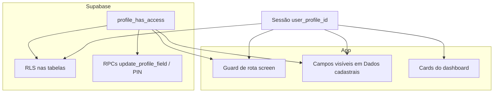
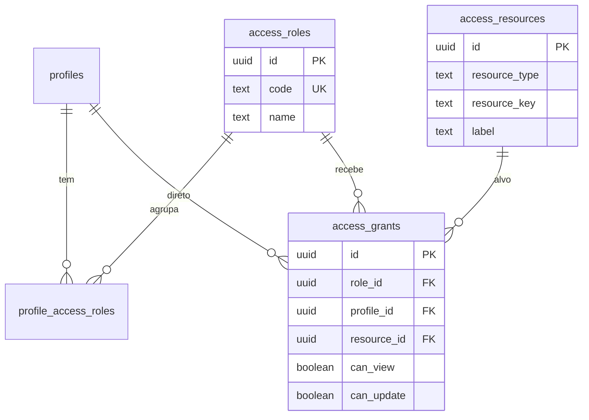
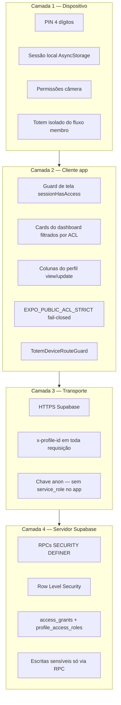
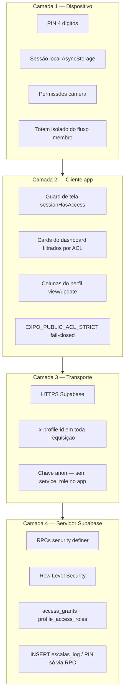
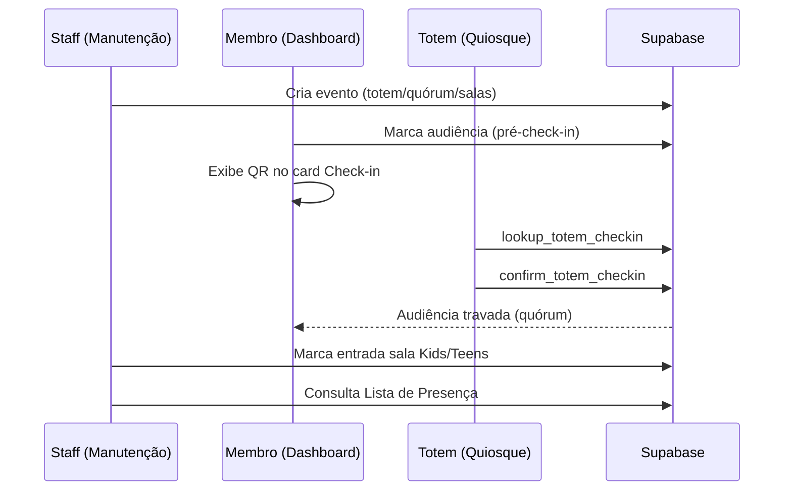

# Pacote 3 — Governança, Permissões e TI

Documentação **autocontida** para super administrador, TI e desenvolvedor.

**Atualizado em:** 10/06/2026

Conteúdo integrado: Manual operacional ACL · Modelo de controle de acesso · Camadas de segurança · Blueprint completo

---

# Parte 1 — Manual operacional de Controle de Acesso

---

# Manual operacional — Controle de acesso (app-igreja)

Este manual descreve **como operar** o controle de acesso no dia a dia: instalação, atribuição de papéis, ajuste de permissões, testes e resolução de problemas.

Documentação técnica de referência: [`CONTROLE_ACESSO.md`](CONTROLE_ACESSO.md) · [`CAMADAS_SEGURANCA.md`](CAMADAS_SEGURANCA.md)

**Pacote:** [`PACOTE_3_GOVERNANCA_TI.md`](PACOTE_3_GOVERNANCA_TI.md) · **Índice:** [`INDICE_DOCUMENTACAO.md`](INDICE_DOCUMENTACAO.md)

**Atualizado em:** 10/06/2026

---

## 1. Para quem é este manual

| Público | Uso |
|---------|-----|
| **Super administrador** | Configura papéis e permissões pela UI ou SQL |
| **Equipe de TI / secretaria** | Atribui `events_admin`, `pastoral`, etc. a pessoas certas |
| **Desenvolvedor** | Instala scripts, valida RLS e RPCs após deploy |

---

## 2. Conceitos essenciais

### 2.1 Identidade

- O “usuário” do ACL é sempre **`profiles.id`** (UUID).
- Login no app: telefone + PIN de 4 dígitos (`profiles.access_pin`).
- Após o login, o app grava `user_profile_id` na sessão e envia o header **`x-profile-id`** ao Supabase.

### 2.2 Papéis (`access_roles`)

Um perfil pode ter **vários papéis** ao mesmo tempo (ex.: `member` + `events_admin`).

| Código | Nome | Uso típico |
|--------|------|------------|
| `visitantes` | Visitantes | Acesso público mínimo; **fallback** sem perfil na sessão ou perfil sem papéis |
| `congregado` | Congregado | Participante com acesso básico (sem gerenciar família) |
| `member` | Membro | Acesso padrão do aplicativo |
| `family_acceptor` | Responsável familiar | Gerencia família (complementar ao `member`) |
| `lider` | Líder | Gerencia servos e programação dos tipos de escala atribuídos ao perfil |
| `events_admin` | Administrador de eventos | Manutenção de eventos e salas |
| `pastoral` | Equipe pastoral | Triagem de pedidos pastorais |
| `super_admin` | Super administrador | Configura o ACL; acesso amplo |

**Ordem no painel (aba Papéis e lista de papéis do perfil):** Visitantes → Congregado → Membro → Responsável familiar → Líder → Administrador de eventos → Equipe pastoral → Super administrador.

### 2.4 Líder de escala (`lider`)

O papel **`lider`** permite gerenciar **tipos específicos** de escala (ex.: Vigilância, Recepção):

1. **Papéis** → ajuste grants do `lider` (painéis `maintenance.card.scale_volunteers` e `maintenance.card.scales`).
2. **Perfis** → atribua o papel **`lider`** ao perfil.
3. **Perfis** → na seção **Liderança por tipo de escala**, ligue os tipos que essa pessoa comanda.

Recursos por tipo: `screen:scale_type.<codigo>` (criados automaticamente a partir de `tipos_escala.codigo`).

Quem tem `maintenance.card.scale_types` (ou `super_admin`) cria/edita tipos; o líder só opera nos tipos vinculados.

**Script:** `scripts/access-control-lider-escala.sql`

**Regra:** todo perfil ativo deve manter pelo menos o papel **`member`**, salvo exceções administrativas explícitas.

**Fallback Visitantes:** quem **não tem `user_profile_id` na sessão** (antes do login) ou tem perfil **sem nenhum papel** em `profile_access_roles` recebe automaticamente os grants do papel **`visitantes`** — não é necessário atribuir esse papel manualmente na maioria dos casos.

### 2.3 Recursos (`access_resources`)

O que pode ser protegido:

| Tipo | Exemplo de chave | O que controla |
|------|------------------|----------------|
| `screen` | `/manage-profile` | Abrir uma tela ou card do dashboard |
| `table` | `profiles` | Leitura/gravação em uma tabela |
| `column` | `profiles.cpf` | Ver/editar um campo em Dados cadastrais |

Curingas (uso restrito):

- `screen:*` — todas as telas
- `table:*` — todas as tabelas
- `column:profiles.*` — todas as colunas de `profiles`

### 2.4 Permissões (`access_grants`)

Cada grant liga um **papel** (ou um perfil específico) a um **recurso**:

| Flag | Significado |
|------|-------------|
| `can_view` | Pode ver (tela, listagem, campo) |
| `can_update` | Pode alterar (formulário, UPDATE, RPC de escrita) |

**Importante:** `can_view` em `table:profiles` **não** libera automaticamente `profiles.cpf` ou `profiles.access_pin`. Colunas sensíveis exigem grants de coluna explícitos.

### 2.5 Onde a permissão é aplicada



---

## 3. Instalação e pré-requisitos (uma vez)

Execute no **SQL Editor do Supabase**, nesta ordem:

| Ordem | Script | O que faz |
|-------|--------|-----------|
| 1 | `scripts/access-control-schema.sql` | Tabelas, funções, seed inicial |
| 2 | `scripts/access-control-profile-write-rpc.sql` | ACL nas RPCs de perfil (9d) |
| 3 | `scripts/access-control-admin-rpc.sql` | UI admin de papéis/grants (9e) |
| 4 | `scripts/access-control-table-rls.sql` | RLS nas tabelas principais (9f) |

Scripts **incrementais** (se o seed for antigo ou algo sumir no app):

| Script | Quando usar |
|--------|-------------|
| `access-control-member-dashboard-grants.sql` | Cards do dashboard não aparecem para `member` |
| `access-control-member-profile-columns.sql` | CPF ou alertas alimentares não aparecem em Dados cadastrais |
| `access-control-lider-escala.sql` | Papel Líder, vínculo perfil↔tipo de escala e enforcement nas RPCs de escala |
| `access-control-role-display-order.sql` | Corrigir ordem dos papéis no painel (Visitantes → … → Super administrador) |
| `access-control-congregado-visitantes-roles.sql` | **Congregado e Visitantes não aparecem na UI** — cria ambos os papéis e grants |
| `access-control-congregado-role.sql` | Só Congregado (legado; prefira o script combinado acima) |
| `access-control-visitantes-role.sql` | Só Visitantes + funções de fallback (sem perfil/papéis) |

### 3.1 Primeiro super administrador

Todo ambiente precisa de **pelo menos um** perfil com papel `super_admin`:

```sql
-- Confirme quem já é super_admin
select p.full_name, p.phone, ar.code
  from public.profile_access_roles par
  join public.access_roles ar on ar.id = par.role_id
  join public.profiles p on p.id = par.profile_id
 where ar.code = 'super_admin';

-- Atribuir (troque o telefone)
insert into public.profile_access_roles (profile_id, role_id)
select p.id, ar.id
  from public.profiles p
 cross join public.access_roles ar
 where regexp_replace(coalesce(p.phone, ''), '\D', '', 'g')
     = regexp_replace('(11) 99999-9999', '\D', '', 'g')
   and ar.code = 'super_admin'
on conflict (profile_id, role_id) do nothing;
```

### 3.2 Garantir `member` em todos os perfis

```sql
insert into public.profile_access_roles (profile_id, role_id)
select p.id, ar.id
  from public.profiles p
 cross join public.access_roles ar
 where ar.code = 'member'
   and not exists (
     select 1
       from public.profile_access_roles par
      where par.profile_id = p.id
        and par.role_id = ar.id
   );
```

---

## 4. Operação pelo aplicativo (recomendado)

### 4.1 Quem pode abrir a manutenção de ACL

1. Perfil com papel **`super_admin`**.
2. Acesso à tela **Manutenção** (`/maintenance-dashboard`) — normalmente só `super_admin` ou quem tiver grant explícito nessa tela.
3. No carrossel de manutenção, o card **Controle de Acesso** só aparece para `super_admin`.

### 4.2 Aba **Perfis** — atribuir papéis a uma pessoa

**Objetivo:** definir *quem* é membro, quem cuida de eventos, quem é admin, etc.

**Passo a passo:**

1. Abra **Manutenção → Controle de Acesso → aba Perfis**.
2. Em **Buscar perfil**, digite nome, telefone ou código do membro (mínimo 2 caracteres).
3. Toque em **Buscar** e selecione o perfil na lista.
4. Na lista de papéis, use o **switch** para ligar ou desligar cada papel.
5. Confirme o toast de sucesso.

**Efeito:** alteração imediata em `profile_access_roles`.

**Regras de segurança:**

- O sistema **impede remover o último** `super_admin` do banco.
- Após mudar papéis de **si mesmo** ou de quem está testando, peça **Sair → entrar de novo** no app.

### 4.3 Aba **Papéis** — ajustar o que cada papel pode fazer

**Objetivo:** definir *o que* `member`, `events_admin`, etc. podem ver e editar.

**Passo a passo:**

1. Aba **Papéis**.
2. Selecione o papel (ex.: `member`, `events_admin`).
3. Filtre por **Telas**, **Tabelas** ou **Colunas**.
4. Para cada recurso, use:
   - **Ver** — `can_view`
   - **Editar** — `can_update` (só fica ativo se **Ver** estiver ligado)
5. Colunas sensíveis (`profiles.cpf`, `profiles.access_pin`) aparecem **destacadas em amarelo**.

**Desligar Ver e Editar** remove o grant daquele recurso para o papel.

**Exemplos de política:**

| Objetivo | Onde ajustar |
|----------|--------------|
| Membro não vê PIN | Papel `member` → Colunas → `profiles.access_pin` → Ver/Editar desligados |
| Só tesouraria vê financeiro | Tirar `dashboard.card.financial` e `/financial` do `member`; criar papel `finance_admin` (futuro) ou grant direto ao perfil |
| Equipe de eventos mantém agenda | Atribuir papel `events_admin` à pessoa (aba Perfis); revisar grants do papel em Telas/Tabelas |

### 4.4 O que o membro comum experiencia (sem ser admin)

| Área | Comportamento |
|------|---------------|
| Dashboard | Só cards com `can_view` no papel |
| Dados cadastrais | Só campos com grant de coluna; sem PIN se não houver grant |
| Telas (pastoral, família, financeiro) | Guard bloqueia com alerta se não houver `screen:*` view |
| Gravação de perfil | RPC + RLS validam de novo no servidor |

---

## 5. Operação via SQL (Table Editor ou SQL Editor)

Use quando a UI não estiver disponível, para diagnóstico ou carga em massa.

### 5.1 Consultar papéis de um perfil

```sql
select p.full_name, p.phone, ar.code, ar.name, par.granted_at
  from public.profiles p
  join public.profile_access_roles par on par.profile_id = p.id
  join public.access_roles ar on ar.id = par.role_id
 where regexp_replace(coalesce(p.phone, ''), '\D', '', 'g')
     = regexp_replace('(11) 99999-9999', '\D', '', 'g')
 order by ar.code;
```

### 5.2 Testar permissão (simula o app)

```sql
select public.profile_has_access(
  '<uuid-do-perfil>'::uuid,
  'screen',           -- ou 'table' ou 'column'
  '/financial',       -- ou 'profiles' ou 'profiles.cpf'
  'view'              -- ou 'update'
);
```

Simular header da sessão (RLS):

```sql
select set_config(
  'request.headers',
  '{"x-profile-id":"<uuid-do-perfil>"}',
  true
);
select public.session_has_resource_access('table', 'profiles', 'view');
```

### 5.3 Atribuir / remover papel

```sql
-- Atribuir events_admin
insert into public.profile_access_roles (profile_id, role_id)
select p.id, ar.id
  from public.profiles p
 cross join public.access_roles ar
 where p.id = '<uuid>'::uuid
   and ar.code = 'events_admin'
on conflict (profile_id, role_id) do nothing;

-- Remover events_admin
delete from public.profile_access_roles par
 using public.access_roles ar
 where par.role_id = ar.id
   and par.profile_id = '<uuid>'::uuid
   and ar.code = 'events_admin';
```

### 5.4 Ajustar grant de um papel

```sql
-- Ex.: member pode VER mas não EDITAR financeiro (tela)
insert into public.access_grants (role_id, resource_id, can_view, can_update)
select r.id, res.id, true, false
  from public.access_roles r
  join public.access_resources res
    on res.resource_type = 'screen'
   and res.resource_key = '/financial'
 where r.code = 'member'
on conflict (role_id, resource_id) where (role_id is not null) do update
  set can_view = excluded.can_view,
      can_update = excluded.can_update,
      updated_at = now();

-- Remover grant (desliga view e update)
delete from public.access_grants g
 using public.access_roles r, public.access_resources res
 where g.role_id = r.id
   and g.resource_id = res.id
   and r.code = 'member'
   and res.resource_type = 'screen'
   and res.resource_key = '/financial';
```

### 5.5 Grant excepcional a **um perfil** (sem mudar o papel)

Quando **uma pessoa** precisa de algo que o papel dela não tem:

```sql
insert into public.access_grants (profile_id, resource_id, can_view, can_update)
select '<uuid-perfil>'::uuid, res.id, true, false
  from public.access_resources res
 where res.resource_type = 'screen'
   and res.resource_key = '/maintenance-dashboard'
on conflict (profile_id, resource_id) where (profile_id is not null) do update
  set can_view = excluded.can_view,
      can_update = excluded.can_update,
      updated_at = now();
```

Use com moderação: grants por perfil são mais difíceis de auditar que grants por papel.

---

## 6. Cenários operacionais (receitas)

### 6.1 Atribuir papel Congregado (em vez de Membro)

Use para quem participa do app mas **não** é membro pleno nem responsável familiar.

1. Controle de Acesso → **Perfis** → buscar pessoa.
2. Ligar **`congregado`**; desligar **`member`** se não for membro pleno.
3. Ajustar grants em **Papéis → Congregado** (Telas / Colunas) conforme a política da igreja.
4. Pedir **Sair → entrar** no app.

**Diferença padrão vs `member`:** sem `/manage-members`, sem card lista de membros, sem financeiro, sem CPF/alertas alimentares no seed inicial.

### 6.2 Novo membro cadastrado no app

| Etapa | O que acontece | Ação do operador |
|-------|----------------|------------------|
| Cadastro | Cria linha em `profiles` | Nenhuma, se o seed aplicar `member` a todos automaticamente |
| Primeiro login | PIN + sessão | Nenhuma |
| Permissões | Herda grants do papel `member` | Revisar se a política da igreja está correta no papel `member` |

Se o membro não tiver papel `member`:

```sql
insert into public.profile_access_roles (profile_id, role_id)
select p.id, ar.id
  from public.profiles p
 cross join public.access_roles ar
 where p.id = '<uuid>'::uuid
   and ar.code = 'member'
on conflict do nothing;
```

### 6.3 Nomear responsável pela equipe de eventos

1. **App:** Controle de Acesso → Perfis → buscar pessoa → ligar **`events_admin`**.
2. **Verificar** grants do papel `events_admin` (aba Papéis → Telas: `/maintenance-dashboard`; Tabelas: `events`, `event_registrations`).
3. Pedir à pessoa: **Sair → entrar**.
4. Confirmar: engrenagem de manutenção visível; consegue abrir Programação de Eventos.

### 6.4 Restringir CPF e PIN apenas a administradores

1. Aba **Papéis** → `member` → **Colunas**.
2. Desligar **Ver** e **Editar** em:
   - `profiles.cpf`
   - `profiles.access_pin`
3. Manter ligado em `super_admin` (via curinga `*` ou grants explícitos).
4. Testar com perfil `member`: Dados cadastrais sem CPF/PIN; alteração de PIN falha no servidor.

### 6.5 Membro perdeu acesso a um card do dashboard

**Diagnóstico:**

```sql
select public.profile_has_access(
  '<uuid>'::uuid,
  'screen',
  'dashboard.card.financial',
  'view'
);
```

**Correção rápida:** executar `access-control-member-dashboard-grants.sql` ou religar o grant na aba Papéis → `member` → Telas.

### 6.6 Promover novo super administrador

1. Controle de Acesso → Perfis → buscar pessoa → ligar **`super_admin`**.
2. **Não** remover o `super_admin` antigo até o novo confirmar acesso.
3. Novo admin: Sair → entrar → abrir Manutenção → Controle de Acesso.

### 6.7 Desligar acesso de um voluntário

1. Remover papéis específicos (`events_admin`, `pastoral`, …) na aba Perfis.
2. Manter `member` se a pessoa continuar usando o app como membro.
3. Para bloqueio total: remover todos os papéis **exceto** se for o último `super_admin` (bloqueado pelo sistema).

---

## 7. Rotina de manutenção recomendada

### 7.1 Semanal (5 min)

- [ ] Confirmar que existe pelo menos um `super_admin` ativo.
- [ ] Revisar se há perfis sem papel `member` (consulta SQL abaixo).

```sql
select p.id, p.full_name, p.phone
  from public.profiles p
 where not exists (
   select 1
     from public.profile_access_roles par
     join public.access_roles ar on ar.id = par.role_id
    where par.profile_id = p.id
      and ar.code = 'member'
 )
   and coalesce(p.full_name, '') <> '';
```

### 7.2 Ao mudar equipe (eventos, pastoral, tesouraria)

- [ ] Atribuir/remover papéis na aba Perfis.
- [ ] Avisar: **Sair e entrar** no app.
- [ ] Testar uma tela e um card do dashboard com o perfil afetado.

### 7.3 Após deploy de nova versão do app

- [ ] Confirmar scripts SQL do ACL aplicados (seção 3).
- [ ] Login como `member` e como `super_admin`.
- [ ] Um teste de gravação em Dados cadastrais e um de manutenção (se aplicável).

### 7.4 Ao alterar política de privacidade

- [ ] Revisar colunas `profiles.cpf`, `profiles.medical_food_alerts`, `profiles.access_pin` no papel `member`.
- [ ] Documentar internamente quem pode ver dados sensíveis.

---

## 8. Testes de validação

### 8.1 Checklist rápido no celular

| # | Perfil | Ação | Resultado esperado |
|---|--------|------|-------------------|
| 1 | `member` | Abrir dashboard | Cards conforme grants do `member` |
| 2 | `member` | Dados cadastrais | Campos básicos editáveis; sem seção PIN |
| 3 | `member` | Abrir Manutenção | Negado (sem engrenagem / sem acesso) |
| 4 | `super_admin` | Controle de Acesso | Card visível; busca e switches funcionam |
| 5 | `events_admin` | Manutenção → Eventos | Consegue criar/editar evento |
| 6 | Qualquer | Após mudança de papel | Sair → entrar → comportamento atualizado |

### 8.2 Testes SQL úteis

```sql
-- ACL está ativo?
select public.acl_enforcement_enabled();

-- Últimos grants do member (amostra)
select ar.code, res.resource_type, res.resource_key, g.can_view, g.can_update
  from public.access_grants g
  join public.access_roles ar on ar.id = g.role_id
  join public.access_resources res on res.id = g.resource_id
 where ar.code = 'member'
 order by res.resource_type, res.resource_key
 limit 30;

-- PIN bloqueado para member (RPC deve falhar)
select public.update_profile_access_pin('(11) 99999-9999', '1234', '5678');
-- esperado: exception de permissão
```

---

## 9. Solução de problemas

| Sintoma | Causa provável | Correção |
|---------|----------------|----------|
| Card sumiu do dashboard | Grant `dashboard.card.*` ausente no `member` | `access-control-member-dashboard-grants.sql` ou aba Papéis |
| “Acesso negado” ao abrir tela | Sem `screen:...` view | Aba Papéis ou grant SQL |
| Campo não aparece em Dados cadastrais | Sem `column:profiles.<campo>` view | `access-control-member-profile-columns.sql` ou aba Papéis → Colunas |
| Edição falha com mensagem de permissão | Sem `can_update` na coluna ou RPC | Aba Papéis; conferir script 9d aplicado |
| Mudança de papel não surte efeito | Sessão antiga | **Sair → entrar** |
| Controle de Acesso não aparece | Perfil não é `super_admin` | Atribuir papel (seção 3.1) |
| Erro ao abrir Controle de Acesso | RPC admin não instalada | Executar `access-control-admin-rpc.sql` |
| SELECT/UPDATE falha com RLS | `access-control-table-rls.sql` não aplicado ou sem header | Script 9f; app atualizado com `supabaseSessionFetch` |
| Tudo liberado indevidamente | Nenhum grant em `access_grants` (modo legado) | Executar seed em `access-control-schema.sql` |

### 9.1 Modo legado

Se a tabela `access_grants` estiver **vazia**, `profile_has_access` retorna **`true`** para tudo (compatibilidade). Assim que existir **qualquer** grant, o ACL passa a valer de forma restritiva.

---

## 10. Boas práticas e limitações

### 10.1 Boas práticas

1. Prefira mudanças por **papel**, não por perfil individual (mais fácil de manter).
2. Conceda `super_admin` só a pessoas de confiança (2–3 no máximo).
3. Colunas **críticas** (`access_pin`, `cpf`) só para papéis administrativos.
4. Sempre peça **Sair → entrar** após alterar papéis.
5. Teste com um perfil “voluntário” antes de aplicar em massa.

### 10.2 O que o ACL ainda não cobre totalmente

| Área | Situação |
|------|----------|
| RPCs de escalas | Com ACL por tipo quando `access-control-lider-escala.sql` está instalado; financeiro em lote ainda parcial |
| Tabelas `checkins`, `escalas_*` | RLS legada em parte das tabelas; operações sensíveis preferem RPC `security definer` |
| Mascaramento de CPF/PIN no SELECT | Coluna ainda pode existir no JSON se grant de tabela for amplo |
| Editar perfil de **outra** pessoa pela UI | Não há tela admin de cadastro; só SQL ou futura feature |
| Login / cadastro | Fluxos sem `x-profile-id` tratados como pré-sessão |

---

## 11. Referência rápida de arquivos

| Arquivo | Função |
|---------|--------|
| `MANUAL_CONTROLE_ACESSO.md` | Este manual |
| `CONTROLE_ACESSO.md` | Modelo técnico e inventário |
| `scripts/access-control-schema.sql` | Base do ACL |
| `scripts/access-control-admin-rpc.sql` | API da UI admin |
| `scripts/access-control-profile-write-rpc.sql` | RPCs de perfil com ACL |
| `scripts/access-control-table-rls.sql` | RLS por tabela |
| `scripts/access-control-member-dashboard-grants.sql` | Correção cards `member` |
| `scripts/access-control-member-profile-columns.sql` | Correção colunas `member` |
| `components/MaintenanceAccessControlCard.tsx` | UI no app |
| `hooks/useScreenAccessGuard.ts` | Bloqueio de rotas |
| `lib/accessControl.ts` | Cliente `profile_has_access` |
| `lib/supabaseSessionFetch.ts` | Header `x-profile-id` |

---

## 12. Contatos e escalação

| Situação | Responsável |
|----------|-------------|
| Atribuição de papéis do dia a dia | Super administrador da igreja |
| Política de quem vê CPF/dados de saúde | Liderança + secretaria |
| Script SQL, deploy, bug no app | Equipe de desenvolvimento / TI |
| Perda do último `super_admin` | Recuperação via SQL Editor (service role) com insert manual em `profile_access_roles` |

---

*Última atualização: maio/2026 — alinhado às fases 9a–9f e guards de rota.*


---

# Parte 2 — Controle de acesso: modelo e inventário

---

# Controle de acesso — modelo e inventário

Este documento rastreia **como o app-igreja identifica usuários hoje**, quais **telas**, **tabelas** e **campos** existem no ecossistema, e como a tabela de relacionamento proposta se encaixa.

Script SQL: [`scripts/access-control-schema.sql`](scripts/access-control-schema.sql)

**Manual operacional (dia a dia):** [`MANUAL_CONTROLE_ACESSO.md`](MANUAL_CONTROLE_ACESSO.md)

**Pacote:** [`PACOTE_3_GOVERNANCA_TI.md`](PACOTE_3_GOVERNANCA_TI.md) · **Índice:** [`INDICE_DOCUMENTACAO.md`](INDICE_DOCUMENTACAO.md) · **Camadas de segurança:** [`CAMADAS_SEGURANCA.md`](CAMADAS_SEGURANCA.md)

---

## Status da implementação (atualizado em 09/06/2026)

Documento de encerramento da sessão: o que já está pronto, o que falta e qual é o **próximo passo** recomendado.

### Concluído no Supabase (Passos 1–7)

| Item | Status |
|------|--------|
| Tabelas `access_resources`, `access_roles`, `access_grants`, `profile_access_roles` | Criadas |
| Correção de índices únicos (`role_id` / `profile_id` parciais) | Aplicada (evita erro 23505 com `profile_id` null) |
| Funções `profile_has_access` e `profile_has_access_by_phone` | Criadas |
| Seed de recursos, papéis e grants (`member`, `super_admin`, `events_admin`) | Executado |
| Perfil administrador (`04b919ba-38b4-4fe5-a371-2e98e9acbc0d`) com `super_admin` + `member` | Configurado |
| Todos os perfis em `profiles` com papel `member` | Configurado |
| Teste SQL: `profile_has_access` → manutenção `true` para super_admin | OK |

### Concluído no app (Passo 9)

| Item | Arquivo(s) |
|------|----------------|
| Sessão: `user_phone` + `user_profile_id` após login/cadastro | `lib/userSession.ts`, `app/index.tsx`, `app/register.tsx` |
| Cliente ACL: RPC `profile_has_access` / `sessionHasAccess` | `lib/accessControl.ts` |
| Engrenagem do dashboard só para quem tem `view` em `/maintenance-dashboard` | `app/(tabs)/dashboard.tsx` |
| Bloqueio da tela `maintenance-dashboard` sem permissão | `app/maintenance-dashboard.tsx` |
| Logout limpa sessão (telefone + profile_id) | `app/(tabs)/dashboard.tsx` |
| **Passo 9b:** carrossel só com cards permitidos (`dashboard.card.*`) | `lib/accessControl.ts`, `app/(tabs)/dashboard.tsx` |
| **Passo 9c:** colunas visíveis/editáveis em Dados cadastrais | `lib/accessControl.ts`, `app/manage-profile.tsx` |
| **Passo 9d:** `update_profile_field` e `update_profile_access_pin` validam `can_update` | `scripts/access-control-profile-write-rpc.sql` |
| **Passo 9e:** UI admin de papéis e grants (somente `super_admin`) | `components/MaintenanceAccessControlCard.tsx`, `scripts/access-control-admin-rpc.sql` |
| **Passo 9f:** RLS nas tabelas com `profile_has_access` + header `x-profile-id` | `scripts/access-control-table-rls.sql`, `lib/supabaseSessionFetch.ts` |

### Entregas recentes (jun/2026)

| Item | Detalhe |
|------|---------|
| **Relatórios de Despesas (RD)** | Tela `/expense-report`; tesouraria na manutenção (`expense-reports-*.sql`); listagem mensal por data do lançamento (conciliados) ou emissão (pendentes) |
| **Financeiro manutenção** | Carga/esvaziar lote com versão REALIZADO/PLANEJADO; seções colapsáveis; accordion (uma seção aberta) |
| **Índice do aplicativo** | `/(tabs)/index` — atalhos com etiquetas para todos os cards |
| **Manutenção — card menu** | Primeiro card do carrossel com etiquetas dos módulos |
| **Marca d'água** | Global via `AppShell`, exceto login; alinhada ao frame do card |
| **Performance navegação** | Refetch silencioso no foco; menos re-renders ao trocar cards |

### Ainda não feito (próximas sessões)
- Papel `events_admin` atribuído a pessoas da equipe de eventos (só seed SQL hoje).
- RLS em tabelas auxiliares (`checkins`, `escalas_*`, …).
- Views com mascaramento de colunas sensíveis em `profiles`.

### Outras entregas da mesma época (fora do ACL)

- Senha de acesso em Dados cadastrais (PIN, seção recolhível, olho, validação).
- Gerenciar Família: seção “Adicionar membro” recolhível; busca por nome; **transferência** entre famílias com confirmação; **herança de endereço completo** ao aceitar, transferir ou adicionar membro (`lib/inheritFamilyAddress.ts`, RPC `accept_managed_member_into_family`).
- Dashboard: carrossel com `‹` / `›`, indicador `1 / N`, badge do card ativo; card **Dízimos e Ofertas** sempre visível; card **SALA(S)** filtrado por família do usuário.
- UX compartilhada: `lib/uiTokens.ts`, ícones coloridos no Menu e na Manutenção, chips segmentados no Coração Aberto.

---

## Próximo passo recomendado (quando retomar)

Roadmap ACL (fases 9a–9f) **concluído**. Guards de rota nas telas principais via `hooks/useScreenAccessGuard.ts`.

Próximas melhorias opcionais:

1. Enforcement ACL em RPCs de manutenção (escalas, financeiro em lote, etc.).
2. RLS em tabelas auxiliares (`checkins`, `escalas_log`, `tipos_escala`, …).
3. Views com mascaramento de colunas sensíveis (`access_pin`, `cpf`) em `profiles`.

**Supabase (obrigatório após 9f):** execute `scripts/access-control-table-rls.sql` no SQL Editor.

**Teste rápido (9f):**

```sql
-- Simula header do app (substitua pelo seu profile_id)
select set_config('request.headers', '{"x-profile-id":"<uuid>"}', true);
select public.session_has_resource_access('table', 'profiles', 'view');
-- esperado: true para member com grant
```

**Lembrete ao testar no celular:** após mudar papéis no Supabase, use **Sair** e entre de novo para gravar `user_profile_id` na sessão.

---

## 1. Situação no banco vs. no app (referência)

| Aspecto | Hoje |
|--------|------|
| **Identidade no app** | `profiles.id` (login por PIN em `profiles.access_pin` + telefone em `AsyncStorage`) |
| **Supabase Auth** | Opcional (`profiles.auth_user_id`); muitos usuários **não** têm linha em `auth.users` |
| **Autorização** | RLS com `profile_has_access` nas tabelas principais (9f) + RPCs `security definer` para fluxos sem sessão |
| **Manutenção** | Engrenagem e rota protegidas via `profile_has_access` (Passo 9 parcial) |
| **Cards do dashboard** | Filtrados por `profile_has_access` (Passo 9b) |
| **Demais telas** | Guards de rota em manutenção, perfil, família, pastoral, financeiro e LGPD |
| **Campos sensíveis** | Ocultos no cliente; RPCs `update_profile_field` / PIN validam `can_update` por coluna (9d) |

O banco **já responde** permissões via `profile_has_access`; o app consulta para **manutenção** e **cards do dashboard**.

---

## 2. Sujeito da permissão

Use sempre **`profiles.id`** como “usuário” do ACL.

- Não use só `auth.users.id` — pedidos pastorais e RPCs já documentam o desvio (`pastoral-requests-fields.sql`).
- O app pode resolver `profile_id` a partir do telefone da sessão (`find_profile_id_by_phone` / SELECT em `profiles`).

---

## 3. Inventário de telas (`resource_type = 'screen'`)

| `resource_key` | Rota / origem | Observação |
|----------------|---------------|------------|
| `screen:/` | `app/index.tsx` | Login |
| `screen:/register` | `app/register.tsx` | Cadastro |
| `screen:/dashboard` | `app/(tabs)/dashboard.tsx` | Painel principal |
| `screen:/maintenance-dashboard` | `app/maintenance-dashboard.tsx` | Manutenção (eventos, monitor salas) |
| `screen:/manage-profile` | `app/manage-profile.tsx` | Dados cadastrais |
| `screen:/manage-members` | `app/manage-members.tsx` | Gerenciar família |
| `screen:/pastoral` | `app/pastoral.tsx` | Coração Aberto (formulário) |
| `screen:/pastoral-history` | `app/pastoral-history.tsx` | Meus pedidos |
| `screen:/lgpd` | `app/lgpd.tsx` | Termos LGPD |

### Cards do dashboard (`screen:dashboard.card.*`)

| `resource_key` | Card | `content` |
|----------------|------|-----------|
| `screen:dashboard.card.event_alt` | Agenda da Família | `event_alt` |
| `screen:dashboard.card.qr` | Check In | `qr` |
| `screen:dashboard.card.kids_teens` | SALA(S) | `kids_teens` |
| `screen:dashboard.card.offerings` | Dízimos e Ofertas | `offerings` |
| `screen:dashboard.card.pastoral` | Coração Aberto | `pastoral` |
| `screen:dashboard.card.members_list` | Lista de membros | `members_list` |
| `screen:dashboard.card.birthdays` | Aniversariantes | `birthdays` |
| `screen:dashboard.card.vigilance_scales` | Escalas | `vigilance_scales` |
| `screen:dashboard.card.parking_vehicle_v2` | Estacionamento | `parking_vehicle_v2` |
| `screen:dashboard.card.grouped_manage` | Menu (perfil + família) | `grouped_manage` |

Visibilidade condicional de cards (parâmetros/evento) continua no app; o ACL define se o usuário **pode** ver o card quando ele estaria disponível.

---

## 4. Inventário de tabelas (`resource_type = 'table'`)

Tabelas usadas pelo app (Supabase `public`):

| `resource_key` | Uso principal |
|----------------|---------------|
| `table:profiles` | Login, perfil, LGPD, endereço, PIN |
| `table:members` | Família, check-in, listas |
| `table:events` | Agenda, manutenção, salas |
| `table:event_registrations` | Check-in / salas Kids-Teens |
| `table:profile_vehicles` | Veículos no perfil e estacionamento |
| `table:pastoral_requests` | Pedidos pastorais |
| `table:pastoral_reason_categories` | Motivos (leitura) |
| `table:pastoral_reason_subcategories` | Submotivos (leitura) |
| `table:app_parameters` | Parâmetros globais (PIX, QR, prefixo família) |
| `table:families` | Dados de família (`useFamilyData`) |
| `table:vigilancia_*` | Escalas (import/histórico — conferir nomes no Supabase) |

Atualizar a lista após `information_schema.tables` no projeto se houver tabelas só no banco.

---

## 5. Inventário de campos (`resource_type = 'column'`)

Formato: `column:<tabela>.<coluna>`.

### `profiles` (cadastro + sensíveis)

Colunas conhecidas no app (`manage-profile.tsx`, `register.tsx`):

| Coluna | Sensível | Notas |
|--------|----------|--------|
| `full_name`, `phone`, `birth_date`, `email` | médio | Contato / identificação |
| `cpf` | alto | Oculto na UI padrão |
| `access_pin` | crítico | Só RPC `update_profile_access_pin`; exige `can_update` (9d) |
| `address_*`, `cep` | médio | Endereço |
| `lgpd_*`, `medical_food_alerts` | alto | Privacidade / saúde |
| `family_id`, `codigo_membro`, `role` | médio | Escopo familiar / papel |
| `selfie_url` | médio | Imagem |
| `auth_user_id`, `id`, `created_at`, `updated_at` | sistema | Bloqueados em `update_profile_field` |

### `members`

| Coluna | Notas |
|--------|--------|
| `full_name`, `phone`, `birth_date`, `relationship`, `family_id` | Gerenciar família |
| `accepted` | Reconhecimento na família |

### `events`

Campos editáveis em `maintenance-dashboard` / `maintenanceEventForm`: `name`, `event_date`, `event_local`, `max_capacity`, `kids_room`, `teens_room`, `parm_ofertas`, `is_locked`, `is_visible`, etc.

### `pastoral_requests`

`request_for`, `beneficiary_*`, `destination_label`, `profile_id`, `message`, status, etc. (`pastoral-requests-fields.sql`).

**Regra sugerida:** `can_view` na tabela não implica todas as colunas — conceda colunas sensíveis (`cpf`, `access_pin`) só a papéis administrativos.

---

## 6. Modelo proposto (3 tabelas + função)



### `access_resources` (catálogo)

Define **o que** pode ser protegido: tela, tabela ou coluna.

### `access_roles` (papéis)

Ex.: `member`, `family_acceptor`, `pastoral`, `events_admin`, `super_admin`.

### `access_grants` (relacionamento pedido)

Uma linha = permissão de um **papel** *ou* de um **perfil** sobre um recurso:

- `can_view` — visualizar (tela, listagem, SELECT de campo)
- `can_update` — alterar (formulário, UPDATE, RPC de escrita)

Exatamente um de `role_id` ou `profile_id` deve estar preenchido.

### `profile_access_roles`

N:N entre `profiles` e `access_roles`.

### Função `profile_has_access(profile_id, resource_type, resource_key, action)`

- `action`: `'view'` ou `'update'`
- Suporta curinga `*` no final da chave (ex.: `table:profiles` não inclui colunas; `column:profiles.*` todas as colunas)
- **Modo legado:** se não existir nenhum grant no sistema, retorna `true` (app continua funcionando até você configurar papéis)

---

## 7. Papéis sugeridos (seed)

| `code` | Quem | View típico | Update típico |
|--------|------|-------------|---------------|
| `visitantes` | Sem perfil na sessão ou perfil sem papéis | Login, cadastro, LGPD, check-in QR, eventos públicos | Cadastro e inscrição em eventos |
| `congregado` | Participante cadastrado | Dashboard básico, perfil, pastoral; sem família/financeiro | Perfil e pedido pastoral |
| `member` | Membro comum | Próprio perfil (campos básicos), cards dashboard, pastoral próprio | Perfil próprio (campos permitidos), pedido pastoral |
| `family_acceptor` | Quem aceita familiares | `manage-members`, membros da família | `members` da própria `family_id` |
| `lider` | Líder de tipo(s) de escala | Painéis de servos/programação + card Escalas | Tipos vinculados em `profile_scale_leadership` |
| `events_admin` | Equipe de eventos | `maintenance-dashboard`, `events` | CRUD `events` |
| `pastoral` | Equipe pastoral | Pedidos (futuro painel) | Triagem `pastoral_requests` |
| `super_admin` | TI / pastor responsável | `*` | `*` |

Ordem no painel admin: mesma sequência da tabela acima.

Ajuste conforme a política da igreja.

---

## 8. Roadmap do app (ordem sugerida)

| Fase | Descrição | Status |
|------|-----------|--------|
| 9a | Manutenção (engrenagem + tela) | Feito |
| 9b | Cards do dashboard (`dashboard.card.*`) | Feito |
| 9c | Campos do perfil (`column:profiles.*`) | Feito |
| 9d | RPCs de escrita | Feito |
| 9e | UI admin de grants | Feito |
| 9f | RLS nas tabelas | Feito |

---

## 9. Checklist operacional

### Supabase

- [x] Executar `scripts/access-control-schema.sql` (e correção de índices se necessário)
- [x] `super_admin` no perfil administrador
- [x] `member` em todos os perfis
- [x] Testar `profile_has_access` no SQL Editor
- [ ] Atribuir `events_admin` a quem cuida de eventos (quando definir a equipe)
- [ ] Revisar grants do papel `member` conforme política da igreja

### App

- [x] `lib/userSession.ts` + `lib/accessControl.ts`
- [x] Login/cadastro persistem `user_profile_id`
- [x] Dashboard: engrenagem condicional
- [x] `maintenance-dashboard`: guard de acesso
- [x] Dashboard: filtrar cards por ACL (Passo 9b)
- [ ] Supabase: `access-control-member-dashboard-grants.sql` se seed antigo omitiu cards do `member`
- [x] `manage-profile`: colunas visíveis/editáveis por permissão (Passo 9c)
- [ ] Supabase: `access-control-member-profile-columns.sql` se seed antigo omitiu `cpf` / `medical_food_alerts` no `member`
- [x] RPCs: validar `can_update` antes de gravar (Passo 9d)
- [ ] Supabase: `access-control-profile-write-rpc.sql` após deploy do app 9d
- [x] Manutenção: card Controle de Acesso para `super_admin` (Passo 9e)
- [ ] Supabase: `access-control-admin-rpc.sql` após deploy do app 9e
- [x] App: header `x-profile-id` em todas as requisições Supabase (Passo 9f)
- [x] RLS: policies ACL em tabelas principais (Passo 9f)
- [ ] Supabase: `access-control-table-rls.sql` após deploy do app 9f

### Arquivos de referência no código

| Arquivo | Uso |
|---------|-----|
| `lib/accessControl.ts` | Constantes `ACCESS_SCREEN`, `ACCESS_DASHBOARD_CARD`, helpers RPC |
| `lib/userSession.ts` | `user_profile_id` no AsyncStorage |
| `lib/supabaseSessionFetch.ts` | Header `x-profile-id` para RLS (9f) |
| `hooks/useScreenAccessGuard.ts` | Guard de rota por `screen:*` |
| `scripts/access-control-table-rls.sql` | Policies RLS por tabela |
| `DASHBOARD_CARDS.md` | Lista de cards e `content` |
| `MANUTENCAO_ECOSISTEMA.md` | Rotina do módulo de manutenção |
| `MANUAL_CONTROLE_ACESSO.md` | Manual operacional (papéis, grants, testes, troubleshooting) |


---

# Parte 3 — Especificação das camadas de segurança

---

# Especificação das Camadas de Segurança — App IBN

Documento de referência do modelo de **defesa em profundidade** do **app-igreja** (Igreja Batista Norte).

**Atualizado em:** 10/06/2026

**Documentação relacionada:** [`BLUEPRINT.md`](BLUEPRINT.md) · [`CONTROLE_ACESSO.md`](CONTROLE_ACESSO.md) · [`MANUAL_CONTROLE_ACESSO.md`](MANUAL_CONTROLE_ACESSO.md) · [`PACOTE_3_GOVERNANCA_TI.md`](PACOTE_3_GOVERNANCA_TI.md)

---

## 1. Visão geral

O app adota **4 camadas de segurança** encadeadas. Cada camada complementa a anterior; a falha de um controle não deve, por si só, expor dados ou operações críticas.



### 1.1 Princípios

| Princípio | Implementação |
|-----------|---------------|
| **Menor privilégio** | Papéis (`access_roles`) com grants mínimos por recurso |
| **Fail-closed** | Modo estrito ACL nega acesso se RPC de permissão estiver ausente |
| **Não confiar só no cliente** | RLS + RPC validam `profile_has_access` no servidor |
| **Dados sensíveis fora da UI padrão** | `access_pin`, `cpf`, alertas médicos — coluna ACL + RPC de escrita |
| **Sessão reparável** | `repairUserSessionReference()` corrige `user_profile_id` inconsistente |

### 1.2 Granularidade do ACL (dentro da Camada 2 e 4)

Além das 4 camadas, o controle de acesso opera em **4 níveis de recurso**:

| Nível | Exemplo de chave | Onde é aplicado |
|-------|------------------|-----------------|
| **Tela** | `screen:/financial` | `useScreenAccessGuard`, `sessionHasAccess` |
| **Card** | `screen:dashboard.card.financial` | Filtro do carrossel em `dashboard.tsx` |
| **Tabela** | `table:profiles` | Políticas RLS |
| **Coluna** | `column:profiles.access_pin` | Dados cadastrais + RPC `update_profile_field` |

---

## 2. Camada 1 — Dispositivo

Protege o ponto de entrada físico e a sessão local antes de qualquer chamada ao servidor.

### 2.1 Autenticação local

| Controle | Especificação |
|----------|---------------|
| **PIN de 4 dígitos** | Validado no servidor via RPC `verificar_login`; nunca comparado em texto claro no cliente |
| **Primeira entrada** | PIN temporário via WhatsApp (parâmetros `psw_user` / `psw_mngr`) |
| **Sessão persistida** | `user_phone` + `user_profile_id` em `AsyncStorage` |
| **Logout** | `signOutAndReturnToLogin()` limpa telefone e profile_id |
| **Parâmetro `?signedOut=1`** | Impede restauração automática após saída explícita |

### 2.2 Modo totem (exceção controlada)

| Controle | Especificação |
|----------|---------------|
| **Isolamento** | Celular = `cel_totem` em `app_parameters`; fluxo sem cadastro/LGPD de membro |
| **Senha fixa** | PIN `9999` → rota `/totem-checkin` |
| **Sem ACL de tela** | Confiança no aparelho físico dedicado + RPC de confirmação com pré-check-in |
| **TotemDeviceRouteGuard** | Impede rotas de membro no aparelho totem |

### 2.3 Permissões do SO

- **Câmera** — selfie, QR Code, leitura no totem
- **Clipboard** — copiar chave PIX (card Dízimos e Ofertas)

---

## 3. Camada 2 — Cliente (app React Native / PWA)

Validações e filtros executados no app antes e durante a navegação.

### 3.1 Guards de tela

| Mecanismo | Arquivo | Comportamento |
|-----------|---------|---------------|
| `useScreenAccessGuard` | `hooks/useScreenAccessGuard.ts` | Bloqueia telas sem `view` na ACL; alerta e redireciona |
| `sessionHasAccess` | `lib/accessControl.ts` | Consulta RPC `profile_has_access` |
| Guard manual | `maintenance-dashboard.tsx` | Verifica acesso à manutenção no foco da tela |
| Guard manual | `manage-profile.tsx` | Dados cadastrais |

### 3.2 Matriz de telas protegidas

| Tela | Rota | Resource key | Guard |
|------|------|--------------|-------|
| Login | `/` | — | Público (sem marca d'água) |
| Cadastro | `/register` | — | Público com `?phone=` |
| Índice | `/(tabs)` / `/(tabs)/index` | — | Autenticado; atalhos respeitam ACL dos cards |
| Dashboard | `/(tabs)/dashboard` | `/dashboard` + `dashboard.card.*` | Cards filtrados |
| Dados cadastrais | `/manage-profile` | `/manage-profile` | `sessionHasAccess` |
| Gerenciar família | `/manage-members` | `/manage-members` | `useScreenAccessGuard` |
| Coração Aberto | `/pastoral` | `/pastoral` | `useScreenAccessGuard` |
| Meus pedidos | `/pastoral-history` | `/pastoral-history` | `useScreenAccessGuard` |
| Financeiro | `/financial` | `/financial` | `useScreenAccessGuard` |
| Relatório de despesas | `/expense-report` | `/expense-report` | Autenticado + tesouraria na manutenção |
| Mapa (web) | `/mapa-geolocalizacao` | `/mapa-geolocalizacao` | `useScreenAccessGuard` |
| LGPD | `/lgpd` | `/lgpd` | `useScreenAccessGuard` (skip com `?phone=`) |
| Manutenção | `/maintenance-dashboard` | `/maintenance-dashboard` | `useScreenAccessGuard` + verificação no foco |
| Totem | `/totem-checkin` | — | **Sem ACL** — aparelho dedicado |

### 3.3 Cards do dashboard

- Lista candidata em `dashboardCardCandidates` (`dashboard.tsx`)
- Filtro final via `isDashboardCardContentAllowed` e `loadDashboardCardViewAccess`
- Card **Dízimos e Ofertas** (`offerings`) permanece visível mesmo sem grant explícito (`DASHBOARD_ALWAYS_VISIBLE_CARD_CONTENTS`)
- Card **QR** depende de regras de negócio (dia do evento, totem, quórum, pré-check-in) além da ACL

### 3.4 Colunas do perfil

- Campos listados em `PROFILE_MANAGE_COLUMN_FIELDS` (`lib/accessControl.ts`)
- UI só exibe campos com `view`; edição exige `update`
- PIN e CPF nunca expostos sem grant de coluna

### 3.5 Modo estrito ACL

| Variável | Valor | Efeito |
|----------|-------|--------|
| `EXPO_PUBLIC_ACL_STRICT` | `true` (produção) | Se RPC ACL ausente → nega acesso |
| Banner no dashboard | `aclRpcStatus === 'missing'` | Alerta amarelo `ACL_UNAVAILABLE_MESSAGE` |

### 3.6 Marca d'água (não é controle de segurança)

- Overlay visual global via `AppShell` + `WatermarkSurface`
- **Excluída** na tela de login (`/` e `/index` raiz)
- Não substitui ACL; apenas identidade visual

---

## 4. Camada 3 — Transporte

Protege dados em trânsito entre app e Supabase.

| Controle | Especificação |
|----------|---------------|
| **HTTPS** | Todas as requisições ao projeto Supabase |
| **Header `x-profile-id`** | Injetado em toda requisição por `lib/supabaseSessionFetch.ts` |
| **Chave `anon`** | Única chave embutida no app; **`service_role` proibido** no cliente |
| **Sem PIN em query string** | Autenticação via corpo de RPC, não em URL |

### 4.1 Sessão no header

```text
Requisição HTTP → supabaseSessionFetch → adiciona x-profile-id: <uuid>
                                         → RLS usa profile_has_access(header, recurso, ação)
```

Se `user_profile_id` estiver ausente, `repairUserSessionReference()` tenta reconstruir a partir do telefone antes de operações sensíveis.

---

## 5. Camada 4 — Servidor (Supabase / PostgreSQL)

Última linha de defesa: banco, RPCs e políticas.

### 5.1 Modelo de dados ACL

| Tabela | Função |
|--------|--------|
| `access_resources` | Inventário de telas, cards, tabelas, colunas |
| `access_roles` | Papéis (`member`, `super_admin`, `lider`, …) |
| `access_grants` | Permissões `view` / `update` por papel e recurso |
| `profile_access_roles` | Vínculo perfil ↔ papel |

### 5.2 Funções centrais

| Função | Papel |
|--------|-------|
| `profile_has_access(profile_id, tipo, chave, ação)` | Decisão canônica de autorização |
| `profile_has_access_by_phone` | Variante por telefone (login/cadastro) |
| `session_has_resource_access` | Atalho com header `x-profile-id` |
| `verificar_login` | Valida celular + PIN sem expor hash no cliente |
| `update_profile_field` / `update_profile_access_pin` | Escrita com `can_update` na coluna |

### 5.3 Row Level Security (RLS)

- Habilitado nas tabelas sensíveis (`scripts/access-control-table-rls.sql`)
- Políticas consultam `profile_has_access` com o perfil do header
- Scripts adicionais por domínio: pastoral, escalas, mapa, RD, financeiro

### 5.4 RPCs `SECURITY DEFINER`

Operações que **não** podem ser feitas por INSERT/UPDATE direto:

| Domínio | Exemplos | Script |
|---------|----------|--------|
| Perfil | `update_profile_field`, PIN | `access-control-profile-write-rpc.sql` |
| Escalas | `aplicar_ciclo_escala` | `escalas-apply-cycle-batch.sql` |
| Check-in | `lookup_totem_checkin`, `confirm_totem_checkin` | `checkins-totem-flow.sql` |
| Financeiro | carga/exclusão em lote | `financials-maintenance-rpc.sql` |
| RD (despesas) | criar, conciliar, listar período | `expense-reports-rpc.sql` |
| ACL admin | grants e papéis | `access-control-admin-rpc.sql` |

Tesouraria de RD valida `session_can_manage_expense_reports_treasury()` nas RPCs de listagem e conciliação.

### 5.5 Dados sensíveis no banco

| Dado | Proteção |
|------|----------|
| `profiles.access_pin` | Hash no banco; escrita só via RPC; coluna ACL |
| `profiles.cpf` | Coluna ACL; mascaramento na UI |
| `profiles.lgpd_*` | Aceite registrado; tela LGPD com scroll obrigatório |
| `medical_food_alerts` | Coluna ACL restrita |
| `escalas_log` | Sem INSERT direto pelo app |

---

## 6. Papéis canônicos

Ordem de exibição (`lib/accessRoleDisplayOrder.ts`):

```text
visitantes → congregado → member → family_acceptor → lider → events_admin → pastoral → super_admin
```

| Papel | Uso típico |
|-------|------------|
| `member` | Membro padrão — dashboard, cadastro, família |
| `family_acceptor` | Gestor familiar |
| `lider` | Escalas por tipo (`access-control-lider-escala.sql`) |
| `events_admin` | Manutenção de eventos |
| `pastoral` | Triagem pastoral |
| `super_admin` | ACL, cadastro de usuários, manutenção completa |
| `visitantes` / `congregado` | Perfis restritos / visitantes no mapa |

---

## 7. Fluxos críticos (trilha de auditoria)

### 7.1 Login membro

```text
Celular + PIN → RPC verificar_login → grava user_phone + user_profile_id
             → redireciona (dashboard / cadastro / LGPD)
```

### 7.2 Acesso a tela protegida

```text
Navegação → useScreenAccessGuard / sessionHasAccess
         → RPC profile_has_access
         → permitido: renderiza | negado: alerta + volta
```

### 7.3 Escrita em perfil

```text
Campo editável na UI → grant column:profiles.<campo> update
                    → RPC update_profile_field valida grant no servidor
                    → RLS confirma política da tabela
```

### 7.4 Relatório de despesas (RD)

```text
Membro cria RD → expense_reports (pending)
Tesoureiro concilia → RPC conciliar_relatorio_despesas(financial_id)
Listagem mensal manutenção → mês do lançamento financeiro (conciliados)
                          ou mês de emissão (pendentes)
```

---

## 8. Exceções e limitações conhecidas

| Item | Situação | Mitigação |
|------|----------|-----------|
| **Totem** | Sem ACL de tela | Aparelho físico dedicado + PIN + RPC com pré-check-in |
| **RLS auxiliar** | Algumas tabelas (`checkins`, `escalas_log`) sem RLS completo | Enforcement via RPC `SECURITY DEFINER` |
| **PWA / web** | Mesma chave `anon` no bundle | RLS obrigatório; sem `service_role` |
| **ACL ausente em dev** | RPC não aplicada | Banner; modo estrito bloqueia em produção |

---

## 9. Checklist de deploy (segurança)

Execute no Supabase após atualizar o app:

| Ordem | Script | Camada impactada |
|-------|--------|------------------|
| 1 | `access-control-schema.sql` | 4 — modelo ACL |
| 2 | `access-control-profile-write-rpc.sql` | 4 — escrita perfil |
| 3 | `access-control-table-rls.sql` | 4 — RLS |
| 4 | `access-control-admin-rpc.sql` | 4 — UI admin ACL |
| 5 | `access-control-lider-escala.sql` | 4 — escalas por líder |
| 6 | `access-control-map-screen.sql` | 2/4 — tela mapa |
| 7 | `expense-reports-schema.sql` + `expense-reports-rpc.sql` | 4 — RD |
| 8 | `financials-maintenance-rpc.sql` | 4 — financeiro manutenção |

**Produção:** definir `EXPO_PUBLIC_ACL_STRICT=true`.

**Teste rápido:**

```sql
select set_config('request.headers', '{"x-profile-id":"<uuid>"}', true);
select public.profile_has_access('<uuid>', 'screen', '/maintenance-dashboard', 'view');
```

---

## 10. Resumo executivo

| # | Camada | Pergunta que responde |
|---|--------|------------------------|
| 1 | Dispositivo | Quem está segurando o aparelho e qual sessão local está ativa? |
| 2 | Cliente | Esta tela, card ou campo pode ser exibido/editado para este perfil? |
| 3 | Transporte | A requisição identifica o perfil e trafega de forma segura? |
| 4 | Servidor | O banco autoriza e executa a operação conforme o papel do usuário? |

O modelo não depende de uma única barreira: um bypass no cliente ainda encontra RLS e RPCs no servidor; um aparelho totem dedicado opera fora do ACL de tela, mas permanece preso a RPCs de check-in e pré-check-in obrigatório.

---

*App IBN · Igreja Batista Norte · Especificação de segurança v2026-06-10*


---

# Parte 4 — Blueprint completo

---

# Blueprint completo — app-igreja (Igreja Batista Norte)

Documento de referência da solução implementada: telas, controles, fluxos de negócio, mensagens ao usuário e camadas de segurança.

**Índice da documentação:** [`INDICE_DOCUMENTACAO.md`](INDICE_DOCUMENTACAO.md) · Pacote técnico: [`PACOTE_3_GOVERNANCA_TI.md`](PACOTE_3_GOVERNANCA_TI.md) · Anexo: [`PACOTE_4_ANEXO_TECNICO.md`](PACOTE_4_ANEXO_TECNICO.md)

**Atualizado em:** 10/06/2026

---

## 1. Visão geral da solução

| Aspecto | Descrição |
|---------|-----------|
| **Produto** | PWA / app Expo (React Native + Web) para membros e equipe da igreja |
| **Backend** | **Supabase** (PostgreSQL + PostgREST + RPCs + Storage) |
| **Projeto Supabase** | `bldbrsuiwctoaxzcrjoc` — URL `https://bldbrsuiwctoaxzcrjoc.supabase.co` |
| **Identidade** | Login por **celular + PIN de 4 dígitos** (`profiles.access_pin`); sessão local com `user_phone` e `user_profile_id` |
| **Autorização** | ACL via RPC `profile_has_access` + RLS com header `x-profile-id` |
| **Deploy web** | `npm run build:web` → pasta `dist/` (PWA estático em HTTPS) |
| **Modo totem** | Aparelho dedicado: celular configurado em `app_parameters.cel_totem`, senha fixa `9999`, rota `/totem-checkin` |

### Mapa de telas (rotas)

```
/                      → Login
/register              → Cadastro inicial
/(tabs)/dashboard      → Painel principal (carrossel de módulos)
/manage-profile        → Dados cadastrais
/manage-members        → Gerenciar família
/pastoral              → Coração Aberto (novo pedido)
/pastoral-history      → Meus pedidos pastorais
/financial             → Financeiro (leitura)
/mapa-geolocalizacao   → Mapa de geolocalização (PWA/web)
/lgpd                  → Termos LGPD
/maintenance-dashboard → Manutenção (equipe)
/totem-checkin         → Totem de check-in (quiosque)
```

### Documentação relacionada

| Documento | Conteúdo |
|-----------|----------|
| [`CONTROLE_ACESSO.md`](CONTROLE_ACESSO.md) | Modelo ACL, inventário de recursos, status de implementação |
| [`MANUAL_CONTROLE_ACESSO.md`](MANUAL_CONTROLE_ACESSO.md) | Manual operacional do ACL |
| [`scripts/`](scripts/) | Scripts SQL versionados para deploy no Supabase |

---

## 2. Segurança da informação — camadas e confiança

**Especificação completa:** [`CAMADAS_SEGURANCA.md`](CAMADAS_SEGURANCA.md)

### 2.1 Camadas de proteção (defesa em profundidade)



### 2.2 Banco de dados e guarda de informações

| Item | Detalhe |
|------|---------|
| **SGBD** | PostgreSQL 15+ (gerenciado pelo Supabase) |
| **Schema** | `public` |
| **Tabelas principais** | `profiles`, `members`, `events`, `event_registrations`, `checkins`, `financials`, `pastoral_requests`, `escalas_log`, `tipos_escala`, `access_resources`, `access_roles`, `access_grants`, `profile_access_roles`, `app_parameters`, `cep_geolocations`, etc. |
| **Dados sensíveis** | `access_pin` (crítico), `cpf`, `lgpd_*`, `medical_food_alerts` — ocultos na UI padrão; escrita via RPC com `can_update` |
| **Autenticação Supabase Auth** | Opcional (`profiles.auth_user_id`); maioria dos usuários **não** usa `auth.users` |
| **Validação de login** | RPC `verificar_login` — PIN nunca comparado em texto claro no cliente |
| **Sessão no app** | `user_profile_id` + `user_phone` em AsyncStorage; reparada via `repairUserSessionReference()` se inconsistente |
| **RLS** | Políticas consultam `profile_has_access` + header `x-profile-id` injetado por `lib/supabaseSessionFetch.ts` |
| **Modo estrito ACL** | `EXPO_PUBLIC_ACL_STRICT=true` em produção: nega acesso se RPC ACL ausente (banner no dashboard) |
| **Totem** | Sem ACL de tela; confiança no aparelho físico + parâmetro `cel_totem` + PIN `9999`; confirmação só via RPC com pré-check-in |
| **Geolocalização** | CEP → coordenadas no servidor (`cep_geolocations`); cache local versionado (`geoCepCache.v8`) |
| **LGPD** | Aceite registrado em `profiles.lgpd_accepted`; termos carregados de `app_parameters`; scroll obrigatório antes do aceite |
| **Confiança operacional** | Dados em nuvem Supabase (SOC 2); app não embute `service_role`; scripts SQL versionados em `scripts/`; PWA servido em HTTPS |

### 2.3 Papéis de acesso (ACL)

Papéis canônicos (ordem de exibição em `lib/accessRoleDisplayOrder.ts`):

`visitantes` → `congregado` → `member` → `family_acceptor` → `lider` → `events_admin` → `pastoral` → `super_admin`

Recursos protegidos:

- **Telas** — `screen:/dashboard`, `screen:/manage-profile`, etc.
- **Cards** — `screen:dashboard.card.*`
- **Tabelas** — `table:profiles`, `table:members`, etc.
- **Colunas** — `column:profiles.cpf`, `column:profiles.access_pin`, etc.

### 2.4 Matriz de guards por tela

| Tela | Mecanismo | Resource key |
|------|-----------|--------------|
| Login `/` | Público | — |
| Cadastro `/register` | Público (com `?phone=`) | — |
| Dashboard | Cards filtrados por ACL | `screen:/dashboard` + `dashboard.card.*` |
| Dados cadastrais | `sessionHasAccess` manual | `/manage-profile` |
| Gerenciar família | `useScreenAccessGuard` | `/manage-members` |
| Coração Aberto | `useScreenAccessGuard` | `/pastoral` |
| Meus pedidos | `useScreenAccessGuard` | `/pastoral-history` |
| Financeiro | `useScreenAccessGuard` | `/financial` |
| Mapa (web) | `useScreenAccessGuard` | `/mapa-geolocalizacao` |
| LGPD | `useScreenAccessGuard` (skip com `?phone=`) | `/lgpd` |
| Manutenção | `useScreenAccessGuard` | `/maintenance-dashboard` |
| Totem | **Sem ACL** — aparelho dedicado | — |

---

## 3. Telas — descrição completa

---

### 3.1 Tela de Login (`/` — `app/index.tsx`)

**Esta tela serve para:** autenticar membros (celular + PIN) ou abrir o modo totem em aparelho dedicado; restaurar sessão existente; links para redes sociais.

#### Modo membro (padrão)

| Elemento | Função |
|----------|--------|
| **Logo IBNORTE** | Identidade visual |
| **Título "Boas-Vindas"** | Cabeçalho |
| **Subtítulo** | Orienta: celular → WhatsApp → PIN temporário → alterar em Dados Cadastrais |
| **Campo Celular** | Máscara `(00) 00000-0000`; ao completar 11 dígitos foca o PIN |
| **Botão X (celular)** | Limpa o número digitado |
| **Campo Senha de acesso** | 4 dígitos, ocultos; auto-submit ao completar |
| **Ícone WhatsApp** | Gera e envia PIN temporário (fluxo primeira entrada) |
| **Texto de hint (PIN)** | Varia conforme `psw_user`/`psw_mngr` em `app_parameters` |
| **Botão "Entrar"** | Valida e autentica |
| **Instagram / YouTube** | Abre links externos da igreja |

#### Modo totem (quando celular = `cel_totem`)

| Elemento | Função |
|----------|--------|
| **Título "Totem — Check-in"** | Identifica modo quiosque |
| **Campo Senha do totem** | Apenas PIN; sem campo celular |
| **Botão "Abrir tela do totem"** | Senha `9999` → `/totem-checkin` |
| **Hint** | Informa que não usa cadastro/LGPD/PIN de membro |

#### Restauração de sessão

- Ao abrir: se há `user_phone` salvo e é o totem → redireciona direto para `/totem-checkin`.
- Parâmetro `?signedOut=1` após logout impede restauração automática.

#### Mensagens interativas (Alert)

| Título | Quando |
|--------|--------|
| **Atenção** — celular inválido | WhatsApp ou entrar sem celular completo |
| **WhatsApp indisponível** | `psw_mngr`/`psw_user` mal configurado |
| **Erro ao gerar código** | Falha em `prepareAccessPinDraft` |
| **Gestor não configurado** | `psw_user=nao` sem `psw_mngr` |
| **Não foi possível gerar o código** | Perfil/RPC ausente no Supabase |
| **Código gerado** | PIN preparado; mensagem copiada para área de transferência |
| **Código necessário** | Primeira entrada sem passar pelo WhatsApp |
| **Senha incorreta** | Totem: PIN diferente de 9999 |
| **Totem não configurado** | `cel_totem` ausente |
| **Validação indisponível** | RPC `verificar_login` não instalada |
| **Erro** — Número ou senha inválidos | Credenciais incorretas |
| **Erro de Acesso** | Falha de rede ou perfil não continuável |
| **Erro** — link social | Falha ao abrir Instagram/YouTube |

#### Quem inicia / termina

- **Inicia:** usuário digita celular e PIN (ou solicita PIN via WhatsApp).
- **Termina:** app grava sessão (`persistUserSession`) e redireciona para dashboard, cadastro, LGPD ou totem conforme estado do perfil.

---

### 3.2 Tela de Cadastro (`/register` — `app/register.tsx`)

**Esta tela serve para:** primeiro cadastro de perfil após receber PIN; coleta nome, nascimento, selfie, aceite LGPD; cria `profiles` + `family_id`.

| Elemento | Função |
|----------|--------|
| **Nome completo** | Capitalização automática por palavra |
| **Data nascimento** | Máscara DD/MM/AAAA |
| **Telefone** | Somente leitura (vem da rota `?phone=`) |
| **Caixa LGPD rolável** | Termos carregados do banco; exige scroll até o fim |
| **Checkbox "Li e aceito"** | Marca `lgpd_accepted=true` |
| **Checkbox "Li e não concordo"** | Marca recusa (com alerta de privacidade) |
| **Botão selfie / câmera** | Abre captura (nativo) ou seletor de arquivo (web) |
| **Estágio CAMERA** | Preview frontal, botão "Capturar Selfie" |
| **Estágio CONFIRM** | Revisão da foto + confirmar cadastro |
| **Botão final** | Grava perfil, upload selfie no Storage, reserva `family_id` |

**Rejeição totem:** `useRejectTotemPhoneFromMemberRoutes` redireciona celular totem para login.

#### Mensagens

| Mensagem | Quando |
|----------|--------|
| Preencha Nome e Nascimento | LGPD sem formulário válido |
| Role os termos até o final | Aceite sem scroll completo |
| Privacidade (declínio LGPD) | `buildLgpdDeclineMessage` |
| Permissão necessária (câmera) | Selfie sem permissão |
| Erro na câmera | Falha de hardware |
| Sucesso — cadastro concluído | Redireciona para completar dados |
| Erro | Falha insert/update |

#### Fluxo

- **Inicia:** gestor/sistema gera PIN → membro entra com PIN → rota de onboarding leva ao cadastro.
- **Termina:** perfil criado → sessão gravada → próxima tela (`manage-profile` ou LGPD).

---

### 3.3 Painel Principal / Dashboard (`/(tabs)/dashboard`)

**Esta tela serve para:** hub central do membro — carrossel de módulos conforme evento selecionado e permissões ACL.

#### Cabeçalho global

| Elemento | Função |
|----------|--------|
| **"Boas-Vindas, {nome}"** | Saudação; fundo vermelho se LGPD pendente |
| **Título do card ativo** | Nome do módulo atual |
| **Banner ACL** | `ACL_UNAVAILABLE_MESSAGE` se RPC ACL ausente em modo estrito |

#### Rodapé (`CarouselFooterNav`)

| Elemento | Função |
|----------|--------|
| **‹ / ›** | Navega cards (segurar = avança a cada 500 ms) |
| **Indicador 1 / N** | Posição atual no carrossel |
| **Menu** (centro) | Abre tela de atalhos `/(tabs)` com ícones coloridos |
| **Engrenagem** | Manutenção — só com `view` em `/maintenance-dashboard`; duplo toque evita clique acidental |

---

#### Card 1 — Agenda da Família (`event_alt`)

**Serve para:** escolher evento e registrar **audiência** (pré-check-in) dos membros da família.

| Elemento | Função |
|----------|--------|
| **Evento selecionado** | Nome, data/hora, local, badges Kids/Teens |
| **Vagas** | Inscritos / capacidade |
| **Trocar Evento** | Chips horizontais (`FamilyEventSelector`) |
| **Lista de audiência** | Checkboxes por membro (`FamilyRegistrationList`) |
| **Checkbox em massa** | Marca/desmarca todos (exceto quórum bloqueado) |

**Hints inline (sem Alert):**

- Selecione um evento…
- Quórum: só membro da sessão ativa
- Quórum + totem confirmado: audiência travada
- Quórum pendente: marque audiência para liberar QR
- Check-in automático / QR só no dia do evento
- Erro de gate pré-check-in (`preCheckinGateError`)

**Quem inicia / termina o pré-check-in:**

- **Inicia:** membro marca checkbox na audiência.
- **Termina (totem/quórum):** membro apresenta QR no totem → RPC confirma → checkbox trava.
- **Staff:** não participa desta etapa; apenas configura evento na manutenção.

---

#### Card 2 — Check-in QR (`qr`)

**Serve para:** exibir etiqueta (código família) e QR para leitura no totem ou entrada manual.

| Elemento | Função |
|----------|--------|
| **Toque no card** | Abre `CheckinModal` (seleção manual — **ainda sem gravação no banco**) |
| **Etiqueta** | `family_id` / `codigo_membro` |
| **QR Code** | Codifica identificador da família |
| **Badges Kids/Teens** | Se evento tem salas |

**Visibilidade:** dia do evento + pré-check-in feito + ACL + tipo de fluxo (totem/quórum/manual).

**Quem termina check-in no totem:**

- **Membro** mostra QR na tela do **totem** (outro aparelho, `/totem-checkin`).
- **Totem** escaneia → `lookup_totem_checkin` → `confirm_totem_checkin`.
- **Sistema** atualiza `checkins.status` para `confirmado`.

---

#### Card 3 — SALA(S) (`kids_teens`)

**Serve para:** monitorar entrada nas salas Kids/Teens (somente leitura para o membro).

| Elemento | Função |
|----------|--------|
| **Chips IBN KIDS / IBN TEENS** | Contagem check-in/total |
| **Lista de inscritos** | ✓ se `room_entry_checked` — **apenas membros da família do usuário** |

**Escopo:** no dashboard, filtro por `familyId` da sessão. Na manutenção, a equipe vê todos os inscritos.

**Quem termina check-in na sala:**

- **Staff** marca entrada em **Manutenção → Sala(s) - Check In**.
- Membro apenas **visualiza** status aqui.

---

#### Card 4 — Dízimos e Ofertas (`offerings`)

**Visibilidade:** sempre presente no carrossel (com ACL); independente de `parm_ofertas` do evento.

| Elemento | Função |
|----------|--------|
| **Dados do recebedor** | Informações institucionais |
| **Chave PIX** | Exibição + **Copiar chave PIX** |
| **Atualizar chave PIX** | Recarrega de `app_parameters` |

**Mensagens:** Chave PIX indisponível; Erro ao copiar; sucesso inline 3 s.

---

#### Card 5 — Coração Aberto (`pastoral`)

| Elemento | Função |
|----------|--------|
| **Toque** | Navega para `/pastoral` |

---

#### Card 6 — Lista de Membros (`members_list`)

| Elemento | Função |
|----------|--------|
| **Mapa** | `/mapa-geolocalizacao` |
| **Busca** | Filtra por nome |
| **Tabela** | Nome, família, WhatsApp |
| **Ícone users** | Modal "Membros da família" |
| **Ícone Zap** | Abre WhatsApp do membro |

---

#### Card 7 — Aniversariantes (`birthdays`)

| Elemento | Função |
|----------|--------|
| **Seletor de mês** | Picker |
| **Lista** | Data + nome + WhatsApp |

---

#### Card 8 — Financeiro (`financial`)

| Elemento | Função |
|----------|--------|
| **Toque** | `/financial` (somente leitura) |

---

#### Card 9 — Escalas (`vigilance_scales` + `scale_roster`)

| Elemento | Função |
|----------|--------|
| **Lista de tipos** | Radio → abre escala do tipo |
| **Roster** | Datas + servos + WhatsApp |
| **Estacionamento** | Se tipo = parking → painel de placa |
| **Voltar** | Retorna à lista de tipos |

---

#### Card 10 — Dados Cadastrais (`grouped_manage`)

| Elemento | Função |
|----------|--------|
| **Dados Cadastrais** | `/manage-profile` |
| **Gerenciar Família** | `/manage-members` |

---

#### Modais do dashboard

**CheckinModal:** lista membros, Confirmar Presença / Cancelar — *implementação de persistência pendente*.

**Modal família:** lista membros, WhatsApp, Fechar.

---

### 3.4 Dados Cadastrais (`/manage-profile`)

**Serve para:** autogestão completa do perfil — dados pessoais, contato, endereço (CEP), selfie, veículos, vínculo familiar, PIN, LGPD.

| Seção / controle | Função |
|------------------|--------|
| **Selfie** | Captura/substituição com confirmação |
| **Dados Pessoais** | Nome, nascimento, CPF (se permitido) — edição inline |
| **Contato** | E-mail, telefone (com `changePhoneEverywhere`) |
| **Endereço** | CEP com sync automático de logradouro |
| **Senha de acesso** | PIN atual / novo / confirmar (4 dígitos) |
| **Veículos** | CRUD placa, marca, modelo, cor |
| **Vincular família** | Busca por código + solicitação |
| **LGPD** | Atalho se pendente |
| **Voltar** | Dashboard card grouped_manage |

**ACL:** guard manual por tela; **colunas** filtradas por `canViewProfileColumn` / `canUpdateProfileColumn`; campos bloqueados até ACL carregar.

**Mensagens principais:** Acesso negado; Complete seu cadastro (onboarding); Campo protegido; Senha atualizada; erros de CEP/câmera/veículo/família.

---

### 3.5 Gerenciar Família (`/manage-members`)

**Serve para:** CRUD de membros da família (`members`), reconhecimento familiar (aceite), transferência entre famílias e herança de endereço completo.

| Controle | Função |
|----------|--------|
| **Formulário recolhível** | Adicionar/editar membro |
| **Busca por nome ou telefone** | Vincula perfil existente; permite transferir de outra família |
| **Parentesco** | Chips (Cônjuge, Filho(a), etc.) |
| **Checkbox aceite** | Reconhecimento na família; dispara herança de endereço |
| **Editar / Salvar / Excluir** | Por membro |
| **Banner family_id** | Somente leitura |

**Fluxos especiais:**

- **Transferência:** se membro está em outra `family_id`, diálogo de confirmação → `accept_managed_member_into_family` → cópia de endereço (`inheritFamilyAddressToAcceptedMember`).
- **Herança de endereço:** CEP, rua, número, complemento, bairro, cidade, estado do gestor → perfil do membro (aceitar, transferir ou adicionar). Falha na cópia não desfaz o vínculo familiar.

**Regra:** representante legal não pode ser excluído.

**Mensagens:** Acesso negado; duplicata de telefone/membro; confirmação de transferência/exclusão; aviso se endereço não pôde ser copiado; RLS/accepted column errors.

**SQL:** `scripts/sync-managed-member-profile-family-rpc.sql`, `scripts/profiles-sync-address-from-cep-rpc.sql` (`update_profile_field`).

---

### 3.6 Coração Aberto (`/pastoral`)

**Serve para:** enviar pedido de cuidado pastoral / intercessão.

| Controle | Função |
|----------|--------|
| **Motivo / Situação** | Chips segmentados (`SegmentChipRow`); categorias de `pastoral_reason_categories` |
| **Beneficiário** | Eu / família / terceiro (+ campos condicionais) |
| **Destino** | Sigilo pastoral / Intercessão |
| **Seu pedido** | Texto livre |
| **Histórico (ícone)** | `/pastoral-history` |
| **Enviar pedido** | RPC `submitPastoralRequest` |

---

### 3.7 Meus Pedidos (`/pastoral-history`)

**Serve para:** listar pedidos do perfil logado com status; pull-to-refresh.

| Controle | Função |
|----------|--------|
| **Tentar novamente** | Em erro de carga |
| **Fazer um pedido / Novo pedido** | Volta ao formulário |

---

### 3.8 Financeiro (`/financial`)

**Serve para:** relatórios financeiros **somente leitura** — REALIZADO mensal, comparativo, 12 meses, planejado × realizado.

| Controle | Função |
|----------|--------|
| **Seletor de mês** | Meses com REALIZADO e/ou PLANEJADO; badge **(só planejado)** |
| **Hint só planejado** | Explica resultado REALIZADO vazio |
| **Resultado do mês** | Boletim com saldo acumulado até o mês + YTD |
| **Comparativo mensal** | Mês atual vs anterior |
| **Últimos 12 meses** | Matriz |
| **Planejado × Realizado** | Bloqueado se sem orçamento planejado |
| **Atualizar** | Em erro de carga |
| **Aviso amarelo** | `commentsWarning` se comentários não carregaram |

**Edição financeira:** apenas em **Manutenção → Informações Financeiras** (staff).

---

### 3.9 Mapa de Geolocalização (`/mapa-geolocalizacao` — web)

**Serve para:** mapa Leaflet com pins por CEP dos perfis; filtros visitante/membro.

| Controle | Função |
|----------|--------|
| **Filtros** | Todos / Com papel / Visitantes |
| **Atualizar mapa** | Sincroniza snapshot + geocodificação |
| **Pin clicável** | Painel detalhe + WhatsApp |
| **Voltar** | Lista de membros no dashboard |

**Nativo (app mobile):** placeholder informando que mapa é só na PWA.

---

### 3.10 Termos LGPD (`/lgpd`)

**Serve para:** exibir termos e registrar aceite/recusa em `profiles.lgpd_accepted`.

| Controle | Função |
|----------|--------|
| **Scroll obrigatório** | Gate antes dos checkboxes |
| **Li e aceito / não concordo** | Escolha |
| **Confirmar / Concluir** | Grava preferência |

ACL ignorado quando `?phone=` (fluxo cadastro).

---

### 3.11 Totem Check-in (`/totem-checkin`)

**Serve para:** quiosque — escanear QR da família e confirmar presença no evento do dia.

| Controle | Função |
|----------|--------|
| **Seleção automática de evento** | Hoje + `totem_ativo` ou `requer_quorum` + publicado |
| **Ativar câmera** | Gate de permissão |
| **Scanner QR** | `CameraView` modo QR |
| **Banner de status** | Sucesso / erro / aviso |
| **Encerrar sessão** | Logout totem |

**Sem ACL de tela** — modelo de aparelho dedicado.

**Fluxo completo do check-in (totem/quórum):**

```
1. STAFF cria evento (Manutenção) com totem e/ou quórum
2. MEMBRO marca audiência no Dashboard (pré-check-in)
3. MEMBRO abre card QR no dia do evento
4. TOTEM escaneia QR → lookup → confirm
5. SISTEMA grava confirmado; trava audiência se quórum
6. STAFF consulta Lista de Presença (Manutenção) — somente leitura
```

**Mensagens (Toast + banners):**

- Pré-check-in não encontrado
- Confirmação realizada com sucesso
- Já confirmado (`TOTEM_CHECKIN_ALREADY_CONFIRMED_MESSAGE`)
- Câmera bloqueada / permissão necessária
- Evento indisponível (vários motivos + hints SQL)
- Aponte para o QR Code da família…

---

### 3.12 Manutenção (`/maintenance-dashboard`)

**Serve para:** operação interna — eventos, salas, quórum, escalas, pastoral, financeiro, ACL, cadastro de usuários.

#### Menu de módulos (atalhos)

| Módulo | Componente | Quem acessa |
|--------|------------|-------------|
| **Programação de Eventos** | Lista + editor | Staff com acesso manutenção |
| **Cronograma de Eventos** | Gantt | Idem |
| **Sala(s) - Check In** | `MaintenanceSalaMonitorCard` | Staff — **marca entrada Kids/Teens** |
| **Lista de Presença** | `MaintenanceQuorumPresenceCard` | Staff — leitura pós-totem |
| **Tipos de Escala** | `MaintenanceScaleTypesCard` — vagas/domingo e modo ciclo | ACL escala |
| **Servos em Disponibilidade** | `MaintenanceScaleVolunteersCard` | ACL escala |
| **Programação de Escalas** | `MaintenanceScalesCard` | Ciclo em bloco via `aplicar_ciclo_escala` |
| **Cuidado Pastoral** | `MaintenancePastoralCareCard` | Papel pastoral |
| **Informações Financeiras** | `MaintenanceFinancialsCard` | Import CSV, esvaziar mês REALIZADO |
| **Controle de Acesso** | `MaintenanceAccessControlCard` | `super_admin` |
| **Cadastro de Usuário** | `MaintenanceProfileCadastroCard` | `super_admin` |

#### Editor de eventos (campos)

| Campo | Função |
|-------|--------|
| Nome, data/hora, local | Identificação |
| Capacidade | Vagas obrigatórias |
| Chips Kids / Teens / Ofertas | Recursos do evento |
| **Ativação de Totem** | Habilita fluxo totem |
| **Requer Quorum** | Fluxo quórum + lista de presença |
| **Publicação** | Publicado / Rascunho |
| **Tabela quórum** | Registro em tempo real (poll 15 s) |
| **Salvar / Apagar / Cancelar** | CRUD |

**Toasts:** evento criado/atualizado/apagado; erros de formulário/RLS.

---

## 4. Fluxos de negócio — quem inicia e quem termina

| Processo | Inicia | Termina | Onde |
|----------|--------|---------|------|
| **Login membro** | Usuário | App grava sessão | `/` |
| **Primeiro PIN** | Usuário (WhatsApp) | RPC grava PIN temporário | `/` |
| **Cadastro inicial** | Sistema redireciona | Perfil + family_id criados | `/register` |
| **Completar perfil** | Onboarding | Membro salva campos | `/manage-profile` |
| **Audiência / pré-check-in** | Membro (checkbox) | Membro ou totem (quórum trava) | Dashboard Agenda |
| **Check-in totem** | Membro mostra QR | Totem confirma via RPC | `/totem-checkin` |
| **Check-in sala Kids/Teens** | Membro inscreve na audiência | **Staff** marca checkbox | Manutenção Salas |
| **Quórum lista presença** | Totem confirma | Staff imprime/consulta | Manutenção Lista Presença |
| **Pedido pastoral** | Membro envia | Equipe pastoral (fora do app) | `/pastoral` |
| **Financeiro leitura** | Membro consulta | — | `/financial` |
| **Financeiro carga** | Staff importa CSV | RPC manutenção | Manutenção Financeiro |
| **Escala ciclo** | Staff preview + confirma | RPC `aplicar_ciclo_escala` | Manutenção Escalas |
| **ACL papéis** | Super admin | Grants no Supabase | Manutenção ACL |
| **Mapa geolocalização** | Membro/staff abre mapa | Sync CEP → pins | PWA mapa |
| **Logout** | Usuário (Sair) | Sessão limpa | Dashboard / totem |

### Diagrama — check-in completo (totem + salas)



---

## 5. Catálogo consolidado de mensagens interativas

### Alerts (bloqueantes)

Login, cadastro, ACL negado, validações de formulário, confirmações destrutivas (excluir membro/evento), erros de RPC ausente, PIX, WhatsApp, câmera, PIN, totem, pastoral, perfil, família, veículos.

### Toasts (totem + manutenção)

Confirmação check-in, já confirmado, sucesso/erro de salvamento em manutenção.

### Banners / hints inline (não bloqueantes)

Gate pré-check-in, quórum, LGPD pendente (header vermelho), ACL indisponível, meses só planejado, comentários financeiros, schema SQL pendente na manutenção, cache do mapa, estados vazios de listas.

### Confirmações (dupla ação)

Apagar evento (Sim, apagar / Não), excluir membro, substituir selfie.

---

## 6. Scripts SQL e dependências de deploy

Ordem recomendada no Supabase:

1. `scripts/access-control-role-display-order.sql`
2. `scripts/access-control-schema.sql` + seeds ACL
3. `scripts/escalas-multi-vagas.sql`
4. `scripts/escalas-integrity-constraints.sql`
5. `scripts/escalas-apply-cycle-batch.sql` (inclui `aplicar_ciclo_escala` + `get_scale_cycle_context`)
6. `scripts/escalas-tipos-maintenance-rpc.sql`
7. `scripts/escalas-volunteers-rpc.sql`
8. `scripts/escalas-maintenance-rpc.sql`
9. `scripts/checkins-totem-flow.sql` + `scripts/events-quorum-registry.sql`
10. `scripts/profiles-sync-address-from-cep-rpc.sql`
11. `scripts/access-control-map-screen.sql`
12. `scripts/financials-maintenance-rpc.sql`
13. `scripts/verificar-login.sql`, scripts PIN/LGPD conforme ambiente

**Produção:**

- `EXPO_PUBLIC_ACL_STRICT=true`
- Deploy PWA: `npm run build:web` → publicar `dist/` em HTTPS

---

## 7. Resumo de confiança e proteção

A solução combina:

- **Autenticação por PIN** validado no servidor (`verificar_login`)
- **Autorização granular** (tela / card / coluna / tabela) via `profile_has_access`
- **RLS no PostgreSQL** com identidade transportada por header `x-profile-id`
- **RPCs `security definer`** para operações sensíveis (PIN, check-in, escala em lote, exclusão financeira escopada)
- **Isolamento do totem** (aparelho dedicado, sem ACL de tela)
- **LGPD** com registro auditável (`lgpd_accepted`)
- **Separação leitura (membro) vs escrita (manutenção)** em finanças e eventos

Dados residem no Supabase (PostgreSQL gerenciado). O app cliente **nunca** recebe chave `service_role`.

---

## 8. Inventário de cards do dashboard (ACL)

| `resource_key` | Card | Rota / destino |
|----------------|------|----------------|
| `screen:dashboard.card.event_alt` | Agenda da Família | Inline no dashboard |
| `screen:dashboard.card.qr` | Check In / QR Totem / Quórum | Inline + modal |
| `screen:dashboard.card.kids_teens` | SALA(S) | Inline (leitura) |
| `screen:dashboard.card.offerings` | Dízimos e Ofertas | Inline |
| `screen:dashboard.card.pastoral` | Coração Aberto | `/pastoral` |
| `screen:dashboard.card.members_list` | Lista de Membros | Inline + `/mapa-geolocalizacao` |
| `screen:dashboard.card.birthdays` | Aniversariantes | Inline |
| `screen:dashboard.card.financial` | Financeiro | `/financial` |
| `screen:dashboard.card.vigilance_scales` | Escalas | Inline (roster) |
| `screen:dashboard.card.parking_vehicle_v2` | Estacionamento | Inline |
| `screen:dashboard.card.grouped_manage` | Dados + Família | `/manage-profile`, `/manage-members` |

---

*Documento gerado a partir do código-fonte e da documentação do projeto app-igreja.*

