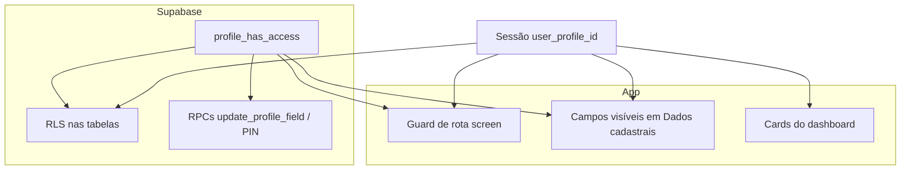
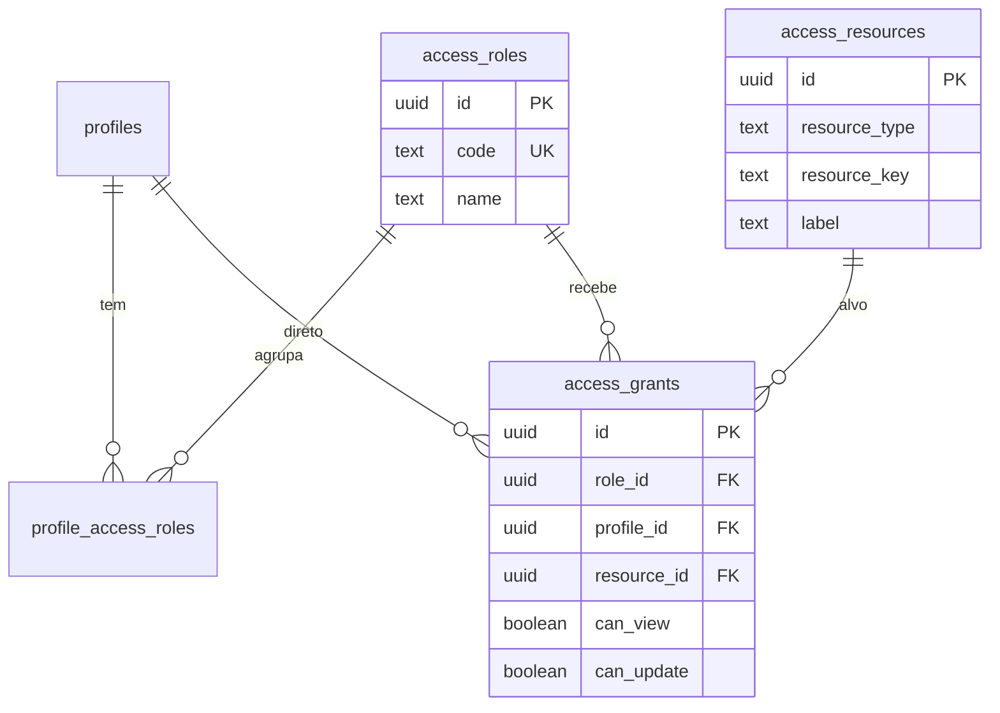
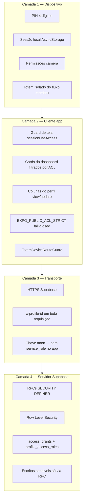

# Pacote 3 — Governança, Permissões e TI

Documentação **autocontida** para super administrador, TI e desenvolvedor.

**Atualizado em:** 05/10/2026

Conteúdo integrado: Manual operacional ACL · Modelo de controle de acesso · Camadas de segurança · Blueprint completo

---

# Parte 1 — Manual operacional de Controle de Acesso

---

# Manual operacional — Controle de acesso (app-igreja)

Este manual descreve **como operar** o controle de acesso no dia a dia: instalação, atribuição de papéis, ajuste de permissões, testes e resolução de problemas.

Documentação técnica de referência: [`CONTROLE_ACESSO.md`](CONTROLE_ACESSO.md) · [`CAMADAS_SEGURANCA.md`](CAMADAS_SEGURANCA.md)

**Pacote:** [`PACOTE_3_GOVERNANCA_TI.md`](PACOTE_3_GOVERNANCA_TI.md) · **Índice:** [`INDICE_DOCUMENTACAO.md`](INDICE_DOCUMENTACAO.md)

**Atualizado em:** 05/10/2026

---

## 1. Para quem é este manual

| Público | Uso |
|---------|-----|
| **Super administrador** | Configura papéis e permissões pela UI ou SQL |
| **Equipe de TI / secretaria** | Atribui `events_admin`, `pastoral`, etc. a pessoas certas |
| **Desenvolvedor** | Instala scripts, valida RLS e RPCs após deploy |

---

## 2. Conceitos essenciais

### 2.1 Identidade

- O “usuário” do ACL é sempre **`profiles.id`** (UUID).
- Login no app: telefone + PIN de 4 dígitos (`profiles.access_pin`).
- Após o login, o app grava `user_profile_id` na sessão e envia o header **`x-profile-id`** ao Supabase.

### 2.2 Papéis (`access_roles`)

Um perfil pode ter **vários papéis** ao mesmo tempo (ex.: `member` + `events_admin`).

| Código | Nome | Uso típico |
|--------|------|------------|
| `visitantes` | Visitantes | Acesso público mínimo; **fallback** sem perfil na sessão ou perfil sem papéis |
| `congregado` | Congregado | Participante com acesso básico (sem gerenciar família) |
| `member` | Membro | Acesso padrão do aplicativo |
| `family_acceptor` | Responsável familiar | Gerencia família (complementar ao `member`) |
| `lider` | Líder | Gerencia servos e programação dos tipos de escala atribuídos ao perfil |
| `events_admin` | Administrador de eventos | Manutenção de eventos e salas |
| `tesoureiro` | Tesoureiro | Card **Financeiro**, manutenção financeira, eventos retroativos e numeração **RD** (prefixo AAMM) |
| `pastoral` | Equipe pastoral | Triagem de pedidos pastorais |
| `super_admin` | Super administrador | Configura o ACL; acesso amplo |
| `gestor_controle_acesso` | Gestor em Controle de Acesso | Opera papéis e grants com escudo obrigatório sobre o Super Administrador |

**Ordem no painel (aba Papéis e lista de papéis do perfil):** Visitantes → Congregado → Membro → Responsável familiar → Líder → Administrador de eventos → **Tesoureiro** → Equipe pastoral → Super administrador.

### 2.4 Líder de escala (`lider`)

O papel **`lider`** permite gerenciar **tipos específicos** de escala (ex.: Vigilância, Recepção):

1. **Papéis** → ajuste grants do `lider` (painéis `maintenance.card.scale_volunteers` e `maintenance.card.scales`).
2. **Perfis** → atribua o papel **`lider`** ao perfil.
3. **Perfis** → na seção **Liderança por tipo de escala**, ligue os tipos que essa pessoa comanda.

Recursos por tipo: `screen:scale_type.<codigo>` (criados automaticamente a partir de `tipos_escala.codigo`).

Quem tem `maintenance.card.scale_types` (ou `super_admin`) cria/edita tipos; o líder só opera nos tipos vinculados.

**Script:** `scripts/access-control-lider-escala.sql`

**Regra:** todo perfil ativo deve manter pelo menos o papel **`member`**, salvo exceções administrativas explícitas.

**Fallback Visitantes:** quem **não tem `user_profile_id` na sessão** (antes do login) ou tem perfil **sem nenhum papel** em `profile_access_roles` recebe automaticamente os grants do papel **`visitantes`**. Com o script `access-control-visitantes-auto-assign.sql`, **novos perfis** também recebem o papel **`visitantes`** na criação — até a secretaria atribuir papéis como **`member`**, não é necessário marcar Visitantes manualmente na maioria dos casos.

### 2.3 Recursos (`access_resources`)

O que pode ser protegido:

| Tipo | Exemplo de chave | O que controla |
|------|------------------|----------------|
| `screen` | `/manage-profile` | Abrir uma tela ou card do dashboard |
| `table` | `profiles` | Leitura/gravação em uma tabela |
| `column` | `profiles.cpf` | Ver/editar um campo em Dados cadastrais |

Curingas (uso restrito):

- `screen:*` — todas as telas
- `table:*` — todas as tabelas
- `column:profiles.*` — todas as colunas de `profiles`

### 2.4 Permissões (`access_grants`)

Cada grant liga um **papel** (ou um perfil específico) a um **recurso**:

| Flag | Significado |
|------|-------------|
| `can_view` | Pode ver (tela, listagem, campo) |
| `can_update` | Pode alterar (formulário, UPDATE, RPC de escrita) |

**Importante:** `can_view` em `table:profiles` **não** libera automaticamente `profiles.cpf` ou `profiles.access_pin`. Colunas sensíveis exigem grants de coluna explícitos.

### 2.5 Onde a permissão é aplicada


```mermaid
flowchart TB
  subgraph app [App]
    G[Guard de rota screen]
    C[Campos visíveis em Dados cadastrais]
    K[Cards do dashboard]
  end
  subgraph supabase [Supabase]
    R[RLS nas tabelas]
    P[RPCs update_profile_field / PIN]
    F[profile_has_access]
  end
  S[Sessão user_profile_id] --> G
  S --> C
  S --> K
  S --> R
  F --> G
  F --> C
  F --> R
  F --> P
```

### 2.6 Modo Ghost e identidade efetiva

- Perfil, telefone, família, ACL, listas e dados são resolvidos pela identidade do perfil-alvo.
- O bypass do `super_admin` real não é herdado pelo alvo simulado.
- O auditor permanece na rota aberta; ACL negada no alvo não força retorno ao Início nem mostra uma cobertura de “Sem acesso nesta simulação”.
- Apenas iniciar e encerrar o Ghost levam ao Início. Assinatura, paywall e instância usam o operador real, evitando redirecionamento para `/billing` por causa do alvo.

### 2.7 Rotas publicadas recentes

| Recurso de tela | Uso |
|-----------------|-----|
| `/lista-familias` | Diretório de famílias |
| `/visitantes-cadastro-rapido` | Cadastro rápido e QR do visitante |
| `/documentos-oficiais` | Documentos oficiais publicados |
| `/apoio-mutuo` | Serviços oferecidos pela comunidade |
| `/atribuicoes` | Atribuição de papéis operacionais, quando presente no catálogo |

---

## 3. Instalação e pré-requisitos (uma vez)

Execute no **SQL Editor do Supabase**, nesta ordem:

| Ordem | Script | O que faz |
|-------|--------|-----------|
| 1 | `scripts/access-control-schema.sql` | Tabelas, funções, seed inicial |
| 2 | `scripts/access-control-profile-write-rpc.sql` | ACL nas RPCs de perfil (9d) |
| 3 | `scripts/access-control-admin-rpc.sql` | UI admin de papéis/grants (9e) |
| 4 | `scripts/access-control-table-rls.sql` | RLS nas tabelas principais (9f) |

Scripts **incrementais** (se o seed for antigo ou algo sumir no app):

| Script | Quando usar |
|--------|-------------|
| `access-control-member-dashboard-grants.sql` | Cards do dashboard não aparecem para `member` |
| `access-control-member-profile-columns.sql` | CPF ou alertas alimentares não aparecem em Dados cadastrais |
| `access-control-lider-escala.sql` | Papel Líder, vínculo perfil↔tipo de escala e enforcement nas RPCs de escala |
| `access-control-role-display-order.sql` | Corrigir ordem dos papéis no painel (Visitantes → … → Super administrador) |
| `access-control-congregado-visitantes-roles.sql` | **Congregado e Visitantes não aparecem na UI** — cria ambos os papéis e grants |
| `access-control-congregado-role.sql` | Só Congregado (legado; prefira o script combinado acima) |
| `access-control-visitantes-role.sql` | Só Visitantes + funções de fallback (sem perfil/papéis) |
| `access-control-visitantes-auto-assign.sql` | Atribui **`visitantes`** automaticamente a perfis novos (trigger + backfill) |
| `access-control-tesoureiro-role.sql` | Papel **Tesoureiro**, RD com prefixo **AAMM**, eventos retroativos |
| `app-parameter-parm-entidade.sql` | Parâmetro **`Parm_entidade`** — prefixo dinâmico da entidade na interface (ex.: IBN KIDS) |
| `salvar-app-parameter-admin.sql` | RPC para **super_admin** gravar `app_parameters` (inclui **`LGPD_Ativo`**) |
| `app-parameter-lgpd-ativo.sql` / `app-parameter-lgpd-ativo-dedupe.sql` | Parâmetro **`LGPD_Ativo`** (`sim` / `nao`) — reconhecimento opcional de LGPD |
| `access-control-map-pin-detail.sql` | Recurso **`/mapa-geolocalizacao/detalhe-pin`** — detalhe de pin só pastoral/super_admin |
| `family-event-audience-members.sql` | RPC de audiência familiar incluindo congregados e dependentes não rejeitados |
| `access-control-ghost-mode.sql` | Modo Ghost (auditoria de permissões) — sessão efetiva simulada; exige grant **explícito** em `maintenance.card.auditor` ou papel `super_admin` (`can_operate_ghost_mode`) |
| `ministerial-profile-questionnaire.sql` | Questionário de Perfil Ministerial (tabelas + RPCs) |
| `ministerial-profile-questionnaire-seed.sql` | Seed das 50 perguntas e opções |
| `ministerial-profile-questionnaire-session-fix.sql` | Patch de validação de sessão do questionário (`ministerial_require_session_profile`) |
| `maintenance-reports-age-brackets-active-membership-patch.sql` | Patch legado de Faixa Etária (relatório **removido** do catálogo na UI) |

### 3.1 Primeiro super administrador

Todo ambiente precisa de **pelo menos um** perfil com papel `super_admin`:

```sql
-- Confirme quem já é super_admin
select p.full_name, p.phone, ar.code
  from public.profile_access_roles par
  join public.access_roles ar on ar.id = par.role_id
  join public.profiles p on p.id = par.profile_id
 where ar.code = 'super_admin';

-- Atribuir (troque o telefone)
insert into public.profile_access_roles (profile_id, role_id)
select p.id, ar.id
  from public.profiles p
 cross join public.access_roles ar
 where regexp_replace(coalesce(p.phone, ''), '\D', '', 'g')
     = regexp_replace('(11) 99999-9999', '\D', '', 'g')
   and ar.code = 'super_admin'
on conflict (profile_id, role_id) do nothing;
```

### 3.2 Garantir `member` em todos os perfis

```sql
insert into public.profile_access_roles (profile_id, role_id)
select p.id, ar.id
  from public.profiles p
 cross join public.access_roles ar
 where ar.code = 'member'
   and not exists (
     select 1
       from public.profile_access_roles par
      where par.profile_id = p.id
        and par.role_id = ar.id
   );
```

---

## 4. Operação pelo aplicativo (recomendado)

### 4.1 Quem pode abrir a manutenção de ACL

1. Perfil com papel **`super_admin`** ou **`gestor_controle_acesso`**, conforme grants da instância.
2. Acesso à tela **Manutenção** (`/maintenance-dashboard`) — normalmente só `super_admin` ou quem tiver grant explícito nessa tela.
3. Na engrenagem, **Controle de Acesso** aparece somente com o recurso `maintenance.card.access_control`.

O Gestor opera sob um escudo no SQL: não lista, visualiza ou edita perfil/papel `super_admin`, não vê seus registros de acesso e não vê nem concede PIN/senha. Os filtros do cliente são apenas defesa adicional.

<!-- Proteção aplicada: Gestor não tem visibilidade do Super Administrador -->

### 4.2 Aba **Perfis** — atribuir papéis a uma pessoa

**Objetivo:** definir *quem* é membro, quem cuida de eventos, quem é admin, etc.

**Passo a passo:**

1. Abra **Manutenção → Controle de Acesso → aba Perfis**.
2. Em **Selecionar perfil**, abra o **dropdown** e escolha o usuário na lista completa (todos os perfis cadastrados).
3. Na lista de papéis, use o **switch** para ligar ou desligar cada papel.
4. Confirme o toast de sucesso.

**Efeito:** alteração imediata em `profile_access_roles`.

**Regras de segurança:**

- O sistema **impede remover o último** `super_admin` do banco.
- O Gestor em Controle de Acesso nunca recebe o Super Administrador na lista de perfis ou papéis e não pode contornar isso por chamada direta às RPCs.
- Após mudar papéis de **si mesmo** ou de quem está testando, peça **Sair → entrar de novo** no app.

### 4.3 Aba **Papéis** — ajustar o que cada papel pode fazer

**Objetivo:** definir *o que* `member`, `events_admin`, etc. podem ver e editar.

**Passo a passo:**

1. Aba **Papéis**.
2. Selecione o papel (ex.: `member`, `events_admin`).
3. Filtre por **Telas**, **Tabelas** ou **Colunas**.
4. Para cada recurso, use:
   - **Ver** — `can_view`
   - **Editar** — `can_update` (só fica ativo se **Ver** estiver ligado)
5. **Visão por recurso:** toque no **ponto colorido** (escopo azul = produto, âmbar = manutenção) ou no **nome do recurso**. A tela inverte: o recurso fica em destaque e cada **papel** aparece como linha com interruptores **Ver** / **Editar**. Use **Voltar** para retornar à visão por papel.
6. Colunas sensíveis (`profiles.cpf`, `profiles.access_pin`) aparecem **destacadas em amarelo**.

**Desligar Ver e Editar** remove o grant daquele recurso para o papel (em qualquer uma das visões).

**Exemplos de política:**

| Objetivo | Onde ajustar |
|----------|--------------|
| Membro não vê PIN | Papel `member` → Colunas → `profiles.access_pin` → Ver/Editar desligados |
| Só tesouraria vê financeiro | Tirar `dashboard.card.financial` e `/financial` do `member`; criar papel `finance_admin` (futuro) ou grant direto ao perfil |
| Equipe de eventos mantém agenda | Atribuir papel `events_admin` à pessoa (aba Perfis); revisar grants do papel em Telas/Tabelas |

**Acessos de Usuários:** `maintenance.card.profile_access_insights` é exclusivo de `super_admin`. O Gestor não pode abrir, consultar ou limpar esse histórico, mesmo que um grant legado esteja incorreto.

### 4.4 O que o membro comum experiencia (sem ser admin)

| Área | Comportamento |
|------|---------------|
| Dashboard | Só cards com `can_view` no papel |
| Dados cadastrais | Só campos com grant de coluna; sem PIN se não houver grant |
| Telas (pastoral, família, financeiro) | Guard bloqueia com alerta se não houver `screen:*` view |
| Gravação de perfil | RPC + RLS validam de novo no servidor |

---

## 5. Operação via SQL (Table Editor ou SQL Editor)

Use quando a UI não estiver disponível, para diagnóstico ou carga em massa.

### 5.1 Consultar papéis de um perfil

```sql
select p.full_name, p.phone, ar.code, ar.name, par.granted_at
  from public.profiles p
  join public.profile_access_roles par on par.profile_id = p.id
  join public.access_roles ar on ar.id = par.role_id
 where regexp_replace(coalesce(p.phone, ''), '\D', '', 'g')
     = regexp_replace('(11) 99999-9999', '\D', '', 'g')
 order by ar.code;
```

### 5.2 Testar permissão (simula o app)

```sql
select public.profile_has_access(
  '<uuid-do-perfil>'::uuid,
  'screen',           -- ou 'table' ou 'column'
  '/financial',       -- ou 'profiles' ou 'profiles.cpf'
  'view'              -- ou 'update'
);
```

Simular header da sessão (RLS):

```sql
select set_config(
  'request.headers',
  '{"x-profile-id":"<uuid-do-perfil>"}',
  true
);
select public.session_has_resource_access('table', 'profiles', 'view');
```

### 5.3 Atribuir / remover papel

```sql
-- Atribuir events_admin
insert into public.profile_access_roles (profile_id, role_id)
select p.id, ar.id
  from public.profiles p
 cross join public.access_roles ar
 where p.id = '<uuid>'::uuid
   and ar.code = 'events_admin'
on conflict (profile_id, role_id) do nothing;

-- Remover events_admin
delete from public.profile_access_roles par
 using public.access_roles ar
 where par.role_id = ar.id
   and par.profile_id = '<uuid>'::uuid
   and ar.code = 'events_admin';
```

### 5.4 Ajustar grant de um papel

```sql
-- Ex.: member pode VER mas não EDITAR financeiro (tela)
insert into public.access_grants (role_id, resource_id, can_view, can_update)
select r.id, res.id, true, false
  from public.access_roles r
  join public.access_resources res
    on res.resource_type = 'screen'
   and res.resource_key = '/financial'
 where r.code = 'member'
on conflict (role_id, resource_id) where (role_id is not null) do update
  set can_view = excluded.can_view,
      can_update = excluded.can_update,
      updated_at = now();

-- Remover grant (desliga view e update)
delete from public.access_grants g
 using public.access_roles r, public.access_resources res
 where g.role_id = r.id
   and g.resource_id = res.id
   and r.code = 'member'
   and res.resource_type = 'screen'
   and res.resource_key = '/financial';
```

### 5.5 Grant excepcional a **um perfil** (sem mudar o papel)

Quando **uma pessoa** precisa de algo que o papel dela não tem:

```sql
insert into public.access_grants (profile_id, resource_id, can_view, can_update)
select '<uuid-perfil>'::uuid, res.id, true, false
  from public.access_resources res
 where res.resource_type = 'screen'
   and res.resource_key = '/maintenance-dashboard'
on conflict (profile_id, resource_id) where (profile_id is not null) do update
  set can_view = excluded.can_view,
      can_update = excluded.can_update,
      updated_at = now();
```

Use com moderação: grants por perfil são mais difíceis de auditar que grants por papel.

---

## 6. Cenários operacionais (receitas)

### 6.1 Atribuir papel Congregado (em vez de Membro)

Use para quem participa do app mas **não** é membro pleno nem responsável familiar.

1. Controle de Acesso → **Perfis** → selecionar pessoa no dropdown.
2. Ligar **`congregado`**; desligar **`member`** se não for membro pleno.
3. Ajustar grants em **Papéis → Congregado** (Telas / Colunas) conforme a política da igreja.
4. Pedir **Sair → entrar** no app.

**Diferença padrão vs `member`:** sem `/manage-members`, sem card lista de membros, sem financeiro, sem CPF/alertas alimentares no seed inicial.

### 6.2 Novo membro cadastrado no app

| Etapa | O que acontece | Ação do operador |
|-------|----------------|------------------|
| Cadastro | Cria linha em `profiles` | Nenhuma, se o seed aplicar `member` a todos automaticamente |
| Primeiro login | PIN + sessão | Nenhuma |
| Permissões | Herda grants do papel `member` | Revisar se a política da igreja está correta no papel `member` |

Se o membro não tiver papel `member`:

```sql
insert into public.profile_access_roles (profile_id, role_id)
select p.id, ar.id
  from public.profiles p
 cross join public.access_roles ar
 where p.id = '<uuid>'::uuid
   and ar.code = 'member'
on conflict do nothing;
```

### 6.3 Nomear responsável pela equipe de eventos

1. **App:** Controle de Acesso → Perfis → selecionar pessoa no dropdown → ligar **`events_admin`**.
2. **Verificar** grants do papel `events_admin` (aba Papéis → Telas: `/maintenance-dashboard`; Tabelas: `events`, `event_registrations`).
3. Pedir à pessoa: **Sair → entrar**.
4. Confirmar: engrenagem de manutenção visível; consegue abrir Programação de Eventos.

### 6.4 Restringir CPF e PIN apenas a administradores

1. Aba **Papéis** → `member` → **Colunas**.
2. Desligar **Ver** e **Editar** em:
   - `profiles.cpf`
   - `profiles.access_pin`
3. Manter ligado em `super_admin` (via curinga `*` ou grants explícitos).
4. Testar com perfil `member`: Dados cadastrais sem CPF/PIN; alteração de PIN falha no servidor.

### 6.5 Membro perdeu acesso a um card do dashboard

**Diagnóstico:**

```sql
select public.profile_has_access(
  '<uuid>'::uuid,
  'screen',
  'dashboard.card.financial',
  'view'
);
```

**Correção rápida:** executar `access-control-member-dashboard-grants.sql` ou religar o grant na aba Papéis → `member` → Telas.

### 6.6 Promover novo super administrador

1. Controle de Acesso → Perfis → selecionar pessoa no dropdown → ligar **`super_admin`**.
2. **Não** remover o `super_admin` antigo até o novo confirmar acesso.
3. Novo admin: Sair → entrar → abrir Manutenção → Controle de Acesso.

### 6.7 Desligar acesso de um voluntário

1. Remover papéis específicos (`events_admin`, `pastoral`, …) na aba Perfis.
2. Manter `member` se a pessoa continuar usando o app como membro.
3. Para bloqueio total: remover todos os papéis **exceto** se for o último `super_admin` (bloqueado pelo sistema).

---

## 7. Rotina de manutenção recomendada

### 7.1 Semanal (5 min)

- [ ] Confirmar que existe pelo menos um `super_admin` ativo.
- [ ] Revisar se há perfis sem papel `member` (consulta SQL abaixo).

```sql
select p.id, p.full_name, p.phone
  from public.profiles p
 where not exists (
   select 1
     from public.profile_access_roles par
     join public.access_roles ar on ar.id = par.role_id
    where par.profile_id = p.id
      and ar.code = 'member'
 )
   and coalesce(p.full_name, '') <> '';
```

### 7.2 Ao mudar equipe (eventos, pastoral, tesouraria)

- [ ] Atribuir/remover papéis na aba Perfis.
- [ ] Avisar: **Sair e entrar** no app.
- [ ] Testar uma tela e um card do dashboard com o perfil afetado.

### 7.3 Após deploy de nova versão do app

- [ ] Confirmar scripts SQL do ACL aplicados (seção 3).
- [ ] Login como `member` e como `super_admin`.
- [ ] Um teste de gravação em Dados cadastrais e um de manutenção (se aplicável).

### 7.4 Ao alterar política de privacidade

- [ ] Revisar colunas `profiles.cpf`, `profiles.medical_food_alerts`, `profiles.access_pin` no papel `member`.
- [ ] Revisar `LGPD_Ativo` e o texto LGPD da **instância ativa**; cada igreja mantém seu próprio conteúdo e aceite.
- [ ] Documentar internamente quem pode ver dados sensíveis.

---

## 8. Testes de validação

### 8.1 Checklist rápido no celular

| # | Perfil | Ação | Resultado esperado |
|---|--------|------|-------------------|
| 1 | `member` | Abrir dashboard | Cards conforme grants do `member` |
| 2 | `member` | Dados cadastrais | Campos básicos editáveis; sem seção PIN |
| 3 | `member` | Abrir Manutenção | Negado (sem engrenagem / sem acesso) |
| 4 | `super_admin` | Controle de Acesso | Card visível; dropdown de perfis e switches funcionam |
| 5 | `events_admin` | Manutenção → Eventos | Consegue criar/editar evento |
| 6 | Qualquer | Após mudança de papel | Sair → entrar → comportamento atualizado |

### 8.2 Testes SQL úteis

```sql
-- ACL está ativo?
select public.acl_enforcement_enabled();

-- Últimos grants do member (amostra)
select ar.code, res.resource_type, res.resource_key, g.can_view, g.can_update
  from public.access_grants g
  join public.access_roles ar on ar.id = g.role_id
  join public.access_resources res on res.id = g.resource_id
 where ar.code = 'member'
 order by res.resource_type, res.resource_key
 limit 30;

-- PIN bloqueado para member (RPC deve falhar)
select public.update_profile_access_pin('(11) 99999-9999', '1234', '5678');
-- esperado: exception de permissão
```

---

## 9. Solução de problemas

| Sintoma | Causa provável | Correção |
|---------|----------------|----------|
| Card sumiu do dashboard | Grant `dashboard.card.*` ausente no `member` | `access-control-member-dashboard-grants.sql` ou aba Papéis |
| “Acesso negado” ao abrir tela | Sem `screen:...` view | Aba Papéis ou grant SQL |
| Campo não aparece em Dados cadastrais | Sem `column:profiles.<campo>` view | `access-control-member-profile-columns.sql` ou aba Papéis → Colunas |
| Edição falha com mensagem de permissão | Sem `can_update` na coluna ou RPC | Aba Papéis; conferir script 9d aplicado |
| Mudança de papel não surte efeito | Sessão antiga | **Sair → entrar** |
| Controle de Acesso não aparece | Perfil não é `super_admin` | Atribuir papel (seção 3.1) |
| Gestor procura Super Administrador ou PIN | Escudo de segurança funcionando | Não liberar: essa invisibilidade é obrigatória e aplicada no SQL |
| Acessos de Usuários não aparece | Recurso exclusivo de `super_admin` | Entrar com Super Administrador; não conceder ao Gestor |
| Ghost volta ao Início ou abre billing | Fluxo usando identidade/navegação real incorretamente | Conferir helpers de identidade efetiva e `ghostBlocksHomeBounce()` |
| Erro ao abrir Controle de Acesso | RPC admin não instalada | Executar `access-control-admin-rpc.sql` |
| SELECT/UPDATE falha com RLS | `access-control-table-rls.sql` não aplicado ou sem header | Script 9f; app atualizado com `supabaseSessionFetch` |
| Tudo liberado indevidamente | Nenhum grant em `access_grants` (modo legado) | Executar seed em `access-control-schema.sql` |

### 9.1 Modo legado

Se a tabela `access_grants` estiver **vazia**, `profile_has_access` retorna **`true`** para tudo (compatibilidade). Assim que existir **qualquer** grant, o ACL passa a valer de forma restritiva.

---

## 10. Boas práticas e limitações

### 10.1 Boas práticas

1. Prefira mudanças por **papel**, não por perfil individual (mais fácil de manter).
2. Conceda `super_admin` só a pessoas de confiança (2–3 no máximo).
3. Colunas **críticas** (`access_pin`, `cpf`) só para papéis administrativos.
4. Sempre peça **Sair → entrar** após alterar papéis.
5. Teste com um perfil “voluntário” antes de aplicar em massa.

### 10.2 O que o ACL ainda não cobre totalmente

| Área | Situação |
|------|----------|
| RPCs de escalas | Com ACL por tipo quando `access-control-lider-escala.sql` está instalado; financeiro em lote ainda parcial |
| Tabelas `checkins`, `escalas_*` | RLS legada em parte das tabelas; operações sensíveis preferem RPC `security definer` |
| Mascaramento de CPF/PIN no SELECT | Coluna ainda pode existir no JSON se grant de tabela for amplo |
| Editar perfil de **outra** pessoa pela UI | Não há tela admin de cadastro; só SQL ou futura feature |
| Login / cadastro | Fluxos sem `x-profile-id` tratados como pré-sessão |

---

## 11. Referência rápida de arquivos

| Arquivo | Função |
|---------|--------|
| `MANUAL_CONTROLE_ACESSO.md` | Este manual |
| `CONTROLE_ACESSO.md` | Modelo técnico e inventário |
| `scripts/access-control-schema.sql` | Base do ACL |
| `scripts/access-control-admin-rpc.sql` | API da UI admin |
| `scripts/access-control-profile-write-rpc.sql` | RPCs de perfil com ACL |
| `scripts/access-control-table-rls.sql` | RLS por tabela |
| `scripts/access-control-member-dashboard-grants.sql` | Correção cards `member` |
| `scripts/access-control-member-profile-columns.sql` | Correção colunas `member` |
| `components/MaintenanceAccessControlCard.tsx` | UI no app |
| `hooks/useScreenAccessGuard.ts` | Bloqueio de rotas |
| `lib/accessControl.ts` | Cliente `profile_has_access` |
| `lib/supabaseSessionFetch.ts` | Header `x-profile-id` |

---

## 12. Contatos e escalação

| Situação | Responsável |
|----------|-------------|
| Atribuição de papéis do dia a dia | Super administrador da igreja |
| Política de quem vê CPF/dados de saúde | Liderança + secretaria |
| Script SQL, deploy, bug no app | Equipe de desenvolvimento / TI |
| Perda do último `super_admin` | Recuperação via SQL Editor (service role) com insert manual em `profile_access_roles` |

---

*Última atualização: 05/10/2026 — escudo do Gestor, identidade efetiva no Ghost, recursos publicados e LGPD por instância.*


---

# Parte 2 — Controle de acesso: modelo e inventário

---

# Controle de acesso — modelo e inventário

Este documento rastreia **como o app-igreja identifica usuários hoje**, quais **telas**, **tabelas** e **campos** existem no ecossistema, e como a tabela de relacionamento proposta se encaixa.

Script SQL: [`scripts/access-control-schema.sql`](scripts/access-control-schema.sql)

**Manual operacional (dia a dia):** [`MANUAL_CONTROLE_ACESSO.md`](MANUAL_CONTROLE_ACESSO.md)

**Pacote:** [`PACOTE_3_GOVERNANCA_TI.md`](PACOTE_3_GOVERNANCA_TI.md) · **Índice:** [`INDICE_DOCUMENTACAO.md`](INDICE_DOCUMENTACAO.md) · **Camadas de segurança:** [`CAMADAS_SEGURANCA.md`](CAMADAS_SEGURANCA.md)

---

## Status da implementação (atualizado em 05/10/2026)

Documento de encerramento da sessão: o que já está pronto, o que falta e qual é o **próximo passo** recomendado.

### Concluído no Supabase (Passos 1–7)

| Item | Status |
|------|--------|
| Tabelas `access_resources`, `access_roles`, `access_grants`, `profile_access_roles` | Criadas |
| Correção de índices únicos (`role_id` / `profile_id` parciais) | Aplicada (evita erro 23505 com `profile_id` null) |
| Funções `profile_has_access` e `profile_has_access_by_phone` | Criadas |
| Seed de recursos, papéis e grants (`member`, `super_admin`, `events_admin`) | Executado |
| Perfil administrador (`04b919ba-38b4-4fe5-a371-2e98e9acbc0d`) com `super_admin` + `member` | Configurado |
| Todos os perfis em `profiles` com papel `member` | Configurado |
| Teste SQL: `profile_has_access` → manutenção `true` para super_admin | OK |

### Concluído no app (Passo 9)

| Item | Arquivo(s) |
|------|----------------|
| Sessão: `user_phone` + `user_profile_id` após login/cadastro | `lib/userSession.ts`, `app/index.tsx`, `app/register.tsx` |
| Cliente ACL: RPC `profile_has_access` / `sessionHasAccess` | `lib/accessControl.ts` |
| Engrenagem do dashboard só para quem tem `view` em `/maintenance-dashboard` | `app/(tabs)/dashboard.tsx` |
| Bloqueio da tela `maintenance-dashboard` sem permissão | `app/maintenance-dashboard.tsx` |
| Logout limpa sessão (telefone + profile_id) | `app/(tabs)/dashboard.tsx` |
| **Passo 9b:** carrossel só com cards permitidos (`dashboard.card.*`) | `lib/accessControl.ts`, `app/(tabs)/dashboard.tsx` |
| **Passo 9c:** colunas visíveis/editáveis em Dados cadastrais | `lib/accessControl.ts`, `app/manage-profile.tsx` |
| **Passo 9d:** `update_profile_field` e `update_profile_access_pin` validam `can_update` | `scripts/access-control-profile-write-rpc.sql` |
| **Passo 9e:** UI admin de papéis e grants (somente `super_admin`) | `components/MaintenanceAccessControlCard.tsx`, `scripts/access-control-admin-rpc.sql` |
| **Passo 9f:** RLS nas tabelas com `profile_has_access` + header `x-profile-id` | `scripts/access-control-table-rls.sql`, `lib/supabaseSessionFetch.ts` |

### Entregas recentes (jun/2026)

| Item | Detalhe |
|------|---------|
| **Relatórios de Despesas (RD)** | Telas `/expense-report` e hub no `/financial`; WhatsApp ao tesoureiro na submissão; tesouraria na manutenção (`expense-reports-*.sql`) |
| **Financeiro membro** | Saldo bancário por conta; hub com RD destacado |
| **Financeiro manutenção** | Carga/esvaziar lote com versão REALIZADO/PLANEJADO; seções colapsáveis; accordion (uma seção aberta) |
| **Recepção Familiar** | Formulário `/cadastro-familia/` → fila na manutenção (`recepcao-cadastro-familiar.sql`) |
| **Mudança de Papéis** | Card pastoral/super_admin (`access-control-pastoral-role-change.sql`) |
| **Cadastro de Usuário** | `maintenance.card.profile_cadastro` — busca, CEP, exclusão completa |
| **Acessos de Usuários** | `maintenance.card.profile_access_insights` — histórico de logins e telas visitadas *(super_admin)* |
| **Gestor em Controle de Acesso** | Opera papéis e grants sem listar, visualizar ou editar Super Administrador, seus acessos ou PIN/senha |
| **Modo Ghost** | ACL, perfil, telefone, família e dados usam a identidade efetiva do alvo; cobrança e instância permanecem na identidade real |
| **Sessão assinada** | `profile_sessions` + header `x-session-token` (prioridade sobre `x-profile-id`) |
| **Telemetria de uso** | Tabelas `profile_app_access_events` e `profile_app_access_screen_visits`; RPCs admin e `record_profile_app_access_screen_visit` |
| **Mapa ACL PDF** | `npm run build:access-roles-pdf` → `PAPEIS_CONTROLE_ACESSO.pdf` |
| **Índice do aplicativo** | `/(tabs)/index` — atalhos com etiquetas para todos os cards |
| **Manutenção — card menu** | Primeiro card do carrossel com etiquetas dos módulos |
| **Marca d'água** | Global via `AppShell`, exceto login; alinhada ao frame do card |
| **Performance navegação** | Cache em memória de ACL, perfil de sessão e audiência familiar; sem refetch completo a cada foco de tela |
| **Mapa — detalhe de pin** | Recurso `/mapa-geolocalizacao/detalhe-pin` — mapa geral para membros; detalhe alheio só pastoral/super_admin (`access-control-map-pin-detail.sql`) |
| **Audiência familiar** | União de fontes inclui congregados; dependentes com `accepted` ≠ `false` (`family-event-audience-members.sql`) |
| **ACL — visão por recurso** | Aba Papéis: toque no marcador colorido do recurso → papéis como linhas com Ver/Editar; botão Voltar |
| **Rodapé do dashboard** | Botão Menu expandido; engrenagem alinhada à direita do card (`CarouselFooterNav`) |

### Ainda não feito (próximas sessões)
- Papel `events_admin` atribuído a pessoas da equipe de eventos (só seed SQL hoje).
- RLS em tabelas auxiliares (`checkins`, `escalas_*`, …).
- Views com mascaramento de colunas sensíveis em `profiles`.

### Outras entregas da mesma época (fora do ACL)

- Senha de acesso em Dados cadastrais (PIN, seção recolhível, olho, validação).
- Gerenciar Família: seção “Adicionar membro” recolhível; busca por nome; **transferência** entre famílias com confirmação; **herança de endereço completo** ao aceitar, transferir ou adicionar membro (`lib/inheritFamilyAddress.ts`, RPC `accept_managed_member_into_family`).
- Dashboard: carrossel com `‹` / `›`, indicador `1 / N`, badge do card ativo; card **Dízimos e Ofertas** sempre visível; card **SALA(S)** filtrado por família do usuário.
- UX compartilhada: `lib/uiTokens.ts`, ícones coloridos no Menu e na Manutenção, chips segmentados no Coração Aberto.

---

## Próximo passo recomendado (quando retomar)

Roadmap ACL (fases 9a–9f) **concluído**. Guards de rota nas telas principais via `hooks/useScreenAccessGuard.ts`.

Próximas melhorias opcionais:

1. Enforcement ACL em RPCs de manutenção (escalas, financeiro em lote, etc.).
2. RLS em tabelas auxiliares (`checkins`, `escalas_log`, `tipos_escala`, …).
3. Views com mascaramento de colunas sensíveis (`access_pin`, `cpf`) em `profiles`.

**Supabase (obrigatório após 9f):** execute `scripts/access-control-table-rls.sql` no SQL Editor.

**Teste rápido (9f):**

```sql
-- Simula header do app (substitua pelo seu profile_id)
select set_config('request.headers', '{"x-profile-id":"<uuid>"}', true);
select public.session_has_resource_access('table', 'profiles', 'view');
-- esperado: true para member com grant
```

**Lembrete ao testar no celular:** após mudar papéis no Supabase, use **Sair** e entre de novo para gravar `user_profile_id` na sessão.

---

## 1. Situação no banco vs. no app (referência)

| Aspecto | Hoje |
|--------|------|
| **Identidade no app** | `profiles.id` (login por PIN em `profiles.access_pin` + telefone em `AsyncStorage`) |
| **Supabase Auth** | Opcional (`profiles.auth_user_id`); muitos usuários **não** têm linha em `auth.users` |
| **Autorização** | RLS com `profile_has_access` nas tabelas principais (9f) + RPCs `security definer` para fluxos sem sessão |
| **Manutenção** | Engrenagem e rota protegidas via `profile_has_access` (Passo 9 parcial) |
| **Cards do dashboard** | Filtrados por `profile_has_access` (Passo 9b) |
| **Demais telas** | Guards de rota em manutenção, perfil, família, pastoral, financeiro e LGPD |
| **Campos sensíveis** | Ocultos no cliente; RPCs `update_profile_field` / PIN validam `can_update` por coluna (9d) |

O banco **já responde** permissões via `profile_has_access`; o app consulta para **manutenção** e **cards do dashboard**.

---

## 2. Sujeito da permissão

Use sempre **`profiles.id`** como “usuário” do ACL.

- Não use só `auth.users.id` — pedidos pastorais e RPCs já documentam o desvio (`pastoral-requests-fields.sql`).
- O app pode resolver `profile_id` a partir do telefone da sessão (`find_profile_id_by_phone` / SELECT em `profiles`).

### 2.1 Identidade efetiva no Modo Ghost

- Telas, listas e permissões resolvem o alvo com `loadEffectiveSessionProfile`, `resolveEffectiveProfileId` e `getEffectiveUserPhone`.
- O bypass de `super_admin` do operador fica desligado para a ACL simulada.
- O auditor entra e permanece na rota escolhida; grant negado do alvo não provoca retorno ao Início nem bloqueio “Sem acesso nesta simulação”.
- Iniciar/encerrar Ghost são as únicas transições automáticas para o Início. Billing, paywall e seleção de instância continuam vinculados ao operador real.

---

## 3. Inventário de telas (`resource_type = 'screen'`)

| `resource_key` | Rota / origem | Observação |
|----------------|---------------|------------|
| `screen:/` | `app/index.tsx` | Login |
| `screen:/register` | `app/register.tsx` | Cadastro |
| `screen:/dashboard` | `app/(tabs)/dashboard.tsx` | Painel principal |
| `screen:/maintenance-dashboard` | `app/maintenance-dashboard.tsx` | Manutenção (eventos, monitor salas) |
| `screen:/manage-profile` | `app/manage-profile.tsx` | Dados cadastrais |
| `screen:/manage-members` | `app/manage-members.tsx` | Gerenciar família |
| `screen:/pastoral` | `app/pastoral.tsx` | Coração Aberto (formulário) |
| `screen:/pastoral-history` | `app/pastoral-history.tsx` | Meus pedidos |
| `screen:/financial` | `app/financial.tsx` | Relatórios financeiros (leitura) |
| `screen:/expense-report` | `app/expense-report.tsx` | Relatório de Despesas (RD) |
| `screen:/lgpd` | `app/lgpd.tsx` | Termos LGPD |
| `screen:/lista-familias` | `app/lista-familias.tsx` | Diretório de famílias |
| `screen:/visitantes-cadastro-rapido` | `app/visitantes-cadastro-rapido.tsx` | Cadastro rápido e QR do visitante |
| `screen:/documentos-oficiais` | `app/documentos-oficiais.tsx` | Documentos publicados da igreja |
| `screen:/apoio-mutuo` | `app/apoio-mutuo.tsx` | Serviços da comunidade |
| `screen:/atribuicoes` | `app/atribuicoes.tsx` | Papéis operacionais; pastoral e super_admin |

### Cards do dashboard (`screen:dashboard.card.*`)

| `resource_key` | Card | `content` |
|----------------|------|-----------|
| `screen:dashboard.card.event_alt` | Agenda da Família | `event_alt` |
| `screen:dashboard.card.qr` | Check In | `qr` |
| `screen:dashboard.card.kids_teens` | SALA(S) | `kids_teens` |
| `screen:dashboard.card.offerings` | Dízimos e Ofertas | `offerings` |
| `screen:dashboard.card.pastoral` | Coração Aberto | `pastoral` |
| `screen:dashboard.card.members_list` | Lista de membros | `members_list` |
| `screen:dashboard.card.birthdays` | Aniversariantes | `birthdays` |
| `screen:dashboard.card.vigilance_scales` | Escalas | `vigilance_scales` |
| `screen:dashboard.card.parking_vehicle_v2` | Estacionamento | `parking_vehicle_v2` |
| `screen:dashboard.card.grouped_manage` | Menu (perfil + família) | `grouped_manage` |

Visibilidade condicional de cards (parâmetros/evento) continua no app; o ACL define se o usuário **pode** ver o card quando ele estaria disponível.

As rotas dedicadas e o menu/“Eu quero…” são a navegação publicada. O antigo carrossel do Painel não deve ser usado como inventário do produto.

### Recursos administrativos restritos

- `maintenance.card.profile_access_insights` (**Acessos de Usuários**) é exclusivo de `super_admin`, inclusive nas RPCs de listar e limpar histórico.
- O papel `gestor_controle_acesso` pode administrar o ACL, mas o escudo autoritativo SQL (`assert_gestor_super_admin_shield` e filtros de visibilidade) impede qualquer acesso ao perfil/papel `super_admin`, aos registros de acesso desse perfil e às colunas de PIN/senha.
- O cliente aplica os mesmos filtros em `lib/gestorControleAcessoSecurity.ts` como defesa em profundidade.
<!-- Proteção aplicada: Gestor não tem visibilidade do Super Administrador -->

---

## 4. Inventário de tabelas (`resource_type = 'table'`)

Tabelas usadas pelo app (Supabase `public`):

| `resource_key` | Uso principal |
|----------------|---------------|
| `table:profiles` | Login, perfil, LGPD, endereço, PIN |
| `table:members` | Família, check-in, listas |
| `table:events` | Agenda, manutenção, salas |
| `table:event_registrations` | Check-in / salas Kids-Teens |
| `table:profile_vehicles` | Veículos no perfil e estacionamento |
| `table:pastoral_requests` | Pedidos pastorais |
| `table:pastoral_reason_categories` | Motivos (leitura) |
| `table:pastoral_reason_subcategories` | Submotivos (leitura) |
| `table:app_parameters` | Parâmetros globais (PIX, QR, prefixo família, **`LGPD_Ativo`**) — escrita por **super_admin** via RPC `salvar_app_parameter_admin` |
| `table:families` | Dados de família (`useFamilyData`) |
| `table:vigilancia_*` | Escalas (import/histórico — conferir nomes no Supabase) |

Atualizar a lista após `information_schema.tables` no projeto se houver tabelas só no banco.

O texto e a ativação da LGPD são por instância/tenant. A tela deve carregar o conteúdo da igreja ativa; não se reutiliza texto de outra instância, mesmo quando o mesmo telefone existe em mais de uma igreja.

---

## 5. Inventário de campos (`resource_type = 'column'`)

Formato: `column:<tabela>.<coluna>`.

### `profiles` (cadastro + sensíveis)

Colunas conhecidas no app (`manage-profile.tsx`, `register.tsx`):

| Coluna | Sensível | Notas |
|--------|----------|--------|
| `full_name`, `phone`, `birth_date`, `email` | médio | Contato / identificação |
| `cpf` | alto | Oculto na UI padrão |
| `access_pin` | crítico | Só RPC `update_profile_access_pin`; exige `can_update` (9d) |
| `address_*`, `cep` | médio | Endereço |
| `lgpd_*`, `medical_food_alerts` | alto | Privacidade / saúde |
| `family_id`, `codigo_membro`, `role` | médio | Escopo familiar / papel |
| `selfie_url` | médio | Imagem |
| `auth_user_id`, `id`, `created_at`, `updated_at` | sistema | Bloqueados em `update_profile_field` |

### `members`

| Coluna | Notas |
|--------|--------|
| `full_name`, `phone`, `birth_date`, `relationship`, `family_id` | Gerenciar família |
| `accepted` | Reconhecimento na família |

### `events`

Campos editáveis em `maintenance-dashboard` / `maintenanceEventForm`: `name`, `event_date`, `event_local`, `max_capacity`, `kids_room`, `teens_room`, `parm_ofertas`, `is_locked`, `is_visible`, etc.

### `pastoral_requests`

`request_for`, `beneficiary_*`, `destination_label`, `profile_id`, `message`, status, etc. (`pastoral-requests-fields.sql`).

**Regra sugerida:** `can_view` na tabela não implica todas as colunas — conceda colunas sensíveis (`cpf`, `access_pin`) só a papéis administrativos.

---

## 6. Modelo proposto (3 tabelas + função)


```mermaid
erDiagram
  profiles ||--o{ profile_access_roles : tem
  access_roles ||--o{ profile_access_roles : agrupa
  access_roles ||--o{ access_grants : recebe
  profiles ||--o{ access_grants : direto
  access_resources ||--o{ access_grants : alvo

  access_resources {
    uuid id PK
    text resource_type
    text resource_key
    text label
  }
  access_roles {
    uuid id PK
    text code UK
    text name
  }
  access_grants {
    uuid id PK
    uuid role_id FK
    uuid profile_id FK
    uuid resource_id FK
    boolean can_view
    boolean can_update
  }
```

### `access_resources` (catálogo)

Define **o que** pode ser protegido: tela, tabela ou coluna.

### `access_roles` (papéis)

Ex.: `member`, `family_acceptor`, `pastoral`, `events_admin`, `super_admin`.

### `access_grants` (relacionamento pedido)

Uma linha = permissão de um **papel** *ou* de um **perfil** sobre um recurso:

- `can_view` — visualizar (tela, listagem, SELECT de campo)
- `can_update` — alterar (formulário, UPDATE, RPC de escrita)

Exatamente um de `role_id` ou `profile_id` deve estar preenchido.

### `profile_access_roles`

N:N entre `profiles` e `access_roles`.

### Função `profile_has_access(profile_id, resource_type, resource_key, action)`

- `action`: `'view'` ou `'update'`
- Suporta curinga `*` no final da chave (ex.: `table:profiles` não inclui colunas; `column:profiles.*` todas as colunas)
- **Modo legado:** se não existir nenhum grant no sistema, retorna `true` (app continua funcionando até você configurar papéis)

---

## 7. Papéis sugeridos (seed)

| `code` | Quem | View típico | Update típico |
|--------|------|-------------|---------------|
| `visitantes` | Sem perfil na sessão ou perfil sem papéis | Login, cadastro, LGPD, check-in QR, eventos públicos | Cadastro e inscrição em eventos |
| `congregado` | Participante cadastrado | Dashboard básico, perfil, pastoral; sem família/financeiro | Perfil e pedido pastoral |
| `member` | Membro comum | Próprio perfil (campos básicos), cards dashboard, pastoral próprio | Perfil próprio (campos permitidos), pedido pastoral |
| `family_acceptor` | Quem aceita familiares | `manage-members`, membros da família | `members` da própria `family_id` |
| `lider` | Líder de tipo(s) de escala | Painéis de servos/programação + card Escalas | Tipos vinculados em `profile_scale_leadership` |
| `events_admin` | Equipe de eventos | `maintenance-dashboard`, `events` | CRUD `events` |
| `tesoureiro` | Tesouraria | Card financeiro, manutenção financeira, RD (AAMM), eventos retroativos | Conciliação RD, importação CSV |
| `pastoral` | Equipe pastoral | Pedidos (futuro painel) | Triagem `pastoral_requests` |
| `super_admin` | TI / pastor responsável | `*` | `*` |

Ordem no painel admin: mesma sequência da tabela acima.

Ajuste conforme a política da igreja.

---

## 8. Roadmap do app (ordem sugerida)

| Fase | Descrição | Status |
|------|-----------|--------|
| 9a | Manutenção (engrenagem + tela) | Feito |
| 9b | Cards do dashboard (`dashboard.card.*`) | Feito |
| 9c | Campos do perfil (`column:profiles.*`) | Feito |
| 9d | RPCs de escrita | Feito |
| 9e | UI admin de grants | Feito |
| 9f | RLS nas tabelas | Feito |

---

## 9. Checklist operacional

### Supabase

- [x] Executar `scripts/access-control-schema.sql` (e correção de índices se necessário)
- [x] `super_admin` no perfil administrador
- [x] `member` em todos os perfis
- [x] Testar `profile_has_access` no SQL Editor
- [ ] Atribuir `events_admin` a quem cuida de eventos (quando definir a equipe)
- [ ] Revisar grants do papel `member` conforme política da igreja

### App

- [x] `lib/userSession.ts` + `lib/accessControl.ts`
- [x] Login/cadastro persistem `user_profile_id`
- [x] Dashboard: engrenagem condicional
- [x] `maintenance-dashboard`: guard de acesso
- [x] Dashboard: filtrar cards por ACL (Passo 9b)
- [ ] Supabase: `access-control-member-dashboard-grants.sql` se seed antigo omitiu cards do `member`
- [x] `manage-profile`: colunas visíveis/editáveis por permissão (Passo 9c)
- [ ] Supabase: `access-control-member-profile-columns.sql` se seed antigo omitiu `cpf` / `medical_food_alerts` no `member`
- [x] RPCs: validar `can_update` antes de gravar (Passo 9d)
- [ ] Supabase: `access-control-profile-write-rpc.sql` após deploy do app 9d
- [x] Manutenção: card Controle de Acesso para `super_admin` (Passo 9e)
- [ ] Supabase: `access-control-admin-rpc.sql` após deploy do app 9e
- [x] App: header `x-profile-id` em todas as requisições Supabase (Passo 9f)
- [x] RLS: policies ACL em tabelas principais (Passo 9f)
- [ ] Supabase: `access-control-table-rls.sql` após deploy do app 9f

### Arquivos de referência no código

| Arquivo | Uso |
|---------|-----|
| `lib/accessControl.ts` | Constantes `ACCESS_SCREEN`, `ACCESS_DASHBOARD_CARD`, helpers RPC |
| `lib/userSession.ts` | `user_profile_id` no AsyncStorage |
| `lib/supabaseSessionFetch.ts` | Header `x-profile-id` para RLS (9f) |
| `hooks/useScreenAccessGuard.ts` | Guard de rota por `screen:*` |
| `scripts/access-control-table-rls.sql` | Policies RLS por tabela |
| `DASHBOARD_CARDS.md` | Lista de cards e `content` |
| `MANUTENCAO_ECOSISTEMA.md` | Rotina do módulo de manutenção |
| `MANUAL_CONTROLE_ACESSO.md` | Manual operacional (papéis, grants, testes, troubleshooting) |


---

# Parte 3 — Especificação das camadas de segurança

---

# Especificação das Camadas de Segurança — App IBN

Documento de referência do modelo de **defesa em profundidade** do **app-igreja** (Igreja Batista Norte).

**Atualizado em:** 05/10/2026

**Documentação relacionada:** [`BLUEPRINT.md`](BLUEPRINT.md) · [`CONTROLE_ACESSO.md`](CONTROLE_ACESSO.md) · [`MANUAL_CONTROLE_ACESSO.md`](MANUAL_CONTROLE_ACESSO.md) · [`PACOTE_3_GOVERNANCA_TI.md`](PACOTE_3_GOVERNANCA_TI.md)

---

## 1. Visão geral

O app adota **4 camadas de segurança** encadeadas. Cada camada complementa a anterior; a falha de um controle não deve, por si só, expor dados ou operações críticas.


```mermaid
flowchart TB
  subgraph L1 [Camada 1 — Dispositivo]
    PIN[PIN 4 dígitos]
    AsyncStorage[Sessão local AsyncStorage]
    Camera[Permissões câmera]
    TotemIso[Totem isolado do fluxo membro]
  end
  subgraph L2 [Camada 2 — Cliente app]
    ScreenACL[Guard de tela sessionHasAccess]
    CardACL[Cards do dashboard filtrados por ACL]
    ColumnACL[Colunas do perfil view/update]
    Strict[EXPO_PUBLIC_ACL_STRICT fail-closed]
    RouteGuard[TotemDeviceRouteGuard]
  end
  subgraph L3 [Camada 3 — Transporte]
    HTTPS[HTTPS Supabase]
    Header[x-profile-id em toda requisição]
    AnonKey[Chave anon — sem service_role no app]
  end
  subgraph L4 [Camada 4 — Servidor Supabase]
    RPC[RPCs SECURITY DEFINER]
    RLS[Row Level Security]
    Grants[access_grants + profile_access_roles]
    NoDirect[Escritas sensíveis só via RPC]
  end
  L1 --> L2 --> L3 --> L4
```

### 1.1 Princípios

| Princípio | Implementação |
|-----------|---------------|
| **Menor privilégio** | Papéis (`access_roles`) com grants mínimos por recurso |
| **Fail-closed** | Modo estrito ACL nega acesso se RPC de permissão estiver ausente |
| **Não confiar só no cliente** | RLS + RPC validam `profile_has_access` no servidor |
| **Dados sensíveis fora da UI padrão** | `access_pin`, `cpf`, alertas médicos — coluna ACL + RPC de escrita |
| **Sessão reparável** | `repairUserSessionReference()` corrige `user_profile_id` inconsistente |
| **Isolamento por tenant** | Sessão, LGPD, telefone e dados são resolvidos dentro da instância ativa |
| **Administração protegida** | Gestor de acesso não enxerga Super Administrador, seus acessos ou PIN/senha |

### 1.2 Granularidade do ACL (dentro da Camada 2 e 4)

Além das 4 camadas, o controle de acesso opera em **4 níveis de recurso**:

| Nível | Exemplo de chave | Onde é aplicado |
|-------|------------------|-----------------|
| **Tela** | `screen:/financial` | `useScreenAccessGuard`, `sessionHasAccess` |
| **Card** | `screen:dashboard.card.financial` | Filtro do carrossel em `dashboard.tsx` |
| **Tabela** | `table:profiles` | Políticas RLS |
| **Coluna** | `column:profiles.access_pin` | Dados cadastrais + RPC `update_profile_field` |

---

## 2. Camada 1 — Dispositivo

Protege o ponto de entrada físico e a sessão local antes de qualquer chamada ao servidor.

### 2.1 Autenticação local

| Controle | Especificação |
|----------|---------------|
| **PIN de 4 dígitos** | Validado no servidor via RPC `verificar_login`; nunca comparado em texto claro no cliente |
| **Primeira entrada** | PIN temporário via WhatsApp (parâmetros `psw_user` / `psw_mngr`) |
| **Recuperação de senha** | `/forgot-password` — pergunta de segurança + novo PIN por **e-mail** (botão só no passo 2 do login) |
| **Sessão persistida** | `user_phone` + `user_profile_id` em `AsyncStorage` |
| **Logout** | `signOutAndReturnToLogin()` limpa telefone e profile_id |
| **Parâmetro `?signedOut=1`** | Impede restauração automática após saída explícita |

### 2.2 Modo totem (exceção controlada)

| Controle | Especificação |
|----------|---------------|
| **Isolamento** | Celular = `cel_totem` em `app_parameters`; fluxo sem cadastro/LGPD de membro |
| **Senha fixa** | PIN `9999` → rota `/totem-checkin` |
| **Sem ACL de tela** | Confiança no aparelho físico dedicado + RPC de confirmação com pré-check-in |
| **TotemDeviceRouteGuard** | Impede rotas de membro no aparelho totem |

### 2.3 Permissões do SO

- **Câmera** — selfie, QR Code, leitura no totem
- **Clipboard** — copiar chave PIX (card Dízimos e Ofertas)

---

## 3. Camada 2 — Cliente (app React Native / PWA)

Validações e filtros executados no app antes e durante a navegação.

### 3.1 Guards de tela

| Mecanismo | Arquivo | Comportamento |
|-----------|---------|---------------|
| `useScreenAccessGuard` | `hooks/useScreenAccessGuard.ts` | Bloqueia telas sem `view` na ACL; alerta e redireciona |
| `sessionHasAccess` | `lib/accessControl.ts` | Consulta RPC `profile_has_access` |
| Guard manual | `maintenance-dashboard.tsx` | Verifica acesso à manutenção no foco da tela |
| Guard manual | `manage-profile.tsx` | Dados cadastrais |

### 3.2 Matriz de telas protegidas

| Tela | Rota | Resource key | Guard |
|------|------|--------------|-------|
| Login | `/` | — | Público (sem marca d'água) |
| Cadastro | `/register` | — | Público com `?phone=` |
| Índice | `/(tabs)` / `/(tabs)/index` | — | Autenticado; atalhos respeitam ACL dos cards |
| Dashboard | `/(tabs)/dashboard` | `/dashboard` + `dashboard.card.*` | Cards filtrados |
| Dados cadastrais | `/manage-profile` | `/manage-profile` | `sessionHasAccess` |
| Gerenciar família | `/manage-members` | `/manage-members` | `useScreenAccessGuard` |
| Coração Aberto | `/pastoral` | `/pastoral` | `useScreenAccessGuard` |
| Meus pedidos | `/pastoral-history` | `/pastoral-history` | `useScreenAccessGuard` |
| Financeiro | `/financial` | `/financial` | `useScreenAccessGuard` |
| Relatório de despesas | `/expense-report` | `/expense-report` | Autenticado + tesouraria na manutenção |
| Mapa (web) | `/mapa-geolocalizacao` | `/mapa-geolocalizacao` | `useScreenAccessGuard` |
| LGPD | `/lgpd` | `/lgpd` | `useScreenAccessGuard` (skip com `?phone=`) |
| Manutenção | `/maintenance-dashboard` | `/maintenance-dashboard` | `useScreenAccessGuard` + verificação no foco |
| Lista de Famílias | `/lista-familias` | `/lista-familias` | `useScreenAccessGuard` / ACL de tela |
| Visitantes — Cadastro Rápido | `/visitantes-cadastro-rapido` | `/visitantes-cadastro-rapido` | ACL de tela + RPCs do tenant |
| Documentos oficiais | `/documentos-oficiais` | `/documentos-oficiais` | ACL de tela + leitura publicada |
| Apoio Mútuo | `/apoio-mutuo` | `/apoio-mutuo` | ACL de tela + identidade efetiva |
| Atribuições | `/atribuicoes` | `/atribuicoes` | RPC autoritativa; pastoral/super_admin |
| Totem | `/totem-checkin` | — | **Sem ACL** — aparelho dedicado |

### 3.3 Cards do dashboard

- Lista candidata em `dashboardCardCandidates` (`dashboard.tsx`)
- Filtro final via `isDashboardCardContentAllowed` e `loadDashboardCardViewAccess`
- Card **Dízimos e Ofertas** (`offerings`) permanece visível mesmo sem grant explícito (`DASHBOARD_ALWAYS_VISIBLE_CARD_CONTENTS`)
- Card **QR** depende de regras de negócio (dia do evento, totem, quórum, pré-check-in) além da ACL

### 3.4 Colunas do perfil

- Campos listados em `PROFILE_MANAGE_COLUMN_FIELDS` (`lib/accessControl.ts`)
- UI só exibe campos com `view`; edição exige `update`
- PIN e CPF nunca expostos sem grant de coluna

### 3.5 Modo estrito ACL

| Variável | Valor | Efeito |
|----------|-------|--------|
| `EXPO_PUBLIC_ACL_STRICT` | `true` (produção) | Se RPC ACL ausente → nega acesso |
| Banner no dashboard | `aclRpcStatus === 'missing'` | Alerta amarelo `ACL_UNAVAILABLE_MESSAGE` |

### 3.6 Marca d'água (não é controle de segurança)

- Overlay visual global via `AppShell` + `WatermarkSurface`
- **Excluída** na tela de login (`/` e `/index` raiz)
- Não substitui ACL; apenas identidade visual

### 3.7 Modo Ghost

- `loadEffectiveSessionProfile`, `resolveEffectiveProfileId` e `getEffectiveUserPhone` definem a identidade do alvo para telas, listas, família, ACL e dados.
- O bypass do `super_admin` operador é desligado para a simulação.
- O auditor permanece na rota escolhida: negação do alvo não causa bounce ao Início nem cobertura de “Sem acesso nesta simulação”.
- Iniciar e encerrar Ghost são as únicas navegações automáticas ao Início. `AppBillingGate` usa o operador real e não redireciona o alvo para billing.

---

## 4. Camada 3 — Transporte

Protege dados em trânsito entre app e Supabase.

| Controle | Especificação |
|----------|---------------|
| **HTTPS** | Todas as requisições ao projeto Supabase |
| **Header `x-session-token`** | Prioridade quando emitido no login (`profile_sessions`); anti-spoof de `x-profile-id` |
| **Header `x-profile-id`** | Fallback legado injetado por `lib/supabaseSessionFetch.ts` quando não há token |
| **Chave `anon`** | Única chave embutida no app; **`service_role` proibido** no cliente |
| **Sem PIN em query string** | Autenticação via corpo de RPC, não em URL |

### 4.1 Sessão no header

```text
Requisição HTTP → supabaseSessionFetch → adiciona x-session-token (se houver)
                                         → senão x-profile-id: <uuid>
                                         → RLS/RPCs usam current_session_profile_id()
```

Se `user_profile_id` ou token estiverem ausentes, `repairUserSessionReference()` tenta reconstruir a partir do telefone antes de operações sensíveis.

---

## 5. Camada 4 — Servidor (Supabase / PostgreSQL)

Última linha de defesa: banco, RPCs e políticas.

### 5.1 Modelo de dados ACL

| Tabela | Função |
|--------|--------|
| `access_resources` | Inventário de telas, cards, tabelas, colunas |
| `access_roles` | Papéis (`member`, `super_admin`, `lider`, …) |
| `access_grants` | Permissões `view` / `update` por papel e recurso |
| `profile_access_roles` | Vínculo perfil ↔ papel |

### 5.2 Funções centrais

| Função | Papel |
|--------|-------|
| `profile_has_access(profile_id, tipo, chave, ação)` | Decisão canônica de autorização |
| `profile_has_access_by_phone` | Variante por telefone (login/cadastro) |
| `session_has_resource_access` | Atalho com header `x-profile-id` |
| `verificar_login` | Valida celular + PIN sem expor hash no cliente |
| `update_profile_field` / `update_profile_access_pin` | Escrita com `can_update` na coluna |

### 5.3 Row Level Security (RLS)

- Habilitado nas tabelas sensíveis (`scripts/access-control-table-rls.sql`)
- Políticas consultam `profile_has_access` com o perfil do header
- Scripts adicionais por domínio: pastoral, escalas, mapa, RD, financeiro

### 5.4 RPCs `SECURITY DEFINER`

Operações que **não** podem ser feitas por INSERT/UPDATE direto:

| Domínio | Exemplos | Script |
|---------|----------|--------|
| Perfil | `update_profile_field`, PIN | `access-control-profile-write-rpc.sql` |
| Escalas | `aplicar_ciclo_escala` | `escalas-apply-cycle-batch.sql` |
| Check-in | `lookup_totem_checkin`, `confirm_totem_checkin` | `checkins-totem-flow.sql` |
| Financeiro | carga/exclusão em lote | `financials-maintenance-rpc.sql` |
| RD (despesas) | criar, conciliar, listar período | `expense-reports-rpc.sql` |
| ACL admin | grants e papéis | `access-control-admin-rpc.sql` |
| Escudo do Gestor | visibilidade de perfis/papéis/logs | `access-control-gestor-controle-acesso.sql` |

Tesouraria de RD valida `session_can_manage_expense_reports_treasury()` nas RPCs de listagem e conciliação.

### 5.5 Dados sensíveis no banco

| Dado | Proteção |
|------|----------|
| `profiles.access_pin` | Hash no banco; escrita só via RPC; coluna ACL |
| `profiles.cpf` | Coluna ACL; mascaramento na UI |
| `profiles.lgpd_*` | Aceite registrado; tela LGPD com scroll obrigatório |
| `medical_food_alerts` | Coluna ACL restrita |
| `escalas_log` | Sem INSERT direto pelo app |

O estado `LGPD_Ativo`, o texto apresentado e o aceite pertencem à instância ativa. Cadastros com o mesmo telefone em igrejas diferentes não compartilham texto, sessão ou consentimento.

---

## 6. Papéis canônicos

Ordem de exibição (`lib/accessRoleDisplayOrder.ts`):

```text
visitantes → congregado → member → family_acceptor → acolhimento_recepcao → acolhimento_estacionamento → ministerio_infantil → secretaria → tesoureiro → pastoral → gestor_controle_acesso → super_admin
```

| Papel | Uso típico |
|-------|------------|
| `member` | Membro padrão — dashboard, cadastro, família |
| `family_acceptor` | Gestor familiar |
| `lider` | Escalas por tipo (`access-control-lider-escala.sql`) |
| `events_admin` | Manutenção de eventos |
| `pastoral` | Triagem pastoral |
| `gestor_controle_acesso` | Gestão de papéis e grants, sem visibilidade do Super Administrador |
| `super_admin` | ACL, cadastro de usuários, manutenção completa |
| `visitantes` / `congregado` | Perfis restritos / visitantes no mapa |

---

## 7. Fluxos críticos (trilha de auditoria)

### 7.0 Administração de acesso

- **Acessos de Usuários** (`maintenance.card.profile_access_insights`) é exclusivo de `super_admin`, tanto na UI quanto nas RPCs de consulta e limpeza.
- `assert_gestor_super_admin_shield` e os filtros SQL impedem o Gestor de listar, visualizar ou editar perfil/papel `super_admin`, registros de acesso do Super Administrador e campos `access_pin`/senha.
- `lib/gestorControleAcessoSecurity.ts` repete o filtro no cliente como defesa em profundidade.

<!-- Proteção aplicada: Gestor não tem visibilidade do Super Administrador -->

### 7.1 Login membro

```text
Celular + PIN → RPC verificar_login → grava user_phone + user_profile_id
             → redireciona (dashboard / cadastro / LGPD)
```

### 7.2 Acesso a tela protegida

```text
Navegação → useScreenAccessGuard / sessionHasAccess
         → RPC profile_has_access
         → permitido: renderiza | negado: alerta + volta
```

### 7.3 Escrita em perfil

```text
Campo editável na UI → grant column:profiles.<campo> update
                    → RPC update_profile_field valida grant no servidor
                    → RLS confirma política da tabela
```

### 7.4 Relatório de despesas (RD)

```text
Membro cria RD → expense_reports (pending)
Tesoureiro concilia → RPC conciliar_relatorio_despesas(financial_id)
Listagem mensal manutenção → mês do lançamento financeiro (conciliados)
                          ou mês de emissão (pendentes)
```

### 7.5 Navegação no Modo Ghost

```text
Operador inicia Ghost → Início uma vez, já como alvo
Menu / Eu quero / deep link → permanece na rota escolhida
ACL e dados → identidade efetiva do alvo
Billing / tenant / paywall → identidade real do operador
Encerrar Ghost → Início com identidade real
```

---

## 8. Exceções e limitações conhecidas

| Item | Situação | Mitigação |
|------|----------|-----------|
| **Totem** | Sem ACL de tela | Aparelho físico dedicado + PIN + RPC com pré-check-in |
| **RLS auxiliar** | Algumas tabelas (`checkins`, `escalas_log`) sem RLS completo | Enforcement via RPC `SECURITY DEFINER` |
| **PWA / web** | Mesma chave `anon` no bundle | RLS obrigatório; sem `service_role` |
| **ACL ausente em dev** | RPC não aplicada | Banner; modo estrito bloqueia em produção |

---

## 9. Checklist de deploy (segurança)

Execute no Supabase após atualizar o app:

| Ordem | Script | Camada impactada |
|-------|--------|------------------|
| 1 | `access-control-schema.sql` | 4 — modelo ACL |
| 2 | `access-control-profile-write-rpc.sql` | 4 — escrita perfil |
| 3 | `access-control-table-rls.sql` | 4 — RLS |
| 4 | `access-control-admin-rpc.sql` | 4 — UI admin ACL |
| 5 | `access-control-lider-escala.sql` | 4 — escalas por líder |
| 6 | `access-control-map-screen.sql` | 2/4 — tela mapa |
| 7 | `expense-reports-schema.sql` + `expense-reports-rpc.sql` | 4 — RD |
| 8 | `financials-maintenance-rpc.sql` | 4 — financeiro manutenção |

**Produção:** definir `EXPO_PUBLIC_ACL_STRICT=true`.

**Teste rápido:**

```sql
select set_config('request.headers', '{"x-profile-id":"<uuid>"}', true);
select public.profile_has_access('<uuid>', 'screen', '/maintenance-dashboard', 'view');
```

---

## 10. Resumo executivo

| # | Camada | Pergunta que responde |
|---|--------|------------------------|
| 1 | Dispositivo | Quem está segurando o aparelho e qual sessão local está ativa? |
| 2 | Cliente | Esta tela, card ou campo pode ser exibido/editado para este perfil? |
| 3 | Transporte | A requisição identifica o perfil e trafega de forma segura? |
| 4 | Servidor | O banco autoriza e executa a operação conforme o papel do usuário? |

O modelo não depende de uma única barreira: um bypass no cliente ainda encontra RLS e RPCs no servidor; um aparelho totem dedicado opera fora do ACL de tela, mas permanece preso a RPCs de check-in e pré-check-in obrigatório.

---

*App IBN · Igreja Batista Norte · Especificação de segurança v2026-10-05*


---

# Parte 4 — Blueprint completo

---

# Blueprint — Conecta+

Referência de arquitetura, navegação, módulos, fluxos e segurança do `app-igreja`.

**Atualizado em:** 05/10/2026
**Fontes de verdade de publicação:** `lib/appDrawerMenu.ts` e `lib/frozenPublication.ts`.

---

## 1. Visão do sistema

| Aspecto | Implementação |
|---|---|
| Produto | PWA/app Expo multi-tenant para igrejas |
| Cliente | Expo 54, React 19, React Native 0.81, TypeScript |
| Rotas | Expo Router 6 |
| Backend | Supabase/PostgreSQL, PostgREST, RPC, RLS, Storage e Realtime |
| Sessão | celular + PIN, token de sessão e tenant ativo |
| Deploy | Cloudflare Pages, `npm run build:web` → `dist/` |
| Pagamentos | Stripe por endpoints Cloudflare |
| IA | Gemini por tenant |

---

## 2. Blueprint de navegação publicada

```text
Login / seleção de igreja / onboarding
                  │
                  ▼
                Início
       ┌──────────┼──────────────┐
       ▼          ▼              ▼
 Menu lateral  Eu quero…     Engrenagem
       │          │              │
       ▼          ▼              ▼
 Perfil e      Contribuir     Operação e Segurança
 módulos       Pastoral       Gestão de Pessoas
 do membro     Primícias      Culto e Eventos
                              Finanças e Inteligência
                              Governança e TI
```

### 2.1 Início

- próximos eventos e Agenda da Família;
- avisos e notificações pessoais;
- bolo de aniversários pessoais/casamento do dia;
- sticker de novos registros;
- Abigail para papéis autorizados;
- faixa Eu quero….

### 2.2 Menu lateral do membro

1. Início
2. Perfil
3. Financeiro
4. Documentos oficiais
5. Minha Célula
6. Escalas
7. Mural de Oportunidades
8. Mural de Generosidade
9. Apoio Mútuo
10. Sugestões
11. Como faço…?
12. Redes Sociais
13. Sobre o Conecta+

### 2.3 Engrenagem

| Grupo | Módulos |
|---|---|
| Operação e Segurança | Configuração de salas, Totem, Autorização de imagem/voz |
| Gestão de Pessoas | Cadastro Rápido, Recepção, Régua, membros, usuários, famílias, mapa, aniversários, pastoral, células, murais, administrativo, livros |
| Culto e Eventos | Programação, Gantt, avisos, salas, tipos/voluntários/programação de escala, presença |
| Finanças e Inteligência | Informações Financeiras, Campanhas, Primícias, Modelo Preditivo |
| Governança e TI | Trilha, ajuda, conhecimento, relatórios, ACL, papéis, transferência, logs, Ghost, billing, Aliança, instâncias, Gemini |

Itens são filtrados por vínculo, papel, grant, tenant e identidade efetiva.

---

## 3. Legado congelado

O antigo Painel não é o produto publicado.

### Cards congelados

`event_alt`, `qr`, `kids_teens`, `offerings`, `pastoral`, `members_list`, `birthdays`, `financial`, `vigilance_scales`, `parking_vehicle_v2`, `scale_roster`, `grouped_manage`, `administrativo` e `campaign_card`.

### Rotas congeladas

- `/(tabs)/explore`
- `/explore`

### Regras

- `/(tabs)/dashboard` redireciona para a experiência viva;
- não importar `frozen-dashboard-cards.comment.ts`;
- deep links antigos usam `resolveFrozenDashboardDeepLink`;
- quando há substituta, abrem rota dedicada; sem substituta, abrem Início;
- Minha Célula e Mural de Oportunidades são exceções vivas em rotas dedicadas.

---

## 4. Mapa de rotas

| Rota | Responsabilidade |
|---|---|
| `/` | login, restauração e entrada do totem |
| `/forgot-password` | recuperação por e-mail |
| `/register` | cadastro inicial |
| `/selecionar-igreja` | escolha do tenant |
| `/lgpd` | consentimento/selfie |
| `/(tabs)` | Início |
| `/perfil` | hub pessoal |
| `/manage-profile` | dados cadastrais |
| `/manage-members` | família |
| `/lista-familias`, `/membros`, `/mapa-geolocalizacao` | diretórios |
| `/ofertas`, `/primicias` | contribuições |
| `/pastoral`, `/pastoral-history` | cuidado pastoral |
| `/financial`, `/expense-report` | finanças/RD |
| `/documentos-oficiais`, `/administrativo` | documentos |
| `/pequeno-grupo` | Minha Célula |
| `/mural-oportunidades`, `/mural-generosidade` | murais |
| `/apoio-mutuo` | serviços comunitários |
| `/escalas` | escala do membro |
| `/visitantes-cadastro-rapido`, `/cracha-visitante` | visitante e QR |
| `/totem-checkin` | confirmação de presença |
| `/configuracao-salas` | configuração infantil |
| `/trilha-discipulado` | jornada formativa |
| `/livros-doados` | acervo |
| `/como-faco`, `/conhecimento` | ajuda |
| `/maintenance-dashboard` | painéis de gestão |
| `/atribuicoes` | papéis operacionais |
| `/billing` | planos/assinatura |
| `/igrejas` | tenants |
| `/alianca-conecta-reino`, `/alianca-indicados` | rede/parceria |
| `/cadastro-familia` | redirecionamento ao formulário público |

---

## 5. Arquitetura de componentes

```text
app/_layout
  ├─ restauração de sessão
  ├─ seleção de tenant
  ├─ gate de app/billing
  ├─ roteamento de onboarding
  └─ providers globais

app/(tabs)/index (Início)
  ├─ eventos / agenda
  ├─ avisos
  ├─ admission sticker
  ├─ Abigail
  ├─ Eu quero…
  └─ drawer

app/maintenance-dashboard
  ├─ resolve panel
  ├─ ACL/identidade efetiva
  └─ componentes Maintenance*
```

`appDrawerMenu.ts` resolve item → rota ou painel. `navigateWithScreenAccess` aplica gate; no Ghost, helpers específicos impedem bounce ao Início.

---

## 6. Domínios de dados

| Domínio | Entidades principais |
|---|---|
| Identidade | profiles, members, famílias, profile_sessions |
| Tenant | instâncias, vínculos, app_parameters, branding |
| ACL | resources, roles, grants, profile roles, logs |
| Eventos | events, registrations, checkins, locations, rooms |
| Recepção | lotes, integrantes, inbox e visitor follow-up |
| Pastoral | requests, categories, assignments, slots |
| Financeiro | financials, campaigns, Primícias, expense reports |
| Escalas | tipos, voluntários, programação e trocas |
| Conteúdo | documentos, livros, trilha, conhecimento, avisos |
| Comercial | plans, subscriptions, payments, contracts, referrals |
| IA | configuração Gemini e logs de interação |

Todas as entidades operacionais devem ser tenant-scoped.

---

## 7. Fluxos críticos

### 7.1 Login e onboarding

```text
celular → verificar_login → sessão/token + tenant
 → múltiplos tenants? selecionar igreja
 → cadastro mínimo?
 → LGPD ativo e pendente?
 → Início
```

Primeiro PIN/recuperação: e-mail. WhatsApp é operacional.

### 7.2 Evento e presença

```text
staff publica evento
 → Início lista evento
 → família abre Agenda
 → marca audiência
 → [totem QR | geofence | quórum]
 → checkin confirmado
```

Geofence valida janela, raio, precisão e coordenadas. Alteração crítica do evento/local invalida presença incompatível.

### 7.3 Espaço Infantil

```text
família/visitante cadastra criança + cuidado
 → audiência/QR
 → equipe lê QR na sala
 → confirma entrada
 → responsável reapresenta QR
 → equipe confirma retirada
```

### 7.4 Recepção Familiar

```text
convite livre ou Novos Membros
 → tenant + family_id + celular
 → formulário público
 → lote pending
 → revisão/conflitos
 → processar ou rejeitar
 → profiles/members + inbox
 → régua somente visitante efetivo
 → sticker orienta admissão
```

### 7.5 Pastoral

```text
membro envia pedido
 → fila por destino/sigilo
 → responsável e estágio
 → encerramento
ou
 → solicitação de cancelamento
 → Super Admin confirma Excluir
```

### 7.6 Billing

```text
instância escolhe plano
 → checkout Stripe
 → retorno/webhook
 → assinatura/pagamento sincronizados
 → gate por status/capacidade
```

Se Gestão Liberada estiver ativa, o gate comercial é dispensado; ACL continua ativa.

### 7.7 Ghost

```text
operador real seleciona alvo
 → sessão registra target
 → Início uma vez como alvo
 → perfil/família/ACL/dados do alvo
 → encerra Ghost
 → Início na identidade real
```

Cobrança e tenant permanecem vinculados ao operador real.

---

## 8. Segurança e confiança

### 8.1 Camadas

1. dispositivo e sessão local;
2. cliente, guards e filtros;
3. HTTPS e cabeçalhos de sessão;
4. PostgreSQL com RLS/RPC/tenant;
5. infraestrutura Cloudflare/Supabase/Stripe.

### 8.2 ACL

Recursos: `screen`, `dashboard_card`, `table`, `column`; ações `view` e `update`. A UI oculta o que não está concedido, mas o servidor é autoritativo.

### 8.3 Gestor de Controle de Acesso

A proteção SQL impede o Gestor de:

- listar/ver/editar `super_admin`;
- ver registros de acesso do Super Administrador;
- ver ou conceder acesso a `access_pin`, password ou senha.

### 8.4 Multi-tenant

RPCs obtêm tenant da sessão e validam alvo. Formulários públicos não devem depender de default global. Storage, documentos, billing, IA e parâmetros também são escopados.

### 8.5 Ghost

O alvo é a identidade efetiva. Operador real não fura ACL. Grant negado no Ghost não provoca redirect automático nem overlay de “sem acesso nesta simulação”; RLS e dados continuam como alvo.

---

## 9. Regras operacionais por módulo

### Recepção
- nunca unir pessoa apenas por telefone;
- preservar `family_id` consistente;
- conflito impede promoção;
- inbox e fila são conceitos diferentes;
- régua automática só para visitante efetivo.

### Pastoral
- sigilo não é distribuído à intercessão por padrão;
- cancelamento acompanhado exige justificativa;
- Excluir definitivo é reservado ao Super Administrador no estado válido.

### Financeiro
- membro é leitura;
- escrita é tesouraria/RPC;
- RD finalizado tem regras próprias de exclusão/conciliação;
- dados sempre por tenant.

### Billing
- instância ativa não é sinônimo de assinatura ativa;
- Gestão Liberada não é Super Admin e não é grant;
- Ghost não altera paywall.

---

## 10. Menu técnico de manutenção

| `moduleKey` | Destino |
|---|---|
| `family_reception` | painel `family_reception` |
| `visitor_followup` | painel `visitor_followup` |
| `pastoral_care` | painel `pastoral_care` |
| `financials` | painel `financials` |
| `access_control` | painel `access_control` |
| `mudanca_papeis` | painel `mudanca_papeis` |
| `profile_access_insights` | painel `profile_access_insights` |
| `auditor` | painel `auditor` |
| `menu_billing` | `/billing` |
| `menu_igrejas` | `/igrejas` |
| `menu_salas` | `/configuracao-salas` |
| `menu_totem` | `/totem-checkin` |

Outros itens seguem o mapa completo de `APP_DRAWER_SETTINGS_ITEMS`.

---

## 11. Build e implantação

### Web

```text
git push main → Cloudflare Pages → npm run build:web → dist/
```

### Banco

```bash
npx supabase db query --linked -f "scripts/arquivo.sql"
```

### Validação

- lint/build proporcional à mudança;
- aplicar SQL antes de depender da RPC;
- smoke test por papel e tenant;
- validar Ghost, Gestor e billing quando tocados;
- aguardar Success no Cloudflare e fazer hard refresh.

---

## 12. Critérios para alteração futura

1. Nova navegação do membro entra em `APP_DRAWER_MENU_ITEMS` ou Eu quero….
2. Nova gestão entra em grupo de `APP_DRAWER_SETTINGS_ITEMS`.
3. Toda rota recebe política explícita de sessão/ACL/tenant.
4. Escrita sensível usa RPC transacional.
5. Ghost usa identidade efetiva.
6. Billing nunca usa alvo simulado.
7. Não reconectar cards congelados sem decisão explícita de publicação.
8. Atualizar `FUNCIONALIDADES.md`, manuais, Blueprint e índice.

---

## 13. Status de publicação

| Superfície | Estado |
|---|---|
| Início | Publicada |
| Menu lateral | Publicado |
| Eu quero… | Publicado |
| Perfil | Publicado |
| Engrenagem | Publicada e filtrada por ACL |
| Rotas dedicadas | Publicadas conforme grant |
| Dashboard antigo | Congelado/redirecionado |
| Explore antigo | Congelado |

*Conecta+ · Blueprint técnico e funcional · revisão de 05/10/2026.*

