# Pacote 7 — Treinamento Diário do Membro

Documentação **autocontida** para capacitação **dia a dia**, derivada do Pacote 5.

**Atualizado em:** 05/10/2026

Conteúdo integrado: **7 treinamentos diários** alinhados à navegação Início + menu + Eu quero… + Perfil, com Q&A ao final de cada dia.

---

# Manual completo

---

# Manual de Treinamento Diário — Painel do Membro

**App IBN · Igreja Batista Norte**

Treinamento **particionado por dia**, baseado integralmente no [Pacote 5 — Manual do Painel](PACOTE_5_MANUAL_PAINEL.md). Cada dia reproduz as **mesmas ilustrações, referências numeradas (①②③…) e textos** do manual do membro, **sem misturar temas** entre dias.

**Público:** novos membros, famílias e voluntários.  
**Formato:** um treinamento por dia · **15 a 25 minutos** por sessão · **Perguntas e respostas** ao final de cada dia.

**Pacote:** [`PACOTE_7_TREINAMENTO_DIARIO.md`](PACOTE_7_TREINAMENTO_DIARIO.md) · **Índice geral:** [`INDICE_DOCUMENTACAO.md`](INDICE_DOCUMENTACAO.md)

**Atualizado em:** 05/10/2026

---

## Índice dos treinamentos diários

| Dia | Tema | Seções do Pacote 5 |
|-----|------|-------------------|
| **Dia 1** | Primeiro contato — login por e-mail, cadastro e LGPD | Parte correspondente (linhas 13–185) |
| **Dia 2** | Início, Agenda da Família e próximos eventos | Parte correspondente (linhas 186–298) |
| **Dia 3** | Espaço Infantil (QR) e check-in do culto | Parte correspondente (linhas 299–391) |
| **Dia 4** | Aniversários, sticker de novos membros e Eu quero… Contribuir | Parte correspondente (linhas 392–543) |
| **Dia 5** | Cuidado Pastoral, cancelamento e Abigail | Parte correspondente (linhas 544–696) |
| **Dia 6** | Menu lateral e Perfil (dados, família, carteirinha, trilha) | Parte correspondente (linhas 697–1113) |
| **Dia 7** | Documentos, Apoio Mútuo, privacidade e encerrar sessão | Parte correspondente (linhas 1114–fim) |

> **Navegação atual:** Início + menu + Eu quero… + Perfil. O carrossel antigo está congelado.

> **LGPD opcional:** no Dia 1, quando a igreja mantém LGPD inativo, ignore passos de termos/selfie e siga o cadastro simplificado.

---

# Dia 1 — Primeiro contato — login por e-mail, cadastro e LGPD

## 1. Antes de começar

### Objetivo

Entender os quatro pontos de navegação e evitar procurar uma função no lugar errado.

### Caminho

**Boas-vindas → Login → Início → menu lateral / Eu quero… / Perfil**

### Como a navegação está organizada

1. **Início:** mostra eventos próximos, avisos, aniversários do dia e atalhos.
2. **Menu lateral:** reúne as telas permanentes do membro.
3. **Eu quero…:** concentra ações frequentes, como contribuir e pedir cuidado pastoral.
4. **Perfil:** reúne cadastro, família, Carteirinha Digital e jornada pessoal.
5. **Engrenagem:** aparece apenas para quem possui autorização de gestão.

### Resultado esperado

Você identifica onde iniciar cada tarefa sem depender do carrossel antigo.

### Dicas

- O conteúdo é da igreja ativa; confira nome e logomarca.
- Algumas opções dependem do seu papel e das permissões concedidas.
- Use **Voltar** ou **Fechar** da própria tela para retornar.
- Evite usar o botão Voltar várias vezes rapidamente.

### Se der erro

| Situação | O que fazer |
|---|---|
| Uma opção não aparece | Feche e reabra o menu; se o papel mudou, saia e entre novamente. |
| A tela abre sem conteúdo | Confira internet, igreja ativa e existência de registros. |
| O link antigo abriu outra tela | Use a rota dedicada indicada neste manual. |
| Aparece “sem acesso” | Solicite à secretaria a conferência do papel e do grant. |

---

## 2. Login com celular, e-mail e PIN

### Objetivo

Entrar com segurança usando o celular cadastrado e um PIN de quatro dígitos.

### Caminho

**Boas-vindas → Celular → Continuar → Receber código por e-mail → PIN**

### Primeiro acesso — passo a passo

1. Abra o endereço oficial do Conecta+ da sua igreja.
2. Se usar um atalho instalado, confirme se o nome e a logomarca são os corretos.
3. Informe seu celular com DDD.
4. Revise os números antes de continuar.
5. Toque em **Continuar**.
6. Na etapa do PIN, toque em **Receber código por e-mail**.
7. Confira ou informe o e-mail associado ao seu cadastro.
8. Toque para solicitar o código.
9. Abra sua caixa de entrada.
10. Procure a mensagem enviada pelo Conecta+.
11. Verifique também spam, lixo eletrônico e promoções.
12. Localize o PIN temporário de quatro dígitos.
13. Volte ao Conecta+.
14. Digite os quatro números na mesma ordem.
15. Aguarde a validação automática.
16. Se houver botão **Entrar**, toque nele.
17. Depois do acesso, abra **Menu → Perfil → Dados Cadastrais**.
18. Entre em **Senha de acesso**.
19. Defina um PIN pessoal que você consiga memorizar e que não seja óbvio.
20. Salve a alteração.

### Resultado esperado

O app abre o cadastro inicial, a regularização LGPD ou o **Início**, conforme a situação do perfil.

### Dicas

- O PIN inicial e o PIN de recuperação são enviados por **e-mail**, não por WhatsApp.
- Não compartilhe o PIN com líderes, recepção ou familiares.
- Evite datas de nascimento, sequências como `1234` e números repetidos.
- Em aparelho compartilhado, não permita que o navegador memorize o acesso.

### Esqueci meu PIN — passo a passo

1. Informe o celular na tela de boas-vindas.
2. Toque em **Continuar**.
3. Na segunda etapa, toque em **Esqueci minha senha**.
4. Confirme o e-mail solicitado.
5. Responda à pergunta de segurança, quando ela for exibida.
6. Solicite o novo PIN.
7. Consulte o e-mail e as pastas de spam.
8. Digite o PIN recebido.
9. Depois de entrar, altere-o em **Dados Cadastrais → Senha de acesso**.

### Se der erro

| Situação | O que verificar |
|---|---|
| “Esqueci minha senha” não aparece | Primeiro informe o celular e toque em **Continuar**. |
| E-mail não chegou | Confira endereço, spam, caixa cheia e aguarde alguns minutos antes de nova tentativa. |
| Celular não localizado | Confira DDD e número; peça à secretaria para validar seu cadastro. |
| PIN recusado | Digite apenas o código mais recente e confirme que não houve troca de igreja. |
| Há mais de uma igreja | Escolha a instância correta e confira a identidade visual. |

---

## 3. Cadastro inicial e LGPD

### Objetivo

Completar os dados essenciais e registrar a decisão sobre privacidade quando o módulo LGPD estiver ativo.

### Caminho

**Primeiro login → Cadastro → Dados pessoais → Termos LGPD → Selfie → Confirmar**

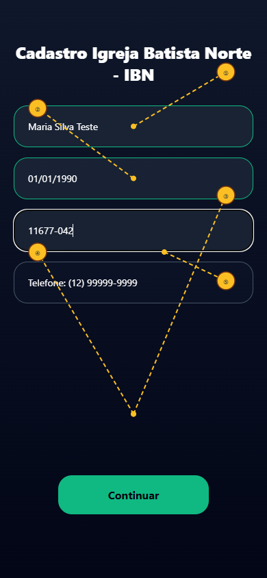

### Com LGPD ativo — passo a passo

1. Confira o celular trazido do login.
2. Informe o nome completo sem abreviações desnecessárias.
3. Informe a data de nascimento.
4. Digite o CEP.
5. Aguarde o preenchimento do endereço, quando disponível.
6. Complete número e complemento.
7. Leia o texto de consentimento desde o início.
8. Role o conteúdo até o final.
9. Tire dúvidas com a igreja antes de decidir.
10. Marque **Li e aceito** ou **Li e não concordo**.
11. Autorize a câmera, se a selfie for exigida.
12. Posicione o rosto em local iluminado.
13. Tire a foto sem óculos escuros, máscara ou outra obstrução.
14. Revise os dados.
15. Toque em **Confirmar** ou **Salvar**.

### Com LGPD inativo — passo a passo

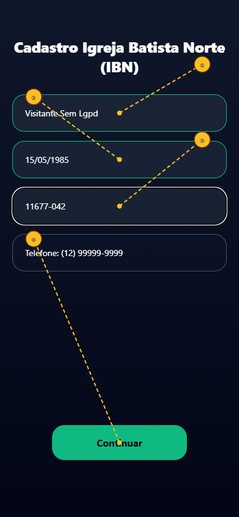

1. Preencha os dados solicitados no cadastro simplificado.
2. Revise telefone, nome, nascimento e endereço.
3. Salve o cadastro.
4. Complete os demais dados depois em **Perfil → Dados Cadastrais**.

### Resultado esperado

O cadastro é gravado para a igreja ativa e o app abre o **Início**.

### Dicas

- O texto LGPD pode ser específico de cada igreja.
- Recusar o consentimento registra sua decisão; procure a igreja para entender os efeitos no uso.
- Mantenha e-mail e celular atualizados para recuperação de acesso.
- A autorização de imagem e voz pode ser um termo separado do consentimento geral.

### Se der erro

| Situação | O que fazer |
|---|---|
| O botão de continuar está desativado | Role o termo até o final e marque uma decisão. |
| A câmera não abre | Permita câmera no navegador e recarregue a página. |
| CEP não completa o endereço | Confira os oito dígitos e preencha manualmente os campos permitidos. |
| LGPD continua pendente | Abra **Perfil → Dados Cadastrais → LGPD** e conclua a etapa. |

---

---

## Perguntas e respostas — Dia 1

| Pergunta | Resposta |
|----------|----------|
| O que digito na tela Boas-vindas? | Seu **celular** com DDD no formato `(00) 00000-0000`, depois o **PIN de 4 dígitos** recebido por **e-mail**. |
| O PIN vem por WhatsApp? | Não. Primeiro acesso e recuperação usam **e-mail**. WhatsApp permanece para convites e contatos da igreja. |
| Por que não vejo termos LGPD no cadastro? | A igreja pode ter **LGPD inativo** na engrenagem → Controle de Acesso. Nesse caso o cadastro é simplificado. |
| O texto LGPD é o mesmo em todas as igrejas? | Não — cada instância pode ter texto próprio em `app_parameters`, editável no Controle de Acesso. |
| Posso trocar o PIN temporário? | Sim — **Menu → Perfil → Dados Cadastrais → Senha de acesso**. |
| Esqueci minha senha? | No passo do PIN toque **Esqueci minha senha** → confirme o e-mail → pergunta de segurança → novo PIN por e-mail. |

# Dia 2 — Início, Agenda da Família e próximos eventos

## 4. Início

### Objetivo

Consultar o que acontece na igreja e abrir rapidamente as ações mais usadas.

### Caminho

**Menu → Início**

### O que pode aparecer

1. **Próximos Eventos**.
2. Avisos e comunicados ativos.
3. Ícone de bolo de aniversariantes.
4. Faixa **Eu quero…**.
5. Botão da Abigail para perfis autorizados.
6. Sticker amarelo de **Novos Membros** para funções autorizadas.
7. Identificação da igreja ativa.

### Passo a passo

1. Ao entrar, aguarde o carregamento do Início.
2. Confira o nome da igreja.
3. Leia os avisos em destaque.
4. Percorra a lista de eventos próximos.
5. Toque em um evento para abrir a Agenda da Família.
6. Use **Eu quero…** para uma ação rápida.
7. Abra o menu lateral para telas permanentes.

### Resultado esperado

Você vê somente conteúdos publicados e permitidos para sua sessão.

### Dicas

- Evento em rascunho não aparece.
- A ausência de conteúdo pode significar que não há publicação vigente.
- Atualize a tela após a igreja publicar um novo aviso ou evento.

### Se der erro

| Situação | O que fazer |
|---|---|
| Evento esperado não aparece | Confirme se foi publicado e se pertence à igreja ativa. |
| A página parece antiga | Recarregue e faça atualização forçada do navegador. |
| Só alguns atalhos aparecem | Isso pode ser uma regra do seu perfil. |

---

## 5. Próximos Eventos e Agenda da Família

### Objetivo

Ver detalhes do evento, indicar quem participará e acessar recursos de check-in.

### Caminho

**Início → Próximos Eventos → tocar no culto ou evento**

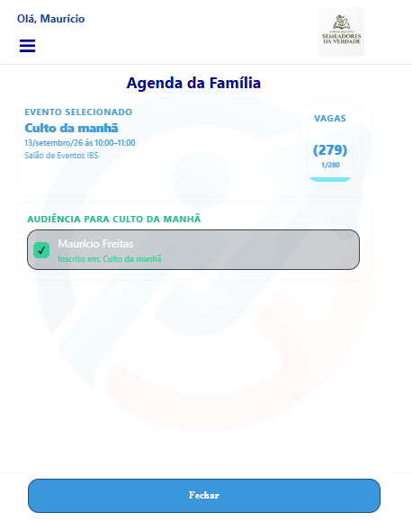

### Inscrever a família — passo a passo

1. No Início, localize **Próximos Eventos**.
2. Toque no culto desejado.
3. Confira nome, data e horário.
4. Confira local e capacidade.
5. Se abriu o evento errado, use **Trocar evento**, quando disponível.
6. Localize a área **Audiência**.
7. Leia a lista de integrantes elegíveis.
8. Marque o primeiro participante.
9. Marque os demais familiares que irão.
10. Use a seleção geral somente se todos realmente participarem.
11. Observe mensagens sobre vagas, Kids ou Teens.
12. Aguarde a confirmação de cada marcação.
13. Se o app oferecer calendário, toque em **Adicionar**.
14. Escolha Google Agenda, Apple Calendar ou Outlook.
15. Confirme o compromisso no aplicativo escolhido.
16. Volte à Agenda para conferir o estado final.

### Retirar uma inscrição

1. Abra o mesmo evento.
2. Localize a pessoa marcada.
3. Desmarque o integrante.
4. Confirme, se solicitado.
5. Aguarde a atualização.

> Eventos com quórum ou presença já confirmada podem bloquear a desmarcação. Procure a equipe responsável quando isso ocorrer.

### Resultado esperado

Os participantes ficam identificados como inscritos e o contador de vagas é atualizado.

### Dicas

- Marque apenas quem realmente pretende comparecer.
- Confirme a data antes de alterar audiência.
- Crianças sem celular podem aparecer pelo vínculo familiar.
- Em eventos com limite de vagas, a disponibilidade pode mudar rapidamente.

### Se der erro

| Situação | O que verificar |
|---|---|
| Um familiar não aparece | Confira o vínculo em **Perfil → Gerenciar Família**. |
| Não consigo desmarcar | A presença pode estar confirmada ou o evento pode usar quórum. |
| “Sem vagas” | Aguarde orientação da igreja ou escolha outro evento. |
| Evento errado | Use **Trocar evento** ou volte ao Início. |

---

---

## Perguntas e respostas — Dia 2

| Pergunta | Resposta |
|----------|----------|
| Onde fica a Agenda da Família? | No **Início**, toque o culto/evento desejado — a Agenda sobe no lugar do inbox. |
| Como inscrevo a família? | Abra o evento → marque os integrantes → confirme audiência/inscrição conforme as vagas. |
| O carrossel do Painel ainda existe? | Não no caminho publicado. Use Início, menu, Eu quero… e Perfil. Cards antigos estão congelados. |
| O que é pré-check-in (audiência)? | Confirmação de interesse antes do culto; libera fluxos de presença (totem/geofence) conforme o evento. |
| Não vejo eventos? | Pode não haver cultos publicados ou seu perfil não tem permissão — fale com a secretaria. |

# Dia 3 — Espaço Infantil (QR) e check-in do culto

## 6. Espaço Infantil e QR familiar

### Objetivo

Preparar o check-in e a retirada segura da criança em uma sala configurada.

### Caminho

**Início → Evento → Agenda da Família → Espaço Infantil | Check-In / Check-Out QR**

### Passo a passo do responsável

1. Abra o evento correto.
2. Marque a criança em **Audiência**.
3. Confirme se a criança está elegível para uma sala.
4. Toque em **Espaço Infantil | Check-In / Check-Out QR**.
5. Aguarde a geração do QR familiar.
6. Aumente o brilho da tela.
7. Apresente o QR à equipe da recepção infantil.
8. Aguarde a leitura.
9. Confirme verbalmente o nome da criança e a sala.
10. Verifique o estado **Na sala**.
11. Guarde o celular para a retirada.
12. Na saída, apresente novamente o QR.
13. Aguarde a equipe registrar o check-out.
14. Confira o estado **Liberado**.

### Resultado esperado

A criança fica associada à sala correta e os estados de entrada e saída aparecem na Agenda.

### Dicas

- O QR da Carteirinha Digital também identifica a família nos fluxos autorizados.
- Não envie o QR para pessoas que não estejam autorizadas a retirar a criança.
- Mantenha o código visível, inteiro e sem reflexo na tela.
- Informe à equipe qualquer divergência antes de deixar a recepção.

### Se der erro

| Situação | O que fazer |
|---|---|
| O botão infantil não aparece | Verifique criança elegível, sala ativa, evento correto e código familiar. |
| QR não é lido | Aumente o brilho, limpe a tela e peça à equipe para digitar o código. |
| Criança está na sala errada | Não conclua a entrega; peça correção imediata à recepção. |
| Estado não atualiza | Aguarde alguns segundos e reabra a Agenda. |

---

## 7. Check-in do culto

### Objetivo

Registrar presença conforme o método definido para o evento.

### Caminho

**Agenda da Família / Carteirinha Digital → Totem ou presença por proximidade**

### Passo a passo

1. Abra o evento.
2. Marque sua audiência quando o pré-check-in for exigido.
3. Verifique a orientação exibida.
4. Para QR, abra a Carteirinha Digital ou o QR da Agenda.
5. Apresente o código ao totem.
6. Aguarde a mensagem de confirmação.
7. Para proximidade, permita o uso da localização.
8. Permaneça dentro do raio do local.
9. Aguarde a confirmação de presença.

### Resultado esperado

O evento reconhece a presença do participante elegível.

### Dicas

- Ative localização precisa somente durante o uso necessário.
- Não tente registrar presença fora do local quando houver geofence.
- Cada evento pode usar regras diferentes.

### Se der erro

| Mensagem | Ação |
|---|---|
| Pré-check-in não encontrado | Marque a audiência no evento correto. |
| Fora da área | Confirme o endereço, ative GPS e aproxime-se do local. |
| QR inválido | Abra novamente a Carteirinha/Agenda e tente com brilho maior. |

---

---

## Perguntas e respostas — Dia 3

| Pergunta | Resposta |
|----------|----------|
| Quando aparece o Check-in do Espaço Infantil? | Quando a família tem crianças elegíveis às salas e o evento usa esse fluxo. |
| Como entrego a criança na sala? | Na Agenda, use o QR / Digitar Código da Família conforme a operação da igreja; o selo **Na sala** / **Liberado** acompanha o status. |
| O que é check-in por proximidade? | Com geofence ativo, o app confirma presença ao chegar ao templo (GPS + audiência prévia). |
| Onde apresento o QR no hall? | No **Totem de check-in** ou na Carteirinha Digital / Agenda, conforme o culto do dia. |

# Dia 4 — Aniversários, sticker de novos membros e Eu quero… Contribuir

## 8. Bolo de aniversariantes

### Objetivo

Ver aniversários pessoais ou de casamento do dia.

### Caminho

**Início → ícone de bolo ao lado de Próximos Eventos**

### Passo a passo

1. Procure o ícone de bolo.
2. Toque no ícone.
3. Leia os nomes exibidos.
4. Observe se é aniversário pessoal ou de casamento.
5. Leia a mensagem sugerida.
6. Se autorizado, toque em copiar.
7. Cole a mensagem no canal apropriado.
8. Feche o quadro para voltar ao Início.

### Resultado esperado

Os aniversariantes do dia permitidos ao seu perfil são exibidos.

### Dicas

- O bolo aparece somente quando há aniversário no dia.
- Para o mês inteiro, use **Aniversariantes** se sua função tiver acesso.
- Revise a mensagem antes de enviá-la.

### Se der erro

Se a data conhecida não aparece, peça ao aniversariante para conferir seu cadastro e respeite as regras de privacidade.

---

## 9. Sticker amarelo de Novos Membros

### Objetivo

Avisar perfis autorizados de que há registros aguardando processamento.

### Caminho

**Início → sticker lateral Novos Membros**

### Passo a passo para pessoa autorizada

1. Localize a etiqueta amarela retrátil.
2. Toque para expandir.
3. Leia a quantidade ou a mensagem.
4. Toque para abrir o destino.
5. Se houver fila familiar, revise-a em **Recepção Familiar**.
6. Se houver visitante aguardando admissão, o app abre **Mudança Papéis** filtrada.
7. Volte ao Início ao terminar.

### Resultado esperado

- **super_admin:** vê o sticker sempre, inclusive a mensagem sem pendências.
- **secretaria/pastoral:** vê quando existe pendência.
- Outros perfis: normalmente não veem.

### Dicas

- O sticker não é uma notificação para todos os membros.
- A fila da Recepção Familiar tem prioridade sobre Mudança Papéis.

### Se der erro

Se você deveria operar a recepção e não vê o sticker, abra a engrenagem diretamente ou peça revisão do grant.

---

## 10. Eu quero…

### Objetivo

Abrir ações frequentes sem percorrer todo o menu.

### Caminho

**Início → Eu quero…**

### Passo a passo

1. No Início, localize a faixa **Eu quero…**.
2. Toque para ver as opções.
3. Escolha a ação desejada.
4. Complete o fluxo da tela.
5. Use **Fechar/Voltar** para retornar.

### Resultado esperado

O app abre a rota dedicada, como **Contribuir** ou **Cuidado Pastoral**.

### Dicas

- As opções podem variar conforme a igreja e o perfil.
- O atalho não altera as regras de acesso da tela.

---

## 11. Eu quero… → Contribuir

### Objetivo

Consultar os dados de contribuição e concluir a operação no canal financeiro apresentado.

### Caminho

**Início → Eu quero… → Contribuir**

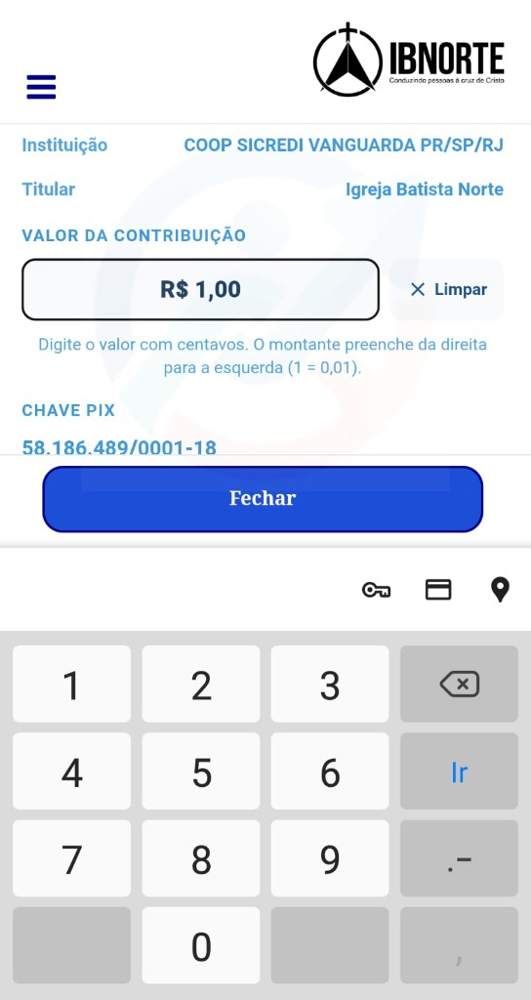

### Passo a passo

1. Toque em **Contribuir**.
2. Confirme a igreja beneficiária.
3. Leia o nome do recebedor.
4. Escolha a campanha, quando houver mais de uma.
5. Leia a finalidade da campanha.
6. Escolha a forma de contribuição disponível.
7. Para PIX, copie a chave ou use o QR exibido.
8. Abra o aplicativo do seu banco.
9. Cole a chave ou leia o QR.
10. Confira recebedor, instituição e valor.
11. Confirme a operação somente se os dados estiverem corretos.
12. Guarde o comprovante conforme sua necessidade.
13. Volte ao Conecta+.

### Resultado esperado

A contribuição é concluída no aplicativo bancário ou provedor apresentado.

### Dicas

- O Conecta+ não debita automaticamente sua conta.
- Nunca confirme PIX com recebedor divergente.
- Em dúvida, pare e consulte a tesouraria.

### Se der erro

| Situação | O que fazer |
|---|---|
| Chave não copia | Selecione manualmente ou use o QR. |
| Campanha não aparece | Ela pode estar encerrada ou não publicada. |
| Banco recusou | Trate com o banco; não repita sem conferir o extrato. |
| Recebedor diverge | Não pague e avise a igreja. |

---

---

## Perguntas e respostas — Dia 4

| Pergunta | Resposta |
|----------|----------|
| Quando aparece o bolo na Home? | Somente quando há aniversário pessoal ou de casamento **hoje**. |
| O que é o sticker amarelo? | Aviso de **novos membros a admitir** — Super Admin sempre vê; secretaria/pastoral quando há fila/régua. |
| Para onde o sticker me leva? | Com fila de recepção → **Recepção Familiar**; senão → **Mudança Papéis** já filtrada em Visitante. |
| Como contribuo? | **Eu quero… → Contribuir** → Dízimos/Ofertas, Campanhas ou Prímicias → copiar Pix. |

# Dia 5 — Cuidado Pastoral, cancelamento e Abigail

## 12. Eu quero… → Cuidado Pastoral

### Objetivo

Enviar um pedido com o destino e o nível de cuidado adequados.

### Caminho

**Início → Eu quero… → Cuidado Pastoral**

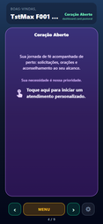

### Enviar pedido — passo a passo

1. Abra **Cuidado Pastoral**.
2. Leia as orientações de privacidade.
3. Escolha o motivo.
4. Escolha a situação.
5. Informe se o pedido é para você, familiar ou terceiro.
6. Identifique o beneficiário apenas quando necessário.
7. Escolha o destino, como cuidado pastoral ou intercessão.
8. Observe a indicação de sigilo.
9. Escreva uma descrição objetiva.
10. Evite expor dados de terceiros além do necessário.
11. Revise o texto.
12. Toque em **Enviar pedido**.
13. Aguarde a confirmação.
14. Abra **Meus pedidos**.
15. Confira data, hora e estado inicial.

### Acompanhar o pedido

1. Abra **Meus pedidos**.
2. Se houver mais de um, escolha pelo resumo ou data.
3. Leia o estágio atual.
4. Aguarde contato da equipe quando aplicável.
5. Use os canais indicados pela igreja para complementar informações.

### Estágios

- **Novo/Pendente:** recebido e aguardando início.
- **Acolher:** primeiro contato ou triagem.
- **Apoiar:** acompanhamento em andamento.
- **Acompanhar:** cuidado continuado.
- **Encerrado:** ciclo concluído.

### Resultado esperado

O pedido aparece em **Meus pedidos** e entra na fila autorizada.

### Dicas

- O recurso não substitui serviços de emergência.
- Em risco imediato, use SAMU 192, Polícia 190 ou Bombeiros 193.
- Não envie a mesma solicitação repetidas vezes.
- Respeite a privacidade de terceiros.

### Se der erro

| Situação | O que fazer |
|---|---|
| Botão enviar desativado | Confira campos obrigatórios e aceite solicitado. |
| Pedido não aparece | Reabra **Meus pedidos** e verifique a conexão. |
| Dados sensíveis enviados por engano | Contate a liderança pastoral responsável. |

---

## 13. Solicitar cancelamento pastoral

### Objetivo

Pedir a exclusão de um pedido que já entrou em acompanhamento.

### Caminho

**Cuidado Pastoral → Meus pedidos → pedido → Solicitar cancelamento**

### Passo a passo

1. Abra **Meus pedidos**.
2. Localize o pedido correto.
3. Confira data, motivo e resumo.
4. Toque em **Solicitar cancelamento**.
5. Leia o aviso.
6. Escreva uma justificativa clara.
7. Revise a justificativa.
8. Confirme o envio.
9. Aguarde a mensagem de sucesso.
10. Confira a indicação de cancelamento pendente.
11. Aguarde a análise da equipe.

### Resultado esperado

A solicitação fica registrada. A exclusão definitiva é confirmada por **super_admin** na engrenagem.

### Dicas

- Um pedido novo pode permitir exclusão direta antes do acompanhamento.
- Solicitar cancelamento não apaga imediatamente o histórico.
- Não crie outro pedido apenas para pedir a exclusão do anterior.

### Se der erro

| Situação | Explicação |
|---|---|
| Não há botão de excluir | Pedido acompanhado exige **Solicitar cancelamento**. |
| Cancelamento continua pendente | Aguarde a confirmação administrativa. |
| Escolhi o pedido errado | Não confirme; volte e compare a data/hora. |

---

## 14. Abigail

### Objetivo

Obter ajuda informativa da assistente do Conecta+ dentro do contexto permitido.

### Caminho

**Início → Abigail**, ao lado de **Eu quero…**, quando autorizada.

### Passo a passo

1. Toque no botão da Abigail.
2. Leia a orientação inicial.
3. Digite uma pergunta por vez.
4. Use nomes claros de telas ou tarefas.
5. Envie a pergunta.
6. Aguarde a resposta.
7. Faça uma pergunta complementar se necessário.
8. Confira informações sensíveis com uma pessoa responsável.
9. Feche a conversa para voltar ao Início.

### Resultado esperado

A Abigail responde conforme a base disponível e as permissões da igreja ativa.

### Dicas

- Prefira “Como inscrevo minha filha no evento?” a perguntas vagas.
- Não informe senha, PIN, dados bancários ou segredos.
- Confirme datas, valores e decisões administrativas com a equipe humana.

### Se der erro

| Situação | O que fazer |
|---|---|
| Abigail não aparece | Seu perfil ou a igreja pode não ter o recurso habilitado. |
| Resposta incompleta | Reformule com contexto e uma pergunta objetiva. |
| Serviço indisponível | Tente depois e use **Como faço…?**. |

---

---

## Perguntas e respostas — Dia 5

| Pergunta | Resposta |
|----------|----------|
| Como peço oração ou conversa? | **Eu quero… → Cuidado Pastoral** → preencha e envie. Acompanhe em Meus pedidos. |
| Posso cancelar um pedido? | Sim — solicite cancelamento com justificativa; a equipe pastoral trata o pedido. |
| O que faz o botão Excluir na engrenagem? | Somente **super_admin**, ao lado de Acompanhar, quando há solicitação de cancelamento — remove o pedido do banco. |
| O que é a Abigail? | Assistente em conversa na Home (mesma linha de Eu quero…), com base na igreja da sessão. |

# Dia 6 — Menu lateral e Perfil (dados, família, carteirinha, trilha)

## 15. Menu lateral — item por item

### Objetivo

Conhecer as telas permanentes disponíveis no menu do membro.

### Caminho

**Ícone de menu → escolher item**

### Início

1. Toque em **Início**.
2. Confira eventos, avisos e atalhos.
3. Use esta opção para retornar à página principal.

**Resultado esperado:** a página inicial da igreja ativa é exibida.

### Perfil

1. Toque em **Perfil**.
2. Escolha dados, família, Carteirinha ou jornada pessoal.
3. Consulte a seção 16 deste manual.

**Resultado esperado:** o conjunto de ações pessoais é exibido.

### Financeiro

1. Toque em **Financeiro**.
2. Escolha o período permitido.
3. Abra as seções disponíveis.
4. Leia valores e informações sem compartilhar dados.
5. Volte ao menu ao terminar.

**Resultado esperado:** somente dados financeiros autorizados são exibidos.

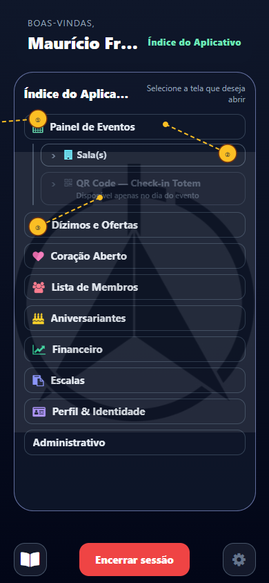

**Dica:** reembolso é iniciado em **Perfil → Reembolsos**, quando autorizado.

### Documentos oficiais

1. Toque em **Documentos oficiais**.
2. Leia as categorias.
3. Localize o documento.
4. Toque para abrir.
5. Leia no navegador ou visualizador.
6. Use **Voltar** para retornar.

**Resultado esperado:** documentos publicados pela igreja ativa são apresentados.

**Se der erro:** tela vazia pode significar ausência de publicação ou falta de acesso.

### Minha Célula

1. Toque em **Minha Célula**.
2. Confira nome do pequeno grupo.
3. Leia dia, horário e local permitidos.
4. Consulte liderança e contatos disponíveis.
5. Use o canal de contato com responsabilidade.

**Resultado esperado:** os dados do pequeno grupo vinculado aparecem.

**Se der erro:** peça à liderança para conferir seu vínculo.

### Escalas

1. Toque em **Escalas**.
2. Escolha o tipo de escala.
3. Consulte as datas.
4. Leia função, horário e equipe.
5. Confirme dúvidas com o coordenador.

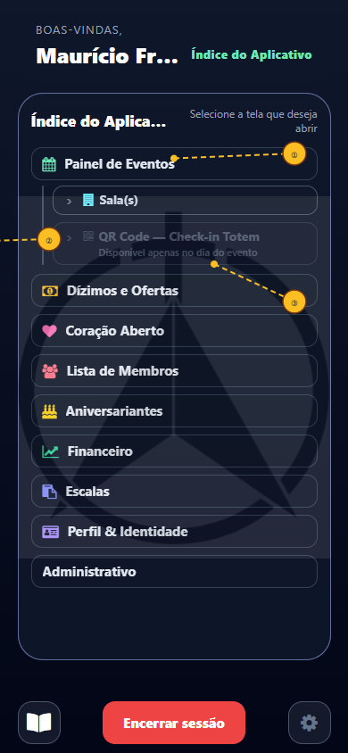

**Resultado esperado:** sua programação autorizada é exibida.

### Mural de Oportunidades

1. Toque em **Mural de Oportunidades**.
2. Percorra as oportunidades publicadas.
3. Abra uma oportunidade.
4. Leia requisitos, período e contato.
5. Siga o canal indicado para demonstrar interesse.

**Resultado esperado:** oportunidades vigentes são exibidas.

### Mural de Generosidade

1. Toque em **Mural de Generosidade**.
2. Escolha consultar doações ou pedidos.
3. Abra o item.
4. Leia condições e estado.
5. Use o contato permitido.
6. Combine entrega ou empréstimo diretamente.

**Resultado esperado:** itens aprovados pela moderação aparecem.

### Apoio Mútuo

1. Toque em **Apoio Mútuo**.
2. Pesquise pelo serviço.
3. Abra o cartão.
4. Leia descrição e contato.
5. Use WhatsApp ou QR quando exibido.

**Resultado esperado:** serviços publicados pela comunidade são exibidos.

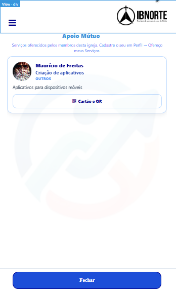

### Sugestões

1. Toque em **Sugestões**.
2. Escolha o assunto.
3. Descreva a ideia ou melhoria.
4. Evite inserir dados pessoais desnecessários.
5. Revise e envie.

**Resultado esperado:** a sugestão é registrada para a equipe responsável.

### Como faço…?

1. Toque em **Como faço…?**.
2. Pesquise pelo assunto.
3. Abra o artigo.
4. Siga as instruções.
5. Volte à lista para consultar outro tema.

**Resultado esperado:** a base de ajuda do membro é exibida.

### Redes Sociais

1. Toque em **Redes Sociais**.
2. Escolha o canal oficial.
3. Confirme a abertura do link.
4. Verifique se o perfil pertence à igreja.

**Resultado esperado:** o canal oficial abre em nova guia ou aplicativo.

### Sobre o Conecta+

1. Toque em **Sobre o Conecta+**.
2. Leia as informações da plataforma.
3. Consulte versão, orientações e contatos disponíveis.

**Resultado esperado:** as informações institucionais são exibidas.

### Dicas gerais do menu

- A ordem segue o menu publicado.
- Itens sem grant não são exibidos.
- Feche e reabra o menu após mudança de orientação.
- Não compartilhe dados vistos em diretórios ou relatórios.

---

## 16. Perfil

### Objetivo

Administrar dados próprios, vínculos familiares, identificação e recursos pessoais.

### Caminho

**Menu → Perfil**

### Opções mais comuns

1. **Dados Cadastrais**.
2. **Ofereço meus Serviços**.
3. **Gerenciar Família**.
4. **Carteirinha Digital**.
5. **Trilha de Discipulado**.
6. **Reembolsos**, quando autorizado.
7. Card de **Apoio Mútuo** e outros recursos permitidos.

> A **Carteirinha Digital** aparece imediatamente abaixo de **Gerenciar Família**.

### Resultado esperado

O app exibe somente as ações pessoais permitidas ao seu perfil.

---

## 17. Perfil → Dados Cadastrais

### Objetivo

Manter dados pessoais, endereço, e-mail, PIN, LGPD e foto atualizados.

### Caminho

**Menu → Perfil → Dados Cadastrais**

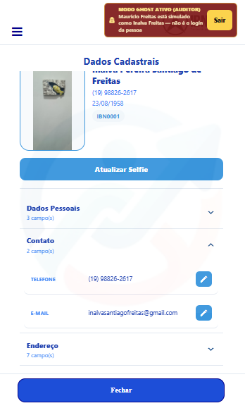

### Passo a passo

1. Abra **Dados Cadastrais**.
2. Confira nome completo.
3. Confira data de nascimento.
4. Revise celular e e-mail.
5. Confira CEP e endereço.
6. Complete número e complemento.
7. Atualize os campos editáveis.
8. Salve cada seção.
9. Abra **Senha de acesso** para trocar o PIN.
10. Informe e confirme o novo PIN.
11. Abra **LGPD** se houver pendência.
12. Leia e registre sua decisão.
13. Atualize a selfie, quando necessário.
14. Revise a foto.
15. Salve e volte ao Perfil.

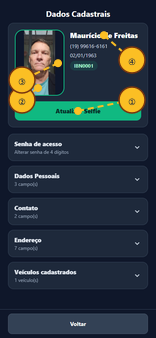

### Resultado esperado

Os dados permitidos são atualizados para a igreja ativa.

### Dicas

- Use um e-mail acessível para recuperar o PIN.
- Informe endereço completo para recursos autorizados de mapa.
- Não use foto de outra pessoa ou imagem de documento.

### Se der erro

| Situação | O que fazer |
|---|---|
| Campo não pode ser editado | Peça correção à secretaria. |
| E-mail já usado ou inválido | Revise a digitação e o vínculo do perfil. |
| Foto não envia | Permita câmera, melhore a conexão e tente novamente. |

---

## 18. Perfil → Gerenciar Família

### Objetivo

Consultar o código familiar e manter integrantes vinculados corretamente.

### Caminho

**Menu → Perfil → Gerenciar Família**

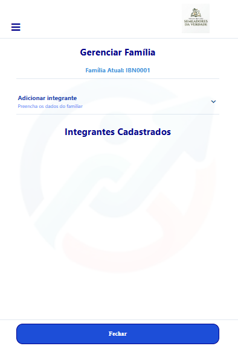

### Adicionar integrante — passo a passo

1. Abra **Gerenciar Família**.
2. Confira o representante principal.
3. Anote o código familiar, se necessário.
4. Toque em **Adicionar integrante**.
5. Informe o nome completo.
6. Informe o telefone se a pessoa possuir.
7. Informe a data de nascimento.
8. Escolha o parentesco.
9. Revise os dados.
10. Toque em **Salvar**.
11. Confirme o reconhecimento familiar quando solicitado.
12. Verifique se o integrante apareceu na lista.

### Editar ou remover

1. Abra o integrante.
2. Confira se selecionou a pessoa certa.
3. Altere somente dados autorizados.
4. Salve.
5. Para remover, leia o aviso.
6. Confirme apenas se o vínculo realmente não deve existir.

### Resultado esperado

A composição familiar fica correta para Agenda, Espaço Infantil e demais serviços.

### Dicas

- Crianças sem celular podem ser cadastradas.
- O representante principal não pode ser removido pelo fluxo comum.
- Evite criar duplicidade quando a pessoa já possui cadastro.

### Se der erro

| Situação | O que fazer |
|---|---|
| Pessoa já existe | Peça à recepção para analisar o vínculo em vez de duplicar. |
| Código familiar diverge | Não force alteração; procure a secretaria. |
| Integrante não aparece na Agenda | Reabra o evento e confira elegibilidade. |

---

## 19. Perfil → Carteirinha Digital

### Objetivo

Usar a identificação digital e o QR permanente da família.

### Caminho

**Menu → Perfil → Carteirinha Digital**

### Passo a passo

1. Abra a Carteirinha.
2. Confira nome e foto.
3. Confira a igreja identificada.
4. Passe para a página do QR, quando necessário.
5. Aumente o brilho da tela.
6. Apresente o código no totem ou recepção autorizada.
7. Aguarde a confirmação.
8. Feche a Carteirinha ao terminar.

### Resultado esperado

O leitor reconhece o identificador seguro da família.

### Dicas

- O QR não é uma ficha aberta com todos os dados pessoais.
- Evite publicar captura do QR em redes sociais.
- Atualize a foto em Dados Cadastrais.

### Se der erro

Se nome, foto ou igreja estiverem incorretos, não use o QR até confirmar o cadastro com a secretaria.

---

## 20. Perfil → Trilha de Discipulado

### Objetivo

Realizar conteúdos, reflexões e etapas da jornada de discipulado.

### Caminho

**Menu → Perfil → Trilha de Discipulado**

### Passo a passo

1. Abra a Trilha.
2. Consulte módulos e passos.
3. Comece pelo primeiro conteúdo disponível.
4. Leia o texto completo.
5. Assista ao vídeo, quando houver.
6. Responda à reflexão.
7. Salve ou conclua a lição.
8. Aguarde a liberação do próximo passo.
9. Consulte o progresso.
10. Abra **Minhas Conquistas** para ver selos.
11. Na lição **5.1 — Descobrindo meus Dons**, responda ao Perfil Ministerial.
12. Revise antes de concluir.

### Resultado esperado

O progresso fica registrado e reconhecimentos aparecem quando os critérios são cumpridos.

### Dicas

- Conclua na ordem proposta.
- Não feche a página antes da confirmação.
- Procure seu discipulador para dúvidas de conteúdo.

### Se der erro

Reabra a lição e verifique a conexão. Se o progresso continuar divergente, informe o módulo e a etapa à equipe.

---

## 21. Perfil → Ofereço meus Serviços e card Apoio

### Objetivo

Criar ou atualizar seu cartão de serviço para o Apoio Mútuo.

### Caminho

**Menu → Perfil → Ofereço meus Serviços**

### Passo a passo

1. Abra **Ofereço meus Serviços**.
2. Informe o título do serviço.
3. Escolha a categoria, quando disponível.
4. Escreva uma descrição objetiva.
5. Informe área atendida e disponibilidade.
6. Confira o contato que será exibido.
7. Adicione imagem somente se apropriada.
8. Revise ortografia e informações.
9. Ative **Publicar no Apoio Mútuo**.
10. Salve.
11. Volte ao Perfil.
12. Confira o card de Apoio.
13. Abra **Menu → Apoio Mútuo**.
14. Pesquise seu cartão para validar a publicação.

### Resultado esperado

O cartão fica disponível conforme as regras da igreja e o estado de publicação.

### Dicas

- Não publique documentos, dados bancários ou endereço residencial completo.
- Seja claro sobre o que oferece; preço e prazo são combinados diretamente.
- Desative a publicação quando o serviço não estiver disponível.

### Se der erro

| Situação | O que fazer |
|---|---|
| Card não aparece | Confirme **Publicar no Apoio Mútuo** e salve novamente. |
| Contato incorreto | Atualize Dados Cadastrais e o cartão. |
| Imagem não carrega | Tente formato e tamanho aceitos ou salve sem imagem. |

---

---

## Perguntas e respostas — Dia 6

| Pergunta | Resposta |
|----------|----------|
| O que há no menu do membro? | Início, Perfil, Financeiro, Documentos oficiais, Célula, Escalas, murais, Apoio Mútuo, Sugestões, Como faço…?, Redes e Sobre. |
| Onde edito meus dados? | **Menu → Perfil → Dados Cadastrais**. |
| Onde gerencio a família? | **Perfil → Gerenciar Família** — inclui cuidados da criança quando aplicável. |
| Onde está a Carteirinha Digital? | Em **Perfil**, abaixo de Gerenciar Família. |
| O que é a Trilha de Discipulado? | Cinco passos com selos; na lição 5.1 está o Perfil Ministerial. |

# Dia 7 — Documentos, Apoio Mútuo, privacidade e encerrar sessão

## 22. Perfil → Reembolsos

### Objetivo

Enviar um Relatório de Despesas quando o perfil possuir autorização.

### Caminho

**Menu → Perfil → Reembolsos → Novo RD**

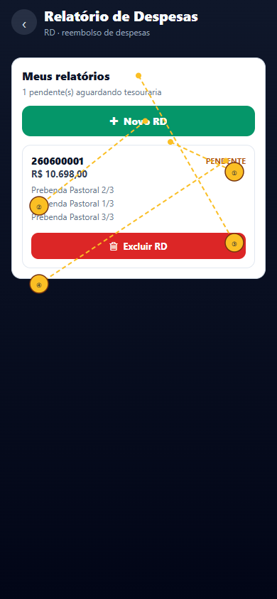

### Passo a passo

1. Abra **Reembolsos**.
2. Toque em **Novo RD**.
3. Informe a chave PIX.
4. Adicione a primeira despesa.
5. Informe data, descrição e valor.
6. Anexe o comprovante.
7. Repita para os demais itens.
8. Confira o total.
9. Revise os anexos.
10. Finalize o relatório.
11. Acompanhe o status na lista.

### Resultado esperado

O RD é enviado para análise com itens e comprovantes.

### Dicas

- Use comprovantes legíveis.
- Não misture despesas de solicitações diferentes sem orientação.
- Depois de finalizar, alterações podem ficar bloqueadas.

### Se der erro

Confira formato do arquivo, tamanho do anexo, valor e conexão antes de reenviar.

---

## 23. Documentos oficiais — uso detalhado

### Objetivo

Consultar documentos institucionais publicados pela igreja ativa.

### Caminho

**Menu → Documentos oficiais**

### Passo a passo

1. Abra o menu.
2. Toque em **Documentos oficiais**.
3. Aguarde o carregamento das categorias.
4. Identifique o documento pelo título.
5. Confira data ou versão, quando exibida.
6. Toque no item.
7. Autorize a abertura em nova guia, se solicitado.
8. Leia o documento.
9. Baixe somente se permitido e necessário.
10. Feche a guia ou toque em **Voltar**.

### Resultado esperado

O arquivo ou conteúdo institucional abre no visualizador adequado.

### Dicas

- Confirme se o documento pertence à igreja ativa.
- Não repasse documentos internos fora da finalidade autorizada.
- Use sempre a versão mais recente publicada.

### Se der erro

| Situação | O que fazer |
|---|---|
| Tela vazia | Pode não haver documentos ou seu perfil não ter acesso. |
| Arquivo não abre | Permita nova guia e confira o visualizador do navegador. |
| Versão parece antiga | Confirme a data com a secretaria. |

---

## 24. Apoio Mútuo — fluxo completo

### Objetivo

Encontrar serviços oferecidos pela comunidade e entrar em contato com responsabilidade.

### Caminho

**Menu → Apoio Mútuo**

### Procurar serviço — passo a passo

1. Abra **Apoio Mútuo**.
2. Leia o aviso de responsabilidade.
3. Use a busca.
4. Digite o serviço ou a categoria.
5. Percorra os cartões.
6. Abra o cartão de interesse.
7. Leia a descrição completa.
8. Confira área e disponibilidade.
9. Consulte os contatos permitidos.
10. Toque em WhatsApp ou abra o QR, quando exibido.
11. Apresente-se e explique a necessidade.
12. Combine preço, prazo e condições diretamente.
13. Não faça pagamento sem validar a pessoa e o acordo.

### Publicar seu serviço

1. Abra **Menu → Perfil**.
2. Toque em **Ofereço meus Serviços**.
3. Preencha o cartão.
4. Ative a publicação.
5. Salve.
6. Confira o resultado no Apoio Mútuo.

### Resultado esperado

Você localiza o serviço ou disponibiliza seu cartão à comunidade.

### Dicas

- O Conecta+ é uma vitrine comunitária, não garante a prestação.
- Contratação, qualidade, preço e prazo são responsabilidade das pessoas.
- Denuncie conteúdo inadequado à igreja.
- Preserve dados pessoais durante o primeiro contato.

### Se der erro

| Situação | O que fazer |
|---|---|
| Busca sem resultado | Tente termo mais amplo ou outra categoria. |
| Contato não abre | Copie o número permitido e abra o WhatsApp manualmente. |
| Serviço indisponível | Procure outro cartão; não insista. |
| Conteúdo inadequado | Não negocie e informe a equipe responsável. |

---

## 25. Privacidade, diretórios e uso responsável

### Objetivo

Usar informações pessoais somente para a finalidade autorizada.

### Caminho

**Menu → módulo autorizado**

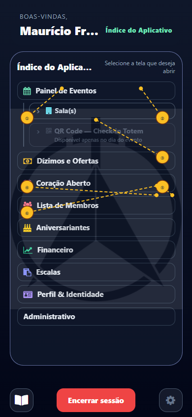

### Passo a passo

1. Abra apenas telas necessárias à sua atividade.
2. Consulte o mínimo de dados necessário.
3. Não faça capturas sem finalidade autorizada.
4. Não copie listas para grupos pessoais.
5. Não compartilhe endereço, telefone ou família fora da igreja.
6. Feche a tela ao concluir.
7. Encerre a sessão em aparelho compartilhado.

### Resultado esperado

Os dados são usados de forma compatível com o papel e com a LGPD.

### Dicas

- Acesso técnico não significa autorização para qualquer uso.
- Em dúvida, consulte o encarregado ou a liderança responsável.

---

## 26. Encerrar sessão / Ao sair

### Objetivo

Finalizar a autenticação e impedir acesso indevido ao seu perfil.

### Caminho

**Menu lateral → Encerrar sessão / Sair do aplicativo**

### Passo a passo

1. Termine a tarefa atual.
2. Confirme que qualquer formulário foi salvo.
3. Abra o menu lateral.
4. Role até a opção de saída, se necessário.
5. Toque em **Encerrar sessão** ou **Sair do aplicativo**.
6. Leia a confirmação.
7. Confirme a saída.
8. Aguarde a tela de boas-vindas.
9. Em aparelho compartilhado, feche a guia.
10. Se o navegador ofereceu salvar PIN, remova essa informação.

### Resultado esperado

A tela volta para **Boas-vindas** e as áreas autenticadas deixam de ficar acessíveis.

### Dicas

- Sempre saia de computador público, tablet da igreja ou celular emprestado.
- Fechar apenas a guia pode não encerrar a sessão.
- No totem, a equipe deve encerrar a sessão ao fim da operação.

### Se der erro

| Situação | O que fazer |
|---|---|
| Botão não responde | Aguarde, toque uma vez e recarregue se necessário. |
| A tela autenticada reaparece | Use **Encerrar sessão** novamente e limpe apenas os dados do site, se orientado. |
| Esqueci sessão aberta | Troque o PIN e avise a igreja se o aparelho ficou com terceiros. |

---

## 27. Solução geral de problemas

### Tela não carrega

1. Confira a internet.
2. Recarregue uma vez.
3. Confirme a igreja ativa.
4. Saia e entre novamente.
5. Teste em navegador atualizado.
6. Informe à equipe a tela, horário e mensagem exata.

### Permissão mudou

1. Termine o que estiver fazendo.
2. Encerre a sessão.
3. Entre novamente.
4. Reabra o menu.
5. Se continuar ausente, solicite revisão do grant.

### Câmera, QR ou localização

1. Use conexão HTTPS.
2. Abra as permissões do site no navegador.
3. Permita o recurso necessário.
4. Feche outros aplicativos que usam a câmera.
5. Reabra a tela.

### Dados divergentes

1. Não crie cadastro duplicado.
2. Anote qual dado está incorreto.
3. Abra **Perfil → Dados Cadastrais**.
4. Corrija os campos permitidos.
5. Para campos bloqueados, procure a secretaria.

---

## 28. Resumo rápido

| Preciso… | Caminho atual |
|---|---|
| Entrar pela primeira vez | **Celular → Continuar → Receber código por e-mail → PIN** |
| Recuperar o PIN | **Celular → Continuar → Esqueci minha senha** |
| Regularizar LGPD | **Perfil → Dados Cadastrais → LGPD** |
| Abrir a Agenda | **Início → tocar no culto** |
| Inscrever a família | **Agenda → Audiência** |
| Check-in da criança | **Agenda → Espaço Infantil \| Check-In / Check-Out QR** |
| Abrir o QR permanente | **Menu → Perfil → Carteirinha Digital** |
| Contribuir | **Início → Eu quero… → Contribuir** |
| Pedir cuidado pastoral | **Início → Eu quero… → Cuidado Pastoral** |
| Cancelar pedido acompanhado | **Meus pedidos → Solicitar cancelamento** |
| Falar com Abigail | **Início → Abigail**, quando autorizada |
| Ver aniversário do dia | **Bolo ao lado de Próximos Eventos** |
| Ver documentos | **Menu → Documentos oficiais** |
| Buscar serviços | **Menu → Apoio Mútuo** |
| Publicar meu serviço | **Menu → Perfil → Ofereço meus Serviços** |
| Atualizar cadastro | **Menu → Perfil → Dados Cadastrais** |
| Gerenciar família | **Menu → Perfil → Gerenciar Família** |
| Fazer a Trilha | **Menu → Perfil → Trilha de Discipulado** |
| Enviar RD | **Menu → Perfil → Reembolsos** |
| Ver escalas | **Menu → Escalas** |
| Sair com segurança | **Menu → Encerrar sessão / Sair do aplicativo** |

---

## 29. Checklist do membro

### No primeiro acesso

- [ ] Confirmei a igreja.
- [ ] Recebi o PIN por e-mail.
- [ ] Troquei o PIN temporário.
- [ ] Completei meus dados.
- [ ] Registrei minha decisão LGPD.
- [ ] Conferi meus familiares.

### Antes de um evento

- [ ] Abri o evento correto.
- [ ] Marquei a audiência.
- [ ] Conferi data e local.
- [ ] Preparei o QR infantil, quando necessário.
- [ ] Autorizei localização apenas se o evento exigir.

### Ao sair

- [ ] Salvei os formulários.
- [ ] Encerrei a sessão.
- [ ] Voltei à tela de boas-vindas.
- [ ] Fechei a guia em aparelho compartilhado.

---

*Conecta+ · Manual detalhado do membro · revisão de 05/10/2026*

---

## Perguntas e respostas — Dia 7

| Pergunta | Resposta |
|----------|----------|
| Quem vê Documentos oficiais? | Em geral o papel **membro** — atas/publicações da igreja da sessão. |
| Como funciona o Apoio Mútuo? | Categorias → nomes dos ofertantes → cartão com contato/QR; categorias sem oferta ficam inacessíveis. |
| Como saio com segurança? | Menu → **Encerrar sessão**. Se a igreja ligou **Ao sair** com URL, o navegador pode ir ao site oficial. |
| Uma tela sumiu do menu? | ACL da igreja — não é defeito do aparelho; fale com a secretaria. |
| Onde está o manual completo? | [Pacote 5](PACOTE_5_MANUAL_PAINEL.md) e [FUNCIONALIDADES.md](FUNCIONALIDADES.md). |

